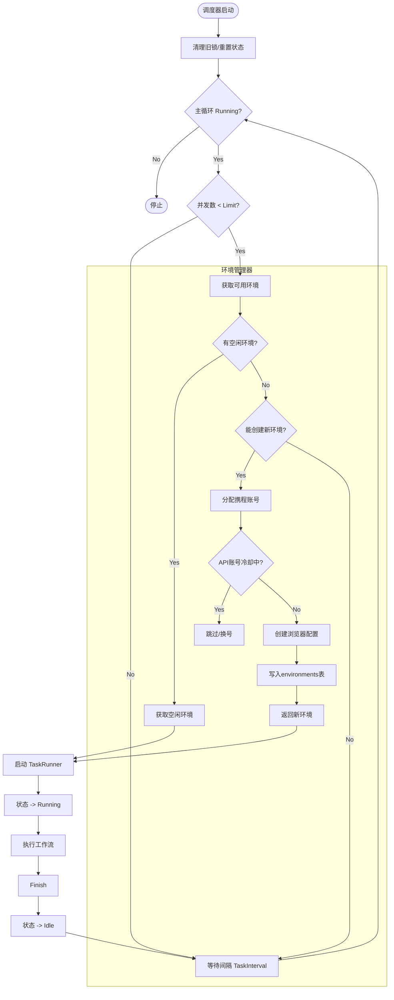
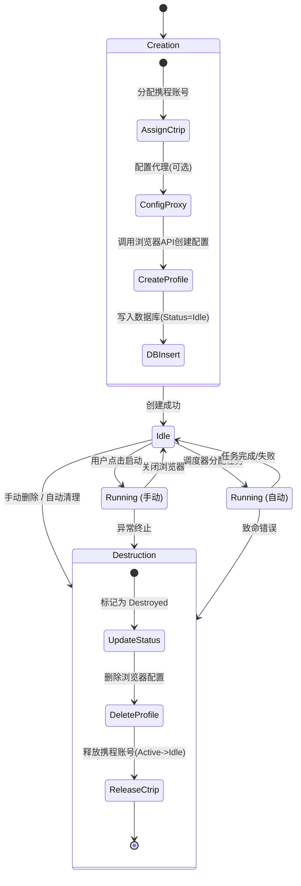
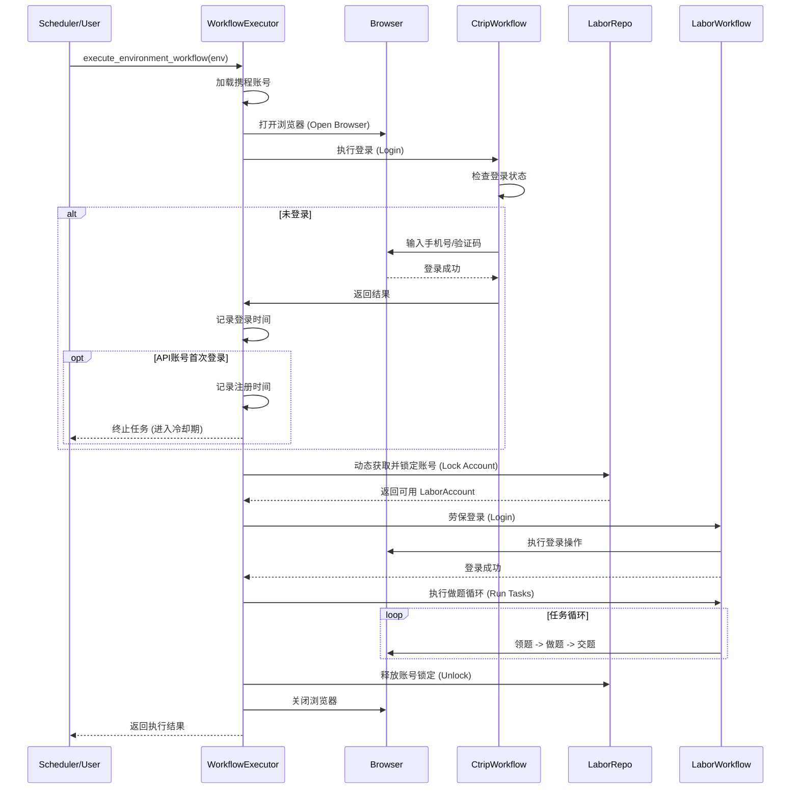

# 系统流程图 (System Architecture & Flows)

## 1. 自动任务调度流程 (Automatic Scheduling Flow)
描述 `TaskScheduler` 如何管理并发、获取环境并分发任务。

## 2. 环境生命周期管理 (Environment Lifecycle)
描述手动模式与自动模式下环境的创建与销毁差异。

## 3. 统一工作流执行 (Unified Workflow Execution)
描述 `execute_environment_workflow` 的内部逻辑，包含动态劳保账号获取。

