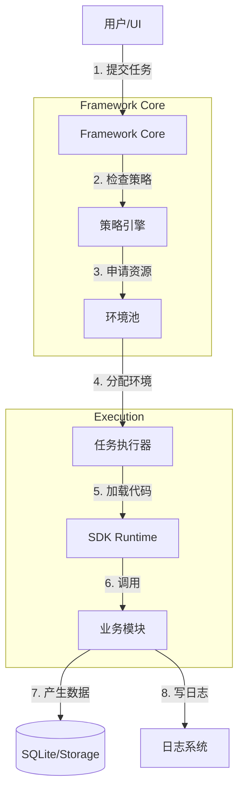

# 第 3 章 需求分析 (Requirements Analysis)

## 3.1 用户角色与场景分析 (User Roles & Scenarios)

在对系统功能进行拆解前，我们首先明确蛛行演略（crawler4j）的三类核心用户及其关键诉求。

| 用户角色 | 典型称谓 | 核心诉求 | 典型场景 |
| :--- | :--- | :--- | :--- |
| **最终用户** | Operator / User | **开箱即用，稳定执行**。<br>不关心技术细节，只关心任务能否成功跑完，环境能否自动准备。 | - "我要跑 Ctrip 任务，抓取 100 个订单"<br>- "怎么总是失败？能自动重试吗？"<br>- "我要看今天的运行报表" |
| **模块开发者** | Module Dev | **开发高效，接口清晰**。<br>不关心底层调度与环境池，只关心业务逻辑如何映射为代码。 | - "我要写个新爬虫，不仅要登录还要验证码"<br>- "我要在 UI 上加个输入框" |
| **平台运维** | Platform Ops | **资源可控，故障可查**。<br>关注系统稳定性、资源消耗与安全合规。 | - "Chrome 进程没杀干净，内存爆了"<br>- "昨天发布的版本有 Bug，需要回滚" |

---

## 3.2 功能需求分解 (Functional Decomposition)

基于上述用户诉求，我们将系统需求划分为三个核心层次：**Framework Core (核心层)**、**SDK (开发套件层)**、**Modules (业务模块层)**。

### 3.2.1 核心层需求 (Framework Core Requirements)

Core 是系统的“操作系统”，负责管理生命周期、资源与调度。它**MUST**是业务无关的 (Agnostic)。

#### [1] 运行环境管理 (Runtime & Environment)
- **FR-CORE-ENV-001 环境池化**: 必须维护一个浏览器环境池 (`BrowserPool`)，支持 `IDLE`, `BUSY`, `PAUSED`, `UNHEALTHY` 状态流转。
  - **新增**: 支持 `PAUSED` (暂停) 状态，允许手动或策略暂停环境（不分配任务但不销毁）。
- **FR-CORE-ENV-002 自动清理**: 必须具备僵尸进程识别与回收能力，确保长时间运行不泄露资源。
- **FR-CORE-ENV-003 异构支持**: 支持多种浏览器后端（Native Chrome / Playwright / 指纹浏览器 API）。

#### [2] 任务调度与策略 (Scheduling & Strategy)
- **FR-CORE-SCHED-001 优先级队列**: 支持任务优先级插队（High/Normal/Low）。
- **FR-CORE-SCHED-002 并发控制**: 必须支持基于“模块”或“全局”的并发配额限制（如 Ctrip 模块最多同时跑 2 个）。
- **FR-CORE-SCHED-003 智能重试**: 提供指数退避 (Exponential Backoff) 等重试策略，而非简单的立即重试。

#### [3] 模块与 UI 宿主 (Module & UI Host)
- **FR-CORE-MOD-001 动态加载**: 支持在不重启主进程的情况下，热加载/刷新业务模块。
- **FR-CORE-UI-001 微前端承载**: 提供统一的 UI Shell，支持通过 Schema 或 Micro-app 方式渲染模块提供的 UI 界面。
- **FR-CORE-UI-002 交互隔离**: 确保模块 UI 崩溃不导致主程序崩溃（Error Boundary）。

---

### 3.2.2 开发套件需求 (SDK Requirements)

SDK 是连接 Core 与 Modules 的桥梁。它的目标是**屏蔽复杂性**。

#### [1] 任务定义契约 (Task Definition)
- **FR-SDK-DEF-001 声明式工作流**: 提供 `TaskFlow` 定义，支持将多个步骤串联（e.g., Init -> Login -> Scrape）。
- **FR-SDK-DEF-002 脚本规范**: 提供 `TaskScript` 基类，标准化 `run(context)` 入口与生命周期 (`on_start`, `on_retry`).

#### [2] 上下文能力 (Context Capabilities)
- **FR-SDK-CTX-001 浏览器操作**: 封装 Playwright/Selenium 差异，提供统一的高级 API（如 `context.browser.goto_and_wait`）。
- **FR-SDK-CTX-002 数据持久化**: 提供 `context.storage` 接口，透明地处理 SQLite/JSON 等存储细节。
- **FR-SDK-CTX-003 日志注入**: 提供 `context.log`，自动附带 `task_id` 和 `module_name` 等元数据。

#### [3] 开发者工具 (DevTools)
- **FR-SDK-CLI-001 脚手架**: 提供 `crawler4j init-model` 快速创建标准模块目录结构。
- **FR-SDK-CLI-002 脚手架扩展**: 提供 `crawler4j add/new/add-workflow/add-ui/list` 等命令，补齐任务、工作流、配置 UI 与模块内任务浏览能力。

---

### 3.2.3 业务模块需求 (Modules Requirements)

Modules 是业务价值的载体。它们**MUST**遵循 SDK 规范。

#### [1] 业务逻辑封装 (Business Logic)
- **FR-MOD-BIZ-001 独立性**: 单个模块应包含完整的业务闭环（如“携程订单抓取”），不应依赖其他业务模块。
- **FR-MOD-BIZ-002 输入输出**: 必须明确定义输入参数 (`TaskParams`) 和输出结构 (`TaskResult`)。

#### [2] 用户交互扩展 (UI Extension)
- **FR-MOD-UI-001 配置界面**: 每个模块需提供设置界面（如账号密码配置），推荐使用 `config_schema.json` 描述。
- **FR-MOD-UI-002 交互式介入**: 支持人工介入流程（如“等待用户手动输入短信验证码”）。

#### [3] 隔离与安全 (Isolation)
- **FR-MOD-SEC-001 数据隔离**: 模块 A 不得直接读取模块 B 的数据库表。
- **FR-MOD-SEC-002 资源约束**: 模块不得私自启动未被 Core 托管的子进程或守护线程。

---

## 3.3 数据流分析 (Data Flow Analysis)



## 3.4 关键质量需求 (Critical NFRs)

1.  **稳定性 (Stability)**: Core 进程必须常驻，单个任务失败不得导致 Core 崩溃 (Crash Resilience)。
2.  **可观测性 (Observability)**: 必须能回答“任何时刻系统在跑什么、因何排队、为何失败”。
3.  **扩展性 (Extensibility)**: 新增一个抓取渠道（模块），不应修改 Core 的一行代码。

---

## 3.5 交互设计与视觉原型 (Interaction Design & Wireframes)

## 3.5 交互设计与详细视觉规格 (Detailed UI/UX Specifications)

本节详细定义蛛行演略（crawler4j）桌面端应用的每一个核心界面、交互逻辑与视觉反馈。设计原则为**信息密度适中、操作直观、状态透明**。界面语言强制为**中文**。

### 3.5.1 全局框架 (Global Shell)

#### [布局设计]
```
+----------------------------------------------------------------------------------+
| [Logo] 蛛行演略 · crawler4j     [全局搜索: 任务ID/模块名...]      [帮助] [通知(2)] [用户]   |
+----------------------+-----------------------------------------------------------+
| [侧边栏导航]         | [面包屑: 首页 > 任务管理 > 任务详情 T-20260101-001]       |
|                      |                                                           |
| 1. 仪表盘            | [主内容区域 (Main Content Area)]                          |
|                      |                                                           |
| 2. 任务中心          |                                                           |
|    - 任务列表        |                                                           |
|    - 新建任务        |                                                           |
|    - 计划任务        |                                                           |
|                      |                                                           |
| 3. 资源管理          |                                                           |
|    - 环境池          |                                                           |
|    - 代理池          |                                                           |
|                      |                                                           |
| 4. 模块中心          |                                                           |
|    - 已安装          |                                                           |
|    - 插件商店        |                                                           |
|                      |                                                           |
| 5. 系统设置          |                                                           |
|                      |                                                           |
+----------------------+-----------------------------------------------------------+
| [状态栏] 核心服务: 已连接 (Uptime: 24h) | CPU: 12% | RAM: 1.2GB | 网络: 500KB/s  |
+----------------------------------------------------------------------------------+
```

#### [交互逻辑]
*   **侧边栏**: 支持折叠图标模式。当前激活项高亮。
*   **通知中心**: 点击展示系统级告警（如：Core 失去连接、磁盘空间不足）。
*   **状态栏**: 实时刷新各核心指标（1秒/次）。如果 Core 断连，状态栏变红并弹出重连对话框。

---

### 3.5.2 仪表盘 (Dashboard)

#### [布局设计]
```
+----------------------------------------------------------------------------------+
| [欢迎语] 下午好，管理员。系统运行正常。                                          |
+--------------------+---------------------+------------------+--------------------+
| [活跃任务数]       | [排队任务数]        | [今日成功率]     | [环境健康度]       |
| 12                 | 5                   | 98.5%            | 10/10 (100%)       |
| (+2 较上小时)      | (高优: 1)           | (-1.2%)          | 0 僵死 / 2 暂停    |
+--------------------+---------------------+------------------+--------------------+
|                                                                                  |
| [实时吞吐量趋势图 (Chart)]                                                       |
| (X轴: 时间, Y轴: 任务完成数/分钟)                                                |
|                                                                                  |
+----------------------------------------------------------------------------------+
| [最近活动流]                                            [快捷入口]               |
| 14:02 [错误] 任务 T-1021 (携程) 因网络超时失败          [+ 新建任务]             |
| 14:00 [信息] 自动清理: 回收了 2 个僵死环境              [> 查看日志]             |
| 13:58 [成功] 任务 T-1020 (Amazon) 完成，产出 500 条     [# 策略配置]             |
+----------------------------------------------------------------------------------+
```

---

### 3.5.3 任务管理 - 列表页 (Task List)

#### [布局设计]
```
+----------------------------------------------------------------------------------+
| [任务管理]                                                                       |
|                                                                                  |
| 筛选: [状态: 所有 v] [模块: 所有 v] [时间范围: 最近24h v] [输入ID搜索]  [查询]   |
+----------------------------------------------------------------------------------+
| [批量操作: 取消 / 重试 / 删除]                                                   |
+---------+----------+--------+----------+----------+----------------+-------------+
| 任务ID  | 模块名称 | 优先级 | 状态     | 耗时     | 创建时间       | 操作        |
+---------+----------+--------+----------+----------+----------------+-------------+
| T-1002  | Ctrip    | 高     | 🟢 成功   | 1m 20s   | 14:05:00       | [详情] [重试]|
| T-1001  | Amazon   | 普通   | 🔵 运行中 | 30s...   | 14:04:30       | [详情] [取消]|
| T-1000  | Taobao   | 低     | 🟡 排队   | -        | 14:00:00       | [详情] [置顶]|
| T-0999  | JD       | 普通   | 🔴 失败   | 10s      | 13:59:00       | [详情] [日志]|
| ...     |          |        |          |          |                |             |
+---------+----------+--------+----------+----------+----------------+-------------+
| [<<] [<] 1 / 50 [>] [>>]  每页显示: [20 v]                                       |
+----------------------------------------------------------------------------------+
```

#### [交互逻辑]
*   **状态徽章 (Badge)**:
    *   🔵 运行中 (Running): 只有此状态显示动态进度条（若有）。
    *   🟡 排队 (Queued): 悬停显示排队原因（如：配额已满、等待环境）。
    *   🔴 失败 (Failed): 悬停显示简要错误 (如 Error Code)。
*   **操作列**:
    *   点击 **[详情]** 跳转至详情页。
    *   点击 **[重试]** 弹出确认框：“确定以相同参数重新提交 T-1002 吗？”。

---

### 3.5.4 任务管理 - 详情页 (Task Detail)

#### [布局设计]
```
+----------------------------------------------------------------------------------+
| [<- 返回]  任务详情: T-1001                                                      |
| 状态: 🔵 运行中  |  模块: Ctrip  |  环境ID: chrome-05  |  策略: Default        |
+----------------------------------------------------------------------------------+
| [Tab: 实时日志]  [Tab: 输出结果]  [Tab: 原始配置]  [Tab: 链路追踪]                 |
+----------------------------------------------------------------------------------+
| 14:04:30 [INFO] TaskContext initialized.                                         |
| 14:04:31 [INFO] Browser loaded, navigating to https://ctrip.com                  |
| 14:04:35 [DEBUG] DOM element #search-btn found.                                  |
| 14:04:36 [WARN] Network slow, waiting 2s...                                      |
| ... (自动滚动/锁定滚动)                                                          |
|                                                                                  |
| [下载日志]  [复制全部]                                                           |
+----------------------------------------------------------------------------------+
```

*   **结果 Tab**: 以 JSON 树状图展示 `metrics` 和 `data`。
*   **配置 Tab**: 展示提交时的 `input_params` (JSON)。

---

### 3.5.5 新建任务向导 (Task Creation Wizard)

**核心交互逻辑：环境匹配 (Environment Matching)**
当用户选择模块后，系统**自动读取**该模块的 `module.yaml` 中的 `requirements` (如 `browser: chromium`, `network: proxy`)，并与当前环境池中的 `Environment` 能力 (`capabilities`) 进行匹配。

#### [布局设计]
```
+----------------------------------------------------------------------------------+
| 新建任务                                                                         |
+----------------------------------------------------------------------------------+
| 1. 选择模块                                                                      |
|  [搜索模块...]                                                                   |
|  +------------+   +------------+   +------------+                                |
|  | [Icon]     |   | [Icon]     |   | [Icon]     |                                |
|  | 携程(Ctrip)|   | 亚马逊     |   | 链家       |                                |
|  | v1.0.2     |   | v2.1.0     |   | v0.9.1     |                                |
|  +------------+   +------------+   +------------+                                |
|  > 已选: Ctrip (需要: Chromium, Proxy)                                           |
|                                                                                  |
| 2. 环境选择与匹配 (自动计算)                                                     |
|  [x] 使用环境池自动分配 (推荐)                                                   |
|      ✅ 匹配到 5 个可用环境 (ID: chrome-01, chrome-02...)                       |
|      ℹ️ 其中 3 个空闲，2 个忙碌 (需排队)                                        |
|  [ ] 指定特定环境 (Debug模式)                                                    |
|      下拉: [ chrome-05 (IDLE) v ]                                                |
|                                                                                  |
| 3. 配置参数 (由模块 Schema 动态渲染)                                             |
|  ----------------------------------------------------------                      |
|  |  目标城市: [ 上海 v ]                                    |                      |
|  | -------------------------------------------------------- |                      |
|  |  入住日期: [ 2026-02-01 ]  离店日期: [ 2026-02-03 ]      |                      |
|  | -------------------------------------------------------- |                      |
|  |  高级选项:                                               |                      |
|  |    无头模式 (Headless): [x] 是 (强制开启)                |                      |
|  ----------------------------------------------------------                      |
|                                                                                  |
| 4. 执行策略                                                                      |
|  策略模板: [ 默认优化策略 v ]  [查看/编辑]                                       |
|                                                                                  |
| [ 立即提交 ]   [ 存为计划任务 ]   [ 取消 ]                                       |
+----------------------------------------------------------------------------------+
```

---

### 3.5.6 资源管理 - 环境池 (Resource / Env Pool)

#### [布局设计]
```
+----------------------------------------------------------------------------------+
| 环境池管理                                                                       |
+----------------------------------------------------------------------------------+
| 概览: 总数 10 | 🟢 空闲: 5 | 🔵 忙碌: 3 | ⚪ 暂停: 2 | 🔴 不健康: 0            |
+----------------------------------------------------------------------------------+
| [ 卡片视图 v ]                                                                   |
|                                                                                  |
| +----------------+   +----------------+   +----------------+                     |
| | ID: chrome-01  |   | ID: chrome-02  |   | ID: chrome-03  |                     |
| | 🟢 IDLE        |   | 🔵 BUSY (T-99) |   | ⚪ PAUSED      |                     |
| | PID: 4021      |   | PID: 4022      |   | PID: 4023      |                     |
| | Mem: 120MB     |   | Mem: 850MB     |   | Mem: 50MB      |                     |
| | [暂停] [调试]  |   | [详情] [终止]  |   | [恢复] [销毁]  |                     |
| +----------------+   +----------------+   +----------------+                     |
| ...                                                                              |
+----------------------------------------------------------------------------------+
```

#### [交互逻辑]
*   **暂停/恢复 (Pause/Resume)**:
    *   点击 **[暂停]**: 状态变为 `PAUSED`。Core 调度器将不再向此环境分配新任务，但正在运行的任务不受影响（Graceful Pause）。
    *   点击 **[恢复]**: 状态变回 `IDLE`，重新参与调度。
*   **调试 (Debug)**: 点击打开 VNC 窗口或 CDP 调试器查看浏览器实时画面。
*   **终止 (Kill)**: 强制杀进程。仅在环境卡死时使用。

---

### 3.5.7 模块中心 (Module Center)

#### [UI-11] 模块列表 (Module List)
*   **TopBar**:
    - `SearchInput`: "搜索已安装模块..."
    - `ImportBtn`: 主按钮 [+ 导入本地模块] -> 触发 [UI-18]。
    - `StoreBtn`: 次级按钮 [访问插件商店] -> 跳转 [UI-12]。
*   **ModuleTable**:
    - 列: `Icon`, `Name` (Link to Detail), `Version`, `Author`, `Status` (Enabled/Disabled), `Actions`.
    - **Actions**:
        1.  [配置]: 图标 Gear，跳转 [UI-19] 全局配置。
        2.  [开关]: 切换启用/禁用状态。
        3.  [卸载]: 红色垃圾桶图标 (需二次确认)。

#### [UI-12] 模块商店 (Store)
*   类 App Store 卡片布局。每张卡片展示:
    - `Icon`, `Name`, `StarRating`, `DownloadCount`.
    - `ActionBtn`: [ 安装 ] 或 [ 已安装 ]。

#### [UI-18] 模块导入弹窗 (Import Module Dialog)
*   **触发**: 点击列表页的 [+ 导入本地模块]。
*   **Step 1: 文件上传**
    - `DropZone`: 虚线框 "拖拽 .zip / .whl 文件到此处，或点击上传".
    - `FilePreview`: 显示文件名、大小 (e.g., `crawler-ctrip-v1.0.2.zip`, 2.5MB).
*   **Step 2: 预检 (Pre-flight Check)**
    - 系统自动解压并读取 `module.yaml`。
    - **显示检查结果**:
        - ✅ 格式校验通过 (Schema Valid)
        - ✅ SDK 版本兼容 (Requires ^0.5.0, Current 0.5.2)
        - ⚠️ 权限请求: 读写网络、本地存储 (需用户确认)
*   **Step 3: 确认安装**
    - `InstallBtn`: "确认并安装 module_id"。
    - `CancelBtn`: "取消"。

#### [UI-19] 模块全局配置页 (Global Config)
*   **触发**: 点击模块列表的 [配置] 按钮。
*   **Context**: 此配置应用于该模块的**所有任务实例** (如公共账号池、API Key)。
*   **Layout**:
    - `Header`: 模块图标 + "携程 (Ctrip) 全局配置"。
    - `ConfigForm`: 由模块的 `config_schema.json` (scope=global) 渲染。
        - **示例字段**:
            - `Concurrent Limit`: [ 5 ] (模块级最大并发)
            - `Account Pool`: (多行文本框 / 列表)
              - user1:pass1
              - user2:pass2
            - `SMS API Key`: [ ********** ]
    - `Footer`: 按钮“保存配置”“重置默认”。

---

### 3.5.8 策略编辑器 (Strategy Editor) - 双流编辑

#### [交互逻辑]
见 05-3 章节定义的双模式（可视化 Form + YAML 代码）。此处不再赘述布局，但在 **3.5.5 新建任务向导** 中点击“查看/编辑”策略时，会以 **模态弹窗 (Modal)** 形式加载此编辑器。

---

### 3.5.9 启动与认证 (Startup & Auth)

#### [UI-01] 启动加载页 (Splash Screen)
*   **布局**: 居中显示 APP Logo，下方为进度条与当前的加载动作文字。
*   **元素**:
    1.  `LogoImage`: 256x256 像素项目 Logo。
    2.  `ProgressBar`: 蓝色细条，显示初始化进度 (0-100%)。
    3.  `StatusText`: 动态文字，例："正在连接 Core 服务...", "加载本地模块..."。
    4.  `VersionLabel`: 底部灰色小字 "v1.0.0"。

#### [UI-02] 用户登录页 (Login)
*   **布局**: 左右分栏。左侧为插画/Banner，右侧为登录表单。
*   **表单元素**:
    1.  `Header`: "欢迎使用蛛行演略（crawler4j）"。
    2.  `UsernameInput`: 输入框，Placeholder="请输入用户名/邮箱"，图标: User。
    3.  `PasswordInput`: 密码框，Placeholder="请输入密码"，图标: Lock，右侧附带 `EyeIcon` (显/隐密码)。
    4.  `RememberMeCheckbox`: 复选框 "记住我"。
    5.  `ServerConfigBtn`: 链接文字 "服务器设置"，点击弹出 [UI-03]。
    6.  `LoginBtn`: 蓝色主按钮 "登 录"，点击后进入 Loading 态。
    7.  `ErrorLabel`: 表单顶部的红色错误提示区 (默认隐藏)。

#### [UI-03] 服务器配置弹窗 (Server Dialog)
*   **触发**: 点击登录页的 "服务器设置"。
*   **元素**:
    1.  `HostInput`: 输入框，默认 "127.0.0.1"。
    2.  `PortInput`: 输入框，默认 "8000"。
    3.  `TokenInput`: 密码框，API Access Token。
    4.  `TestConnBtn`: 幽灵按钮 "测试连接"，点击显示 ✅/❌ 结果。
    5.  `SaveBtn`: 主按钮 "保存并返回"。
    6.  `CancelBtn`: 次级按钮 "取消"。

---

### 3.5.10 系统设置 (Settings)

系统设置分为三个子页面：常规、网络、存储。

#### [UI-14] 设置页框架
采用左侧 Tabs 布局: [常规, 网络, 存储, 关于]。

**1. 常规设置 (General Tab)**
```
+-------------------------------------------------------+
| 界面语言:    [ 中文 v ]                               |
| 主题外观:    [ 跟随系统 v ] (深色/浅色)               |
| 自动更新:    [x] 自动检查更新 (当前 v1.0.0)           |
| 开机自启:    [ ] 随系统启动                           |
| 窗口行为:    [x] 点击关闭时最小化到托盘               |
+-------------------------------------------------------+
```

**2. 网络设置 (Network Tab)**
```
+-------------------------------------------------------+
| 全局代理 (Global Proxy):                              |
|   [ ] 开启                                            |
|   协议: [ HTTP v ]  地址: [ 127.0.0.1 ] 端口: [7890]  |
|                                                       |
| 智能代理池对接 (Proxy Pool Provider):                 |
|   API 地址: [ https://api.proxypool.com/get ]         |
|   API Key:  [ ****************          ]             |
|   [ 测试连接 ] -> ✅ 延迟 20ms                        |
+-------------------------------------------------------+
```

**3. 存储设置 (Storage Tab)**
```
+-------------------------------------------------------+
| 数据存储路径: [ /data/crawler4j/db   ] [浏览]         |
| 日志保留天数: [ 30 ] 天                               |
| 截图保留策略: [ 仅失败任务 v ]                        |
|                                                       |
| [ 立即清理缓存 ] (释放约 120MB)                       |
+-------------------------------------------------------+
```

---

### 3.5.11 消息与通知 (Notifications)

#### [UI-15] 通知抽屉
*   **触发**: 点击顶部铃铛图标向下滑出。
*   **Header**: "通知 (5)" + 右侧文字按钮 [全部标为已读]。
*   **List**: 滚动列表。
    *   **严重告警 Item**:
        - Icon: 🔴 (Exclamation)
        - Title: "核心服务连接断开" (红色加粗)
        - Time: "1m前"
        - Body: "无法连接到 Core 进程，正在尝试重连..."
    *   **警告 Item**:
        - Icon: 🟡 (Triangle)
        - Title: "磁盘空间不足"
        - Body: "剩余空间低于 500MB..."
    *   **信息 Item**:
        - Icon: 🔵 (Info)
        - Title: "任务 T-1002 完成"
        - Body: "成功采集 500 条数据。"
*   **Footer**: [查看全部历史消息] (跳转至完整消息页)。

---

### 3.5.12 日志与调试全屏视图 (Full Log Viewer)

点击任务详情页的 "🔍 全屏浏览" 进入。

#### [UI-16] 深度日志分析器
*   **TopBar**:
    - `BackBtn`: [<- 返回任务]
    - `Title`: "日志查看器: T-1002 (Ctrip)"
    - `ExportGroup`: 按钮“导出 TXT”“导出 HTML”“清空”
*   **FilterBar**:
    - `LevelCheckboxes`: [x] INFO [x] WARN [x] ERROR [ ] DEBUG
    - `SearchInput`: "输入关键词搜索..."
    - `NavBtns`: 按钮“上一项”“下一项”（匹配结果跳转）
    - `AutoScrollSwitch`: [x] 自动滚动底部
*   **LogArea**:
    - 黑色背景，Monospace 字体。
    - 支持 ANSI 颜色渲染。
    - 行号显示。
    - 示例:
      ```
      14:05:01 [INFO] [Init] Initializing browser context...
      14:05:02 [INFO] [Nav] Detected Chinese environment, applying locale.
      14:05:05 [WARN] [AntiBot] Complex captcha detected at step 3.
      14:05:05 [INFO] [Human] Waiting for manual intervention...
      ```

---

### 3.5.13 帮助与关于 (Help & About)

#### [UI-17] 关于页面
*   **Center Content**:
    - 大型 Logo。
    - 此处显示版本号 "蛛行演略 · crawler4j v1.0.0"。
    - `CheckUpdateBtn`: [ 检查更新 ] -> "当前已是最新版本"。
*   **Links**:
    - [官方文档](https://docs.crawler4j.org)
    - [GitHub 仓库](https://github.com/uroborus/crawler4j)
    - [报告问题](mailto:support@crawler4j.org)
*   **Footer**: "Copyright © 2026 蛛行演略（crawler4j）Team. All Rights Reserved."

---

## 3.6 典型场景架构映射 (Architecture Mapping Case Study)

为了清晰界定各组件职责，我们以 **“携程(Ctrip) 自动化抓取”** 为例，深入剖析全链路实现。

### 3.6.1 场景描述
**需求**: 并行打开 5 个指纹浏览器，每个需绑定独立 IP 和指纹信息。环境启动后，需登录携程账号（部分需二次验证），随后进入订单列表进行自动化抓取。

### 3.6.2 职责边界映射表

| 逻辑层级 | 组件归属 | 职责描述 | 本案具体配置/行为 |
| :--- | :--- | :--- | :--- |
| **配置数据** | **模块全局配置**<br>(Module Global Config) | **管理“资源型”数据**。<br>即跨任务共享、与具体执行逻辑无关的资产。 | 1. **账号池**: 100组 `username/password/cookie`<br>2. **打码平台 Key**: 用于过滑块验证<br>3. **通知 Webhook**: 钉钉群机器人 URL |
| **执行意图** | **任务参数**<br>(Task Params) | **定义“本次要做什么”**。<br>即单次运行的目标。 | 1. **抓取范围**: `past_30_days`<br>2. **目标城市**: `Shanghai`<br>3. **指定账号**: (可选) 强制使用账号 A |
| **调度控制** | **策略**<br>(Strategy) | **定义“怎么运行” (QoS)**。<br>即系统资源的分配规则。 | 1. **并发控制**: `max_concurrency: 5`<br>2. **重试机制**: `retry: 3, backoff: exponential`<br>3. **环境偏好**: `tag: fingerprint_v2` |
| **基础设施** | **Framework Core**<br>(EnvManager) | **提供“执行容器”**。<br>负责底层的脏活累活。 | 1. **分配环境**: 从池中划拨 5 个空闲浏览器<br>2. **环境加工 (*Create/Bind*)**: 调用指纹浏览器 API 启动进程，**绑定指定 IP 和指纹配置**<br>3. **网络隧道**: 确保容器的网络流量走指定 Proxy |
| **业务逻辑** | **Module Code**<br>(SDK Runtime) | **负责“浏览器内的操作”**。<br>只关注页面交互。 | 1. **导航**: `ctx.browser.goto("ctrip.com")`<br>2. **登录**: 读取 GlobalConfig 账号 -> 填表 -> 提交<br>3. **业务**: 点击订单 -> 翻页 -> 解析 HTML -> `ctx.emit(data)` |

### 3.6.3 执行时序与数据流

1.  **准备阶段 (Task Submit)**
    *   用户在 **UI-08 新建任务向导** 中选择 "Ctrip 模块"。
    *   **Core** 读取模块需求 `requirements: [fingerprint, proxy]`。
    *   **Core** 根据 **策略 (Strategy)** 决定启动 5 个并发任务。

2.  **环境构建 (Env Preparation) ——> Core 的职责**
    *   Core 向 `EnvProvider` 申请环境。
    *   Provider 启动指纹浏览器进程，此时 **注入 IP 和 指纹特征**。
    *   *产物*: 获得一个已绑定 IP/指纹的 `BrowserContext` 对象。

3.  **代码执行 (Module Execution) ——> Module 的职责**
    *   Core 将 `BrowserContext` 传给 SDK。
    *   **Module 代码运行**:
        ```python
        def run(self, ctx):
            # A. 登录阶段
            # 从全局配置(UI-19)中“借”一个账号
            account = ctx.global_config.account_pool.lease() 
            
            ctx.browser.goto("login.ctrip.com")
            ctx.browser.fill("#user", account.username)
            ctx.browser.fill("#pass", account.password)
            
            # B. 业务阶段
            # 浏览器环境(IP/指纹)由Core保证，代码无需关心代理设置
            ctx.browser.goto("my.ctrip.com/orders")
            data = scrape_orders()
            ctx.emit(data)
        ```

4.  **资源回收 (Cleanup)**
    *   任务结束，Core 回收环境 (State -> IDLE)。
    *   Module 释放账号回池。

---
