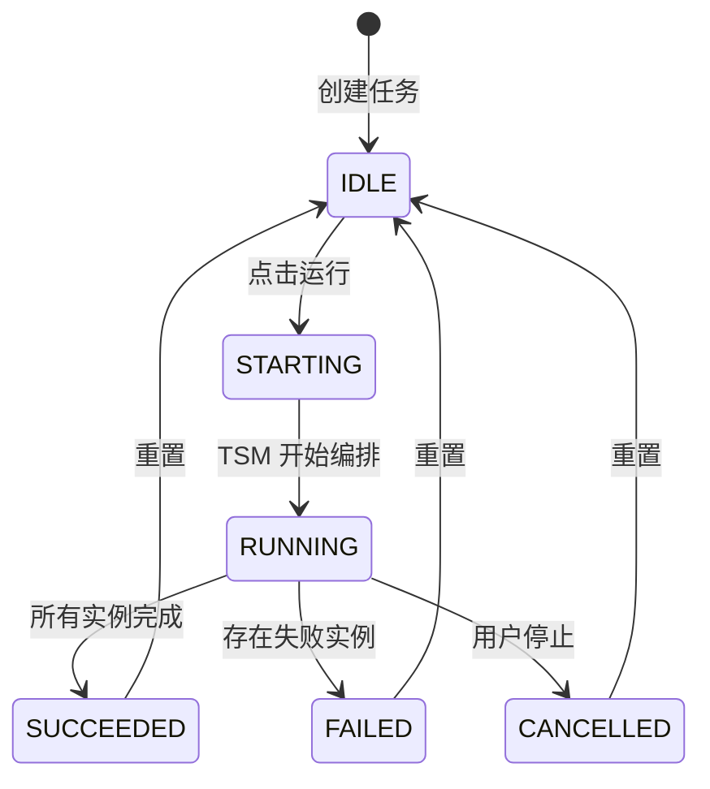
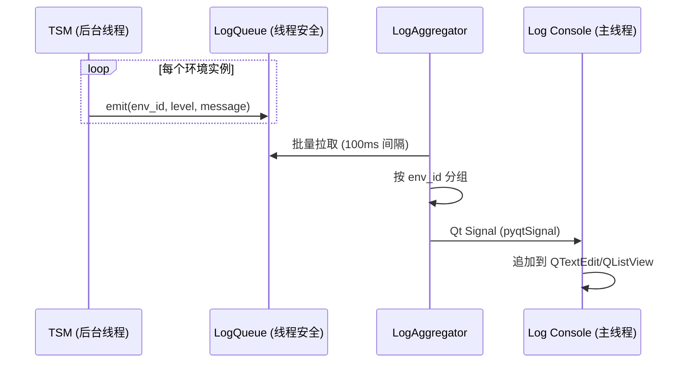

# 5.4 自动化任务管理 (Automation Task Management)

## 5.4.1 需求概述

自动化任务管理 (ATM) 子系统是任务的"执行壳"与"展示器"。它负责：

1.  **任务记录管理**: 维护用户配置的多条自动化任务记录。
2.  **触发执行**: 启动关联的 TSM 策略，驱动任务运行。
3.  **状态展示**: 跟踪任务状态 (运行中/成功/失败)。
4.  **日志聚合**: 实时聚合并展示多个并行环境的执行日志。

### 核心定位

| 维度 | 描述 |
|------|------|
| **职责边界** | ATM 是"触发器+展示器"，不包含策略逻辑，所有编排工作委托给 TSM。 |
| **关联关系** | 每个 ATM 任务 **必须关联一个 TSM 策略** (`strategy_id`)。 |
| **界面核心** | 提供**实时滚动日志窗口**，聚合显示 N 个并行环境的日志流。 |

### 与 TSM 的 E-R 关系

```
┌─────────────────┐        ┌─────────────────┐
│ AutomationTask  │ N : 1  │  TaskStrategy   │
│     (ATM)       │───────▶│     (TSM)       │
├─────────────────┤        ├─────────────────┤
│ id              │        │ id              │
│ name            │        │ name            │
│ strategy_id  ───┼────────│ environment     │
│ status          │        │ lifecycle       │
│ log_path        │        │ concurrency     │
│ created_at      │        │ execution       │
└─────────────────┘        └─────────────────┘
```

---

## 5.4.2 系统设计

### 状态机设计 (Task State Machine)



### 核心类图

| 类 | 职责 |
|---|------|
| `AutomationTask` | 任务实体，持有 `strategy_id` 和状态 |
| `TaskExecutor` | 触发器，调用 TSM 开始执行 |
| `LogAggregator` | 日志聚合器，收集多环境日志流 |
| `TaskRepository` | 持久化接口 |

---

## 5.4.3 功能需求分解

### FR-ATM-001 任务 CRUD
- **功能说明**: 创建、查看、修改、删除自动化任务记录。
- **必填字段**: `name`, `strategy_id`。
- **存储**: 持久化至 SQLite。

### FR-ATM-002 任务触发
- **功能说明**: 用户点击"运行"后，ATM 调用 TSM 开始编排。
- **流程**:
    1. 更新任务状态为 `STARTING`。
    2. 调用 `TSM.execute(strategy_id)`。
    3. 订阅 TSM 的事件流 (进度、日志、完成)。
    4. 根据 TSM 返回更新状态为 `RUNNING` / `SUCCEEDED` / `FAILED`。

### FR-ATM-003 停止与取消
- **功能说明**: 响应用户停止指令。
- **机制**:
    - 调用 `TSM.cancel()`，由 TSM 负责优雅停止所有环境。
    - ATM 更新状态为 `CANCELLED`。

### FR-ATM-004 持久化与恢复
- **功能说明**: 任务配置与历史记录持久化。
- **恢复场景**: 系统重启后，检查 `RUNNING` 状态的任务，标记为 `INTERRUPTED`。

### FR-ATM-005 实时日志窗口 (Critical)
- **功能说明**: 提供实时滚动日志控制台，聚合显示多个并行环境的日志。
- **技术要求**:
    - 支持按环境 ID 过滤 (Tab 或下拉选择)。
    - 支持日志级别过滤 (DEBUG/INFO/WARN/ERROR)。
    - 自动滚动到最新日志，手动滚动时暂停自动滚动。
    - 日志持久化到文件 (`log_path`)。

---

## 5.4.4 数据设计 (Data Design)

### 任务表 (automation_tasks)

| 字段 | 类型 | 说明 |
|------|------|------|
| id | TEXT (PK) | UUID |
| name | TEXT | 任务名称 |
| strategy_id | TEXT (FK) | 关联的 TSM 策略 ID |
| status | TEXT | 状态 (IDLE/STARTING/RUNNING/SUCCEEDED/FAILED/CANCELLED) |
| log_path | TEXT | 日志文件路径 |
| last_run_at | DATETIME | 最后运行时间 |
| created_at | DATETIME | 创建时间 |
| updated_at | DATETIME | 更新时间 |

### 运行历史表 (task_runs)

| 字段 | 类型 | 说明 |
|------|------|------|
| id | TEXT (PK) | 运行记录 ID |
| task_id | TEXT (FK) | 关联任务 ID |
| started_at | DATETIME | 开始时间 |
| ended_at | DATETIME | 结束时间 |
| status | TEXT | 最终状态 |
| instances_total | INT | 环境实例总数 |
| instances_succeeded | INT | 成功数 |
| instances_failed | INT | 失败数 |
| summary | JSON | 执行摘要 |

---

## 5.4.5 接口设计

### ITaskService

```python
class ITaskService(Protocol):
    def create_task(self, name: str, strategy_id: str) -> str:
        """创建任务，返回 task_id。"""
        ...
    
    def run_task(self, task_id: str) -> None:
        """触发任务执行。"""
        ...
    
    def stop_task(self, task_id: str) -> None:
        """停止任务。"""
        ...
    
    def get_task(self, task_id: str) -> AutomationTask:
        """获取任务详情。"""
        ...
    
    def list_tasks(self) -> list[AutomationTask]:
        """列出所有任务。"""
        ...
    
    def subscribe_logs(self, task_id: str, callback: Callable[[LogEntry], None]) -> None:
        """订阅任务日志流。"""
        ...
```

---

## 5.4.6 交互设计 (UI Design)

### 任务列表页

```
+-------------------------------------------------------+
|  自动化任务                              [+ 新建任务]  |
+-------------------------------------------------------+
| 名称              | 策略          | 状态    | 操作    |
|-------------------|---------------|---------|---------|
| 携程机票监控       | ctrip_crawler | ● 运行中 | ⏹ 日志  |
| 火车票抢票         | 12306_grab    | ○ 空闲   | ▶ 编辑   |
| 酒店价格采集       | hotel_price   | ✓ 成功   | ▶ 日志   |
+-------------------------------------------------------+
```

### 日志窗口 (Real-time Log Console)

```
+-------------------------------------------------------+
|  任务: 携程机票监控                         [✕ 关闭]  |
+-------------------------------------------------------+
|  环境: [全部 ▼]  级别: [INFO ▼]              [⬇ 滚动] |
+-------------------------------------------------------+
| [ENV-1] 18:30:01 INFO  正在登录账号 user_001...       |
| [ENV-2] 18:30:02 INFO  正在登录账号 user_002...       |
| [ENV-1] 18:30:05 INFO  登录成功，开始搜索航班         |
| [ENV-3] 18:30:05 WARN  代理 IP 响应慢，切换中...      |
| [ENV-2] 18:30:07 INFO  登录成功，开始搜索航班         |
| [ENV-1] 18:30:12 INFO  找到 15 个航班结果             |
| [ENV-3] 18:30:13 INFO  代理切换成功，继续执行         |
|                                                       |
|                                    ▼ 自动滚动已启用   |
+-------------------------------------------------------+
```

### 日志流转机制 (桌面端架构)



**关键设计点**:
1. **线程安全队列**: TSM 后台线程写入，UI 线程读取。
2. **批量拉取**: 避免 UI 线程过于频繁更新，100ms 拉取一次。
3. **Qt Signal 跨线程**: 使用 `pyqtSignal` 安全地跨线程传递日志。

