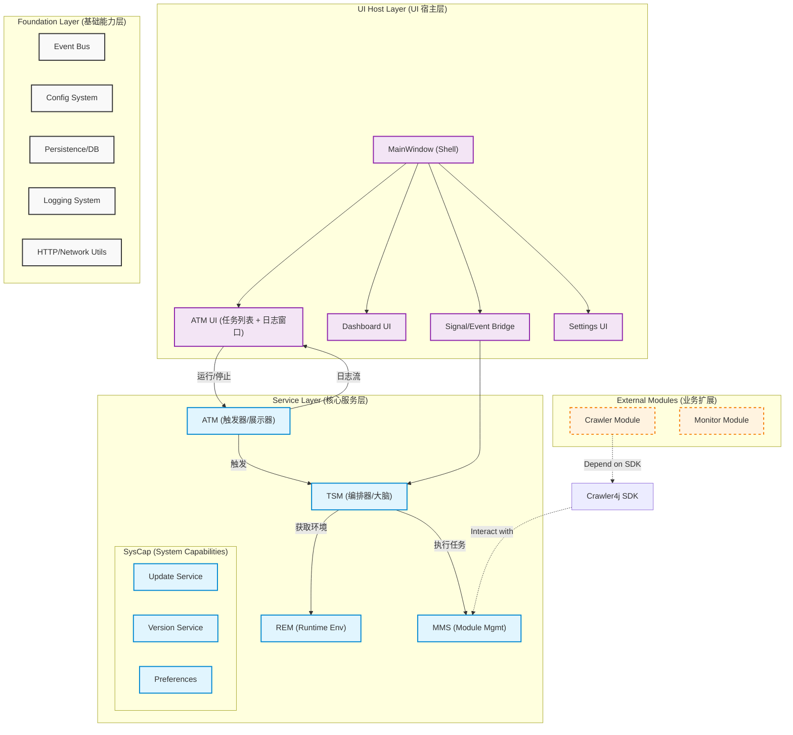

# 第 5 章 系统一：Framework Core（框架核心）

## 核心架构概览

Framework Core 是 Crawler4j 的微内核底座，负责生命周期管理、资源治理、调度编排与 UI 承载。
遵循 **高内聚（High Cohesion）** 与 **职责分离（Separation of Concerns）** 原则，Core 内部划分为三个高内聚层次：基础层、服务层与 UI 宿主层。

### 核心架构图

### 服务层依赖关系 (关键变更)

| 子系统 | 定位 | 依赖关系 | 职责 |
|--------|------|---------|------|
| **ATM** | 触发器/展示器 | → TSM | 管理任务记录，触发执行，聚合日志展示 |
| **TSM** | 编排器/大脑 | → REM, MMS | 定义策略：环境+生命周期+并发+执行目标 |
| **REM** | 资源池 | (被 TSM 调用) | 管理环境的创建、租用、释放与回收 |
| **MMS** | 模块仓库 | (被 TSM 调用) | 模块的扫描、加载、校验、安装与卸载 |

**依赖链**: `ATM → TSM → (REM, MMS)`

- ATM **不直接调用** REM 或 MMS，所有编排工作委托给 TSM。
- TSM 是真正的"大脑"，它读取策略配置，调用 REM 创建环境，调用 MMS 执行任务。

### 分层职责详解

#### 1. Foundation Layer (基础能力层)
**定位**: 提供与业务无关的通用底层能力，是整个框架的基石。
- **职责**:
  - **EventBus**: 进程内事件总线，实现模块间及层级间的解耦通信。
  - **ConfigSystem**: 加载与管理全局配置（YAML/Env），提供强类型配置访问。
  - **Storage**: 基于 SQLite 的本地持久化封装，提供 ORM 或 Query Builder 能力。
  - **Logging**: 统一日志门面，负责日志的分级、轮转与持久化。
  - **Network**: 基础 HTTP 客户端封装，用于系统级通信（如检查更新）。

#### 2. Service Layer (核心服务层)
**定位**: 承载框架的核心业务逻辑，由 5 个高内聚子系统组成。
- **职责**:
  - **ATM (自动化任务)**: 任务记录管理、触发执行、日志聚合展示（见 5.4）。
  - **TSM (任务策略)**: 执行编排器，定义环境+生命周期+并发+执行目标（见 5.3）。
  - **REM (运行环境)**: 负责浏览器/进程资源的池化、分配与回收（见 5.2）。
  - **MMS (模块管理)**: 负责模块的扫描、加载、校验、安装与卸载（见 5.1）。
  - **SysCap (基础能力)**:
    - **UpdateService**: 负责 OTA 升级流程。
    - **VersionService**: 负责版本兼容性检查。
    - **Preferences**: 负责系统偏好设置管理。

#### 3. UI Host Layer (UI 宿主层)
**定位**: 提供用户交互界面与模块 UI 的承载容器，**与逻辑层严格分离**。
- **职责**:
  - **MainWindow**: 应用程序主窗口框架（Shell），提供全局导航与布局管理。
  - **SignalBridge**: 将 Service 层的事件转换为 UI 信号，将 UI 操作转换为 Service 层的命令调用。
  - **ATM UI**: 任务列表页 + 实时滚动日志窗口，是用户操作自动化任务的核心界面。
  - **Core UI Panels**: 框架自带的核心面板，如仪表盘（Dashboard）、设置页（Settings）、模块管理页。
  - **Micro-Frontend Host**: 负责加载和渲染模块提供的 UI 扩展（声明式 UI 或 受信 Micro-App）。

### 架构原则落地

1.  **高内聚 (High Cohesion)**
    - 每个 Service 专注于单一领域（如 TSM 只管编排，ATM 只管触发和展示）。
    - UI 组件（如 Log Console）只负责展示状态，逻辑全部委托给 Service。

2.  **职责分离 (Separation of Concerns)**
    - **UI ↔ Logic**: UI 层不直接操作底层数据，必须通过 SignalBridge 发送 Command，并监听 Event 更新界面。
    - **ATM ↔ TSM**: ATM 不包含策略逻辑，只负责触发和展示；TSM 不负责 UI 渲染，只负责编排。
    - **Core ↔ Module**: Core 不包含任何具体业务（如爬虫逻辑），仅提供调度与运行环境。

