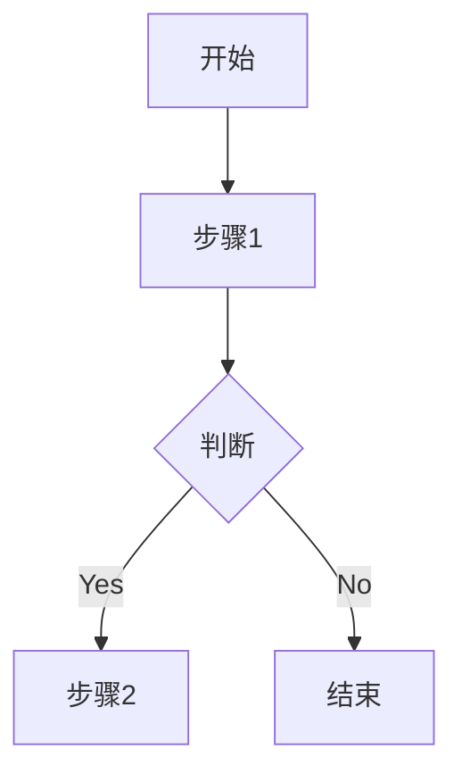

# 7.2 模块规格说明书模板 (Module Specification Template)

> 复制本模板为 `07-x-your_module.md` 并填写。

## 7.x.1 需求概述 (Overview)

简述本模块的业务目标。例如：“负责 XX 平台的商品数据采集与自动下单”。

### 核心能力
- **能力1**: 描述...
- **能力2**: 描述...

## 7.x.2 流程与任务设计 (Flow & Tasks)

### 核心任务: `tasks.your_task_name`

**功能说明**: ...

**流程图**:

### 核心工作流: `workflows.your_workflow_name`

**编排逻辑**:
1. ...
2. ...

## 7.x.3 数据设计 (Data Design)

### 数据模型 (Data Models)

| 字段 | 类型 | 说明 | 约束 |
|------|------|------|------|
| `field1` | String | 说明 | 必填 |
| `field2` | Int | 说明 | 范围 0-100 |

### 持久化要求
- 数据存储表名/Key: ...
- 敏感字段处理: ...

## 7.x.4 交互设计 (Module UI)

- **输入/配置**: 需要用户填写什么配置？
- **人工介入**: 是否有验证码/滑块需要弹窗？
- **展示**: 运行中需要展示什么特定指标？

## 7.x.5 测试与验收标准 (Testing)

### 验收场景
1. **Happy Path**: ...
2. **异常场景**: ...
    - 网络超时
    - 账号封禁
