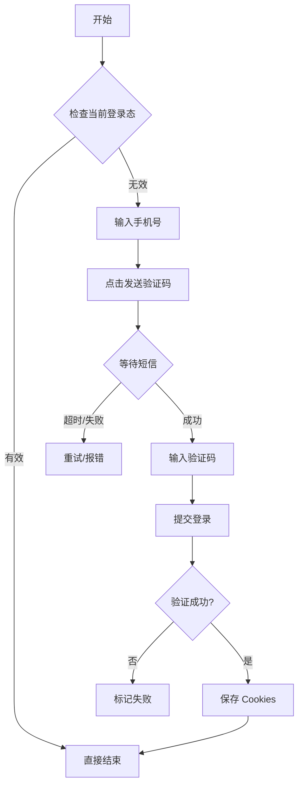

# 7.3 Ctrip 模块 (Ctrip Module)

## 7.3.1 需求概述

Ctrip 模块负责在携程旅行网 (ctrip.com) 执行自动化操作。当前阶段核心需求聚焦于**账号登录与会话维持**，确保拥有可用的登录态以供上层业务（如数据采集、订单管理）使用。

### 核心能力
- **自动登录**: 支持手机号+短信验证码登录，以及账号+密码登录。
- **验证码处理**: 集成接码平台自动获取短信验证码。
- **账号管理**: 维护账号状态（空闲/运行中/黑名单）与风控策略。

## 7.3.2 流程与任务设计

### 核心任务: `ctrip.tasks.login`

**功能说明**: 完成一次完整的登录流程，并在成功后导出 Cookies/Token 持久化。

**流程图**:

### 核心工作流: `ctrip.workflows.login_pipeline`

**编排逻辑**:
1. 从账号池获取 `IDLE` 状态账号。
2. 调度执行 `ctrip.tasks.login`。
3. 成功则更新账号状态为 `ACTIVE` 并记录 `last_login_time`。
4. 失败则根据错误类型（密码错/封号）触发降级或拉黑。

## 7.3.3 数据设计

### 账号模型 (`CtripAccount`)

基于 `src/core/models/ctrip_account.py`，核心字段定义如下：

| 字段 | 类型 | 说明 | 约束 |
|------|------|------|------|
| `phone_number` | String | 登录手机号 | 必须 |
| `country_code` | String | 国家代码 | 默认 +86 |
| `status` | Enum | 状态 | IDLE/ACTIVE/BLACKLISTED |
| `sms_verify_type` | Enum | 接码方式 | MANUAL/AUTO |
| `sms_platform_url` | String | 接码平台 API | AUTO 时必填 |
| `sms_platform_key` | String | 接码平台 Key | AUTO 时必填 |

### 敏感数据处理 (MUST)

- **脱敏展示**: `phone_number` 在 UI/日志中必须脱敏 (e.g. `138****1234`).
- **凭证安全**: `sms_platform_key` 与 Cookies 属于敏感信息，禁止明文写入普通应用日志。

## 7.3.4 交互设计 (Module UI)

- **账号录入**: 提供弹窗表单，支持批量导入 (CSV)。
- **手动接码**: 当 `sms_verify_type=MANUAL` 时，TaskScript 需触发 "Input Request" 事件，在 UI 弹窗请求用户输入短信验证码。

## 7.3.5 测试与验收标准

### 验收场景
1. **Happy Path**: 配置自动接码，启动任务 -> 自动填手机 -> 自动填获得的验证码 -> 登录成功 -> 状态变 ACTIVE。
2. **需要人工介入**: 配置手动接码 -> UI 弹出输入框 -> 用户输入 -> 登录成功。
3. **风控/失败**: 登录后出现滑块验证码 -> 能够识别并抛出特定错误（或尝试解决）。

### 失败处理
- 若短信发送频繁提示（Rate Limited），应将账号标记为临时不可用（冷却 N 小时）。
