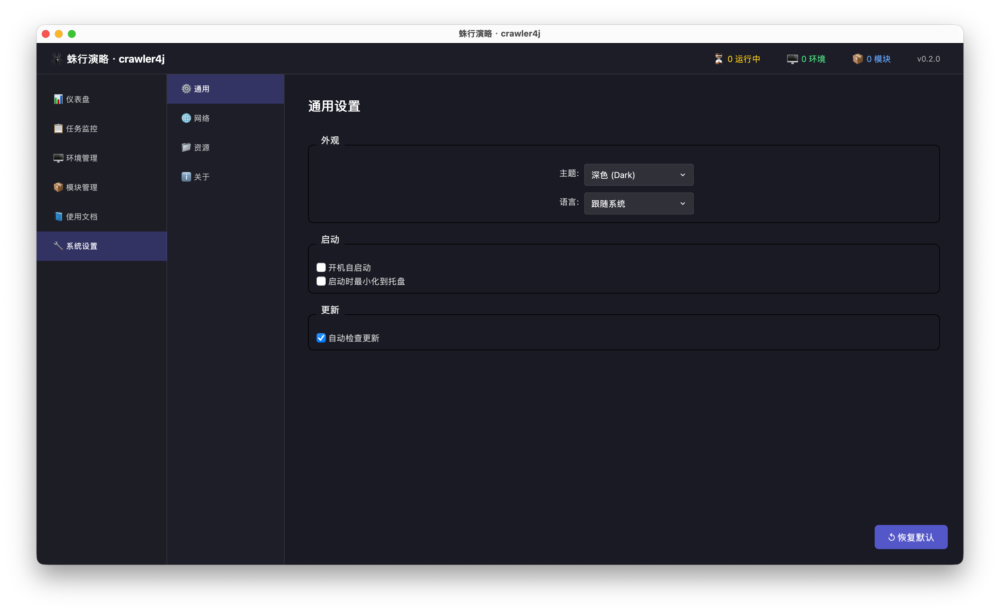
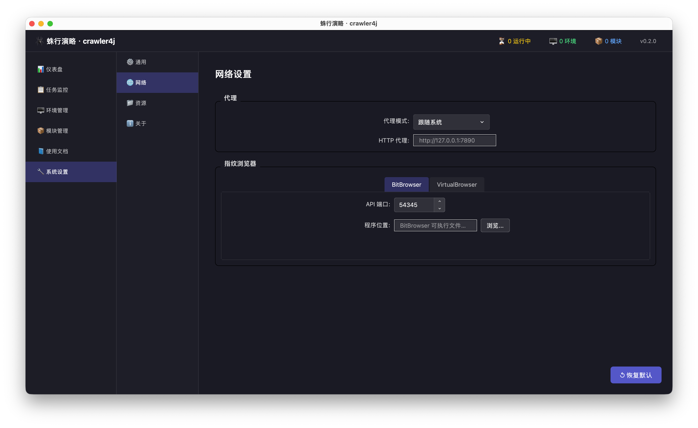
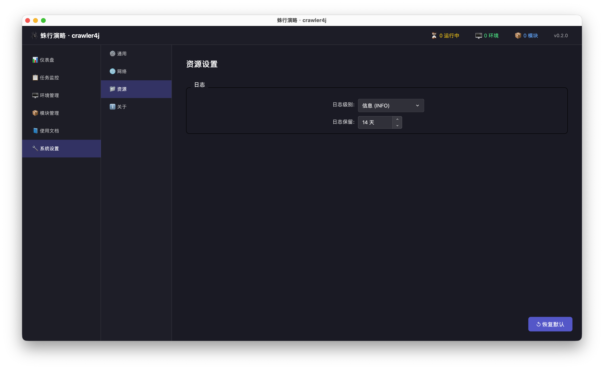
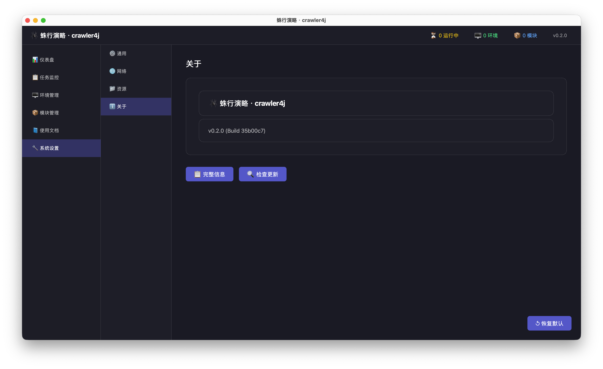

# 首次设置

这篇只讲 `系统设置` 里的全局设置。

请先记住一句话：

`系统设置` 配的是整套客户端的公共行为，不是某个模块自己的业务账号或业务参数。模块自己的参数要去 `模块管理 -> 详情 -> 配置` 修改。

## 系统设置包含哪 4 类

当前版本左侧固定有 4 个页签：

- `通用`
- `网络`
- `资源`
- `关于`

## 先理解两条规则

### 1. 这里是自动保存，不是手动点保存

当前设置页采用自动保存模式。你改完下拉框、复选框、端口、路径后，系统会立即写入配置，并提示：

- `配置已自动保存`

所以这里没有“改一堆后最后再点保存”的过程。

### 2. 只有部分设置需要重启

有些改动保存后会出现黄色提示：

- `部分设置需要重启应用后生效`

当前最典型的两类是：

- `语言`
- `代理模式`

其他像浏览器端口、程序路径、日志级别、日志保留时间，保存后会立即写入；其中日志设置会立刻更新整套客户端共用的唯一日志服务，不需要重启。

## 通用设置：先把“这台机器怎么启动客户端”看对

`通用` 页主要管理机器级别偏好：

| 字段 | 作用 | 第一次到现场怎么判断 |
| --- | --- | --- |
| `主题` | 控制界面外观 | 不影响业务链路，按现场习惯选 |
| `语言` | 控制界面语言 | 建议与现场培训对象一致 |
| `开机自启动` | 系统开机后是否自动启动客户端 | 首次交付通常先不要开 |
| `启动时最小化到托盘` | 启动后是否直接缩到托盘 | 培训阶段通常先不要开，避免用户以为程序没启动 |
| `自动检查更新` | 是否允许客户端自动检查更新 | 若当前交付的是带 Sparkle 的 macOS 内部版，则会同步控制 Sparkle 自动检查；若当前交付的是 Velopack Windows 正式发布产物（`Setup.exe` 安装态或 `Portable.zip`），则会作为宿主更新偏好保存；其余交付形态下只保留为全局偏好开关 |

第一次上手时，`通用` 页的重点不是“把所有开关都打开”，而是先知道这些都是全局行为，会影响整台机器上的客户端。

## 网络设置：最容易配错的一页

`网络` 页分成两部分：

1. 代理
2. 外部浏览器连接信息

### 先把几个词说人话

- `代理`：客户端访问外网时走不走代理、走哪一个代理
- `BitBrowser / VirtualBrowser`：外部浏览器管理软件，`crawler4j` 会连接它们，而不是自己直接充当浏览器
- `API 端口`：客户端连接外部浏览器时要访问的本机接口端口
- `程序位置`：外部浏览器程序在本机上的安装路径

这里最常见的误判，是把网页端口、代理端口和 API 端口混在一起。

### 代理模式怎么选

当前网络页支持 3 种代理模式：

| 模式 | 适合什么场景 |
| --- | --- |
| `跟随系统` | 当前机器本来就有统一代理策略 |
| `不使用代理` | 现场明确要求客户端直连 |
| `手动配置` | 现场要求走指定 HTTP 代理 |

如果使用 `手动配置`，就必须把 `HTTP 代理` 填完整；如果现场并不要求手动代理，不要凭感觉乱填。

### 这些参数通常从哪里拿

第一次到现场，很多人不是不会填，而是根本不知道这些值该找谁拿。先按下面这张表理解：

| 你缺的值 | 通常由谁提供 | 没拿到时怎么办 |
| --- | --- | --- |
| 外部浏览器类型：`BitBrowser` 还是 `VirtualBrowser` | 交付单、现场实施负责人、客户现场管理员 | 不要猜，先停在设置页确认 |
| `API 端口` | 外部浏览器本机设置页、交付说明、实施负责人 | 去浏览器工具本身核对，或向交付方索要 |
| `程序位置` | 本机安装路径、交付说明 | 用浏览按钮重新定位，不要手敲猜路径 |
| `API 密钥` | 只有项目明确启用时才会给 | 没人给就先不要乱填 |
| HTTP 代理 | 客户网络管理员、交付说明 | 不清楚就先不要切到 `手动配置` |

如果这些值没人给你，正确动作不是继续猜，而是先向交付负责人或客户现场管理员补齐信息。

### BitBrowser 和 VirtualBrowser 怎么配

网络页同时有 `BitBrowser` 和 `VirtualBrowser` 页签，不代表两边都必须填。

正确做法是：

- 现场项目要求用哪一种，就先把哪一种填对
- 暂时不用的那一种可以先不动

客户端不会在每次启动时把所有外部浏览器软件都检查一遍。只有启动恢复、垃圾回收、持续作业自检或你手动创建/启动/销毁某类环境时，才会检查对应的外部浏览器 API。

你至少要核对下面这些字段：

| 浏览器类型 | 必查字段 | 最容易错在哪里 |
| --- | --- | --- |
| `BitBrowser` | `API 端口`、`程序位置` | 把网页登录端口或旧版本路径填进来 |
| `VirtualBrowser` | `API 端口`、`程序位置`、必要时的 `API 密钥` | 端口和当前机器实际配置不一致，或路径指向旧目录 |

### 网络页什么算“基本配对”

满足下面几条，就可以继续后面的模块安装和建作业：

1. 你知道当前现场到底需不需要代理
2. 需要手动代理时，`HTTP 代理` 已正确填写
3. 你已经把要使用的外部浏览器 `API 端口` 和 `程序位置` 填对
4. 你看到了 `配置已自动保存`
5. 如果你改了 `代理模式`，你知道要重启后再继续验证

## 资源设置：先把日志留住

`资源` 页当前主要管理日志，不负责业务参数。

核心字段只有两个：

| 字段 | 作用 | 第一次现场建议 |
| --- | --- | --- |
| `日志级别` | 决定记录得多详细 | 一般先用 `INFO` |
| `日志保留` | 决定保留多少天滚动日志 | 不要配得太短，至少保证现场复盘时还能查到 |

主日志文件位于：

- `应用数据目录/logs/crawler4j.log`

这里的日志设置不是只影响某一个页面：

- 会同时影响系统主日志、模块通过 `ctx.logger` 打出来的日志，以及客户端里看到的实时日志
- 修改后会立即热更新，不需要重启应用
- 高频心跳类内部日志不会在普通 `INFO` 使用场景下持续刷屏，便于你把注意力放在真正的错误和业务输出上

第一次交付最常见的问题不是“日志太多”，而是“日志保留太短，问题还没复盘完就被清掉”。

## 关于页：用来核对版本，不是用来配业务

`关于` 页主要做 3 件事：

1. 核对产品名是否正确
2. 核对当前版本号和构建信息
3. 留验收或报障截图

当前 `系统设置 -> 关于` 会直接展示完整版本信息和 `检查更新` 入口；这个标签页本身不再提供 `↺ 恢复默认`，官网链接会指向 `https://github.com/uroborus2s/crawler4j`，顶部状态栏里的版本号点击弹窗仍然保留。

最常见的实际用途是：

- 交付当天确认客户机器上装的是哪个版本
- 出现问题时，把版本号和构建号带给管理员或研发

## 什么是全局设置，什么不是

| 你要改的东西 | 属于哪一类 | 该去哪里改 |
| --- | --- | --- |
| 主题、语言、代理模式、浏览器端口、程序路径、日志保留 | 全局设置 | `系统设置` |
| 模块账号、模块默认参数、Workflow YAML | 模块设置 | `模块管理 -> 详情 -> 配置` |
| 某个作业选哪个模块、哪个流程、哪个环境 | 作业或运行模板 | `任务监控 -> 新建作业` |

如果还是不确定，直接套下面这个例子：

| 例子 | 应该去哪里改 |
| --- | --- |
| “我要改 HTTP 代理” | `系统设置` |
| “我要改 ctrip 模块的账号或城市过滤参数” | `模块详情 -> 模块配置` |
| “我要改某条登录流程的 phone_source 或登录策略” | `模块详情 -> Workflow 配置` |
| “我要让这条作业改用别的模块、别的流程、别的环境” | `新建作业 / 编辑作业 -> 配置运行模板` |

如果你改的是 `系统设置`，默认就要理解成“影响整套客户端”，不要把这里当成某一条任务的临时选项。

## 什么算保存成功

普通用户不需要去看数据库，直接按界面现象判断即可：

| 现象 | 代表什么 |
| --- | --- |
| 出现 `配置已自动保存` | 这次修改已经写入配置 |
| 切走页面再回来，值还在 | 配置已经保存下来 |
| 重启后值还在 | 配置持久化成功 |
| 出现 `部分设置需要重启应用后生效` | 已保存，但要重启后再验证效果 |

## 什么时候该用“恢复默认”

只有在下面几种情况，才建议点 `↺ 恢复默认`：

1. 这台机器被多人反复试配过，没人能确认当前配置是否正确
2. 你确定想回到一套干净的全局默认值再从头配置
3. 当前问题已经定位为“系统设置混乱”

它恢复的是整套系统设置，不只是当前一个字段。

## 第一次最常见的 6 个误判

1. 把 `系统设置` 当成模块配置页，试图在这里填业务账号
2. 看到 `BitBrowser` 和 `VirtualBrowser` 两个页签，就以为两边都必须配
3. 把网页登录端口、代理端口和 API 端口混在一起
4. 改完值就离开，不看有没有 `配置已自动保存`
5. 改了 `代理模式` 却不重启，就继续验证联网行为
6. 把日志保留时间设得太短，导致现场复盘时已经没有历史日志

## 配完以后，下一步去哪

当你确认下面几件事都成立，就可以继续模块安装和建作业：

1. 全局设置已经按现场要求核对完成
2. `配置已自动保存` 已出现过
3. 如果改了 `语言` 或 `代理模式`，你知道要重启
4. 你已经理解了系统设置和模块设置的边界

下一步看 [开始使用](user-guide.md)。
