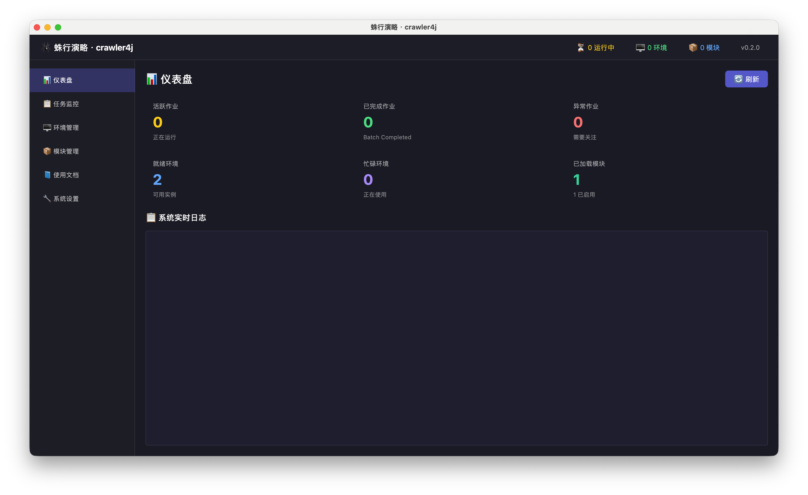

# 使用者指南总览

这组文档面向已经拿到 `crawler4j` 桌面客户端的人，目标不是解释内部实现，而是把下面三件事讲完整：

1. 这套产品到底能做什么。
2. 第一次怎么跑通“安装模块 -> 新建作业 -> 执行一次 -> 看结果”。
3. 日常操作、交付升级和现场分诊分别该看哪一页。

文中的截图都来自真实客户端界面，不是示意图。

第一次只拿这张图认入口，不拿图里的数字当验收标准。你要确认的是：左侧 7 个导航存在、仪表盘统计卡存在、底部日志区域存在。

## 这套产品能做什么

`crawler4j` 当前面向的是“把业务模块装进桌面宿主并运行”的使用场景。普通用户最常接触到的能力有：

- 安装、启用、禁用和升级业务模块。
- 为模块选择流程，并保存成可复用的运行模板。
- 用 `批次任务` 或 `持续保活` 两种模式运行作业。
- 手动执行一次，或按 `Cron` 定时触发批次任务。
- 管理浏览器运行环境和 IP 池，并对单条代理做真实连通测试以确认出口 IP。
- 在作业详情里查看任务实例、`结果/错误` 和任务日志。
- 在配置中心里统一配置代理、外部浏览器、任务运行预算和日志；在一级 `关于` 页里查看版本并执行宿主更新；日志设置会立即热更新，调度器心跳日志不会在 `INFO` 下持续刷屏。

## 新手先只记住这 3 个动作

如果你第一次接触 `crawler4j`，先不要记全部术语。先只按下面 3 个入口走：

1. `配置中心`：先把代理、外部浏览器、任务运行预算和日志规则核对正确。
2. `模块管理`：先把业务模块装进去，并确认状态是 `已启用`。
3. `任务监控`：先新建一条作业，手动 `执行一次`，再打开作业详情看结果。

第一次上手时，只要这 3 个动作走顺，后面的术语就会自然落位。

如果模块装完后状态始终不是 `已启用`，优先去看 [异常案例](exception-cases.md)；当前正式客户端不会兼容旧协议模块包。

## 第一次先只记 3 个词

如果 6 个概念太多，第一次先记住下面 3 个就够了：

| 词 | 先把它理解成 |
| --- | --- |
| 模块 | 要先装进去的业务包 |
| 作业 | 你保存下来的一条任务规则 |
| 任务实例 | 这条作业某次真正跑出来的执行记录 |

## 先认 6 个核心概念

| 概念 | 你可以把它理解成 | 在哪里会看到 |
| --- | --- | --- |
| 模块 | 一份可以安装进客户端的业务能力包 | `模块管理` |
| 流程 | 模块里某一条可执行的业务流程 | 模块详情、运行模板 |
| 作业 | 一条长期保留的任务定义，决定怎么触发、并发多少 | `任务监控` |
| 运行模板 | 作业真正执行时使用的模块、流程、环境策略、指纹参数集合 | 新建作业、编辑作业 |
| 环境 | 任务运行时占用的浏览器实例或浏览器工作位 | `环境管理` |
| 任务实例 | 某个作业某次实际跑出来的一条执行记录 | 作业详情里的 `任务实例 (Tasks)` |

第一次读文档时，最容易把“作业”和“任务实例”混在一起。简单记：

- `作业` 是长期存在的定义。
- `任务实例` 是某次真正跑出来的执行记录。

## 先认 7 个页面

| 页面     | 你主要来这里做什么                                                                                      |
| ------ | ---------------------------------------------------------------------------------------------- |
| `仪表盘`  | 看整体运行概况、活跃任务数、系统实时日志                                                                           |
| `任务监控` | 新建作业、执行一次、启动、暂停、打开作业详情                                                                         |
| `环境管理` | 看环境状态、手动创建环境、维护 IP 池                                                                           |
| `模块管理` | 安装模块、看版本、看详情、改模块配置、检查更新                                                                        |
| `使用文档` | 在客户端里直接阅读内置文档中心，里面包含用户指南和开发者指南；右侧直接展示正文，不再重复显示页面说明头部，左侧分组标题整行可点，文内大图会按阅读区宽度缩放，超链接会用高对比浅蓝并带下划线显示 |
| `配置中心` | 改全局配置：主题、代理、浏览器连接、任务运行预算、日志                                                        |
| `关于` | 看版本、构建号、项目链接，并执行宿主更新检查或升级 |

## 推荐阅读路径

### 普通用户第一次上手

1. [安装与第一次打开](installation.md)
2. [首次设置](configuration.md)
3. [开始使用](user-guide.md)
4. [作业详情整图说明](job-detail-guide.md)
5. [日常使用](usage.md)

### 已经跑通第一次，准备日常使用

1. [日常使用](usage.md)
2. [作业详情整图说明](job-detail-guide.md)
3. [首次设置](configuration.md)

### 负责交付、升级或现场支持

1. [安装与第一次打开](installation.md)
2. [首次设置](configuration.md)
3. [作业详情整图说明](job-detail-guide.md)
4. [异常案例](exception-cases.md)
5. [管理员指南](admin-guide.md)

## 10 分钟最短闭环

如果你不想先通读整套文档，最短可按下面顺序完成第一次闭环：

1. 打开应用，确认左侧能看到 6 个导航入口。
2. 去 `配置中心` 核对代理、外部浏览器端口和程序路径。
3. 去 `模块管理` 安装一个模块。
4. 在模块详情里确认模块状态、流程和配置可见。
5. 去 `任务监控` 配置运行模板并新建一条作业。
6. 先用 `批次任务 + 执行一次 + 1 个并发` 跑第一轮。
7. 打开作业详情，看 `任务实例`、`结果/错误` 和 `任务日志`。

如果你已经点进作业详情，但不知道每一块应该先看什么，继续看 [作业详情整图说明](job-detail-guide.md)。

## 什么算“第一次成功”

满足下面几条，就算这套链路已经跑通：

- 模块列表里能看到目标模块，状态为 `已启用`。
- 作业可以成功保存，任务监控列表里能看到它。
- 你点击 `执行一次` 后，状态会出现 `执行中`、`运行中`、`已完成` 或明确的异常状态，而不是毫无反应。
- 作业详情里能看到任务实例记录。
- 你能从 `结果/错误` 列或 `任务日志` 看出这次执行是成功结束还是失败结束。

第一次请先只认一个标准结果入口，不要到处找：

`任务监控 -> 点击作业行 -> 作业详情 -> 先看 结果/错误 -> 再看 任务日志`

当前通用产品形态里，标准结果入口不是单独的全局结果中心，而是：

- 作业详情里的 `结果/错误` 列。
- 作业详情底部的 `任务日志`。

只有在模块负责人明确告诉你“结果要去模块自定义页看”时，你才需要再去找模块扩展页或数据页。

## 现在卡住了先看哪儿

| 你现在卡住的地方 | 先看哪篇 |
| --- | --- |
| 客户端还没打开 | [安装与第一次打开](installation.md) |
| 已经打开，但不知道先点哪里 | [开始使用](user-guide.md) |
| 不知道代理、浏览器、日志怎么配 | [首次设置](configuration.md) |
| 不知道模块、作业、环境、状态怎么读 | [日常使用](usage.md) |
| 已经进了作业详情，但不知道先看哪里 | [作业详情整图说明](job-detail-guide.md) |
| 已经出现具体异常，需要按症状分诊 | [异常案例](exception-cases.md) |
| 你在做交付、升级、验收或首轮分诊 | [管理员指南](admin-guide.md) |

## 卡住时怎么分流

- 应用打不开、主窗口不出现：看 [安装与第一次打开](installation.md)
- 打得开，但代理、浏览器或日志不知道该怎么配：看 [首次设置](configuration.md)
- 模块、作业、运行模板、环境、任务状态看不懂：看 [日常使用](usage.md)
- 已经进了作业详情，但还分不清任务实例、结果/错误、任务日志：看 [作业详情整图说明](job-detail-guide.md)
- 应用打不开、页面空白、模块未启用、执行一次没反应、结果找不到：看 [异常案例](exception-cases.md)
- 需要做交付、升级、验收或现场分诊：看 [管理员指南](admin-guide.md)

## 这套指南不讲什么

- 不解释内部架构和源码实现。
- 不教你开发模块。
- 不把源码运行、SDK 命令和开发联调路径混进普通使用路径。
