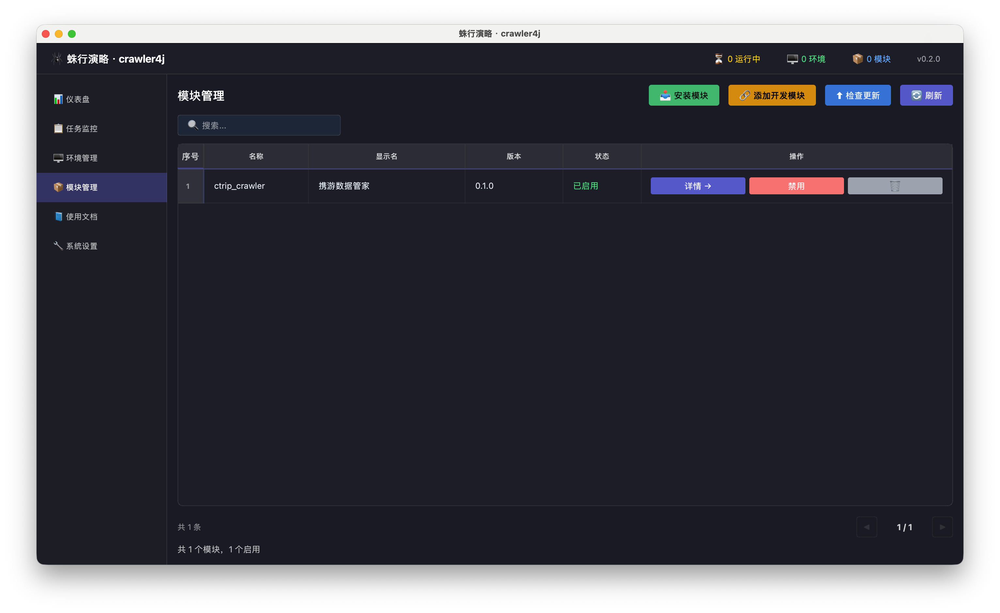
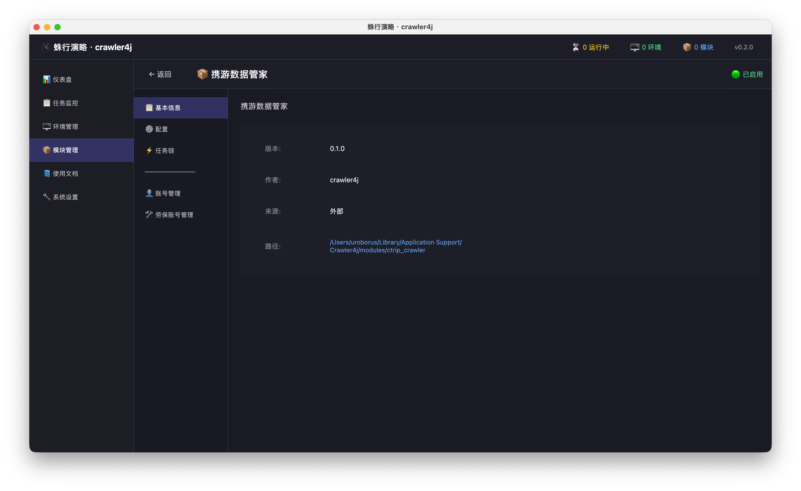
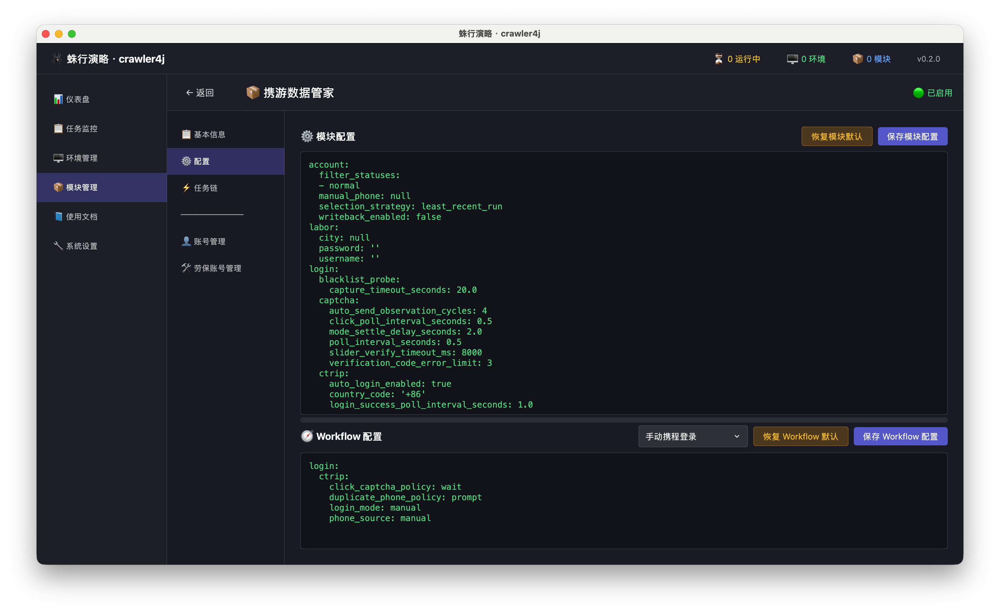
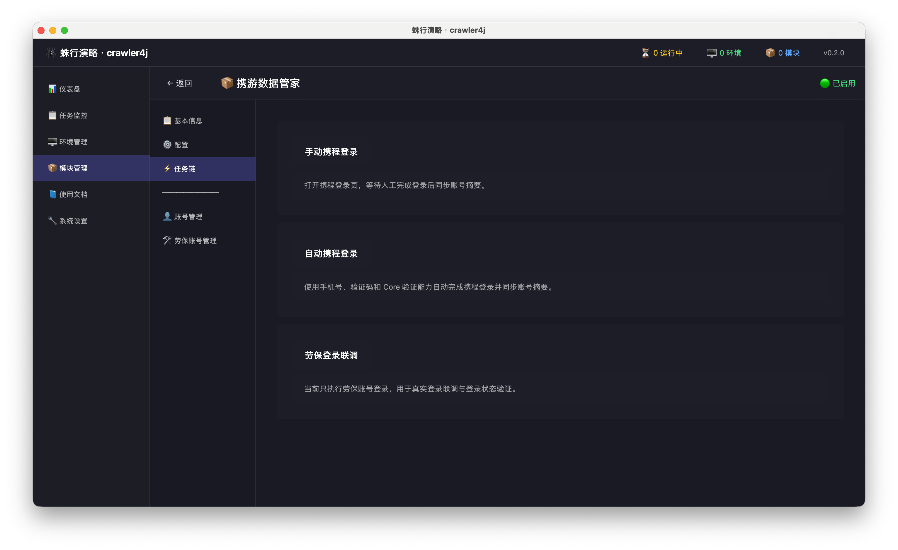
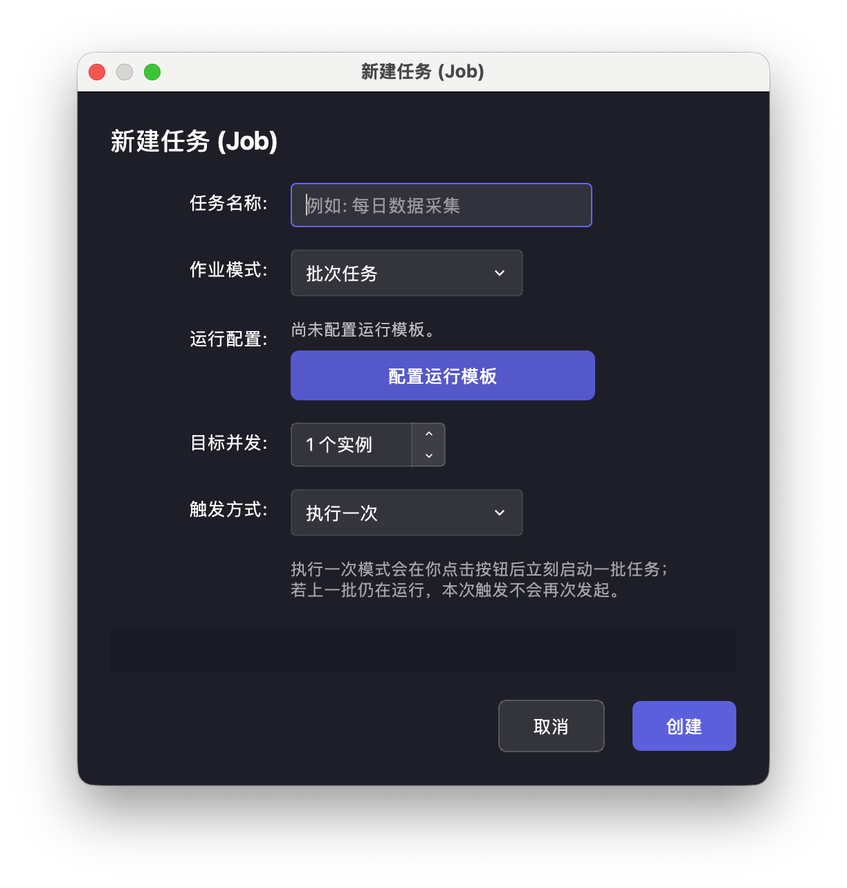
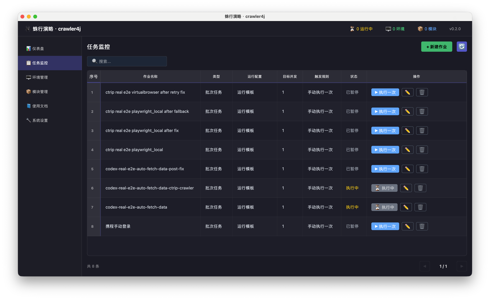
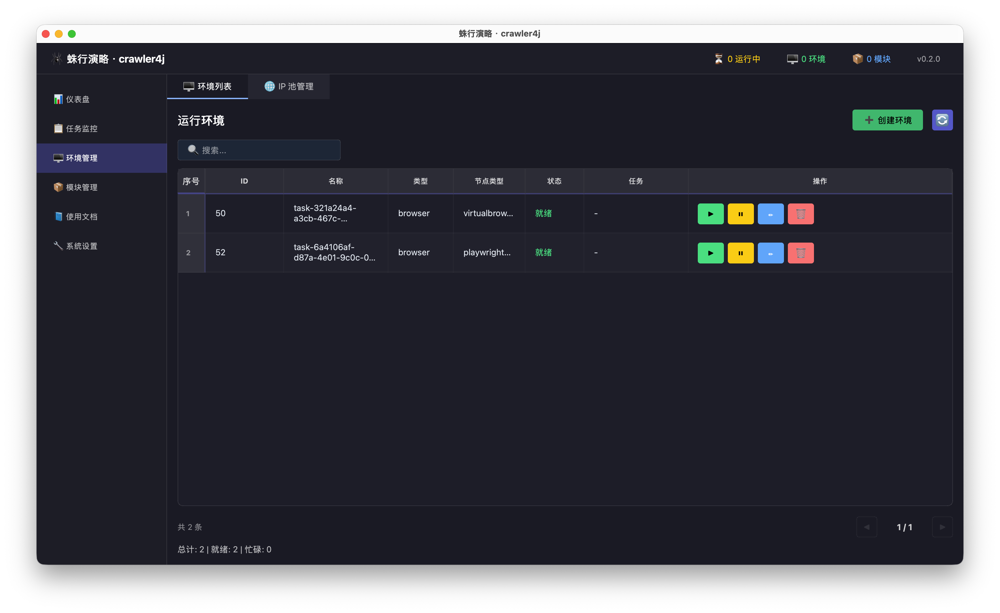
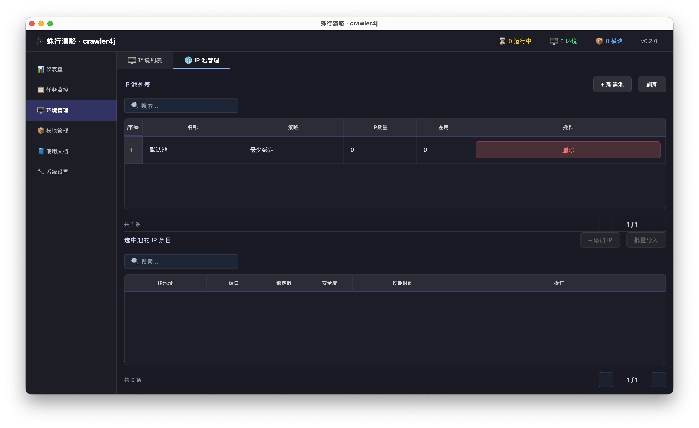
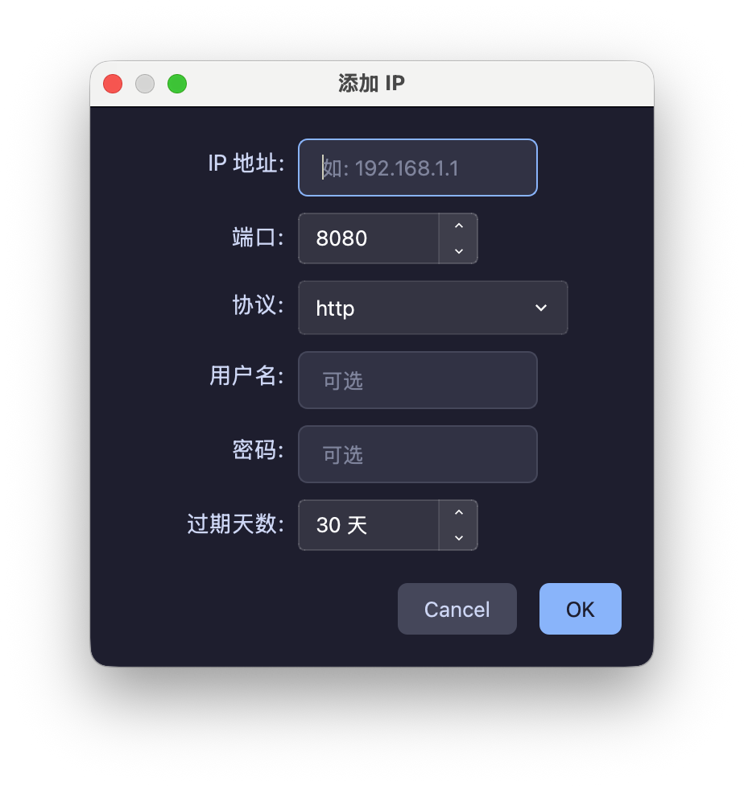

# 日常使用

这篇不是“第一次只跑一轮”的简版说明，而是日常使用主手册。你可以用它回答下面这些问题：

- 模块装在哪里、怎么判断装好了
- 运行模板到底配什么
- `批次任务`、`持续保活`、`执行一次`、`Cron 定时` 分别是什么意思
- 作业状态和任务实例状态怎么读
- 结果到底去哪里看
- 环境和 IP 池什么时候要管

## 先给一句最短结论

第一次日常操作时，请先只认下面这条主线：

`模块管理看模块 -> 任务监控建作业 -> 作业详情看结果`

结果先只看一个入口：

`作业详情里的 结果/错误 + 任务日志`

## 1. 日常使用先看哪几个页面

| 页面 | 日常最常做的事 |
| --- | --- |
| `模块管理` | 安装模块、看版本、进详情、改模块配置、检查更新 |
| `任务监控` | 新建作业、执行一次、启动、暂停、查看作业详情 |
| `环境管理` | 看环境是否就绪、运行中、暂停；手动创建环境；管理 IP 池 |
| `配置中心` | 改全局代理、浏览器连接、任务运行预算和日志策略 |

## 2. 模块管理：先确认模块真的可用

模块列表页至少能让你读出下面这些信息：

- 模块名称和显示名
- 当前版本
- 当前状态：`已启用` 或 `已禁用`
- 行内操作：`详情`、`禁用` / `启用`、删除

### 安装和升级的入口

- `安装模块`：正式安装入口
- `添加开发模块`：联调入口，不是正式交付入口
- `检查更新`：检查已安装模块是否有可升级版本

### 日常判断标准

- 需要执行任务的模块，状态必须是 `已启用`
- 列表里看不到模块，说明根本没有装进去
- 看得到模块但状态不是 `已启用`，不要继续建作业

## 3. 模块详情：别只看基本信息

模块装进去后，建议至少把详情页的 3 个核心区域都看一遍。

### 基本信息

这里用来确认：

- 模块版本是不是你要的版本
- 作者和来源是否正确
- 安装路径是否合理
- 当前状态是否为 `已启用`

### 配置

这里通常会分成两块：

- `模块配置`
- `Workflow 配置`

你要理解的是：

- 这里改的是模块自己的业务参数
- 不是客户端全局代理或浏览器路径
- 模块配置和工作流配置都可能影响后续任务执行结果

### 任务链

`任务链` 页告诉你当前模块暴露了哪些流程。第一次新建作业前，先确认这里确实存在你准备运行的流程。

如果模块还提供了账号管理、数据页或自定义页面，只有被模块配置为菜单入口的页面才会出现在模块详情左侧菜单里；详情页等二级页面通常由页面内按钮或表格行打开。

## 4. 运行模板：决定任务实际怎么跑

运行模板是这套产品里最容易被忽略、但最关键的层。它决定：

- 跑哪个模块
- 跑模块里的哪条流程
- 用创建新环境还是复用现有环境
- 使用哪种 Provider、环境类型、IP 池和指纹参数

### 运行模板里常见的字段

| 字段 | 你要理解成什么 |
| --- | --- |
| `执行脚本` | 选择要跑的模块 |
| 流程下拉框 | 选择模块内部的具体流程 |
| `运行方式` | 是创建新环境，还是选择已有环境 |
| `Provider` | 外部浏览器类型或环境提供方 |
| `环境类型` | 当前环境的类别 |
| `IP 策略` / `IP 池` | 是否绑定 IP 资源，绑定哪一个池 |
| 指纹参数 | 浏览器版本、内核、UA 等更细的运行参数 |

### 日常经验

- 第一次跑新模块时，先用最保守的模板，不要上来就改太多高级参数
- 项目要求固定环境时，优先复用已有环境
- 项目要求每次拉起独立环境时，才选 `创建环境`
- IP 池没准备好时，不要在模板里硬绑定一个不存在或不可用的池

## 5. 新建作业：决定“什么时候跑、跑几条”

作业页里最重要的不是名称，而是下面 4 个维度：

上图只用于认字段位置，不表示运行模板已经配置完成。真正保存作业前，要先点 `配置运行模板`，然后回到这个窗口再确认名称、并发和触发方式。
当前版本里，`配置运行模板` 和底部操作按钮已统一切到共享按钮样式，按钮高度统一为 `40`；同时运行配置预览会按当前宽度自动撑高，不再把下面的按钮区域挤乱。

- 作业模式
- 运行模板
- 目标并发
- 触发方式

### 作业模式怎么选

| 作业模式 | 它的含义 | 适合什么场景 |
| --- | --- | --- |
| `批次任务` | 每次触发时启动一批任务，然后等待这批任务结束 | 定时采集、一次性批量执行 |
| `持续保活` | 你点击启动后，系统持续维持 N 个运行中的任务 | 长驻型轮询、持续采集 |

### 触发方式怎么选

| 触发方式 | 它的含义 |
| --- | --- |
| `执行一次` | 你手动点击后立刻启动一批任务 |
| `Cron 定时` | 到达 Cron 表达式命中时间后自动触发批次任务 |
| `手动启动` | 持续保活模式下，由你手动开始维持任务池 |

### 合法组合先按这张表记

| 作业模式 | 触发方式 | 什么时候用 |
| --- | --- | --- |
| `批次任务` | `执行一次` | 第一次验证、人工手动跑一轮 |
| `批次任务` | `Cron 定时` | 已经验证通过后，按计划定时跑批 |
| `持续保活` | `手动启动` | 需要长期维持 N 个运行中的任务 |

如果你是第一次上手，只用第一行，不要混着试。

## 6. 任务监控：列表页要会读，也要会点

任务监控列表里，每一行都是一条作业定义。你至少要会读下面这些列：

- `作业名称`
- `类型`
- `运行配置`
- `目标并发`
- `触发规则`
- `状态`
- `操作`

### 当前常见作业状态

| 状态 | 它表示什么 |
| --- | --- |
| `运行中` | 当前作业处于活动态 |
| `环境启动中` | 系统已经接单，正在创建环境并启动浏览器；全局任务进度弹窗会在环境真正可用后自动消失 |
| `执行中` | 对手动批次任务来说，当前这轮正在跑；这时主按钮会切成 `⏹ 中止` |
| `中止中` | 你已经发出中止请求，系统正在执行 cleanup 并回收环境 |
| `已暂停` | 作业被暂停，不会继续启动新任务 |
| `已完成` | 当前批次已经结束 |
| `异常` | 作业进入错误态，需要看详情定位 |

### 看到这些状态后，下一步该做什么

| 你看到的状态 | 下一步动作 |
| --- | --- |
| `环境启动中` | 先别重复点按钮，等全局任务进度弹窗消失；如果顶部立刻弹出错误提示，再去看作业详情和主日志 |
| `执行中` | 如果业务正常就在详情页看结果；如果明显卡住或需要立刻回收环境，可以点 `⏹ 中止` |
| `中止中` | 先等它完成 cleanup 和环境回收；如果长时间不退，再去看作业详情和主日志 |
| `运行中` | 点开作业详情，看任务实例和日志 |
| `已完成` | 点开作业详情，确认 `结果/错误` 是否符合预期 |
| `已暂停` | 先判断是你手动暂停，还是现场需要恢复运行 |
| `异常` | 立刻进作业详情，先看 `结果/错误`，再看任务日志 |

### 当前常见操作

| 操作 | 适用场景 |
| --- | --- |
| `▶ 执行一次` | 手动批次任务的首次验证和日常手动触发 |
| `⏹ 中止` | 手动批次任务已经启动，但你需要手动停止并回收环境 |
| `启动` | 持续保活作业恢复运行 |
| `暂停` | 暂停作业，不再继续补任务或触发新批次；尚未拿到环境的等待任务会直接收口 |
| 编辑按钮 | 重新修改作业 |
| 删除按钮 | 删除作业定义 |

点击 `⏹ 中止` 后，宿主会统一停止任务并回收本次环境。中止操作不提供保留或删除策略；需要删除长期不用、未认领或 owner 已缺失的环境时，到 `环境管理` 页面点击 `清理环境`，由宿主生成预览并在安全校验后删除。

一个容易忽略但很重要的交互是：

- 点击行内非按钮区域，可以直接打开作业详情

## 7. 作业详情：标准结果入口就在这里

作业详情是标准通用结果入口，不要只停在列表页。

你进入后，重点看：

1. `任务实例 (Tasks)` 表格
2. 底部 `任务日志`

### 任务实例表重点看什么

| 列 | 你要看什么 |
| --- | --- |
| `Task ID` | 这次实际跑出的任务实例编号 |
| `状态` | `running`、`succeeded`、`failed` 等实际执行态 |
| `环境ID` / `环境租约` | 这次任务到底用了哪个环境 |
| `开始时间` / `结束时间` | 跑了多久 |
| `结果/错误` | 本次任务最后写回的结果说明或错误摘要 |

### 任务日志重点看什么

- 卡在哪一步
- 是否真的进入模块流程
- 是环境问题、登录问题还是业务逻辑问题

### 当前产品里“结果去哪看”

当前标准通用入口不是单独的结果中心，而是：

1. 作业详情里的 `结果/错误`
2. 作业详情底部的 `任务日志`

如果你只看列表页，不进详情，很容易误以为“没结果”。

第一次请只认前两项。只有在模块负责人明确说“结果要看模块自定义页”时，你才需要再去找模块扩展页。

## 8. 环境管理：什么时候要看这里

普通用户不是每次都要手动管环境，但遇到下面情况就要看：

- 任务起不来
- 环境一直占用不释放
- 需要手动创建浏览器环境做联调
- 需要确认 IP 池是否可用

### 环境状态怎么理解

| 状态 | 含义 |
| --- | --- |
| `就绪` | 环境可被任务接管 |
| `运行中` | 当前环境正在被任务或连接占用 |
| `暂停` | 环境被临时停住 |

### 环境列表里常见操作

| 操作 | 用途 |
| --- | --- |
| `➕ 创建环境` | 手动新建一个环境 |
| `从已有环境导入` | 从外部浏览器提供方拉取“来源里有、本地还没有同名记录”的环境，导入后关联一个已配置的“执行一次”任务运行 |
| `▶ 运行` | 让环境进入可连接或活跃状态 |
| `⏸ 暂停` | 暂停环境 |
| 编辑 | 修改环境定义 |
| 销毁 | 删除环境 |
| `⏹ 停止` | 对运行中的环境执行停止 |

日常判断环境问题时，先看两件事：

1. 有没有可用的 `就绪` 环境
2. 目标环境是不是一直卡在 `运行中` 或异常状态

0.4.0 不再在环境列表里展示资源池资格状态。模块是否会使用某个环境，由运行模板里的固定 `env_id` 或模块 `candidates/` 下的 `@env_candidates` 候选函数实时决定。

### 什么时候用 `从已有环境导入`

当外部浏览器里已经有环境，但客户端环境表里还没有对应记录时，用这个入口最合适。

当前标准操作顺序是：

1. 点击工具栏里的 `从已有环境导入`
2. 依次选择 `环境来源`、`关联任务`
3. 在 `未同步环境列表` 里选择一个或多个环境
4. 点击 `导入并执行一次`

关联任务必须先在 `任务监控` 中配置为“批次任务 + 执行一次”。如果一次选择多个环境，客户端会把这些环境挂到同一个任务下生成多条运行实例；并发上限使用该任务自身的并发数量，例如任务并发为 `5` 且选择 `20` 个环境时，最多同时打开或连接 `5` 个环境窗口，其余环境排队等待并发窗口释放。

如果你看到风险提示，表示关联任务的 workflow 没有明确声明自己适配“已有环境导入”场景。这个提示不会拦住执行，只是提醒你自行判断该环境是否已经满足登录态、页面状态或前置步骤要求。

## 9. IP 池管理：只有需要代理/IP 资源时才重点看

IP 池页主要做两件事：

- 管理 IP 池本身
- 管理池中的具体 IP 条目

如果你要从零补一条 IP，当前最短操作闭环是：

1. 在 `IP 池管理` 里先确认目标池存在
2. 点击 `+ 添加 IP`
3. 填写 `IP 地址`、`端口`、协议和必要的认证信息
4. 保存后回到池列表，看这条 IP 是否已经出现在池内
5. 如需先验证代理是否真的可用，可在该条 IP 的 `操作` 栏点击 `测试`
6. 回到运行模板，确认模板已经绑定到这个池

点击 `测试` 后，客户端会真实通过这条代理访问出口 IP 探针服务，并弹出本次测试结果。当前弹窗会直接给出：

- 是否测试成功
- 出口 IP
- 耗时（毫秒）
- 失败阶段（例如连接代理、代理握手、发送请求、解析出口 IP）

这个测试只用于现场验证，不会把结果写回数据库，也不会自动修改 IP 条目的状态或评分。

测试结果弹窗使用客户端公共深色弹窗组件，窗口壳沿用系统原生样式，内容区与动作按钮对齐“安装模块”面板风格，便于在 macOS 等系统主题下稳定阅读出口 IP、代理地址和 HTTP 状态。

当运行模板里已经引用了某个 IP 池，但任务执行时网络始终异常，就应该回来确认：

- 这个池是否存在
- 池里是否真的有 IP
- IP 是否过期或不可用
- 在用数量是否异常
- 单条 IP 点 `测试` 后是否真的能拿到出口 IP

## 10. 日常 3 分钟排查顺序

| 现象 | 先看哪里 | 常见结论 |
| --- | --- | --- |
| 模块没显示 `已启用` | `模块管理` | 先是安装或模块状态问题 |
| 运行模板里选不到模块或流程 | 模块详情 `任务链`、模块状态 | 模块没装对或流程不存在 |
| 点击 `执行一次` 没反应 | `配置中心`、任务状态、运行模板 | 多半是全局配置或模板问题 |
| 作业有状态变化但业务失败 | 作业详情 `结果/错误`、任务日志 | 已进入执行链，继续看具体失败点 |
| 环境一直不可用 | `环境管理` | 优先看环境状态和外部浏览器连接 |
| 需要走代理但一直访问失败 | `配置中心 -> 网络`、`环境管理 -> IP 池管理` | 代理模式、IP 池或浏览器链路不对 |

## 11. 什么时候该停下来，不要继续乱点

出现下面任意一种情况，先停下来判断，不要机械重复操作：

- 模块不是 `已启用`
- 运行模板根本保存不了
- 点击 `执行一次` 多次都完全没反馈
- 作业详情持续只出现失败实例
- 环境一直卡住且无法回收
- 页面弹出明确错误框

这时优先留作业名、模块名、错误提示和日志，再看 [管理员指南](admin-guide.md)。
