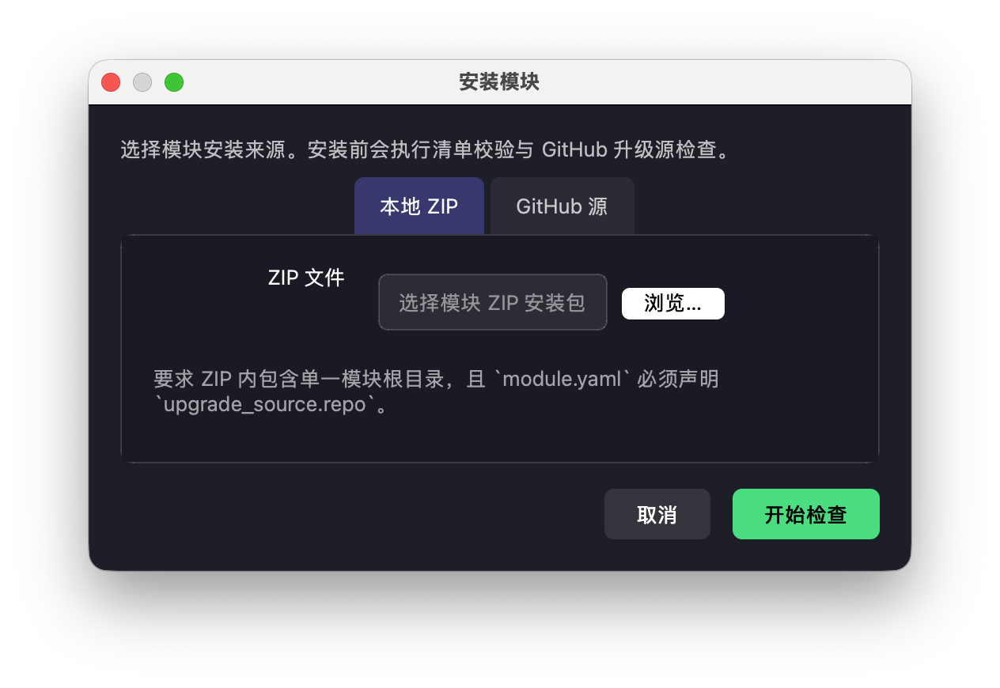
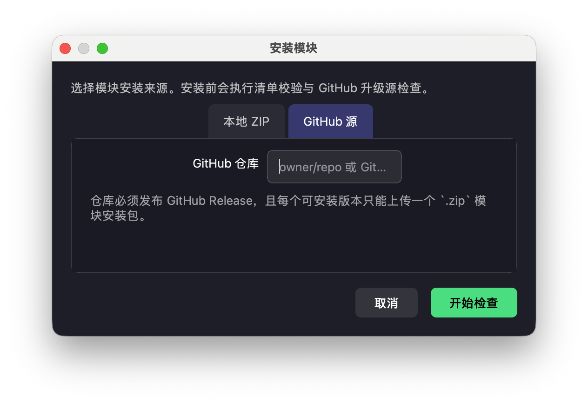

# 开始使用

这篇只做一件事：带你走通第一次完整闭环。

适用前提：

- 你已经能打开客户端主窗口
- 左侧导航能正常显示

如果连客户端都还没打开，先不要从这篇开始，先看 [安装与第一次打开](installation.md)。

不要一上来研究所有页面。第一次只要把下面这条路径走顺，你对整个产品就会有正确心智：

`打开应用 -> 核对系统设置 -> 安装模块 -> 配置运行模板 -> 新建作业 -> 执行一次 -> 打开作业详情看结果`

## 第一次只点这 3 个入口

第一次上手时，请只盯住这 3 个地方：

1. `系统设置`
2. `模块管理`
3. `任务监控`

其他页面先不要分心。

## 开始前先准备好

没有下面 4 样东西，建议先不要继续点按钮：

1. 可以正常打开的 `crawler4j` 桌面客户端。
2. 一个模块来源：本地 ZIP 安装包，或 GitHub 仓库地址。
3. 本机外部浏览器的程序路径和 API 端口。
4. 一套测试账号、测试目标或最小可验证样例。

如果这些信息没人给你，不要猜，先停下来找交付负责人或客户现场管理员补齐。

## 第 1 步：确认应用和设置页都能打开

第一次进入后，先不要急着建作业，先确认：

- 左侧有 `仪表盘`、`任务监控`、`环境管理`、`模块管理`、`使用文档`、`系统设置` 6 个入口。
- `使用文档` 里现在是统一的内置文档中心，左侧会按 `入门说明`、`用户指南`、`开发者指南` 三组展示文档树。
- `系统设置` 能正常打开。
- 你至少知道当前现场要走哪一种外部浏览器：`BitBrowser` 或 `VirtualBrowser`。

这一步如果不成立，先去看 [安装与第一次打开](installation.md) 和 [首次设置](configuration.md)。

## 第 2 步：先把模块装进去

第一次上手，优先使用本地 ZIP 安装；GitHub 源更适合已经明确仓库地址、版本治理也稳定的场景。

### 走本地 ZIP 安装

1. 打开 `模块管理`。
2. 点击右上角 `安装模块`。
3. 保持在 `本地 ZIP` 标签页。
4. 如果安装包声明的是私有 GitHub 升级仓库，先填 `GitHub Token`。
5. 如果你希望后续 `检查更新` / `升级` 自动复用这个 Token，可以勾选“保存这个 Token，后续更新这个模块时自动使用”。
6. 点击 `开始检查`。
7. 安装完成后回到模块列表，看是否出现模块名、版本号和 `已启用` 状态。

### 走 GitHub 源安装

1. 在安装弹窗切到 `GitHub 源`。
2. 输入仓库地址或 `owner/repo`。
3. 如果是私有仓库，填写 `GitHub Token`。
4. 如果希望后续 `检查更新` / `升级` 自动复用这个 Token，可以勾选“保存这个 Token，后续更新这个仓库时自动使用”。
5. 点击 `开始检查`。
6. 按界面提示完成下载和安装。

### 这一小步什么算成功

- 模块出现在列表里。
- 状态是 `已启用`。
- 你能点进 `详情`。

如果模块没装上或状态不是 `已启用`，不要继续建作业。

## 第 3 步：确认模块详情真的完整

装完模块后，不要只看列表，最好点进详情确认三件事：

1. `基本信息` 能看到名称、版本、作者和安装路径。
2. `配置` 页能看到模块配置和 Workflow 配置。
3. `任务链` 页能看到这个模块当前提供的流程。

如果模块自己的功能页、数据页或管理页已经集成到宿主，通常也会出现在模块详情的左侧菜单里。

## 第 4 步：先把运行模板配出来

运行模板决定“跑哪个模块、哪个流程、怎么拿环境、用什么浏览器参数”。作业只是引用它。

运行模板入口在这里：

`任务监控 -> + 新建作业 -> 配置运行模板`

也就是说，你是在“新建作业”弹窗里点 `配置运行模板` 进入，不是在 `系统设置` 或 `模块管理` 里找它。

第一次建议按下面的保守路线配置：

- 执行脚本：选刚安装的模块。
- 流程：先选最短、最容易验证的那条流程。
- 运行方式：优先按项目要求决定是 `创建环境` 还是选择已有环境。
- Provider / 环境类型：按现场要求填写，不要猜。
- IP 池：如果现场启用了 IP 池，就选一个明确可用的池。

第一次不要一口气把所有高级指纹参数都手改一遍；先把最短链路跑通。

### 第一次哪些字段必须先搞定，哪些可以后配

| 字段 | 第一次是否必须明确 |
| --- | --- |
| 模块 | 必须 |
| 流程 | 必须 |
| 运行方式 | 必须 |
| Provider / 环境类型 | 必须 |
| IP 池 | 只有现场启用了 IP 池时才必须 |
| 指纹高级参数 | 可以先沿用默认或项目既定模板 |

## 第 5 步：新建第一条作业

进入 `任务监控`，点击 `+ 新建作业`，第一次建议固定这样选：

先注意一件事：上图只是帮你认“新建作业”这个弹窗长什么样。真正创建前，先点 `配置运行模板` 完成上一步，再回到这个窗口补齐任务名称、并发和触发方式。

- 任务名称：用业务可读名字，比如“每日数据采集”“账号登录联调”。
- 作业模式：`批次任务`
- 运行配置：点 `配置运行模板`，引用刚保存的模板。
- 目标并发：`1`
- 触发方式：`执行一次`

如果你只是做第一次验证，不要一开始就上 `Cron 定时` 或高并发。

## 第 6 步：回到列表执行一次

创建完成后回到 `任务监控` 列表：

1. 找到刚建好的作业。
2. 点击 `▶ 执行一次`。
3. 观察状态是否变成 `执行中`、`运行中`、`已完成` 或 `异常`。

这里最重要的不是“一次就必须成功”，而是：

- 点击后系统真的开始响应。
- 状态确实发生变化。
- 出问题时有明确的错误入口，而不是完全没反馈。

## 第 7 步：打开作业详情看结果和日志

当前产品里，第一次验证链路最关键的一步不是停在列表页，而是继续点进作业详情。

作业详情里重点看两个位置：

1. `任务实例 (Tasks)` 表格
2. 底部 `任务日志`

第一次请先只认这一条结果查看路径：

`任务监控 -> 点击作业所在行 -> 作业详情 -> 结果/错误 -> 任务日志`

除非模块负责人明确告诉你“结果要去模块自定义页看”，否则第一次不要去别的地方找结果。

你要从这里回答 4 个问题：

1. 有没有真的生成任务实例。
2. 每条实例是 `running`、`succeeded` 还是 `failed`。
3. `结果/错误` 列到底写了什么。
4. 日志里卡在了哪一步。

## 第一次什么算跑通

满足下面几条，就可以认为你已经理解这套产品的第一条闭环：

- 模块安装成功并保持 `已启用`
- 运行模板能保存
- 作业能创建
- 点击 `执行一次` 后状态会变化
- 作业详情里能看到任务实例
- 你能通过 `结果/错误` 或日志判断这次到底成功还是失败

## 第一次失败时，先按这个顺序排

1. 模块不是 `已启用`：先回 `模块管理`
2. 点击 `执行一次` 没反应：先查 [首次设置](configuration.md) 里的代理、端口、程序路径
3. 作业能创建但立刻失败：先回看运行模板是不是选错了模块、流程、环境策略
4. 任务实例有了但业务失败：看作业详情里的 `结果/错误` 和 `任务日志`
5. 应用根本打不开：直接看 [管理员指南](admin-guide.md)

## 还分不清“系统设置 / 模块配置 / Workflow 配置 / 运行模板”时，直接按这个例子记

| 你要改的内容 | 去哪里改 |
| --- | --- |
| HTTP 代理、浏览器端口、程序路径 | `系统设置` |
| 模块账号、模块默认参数 | `模块详情 -> 配置 -> 模块配置` |
| 某条流程自己的参数 | `模块详情 -> 配置 -> Workflow 配置` |
| 这次任务跑哪个模块、哪个流程、怎么拿环境 | `新建作业 -> 配置运行模板` |

## 下一步怎么读

- 还不确定客户端本体有没有装对：看 [安装与第一次打开](installation.md)
- 想把全局设置彻底看清：看 [首次设置](configuration.md)
- 想把模块、作业、环境、状态流转系统学明白：看 [日常使用](usage.md)
- 你负责交付、升级、验收和现场支持：看 [管理员指南](admin-guide.md)
