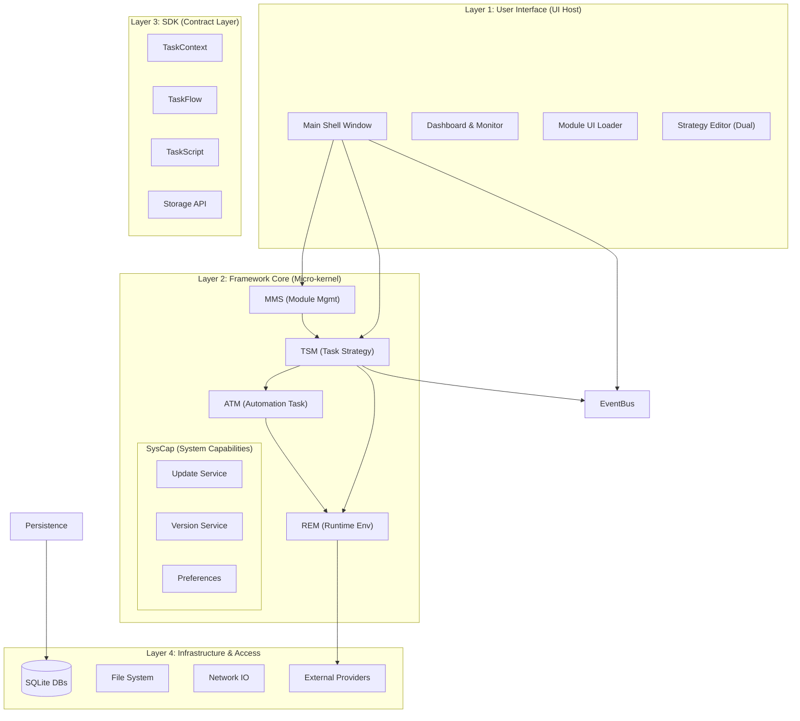
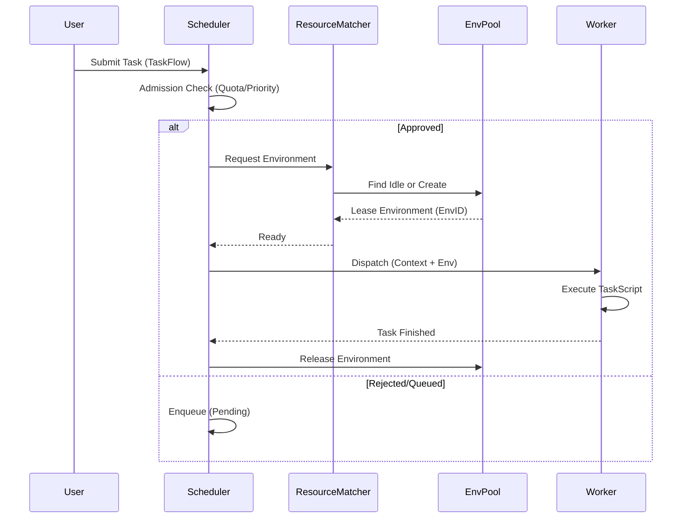

# 总体架构设计文档 (General Architecture Design Document)

## 1. 简介 (Introduction)

本文档旨在定义蛛行演略（crawler4j）系统的总体技术架构，作为开发团队进行详细设计与编码的最高指导原则。设计遵循“微内核 (Micro-kernel) + 插件化 (Plugin-based)”的核心思想，确保系统的可扩展性与长期可维护性。

### 1.1 设计目标
- **解耦**：核心框架 (Core) 与业务逻辑 (Modules) 完全解耦。
- **治理**：提供统一的资源（执行环境、并发、网络）治理能力。
- **稳健**：在不可靠的上下文中（如反爬对抗、网络波动、程序崩溃）提供可靠的恢复机制。

---

## 2. 技术选型 (Technology Stack)

基于“桌面端自动化平台”的定位，技术选型以 Python 生态为核心，兼顾开发效率与运行性能。

| 领域 | 选型 | 理由 |
| :--- | :--- | :--- |
| **开发语言** | **Python 3.12+** | 利用最新 Asyncio 特性与 Type Hinting；生态丰富，适合爬虫与自动化。 |
| **GUI 框架** | **PyQt6** | 成熟的桌面 GUI 解决方案，通过 `qasync` 与 Python Asyncio 完美结合。 |
| **包管理** | **uv** | 极速的 Python 包 与环境管理器，替代 pip/poetry，统一开发与运行时环境。 |
| **核心存储** | **SQLite + SQLAlchemy (Async)** | 轻量级、零配置、单文件部署；配合 Async ORM 满足高并发 I/O 依然流畅。 |
| **浏览器自动化** | **Playwright** | 相比 Selenium 更快、更稳定，原生支持无头/有头模式及 CDP 协议。 |
| **内部总线** | **Asyncio.Queue / Blinker** | 进程内通信，使用 Asyncio 原语处理高频事件与任务分发。 |
| **代码编辑** | **QScintilla** | 提供嵌入式代码编辑器支持（用于策略/配置 YAML 编辑）。 |

---

## 3. 逻辑架构视图 (Logical Architecture)

系统采用典型的**分层架构**，自下而上分为四层，并严格限制依赖方向（`Modules -> SDK -> Core`）。

### 3.1 架构全景图

### 3.2 核心子系统详解

#### 1. Framework Core (微内核)
- **Module Management System (MMS)**: 负责模块全生命周期管理（扫描、加载、校验、版本）。
- **Task Strategy Management (TSM)**: 负责任务的“准入”与“撮合”（优先级、并发控制）。
- **Automation Task Management (ATM)**: 负责任务执行生命周期（上下文注入、异常处理）。
- **Runtime Environment Management (REM)**: 负责“环境”的生命周期（池化、分配、回收）。
- **System Capabilities (SysCap)**: 提供 OTA 升级、版本管理、偏好设置等基础能力。

#### 2. SDK (契约层)
- 定义 Module 与 Core 交互的唯一标准。
- **TaskContext**: 注入到任务中的上下文对象，提供 `log`, `storage`, `browser` 等能力。
- **TaskScript**: 原子任务的基类，开发者继承此类实现具体逻辑。

#### 3. UI Host (展示层)
- 采用“微前端”思想的桌面实现。
- 提供统一的应用外壳（Shell）、路由（Routing）和公共组件。
- 动态加载模块提供的声明式 UI（JSON/YAML）或受信 Micro-app。

---

## 4. 运行视图 (Process View)

### 4.1 任务执行流程

---

## 5. 数据架构视图 (Data Architecture)

采用 SQLite 嵌入式数据库，根据数据特性进行逻辑分库（或分表）。

### 5.1 核心实体关系 (ER)

- **TaskFlow**: 工作流配置，包含多个 TaskScript 引用。
- **Environment**: 运行时环境实例，包含 `provider_type`, `state`, `lease_info`。
- **ExecutionRecord**: 任务运行记录，包含 `status`, `logs`, `result_summary`。
- **Strategies**: 序列化存储的 YAML 策略配置。

### 5.2 存储分层策略

1.  **Config Store (`config` 表/文件)**
    - **内容**: 模块全局配置、策略配置、系统设置。
    - **特性**: 读多写少，结构化 JSON。
    - **访问**: Admin UI 修改 ->Core 校验 -> 持久化。

2.  **State Store (`kv_store` 表)**
    - **内容**: 账号 Cookies、Token、Session、游标。
    - **特性**: 高频读写，Key-Value。
    - **访问**: Module 通过 `ctx.storage.state` 读写。

3.  **Data Store (`collections` 表)**
    - **内容**: 业务抓取结果（订单、商品）。
    - **特性**: 只写/批量读，Schema-less (JSON Document)。
    - **访问**: Module 通过 `ctx.emit` 写入。

---

## 6. 部署架构视图 (Deployment View)

系统为**单机桌面应用**部署模式，但支持连接外部云服务。

- **节点**: 用户 PC / Server (Win/Mac/Linux)。
- **容器**: 可选 Docker 容器化部署（Headless 模式）。
- **外部依赖**:
    - **Target Sites**: 目标抓取网站。
    - **Proxy Services**: 第三方代理 IP 服务商。
    - **Fingerprint Services**: 此类指纹浏览器服务（如 BitBrowser），通过 HTTP/WebSocket 连接。

---

## 7. 非功能性设计 (Non-functional Requirements)

### 7.1 高可用性 (Availability)
- **进程守护**: 虽为桌面应用，但 Core 内部应具备 Exception Boundary，防止单个 Module 崩溃导致整个应用退出。
- **状态恢复 (Crash Recovery)**:
    - 系统启动时扫描 `state.db` 中的 Leased 环境。
    - 发现“僵尸环境”（上次异常退出残留）则触发 `GC` 流程强制关闭进程并释放资源。
    - 重置“Running”状态的任务为“Failed (Crashed)”，保证状态一致性。

### 7.2 安全性 (Security)
- **沙箱隔离**: 理论上 Python 难以做进程级沙箱，但通过 `uv` 虚拟环境隔离模块依赖。
- **凭据加密**:敏感配置（如 API Key, Password）在落盘存储时应用 AES 加密（可选，依赖系统 Keyring）。

### 7.3 可扩展性 (Scalability)
- **IO 密集型优化**: 全链路 Asyncio，单进程不仅能支撑 UI 刷新，能同时支撑 10-50+ 并发爬虫任务（取决于网络与内存）。
- **模块化**: 新增业务只需安装新 Module 包，无需重新编译/修改 Core。

### 7.4 可维护性
- **日志规范**: 统一的日志分级与 Trace ID 贯穿 Core -> Module。
- **自诊断**: 内置 `Doctor` 模块，启动时检查 Python 环境、依赖版本、磁盘空间与权限。
