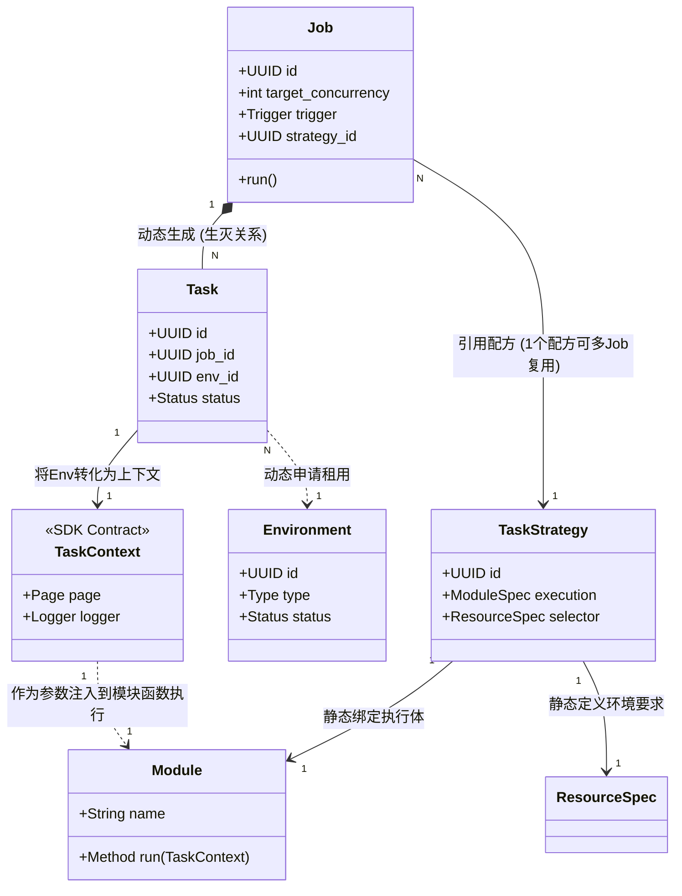

# Job-Task 执行链路架构重塑与关系梳理设计方案

## 1. 核心实体定义辨析
为了彻底厘清调度系统、资源管理系统与业务代码之间的职责，我们首先需要从宏观上明确以下五大核心实体的“人格”定义：

| 实体名称 | 所属子系统 | 现实隐喻 | 核心职责 | 在运行期的存活状态 |
| :--- | :--- | :--- | :--- | :--- |
| **Strategy (策略)** | TSM | **说明书/配方** | 静态定义“去哪跑（资源需求）”和“跑什么（模块名）”，没有任何动态信息。 | 静态持久化数据，全局共享。 |
| **Job (作业)** | ATM (Controller) | **包工头** | 表达用户的“意图”。如：“我要用配方A，每天跑5次”或“保持3个工人常驻运行”。不干具体活。 | 长生命周期（直至用户手动销毁或到期）。 |
| **Task (任务)** | ATM (Dispatcher) | **工人单次派工单** | 一次具体的执行实例。是 `Job` 派生出的原子操作单位，负责串联资源与执行体。 | 短生命周期（Running -> Success/Fail）。 |
| **Environment (环境)** | REM | **厂房/工具车** | 提供代码运行所需的真实物理/虚拟隔离资源（如一个独立指纹浏览器 Context，含 Proxy）。 | 由 `REM` 统一池化与出借，生命周期由租约控制。 |
| **Module (模块/脚本)** | MMS | **打工人/业务逻辑** | 纯粹的业务执行代码，如 `CtripCrawler`。不关心外部是如何调度的，只通过契约(SDK)办事。 | 随 Task 的激活而加载入内存，执行完毕即焚毁释放。 |

---

## 2. 关系流转：ER 图关系建模
实体的静态与动态关系遵循以下严格图谱：

### 关键架构约束解析
1. **控制反转**：`Module` 坚决不允许包含 `import src.core.*` 从而自己去偷偷获取资源。它是一个**纯函数**，只接受 `TaskContext`。
2. **职责拆分**：`Job` 只管**数量和时机**（Scale 和 Trigger）；`Task` 只管**单次执行状态流转**（PENDING -> RUNNING -> SUCCESS）。
3. **隔离解耦**：调度系统在将任务交给 `MMS` 之前，在 `Dispatcher` 层完成 `Environment` 到 `TaskContext` 的组装，确保边界极其纯净。

---

## 3. 全链路主执行逻辑 (Sequence Flow)

接下来，我们以一个“连续常驻监控”作业为例，完整贯穿这 5 大实体的配合机制。

```mermaid
sequenceDiagram
    autonumber
    participant UI as 用户控制台
    participant Controller as ATM (Job Controller)
    participant Repo as 数据库 (State/DB)
    participant Dispatcher as ATM (Task Dispatcher)
    participant TSM as TSM (策略工厂)
    participant REM as REM (环境管家)
    participant MMS as MMS (执行沙箱)
    participant SDK as Crawler4j_SDK
    participant Module as External Module

    UI->>Controller: 创建 Job (Strategy=价格监控, 并发=3)
    
    rect rgb(30, 40, 60)
    note right of Controller: 阶段1: 控制回路 (Job 管理)
    loop 每隔 1 秒 (Reconciliation)
        Controller->>Repo: 查当前 Running+Pending 的 Task 数
        Repo-->>Controller: 返回 1 (缺 2 个)
        Controller->>Repo: 插入 2 个 PENDING 态的新 Task
    end
    end
    
    rect rgb(30, 60, 40)
    note right of Dispatcher: 阶段2: 任务派发与资源分配 (Task 调度)
    Dispatcher->>Repo: 捞取 1 个 PENDING 态 Task
    Dispatcher->>TSM: 获取该 Task 关联的 Strategy
    TSM-->>Dispatcher: 返回需匹配 {"browser", "proxy": "us"} 及 module_name = "xxx"
    
    Dispatcher->>REM: acquire(要求: {"browser", "us"})
    REM->>REM: 查池/热启动创建新浏览器
    REM-->>Dispatcher: 返回 Env 租约与 BrowserHandle
    end
    
    rect rgb(60, 30, 30)
    note right of Dispatcher: 阶段3: 构筑沙箱与执行 (SDK 边界)
    Dispatcher->>SDK: 根据 BrowserHandle 组装 TaskContext
    Dispatcher->>MMS: run_module("xxx", TaskContext)
    
    MMS->>Module: async def run(context)
    Module->>Module: 执行业务逻辑 (使用 context.page)
    Module-->>MMS: 返回 TaskResult / JSON
    MMS-->>Dispatcher: 结果透传
    end
    
    rect rgb(60, 60, 60)
    note right of Dispatcher: 阶段4: 回收与审计
    Dispatcher->>REM: release(租约) -> 销毁或归还缓存池
    Dispatcher->>Repo: 更新 Task 状态为 SUCCEEDED
    end
```

### 控制器模式 (Controller Pattern)
请着重注意图中的 **阶段1**。系统放弃了传统的基于任务队列的单一触发模式，而是转向如同 K8s 的 Deployment Controller。
`Job` 只是一张期望清单（我要 3 个）。`Controller` 负责不断去校准现实（现有 1 个，补 2 个；现有 4 个，杀 1 个）。这种模式极度增强了反脆弱能力——当某个程序崩溃退出，下一秒 Controller 就会因为发现数量不够而自动补刀一个新的 Task，实现无缝自愈。

## 4. 架构合规性声明
- [x] **下沉底座**: TSM, ATM, REM 均处于 Core 系统，严格互相依赖。
- [x] **SDK 阻断**: 对外部 `Module` 代码仅暴露抽象的 `TaskContext` 和原生返回值模型，保护了基础设施的安全。**未触犯** Module -> Core 的架构红线。
- [x] **并发安全**: 由于 `Job` 与 `Task` 层级被分离，使得 `Job` 能处理高层级的并发缩扩容，而 `Task` 生命周期绑定单一独立的 `Environment`，从模型源头上杜绝了资源超卖交叉竞争。

---

## 5. 任务状态机与异常恢复机制 (Crash Recovery)

关于在 UI “任务监控”中观察到的任务状态及其背后的容错设计：

### 5.1 任务状态 (TaskStatus) 的含义
一单 `Task` (单次执行) 一生中会且仅会经历以下状态，在 UI 上分别对应：

*   **PENDING (等待中)**：任务已被 `Job Controller` 创建入库，但底座正忙。它正在 `Dispatcher` 中排队等待 `REM` 分配空闲资源（如等待空闲浏览器）。
*   **RUNNING (执行中)**：已成功申请到沙箱资源（Environment 租约已锁定），正在实际执行用户编写的 Module Python 代码。
*   **SUCCEEDED (成功结束)**：脚本正常 `return TaskResult`，没有抛出未捕获异常，且 `REM` 资源已被干净地回收。
*   **FAILED (失败)**：脚本在执行中抛出异常崩溃、运行超时，或因为系统底层原因强制中止。
*   **CANCELLED (被取消)**：在排队 (PENDING) 期间被用户手动中止，未能被执行。

*(注：除了上述的 Task 粒度单次状态，在外面包裹它的 **Job (作业)** 状态则是 `ACTIVE` / `PAUSED`，代表这台持续输送 Task 的“造血机”的开关情况。)*

### 5.2 UI 关闭与系统关机断电的影响

 蛛行演略（crawler4j）采用 **C/S 分离架构 (UI Host - Core Engine)** 配合 **SQLite ACID 级状态持久化**：

### 5.2 UI 关闭与系统关机断电的影响

 蛛行演略（crawler4j）采用 **C/S 分离架构 (UI Host - Core Engine)** 配合 **SQLite ACID 级状态持久化**：

#### 场景 1：正常关闭 UI 界面 (Graceful Shutdown)
根据爬虫业务特性，绝大多数采集任务应当是**明确的单次批处理生命周期**（而不是无限驻留的服务）。
当用户点击关闭 UI 界面时，系统触发安全退出流程：
*   **停止接单**：`Job Controller` 挂起，切断事件源，所有尚未执行的 `PENDING` 任务被冻结或取消，不再向资源池申请任何新环境。
*   **收尾等待 (Wait for Completion)**：对于当前正处于 **`RUNNING`** 状态的任务，系统**不会**粗暴打断它们。引擎会进入等待期，给予正在执行的脚本把当前的采集逻辑正常跑完并持久化数据的机会。
*   **按序释放**：当这些任务顺利转入 `SUCCEEDED`（或业务抛错导致 `FAILED`）后，`REM` 随即平滑释放浏览器句柄以回收内存。
*   **安全关闭**：当所有 `RUNNING` 活儿都干完后，后台 Core Engine 彻底销毁进程。

#### 场景 2：电脑死机 / 异常断电 (Crash / Power-off) 时的不可预知错误
在突发的不可抗力下，内存中的执行进程暴毙，完全来不及走任何退出逻辑。此时数据库里的记录被刻在了假死的 `RUNNING` 状态。

*   **开机自检 (Crash Recovery)**：重新运行软件启动 Core Daemon 时，调度系统首先执行**状态调和校验 (Reconciliation)**。
*   **识别僵尸任务**：扫描底库中所有的 `RUNNING` 任务，通过比对系统当前的存活进程 ID (PID) 或执行时间戳心跳，准确识别出这些是“假死”的任务。
*   **处理机制 (Action on Zombie Tasks)**：
    1.  **状态修正**：强行将这些僵尸任务的状态从 `RUNNING` 变更为 **`FAILED (Crashed: Unexpected Shutdown)`**，以维持系统状态机的绝对准确。
    2.  **硬性清理 (GC)**：呼叫 `REM` 扫描并强行 Kill 掉可能因断电残留但在重启后侥幸存活的无头浏览器进程 (Orphan Processes)。
    3.  **后续决断**：由于爬虫任务是单次的，考虑到断电期间可能部分数据已经污染或采集过半，系统**默认保留为 FAILED 异常**不自动重跑，并推送明显的通知让用户知晓。用户可以根据日志审查这批数据，然后在新一轮操作中决定是否对这批 FAILED 任务执行“一键重试”。
