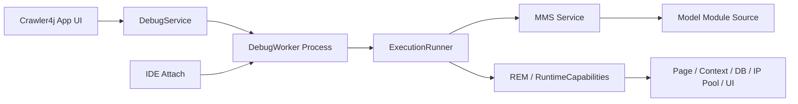
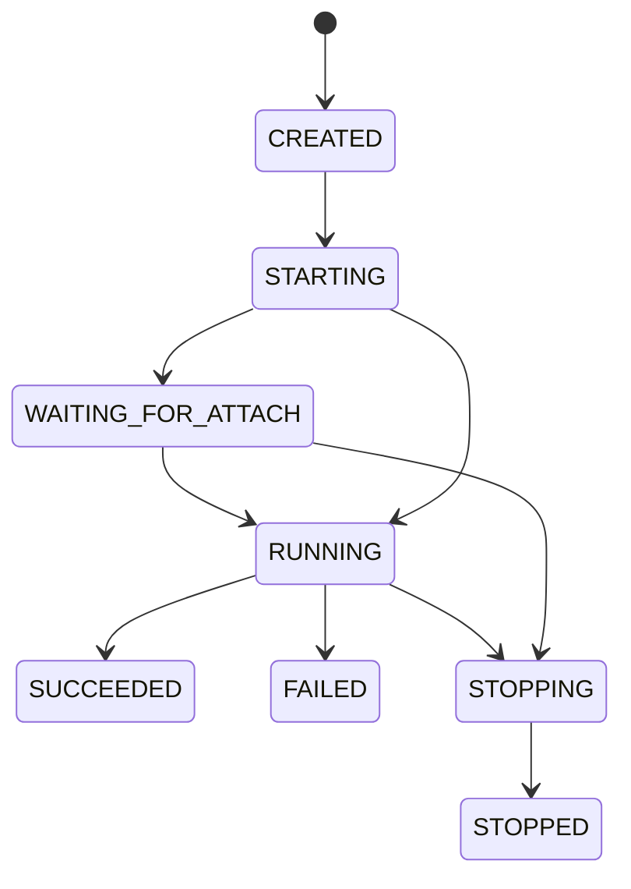
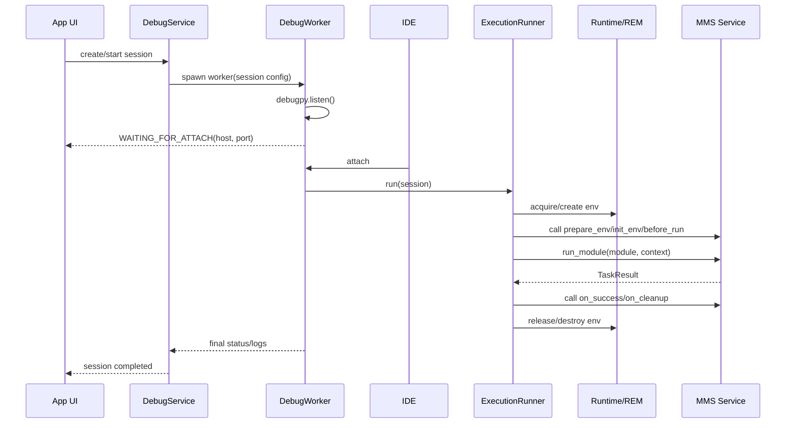

# 详细开发设计文档：[DBG-01] 基于 Core 的 Model 调试会话与 IDE 附加

**状态：** Implemented  
**日期：** 2026-03-21  
**作者：** Codex / 用户共创  
**关联主题：**

- `Module -> SDK/Contracts -> Core` 依赖边界收敛
- Model 开发者调试体验简化
- Core 真实运行时与 IDE 断点调试打通

---

## 1. 背景与问题定义

在本设计提出时，model 项目的本地调试主路径仍然是 CLI 生成的 `debug_runner.py`。这条路径可以帮助开发者快速验证脚本逻辑，但它存在 4 个结构性问题：

1. 调试运行时由 SDK 脚手架自行启动 Playwright，容易让开发者误以为 SDK 负责提供真实外部对象。
2. 本地调试链路与 Core 真实执行链路分离，导致“本地能跑、进框架后行为不同”。
3. model 开发者需要理解 `debug_runner.py`、`TEST_CONFIG`、浏览器启动等实现细节，配置负担偏重。
4. SDK 因历史原因对 `playwright` 存在硬依赖，模糊了 `contracts/sdk` 与 `core` 的边界。

而当前 Core 其实已经具备真实运行的关键基础：

- `ATM Dispatcher` 会构造真实 `TaskContext` 并注入 `page/context/db/ip_pool/env_ops/ui`
- `MMS Service` 负责加载模块并执行 `module.run(ctx)`
- `RuntimeCapabilities` 已经把 Core 能力封装成契约对象注入上下文

因此，正确的下一步不是继续增强 SDK 本地模拟执行，而是把 Core 的真实执行链改造成一条对 IDE 友好的调试路径。

---

## 2. 设计目标

### 2.1 功能目标

- `contracts` 只定义稳定契约与协议类型。
- `sdk` 只提供 model 作者侧开发辅助能力，不再承担真实浏览器/真实运行时职责。
- 所有 model 外部对象都由 Core 创建并注入。
- model 开发者可以先在 `crawler4j` 应用中选择作业并发起任务调试，再让 IDE 附加到该调试会话。
- 调试执行链与正式运行链共享同一套执行内核。

### 2.2 体验目标

- model 开发者首次配置不超过一次。
- 日常调试步骤压缩到“应用里点开始调试 + IDE 点附加”。
- 不要求 model 开发者理解 `debugpy`、端口分配、路径映射、浏览器生命周期。
- 默认行为对 VS Code 友好，同时保持其他 IDE 可通过 host/port 兼容附加。

### 2.3 架构目标

- 主 UI 进程不直接承载可断点暂停的业务执行，避免断点冻结整个桌面应用。
- 每次调试重新启动独立 worker 进程，不依赖复杂热重载。
- Core 保持对调试会话的状态、日志、环境资源和停止动作的控制权。

---

## 3. 非目标

本方案 V1 不包含以下能力：

- 多用户远程协同调试
- 基于网络的远程调试暴露
- 同一进程内的 Python 模块热重载
- 对所有 IDE 的零差异适配
- 将调试会话直接并入正式 Job/Task 的公共领域模型

---

## 4. 目标用户流程

### 4.1 首次使用

1. 用 CLI 创建 model 项目，并在 IDE 中打开该源码目录。
2. 将目录放入 Core 扫描路径，或通过 `DevModuleLink` 注册这个目录。
3. 在 ATM 中创建一个绑定该模块策略的作业。
4. 在作业详情或作业列表点击“调试任务”，首次生成 IDE 附加配置。
5. 以后通过应用发起调试，通过 IDE 附加并下断点。

### 4.2 日常使用

1. 修改 model 代码。
2. 在应用中找到对应作业，点击“开始调试”。
3. IDE 执行 `Attach to Crawler4j`。
4. 在 `tasks/*.py`、`workflows/*.py`、模块 hooks 中命中断点。
5. 调试结束后在应用里重跑、停止或保留环境。

---

## 5. 方案总览

### 5.1 高层结构



### 5.2 核心原则

- 应用负责“配置会话、启动 worker、显示状态”。
- worker 负责“等待 IDE 附加、执行真实运行链、回传状态”。
- `ExecutionRunner` 负责“把 ATM 当前执行逻辑抽成可复用内核”。
- model 源码以“开发链接模块”方式接入 Core，确保 worker 导入的就是 IDE 当前打开的文件。

---

## 6. 核心设计

### 6.1 开发链接模块 (Dev Module Link)

### 设计动机

当前 MMS 更偏向“扫描模块目录”或“安装 zip 包”。但调试场景里，开发者真正需要的是：

- 不复制源码
- 不重新打包
- 不把调试目标变成另一份安装副本

### 设计方案

新增 `DevModuleLink` 注册机制，由 Core 维护 `module_name -> local_source_path` 映射。

### 关键约束

- 仅接受包含 `module.yaml` 的目录。
- 一个模块名在同一时刻只能绑定一个开发路径。
- UI 中明确标注来源类型为“开发链接”。
- 扫描失败时保留错误态，便于开发者定位问题。

### 读取行为

MMS 扫描时合并两类来源：

- 普通模块目录
- 开发链接模块目录

这样，调试和正式运行仍然统一走 `ModuleService` 加载逻辑。

### 6.2 Debug Session 领域对象

调试会话与正式 Job/Task 的生命周期和语义不同，因此单独建模。

建议最小字段集如下：

| 字段 | 说明 |
| --- | --- |
| `id` | 调试会话 ID |
| `job_id` | 目标作业 ID |
| `job_name` | 目标作业名 |
| `strategy_id` | 目标策略 ID |
| `module_name` | 解析得到的模块名 |
| `source_path` | 本地源码路径 |
| `workflow` | 从策略解析出的目标工作流 |
| `params` | 调试参数，最终注入 `ctx.config` |
| `hooks_module` | hooks 模块覆盖项 |
| `provider` | 环境 provider |
| `attach_host` | IDE 附加地址，默认 `127.0.0.1` |
| `attach_port` | IDE 附加端口，默认 `5678` |
| `wait_for_attach` | 是否等待 IDE 附加 |
| `stop_on_entry` | 是否在执行前停住 |
| `state` | 会话状态 |
| `worker_pid` | worker 进程号 |
| `env_id` | 当前绑定环境 ID |
| `started_at` | 启动时间 |
| `finished_at` | 结束时间 |
| `last_error` | 最近错误 |

### 状态机



### 6.3 Debug Service

`DebugService` 是应用内统一门面，负责调试会话的生命周期。

### 主要职责

- 创建调试会话
- 分配端口
- 启动 / 停止 worker
- 查询状态
- 聚合日志
- 提供“重新开始调试”
- 调试结束后执行环境清理策略

### 推荐接口

```python
class DebugService:
    async def create_session(self, request: DebugSessionRequest) -> DebugSession: ...
    async def start_session(self, session_id: str) -> DebugSession: ...
    async def stop_session(self, session_id: str) -> bool: ...
    async def restart_session(self, session_id: str) -> DebugSession: ...
    async def get_session(self, session_id: str) -> DebugSession | None: ...
    async def list_sessions(self) -> list[DebugSession]: ...
```

### 6.4 Debug Worker

### 为什么要独立进程

如果在桌面应用主进程里直接开启 `debugpy` 并断点暂停，会把整个 UI 和后台控制流程一起阻塞，体验很差。因此调试执行必须运行在独立 worker 进程中。

### worker 启动步骤

1. 接收 `DebugSession` 配置。
2. 启动 `debugpy.listen(host, port)`。
3. 若 `wait_for_attach=true`，则进入 `wait_for_client()`。
4. 附加成功后，进入 `ExecutionRunner`。
5. 结束后回传最终状态并退出。

### 关键要求

- 在导入 model 模块之前就完成 `listen/wait`。
- 默认仅绑定 `127.0.0.1`。
- 每次“重跑”启动新 worker，而不是复用旧进程。

### 6.5 ExecutionRunner

### 设计动机

当前真实执行逻辑主要散落在 `ATM Dispatcher` 中。为了保证“调试路径 = 正式路径”，必须把这段逻辑抽成共享执行内核。

### 职责边界

`ExecutionRunner` 负责：

1. 调用 `prepare_env`
2. 获取或创建环境
3. 构造真实 `TaskContext`
4. 注入 `page/context/db/ip_pool/env_ops/ui`
5. 调用 `init_env`
6. 调用 `before_run`
7. 调用 `module.run(ctx)`
8. 调用 `on_success/on_failure/on_timeout/on_cleanup`
9. 回收租约和环境

### 复用关系

- ATM 正常任务执行复用 `ExecutionRunner`
- Debug Worker 调试执行也复用 `ExecutionRunner`

这样可以最大程度消除“调试行为”和“生产行为”的分叉。

### 6.6 模块加载与源码更新策略

V1 不主打进程内热重载，而采用“重启 worker = 重新导入源码”的策略。

### 原因

- 避免 `sys.modules` 缓存污染
- 避免只 reload 根模块、遗漏 `tasks/` 和 `workflows/` 子模块
- 避免断点错位和代码版本不一致

### 结果

- 开发者改完代码后直接点“重新开始调试”
- 新 worker 从源码目录重新导入整个模块包
- 不需要复杂的 `devel_mode` 热重载规则作为主路径

---

## 7. 运行序列



---

## 8. UI 设计

### 8.1 新增入口

### 模块管理

开发链接注册能力已经在 `MMS / DebugService` 落地；独立的“选择本地目录”桌面入口可继续补齐，但不再视为当前实现的必要前提。

### ATM 作业页

在作业列表和作业详情页增加“调试任务”入口，仅当作业解析到的目标模块来源为 `DevLink` 时显示。

### 8.2 调试对话框

### 基础区

- 附加端口
- 运行参数
- 等待 IDE 附加

### 高级区

- timeout
- 调试后保留环境
- stop on entry

### 默认值来源

尽可能直接复用当前作业绑定策略配置：

- `execution.workflow`
- `execution.params`
- `execution.timeout`
- `resource.provider`

开发者只在必要时改动差异项。

### 8.3 调试会话面板

展示：

- 当前状态
- IDE 附加地址
- worker PID
- 环境 ID
- 实时日志
- 最近一次错误

操作：

- 开始调试
- 重新开始
- 停止调试
- 保留环境
- 复制附加地址

---

## 9. IDE 集成设计

### 9.1 VS Code 优先

为降低配置成本，V1 优先提供 VS Code 一键附加配置生成。

### 生成内容

- `.vscode/launch.json`
- 固定名称，例如 `Attach to Crawler4j`
- 默认地址 `127.0.0.1:5678`

### 为什么默认不需要 pathMappings

因为 worker 直接导入开发者本地源码目录，IDE 打开的就是同一套路径，通常不需要额外路径映射。

### 9.2 其他 IDE

PyCharm、Cursor、Windsurf 等只需支持：

- Host
- Port

如果 IDE 支持 Python attach，就能兼容使用。

---

## 10. 包边界调整建议

### 10.1 `crawler4j-contracts`

保留：

- `TaskContext`
- `TaskResult`
- 各类 capability protocol

要求：

- 不引入 Core 实现
- 不承担真实运行时启动

### 10.2 `crawler4j-sdk`

保留：

- `TaskScript`
- `TaskFlow`
- CLI
- 模板
- 开发辅助工具

建议：

- 移除对 `playwright` 的硬依赖
- 不再把 `debug_runner.py` 作为官方主调试路径

### 10.3 `core`

新增职责：

- `DebugService`
- `DebugWorker`
- `ExecutionRunner`
- 开发链接模块管理
- IDE 附加式调试能力

---

## 11. 安全与运维约束

- 默认只监听本地回环地址，不开放远程调试端口。
- 应用退出时应停止仍存活的 debug worker。
- 调试会话日志需要明确区分于正式任务日志。
- 调试模式应显式标识，避免误入正式调度通道。

---

## 12. 分阶段实施计划

### Phase 1：执行内核抽取

- 从 `ATM Dispatcher` 提炼 `ExecutionRunner`
- 保证现有正式任务行为不回归

### Phase 2：开发链接模块与会话服务

- 新增开发模块注册
- 新增 `DebugSession` / `DebugService`
- 新增 worker 启动与停止

### Phase 3：应用内调试 UI

- 作业列表 / 作业详情的任务调试入口
- 调试对话框
- 调试会话面板

### Phase 4：IDE 集成与文档

- VS Code 一键生成附加配置
- 更新插件开发手册
- 更新 SDK/Contracts 边界文档

---

## 13. 风险与缓解

| 风险 | 影响 | 缓解措施 |
| --- | --- | --- |
| worker 与正式运行链出现分叉 | 调试结果不可信 | 强制共用 `ExecutionRunner` |
| 端口占用导致无法附加 | 调试启动失败 | 端口检测 + 自动回退到下一个可用端口 |
| 开发链接模块与安装模块重名 | 加载歧义 | 明确优先级并在 UI 中提示冲突 |
| 开发者修改源码后未重启会话 | 代码未生效 | 明确“重跑即新进程”语义 |
| 主程序退出后残留 worker | 资源泄漏 | 进程组管理 + 退出时清理 |

---

## 14. 验收标准

### 功能验收

- 开发者可以通过扫描路径或 `DevModuleLink` 成功注册本地开发模块。
- 开发者可以在应用中配置工作流和参数并启动调试。
- worker 在 IDE 附加前不会导入目标模块。
- IDE 能在 `tasks/*.py`、`workflows/*.py`、hooks 中命中断点。
- 调试执行拿到的 `ctx.page/db/ip_pool/env_ops/ui` 均来自 Core 注入。
- 调试结束后可按策略保留或销毁环境。

### 体验验收

- 首次使用最多只需要一次 IDE 配置生成。
- 日常调试不要求手工编辑 `debug_runner.py`。
- 日常调试不要求开发者手工填写端口或路径映射。

### 架构验收

- 正式执行与调试执行共用同一执行内核。
- SDK 不再承担真实浏览器调试运行时职责。
- Playwright 运行时责任从 SDK 迁移到 Core 或 model 项目开发依赖。

---

## 15. 受影响模块

- `src/core/atm/dispatcher.py`
- `src/core/atm/runtime_capabilities.py`
- `src/core/mms/service.py`
- `src/core/mms/scanner.py`
- `src/core/mms/registry.py`
- `src/core/mms/ui/module_detail_page.py`
- `src/core/mms/ui/module_list_widget.py`
- `src/core/tsm/models.py`
- `crawler4j_sdk/pyproject.toml`
- `crawler4j_sdk/cli/templates.py`

---

## 16. 文档约定

本文是调试能力的正式设计基线。  
在实现完成前，插件开发手册应同时说明：

- 当前版本可用调试方式
- 官方目标调试方案

避免文档先于实现而误导 model 开发者。
