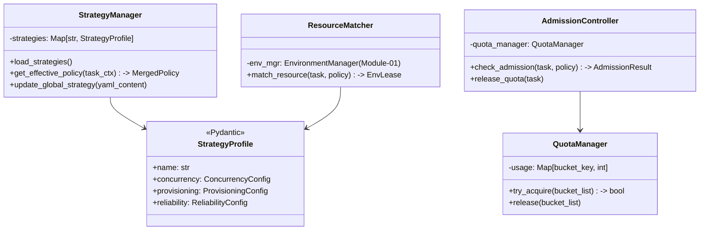
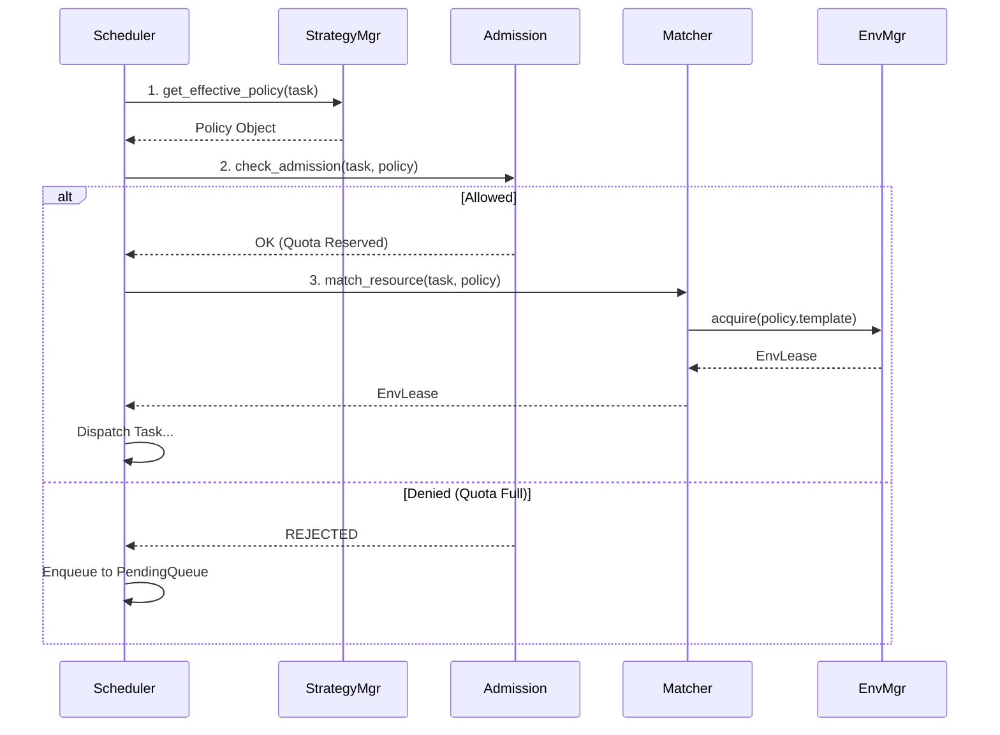

# 详细开发设计文档：[Module-02] 任务策略管理 (TSM)

## 1. 模块功能概述 (Module Overview)

**任务策略管理 (Task Strategy Management, TSM)** 是系统的核心决策组件（大脑）。它不负责执行任务的具体代码，而是负责在任务运行前进行**“准入控制 (Admission Control)”**与**“资源撮合 (Resource Matching)”**。它通过解析可热更新的 YAML 策略文件，动态决定任务的并发配额、优先级以及环境资源的供给模式。

---

## 2. 类设计与接口定义 (Class Design & Interfaces)

### 2.1 核心类图 (Logic View)



### 2.2 核心类定义 (Pseudo-code)

#### 2.2.1 Data Models (Pydantic)

```python
from pydantic import BaseModel, Field
from typing import Dict, Literal

class ConcurrencyConfig(BaseModel):
    global_max: int = 10
    # 动态桶，例如 {"module:ctrip": 2, "tag:heavy": 5}
    group_buckets: Dict[str, int] = {}

class ProvisioningConfig(BaseModel):
    mode: Literal["static", "dynamic", "hybrid"] = "hybrid"
    reuse_policy: Literal["clean", "dirty", "ephemeral"] = "clean"
    auto_create_limit: int = 5
    # 新建环境时的参数模板
    environment_template: Dict[str, Any] = {}

class StrategyProfile(BaseModel):
    """对应 YAML 文件的根对象"""
    metadata: Dict[str, str]
    concurrency: ConcurrencyConfig
    provisioning: ProvisioningConfig
    reliability: ReliabilityConfig
```

#### 2.2.2 StrategyManager (决策合并)

```python
class StrategyManager:
    def __init__(self, db: Database):
        self._cache = {} # In-memory cache of strategies

    async def get_effective_policy(self, task: TaskRequest) -> StrategyProfile:
        """
        策略合并逻辑 (Merge Strategy):
        优先级 Priority: Task Override > Module Default > Global Default
        """
        global_policy = self._cache.get("global", DEFAULT_POLICY)
        module_policy = self._cache.get(f"module:{task.module_name}")
        task_policy = task.strategy_override
        
        # Deep Merge implementations...
        return merged_policy
```

#### 2.2.3 AdmissionController (准入控制)

```python
class AdmissionController:
    def __init__(self):
        # 内存计数器，用于并发限制
        self._usage = defaultdict(int) 
        self._lock = asyncio.Lock()

    async def admit(self, task: TaskRequest, policy: StrategyProfile) -> bool:
        """
        检查是否允许任务立即执行
        
        1. Global Check: if total_active >= policy.concurrency.global_max -> False
        2. Bucket Check: 
           keys = [f"module:{task.module}", f"priority:{task.priority}"]
           for k in keys:
               limit = policy.concurrency.group_buckets.get(k)
               if limit and self._usage[k] >= limit -> False
        
        Return:
           True -> 立即增加计数器，允许通过
           False -> 拒绝（调度器将其放入 Pending 队列）
        """
        async with self._lock:
            # Check logic...
            pass
```

#### 2.2.4 ResourceMatcher (资源撮合)

```python
class ResourceMatcher:
    def __init__(self, env_mgr: EnvironmentManager):
        self.env_mgr = env_mgr

    async def match(self, task: TaskRequest, policy: StrategyProfile) -> EnvLease:
        """
        决定如何获取环境:
        
        1. 构造 EnvRequirement (tags + capabilities)
        2. IF policy.provisioning.mode == 'start new':
             return await env_mgr.spawn(req)
        3. ELSE:
             return await env_mgr.acquire(req)
        """
        pass
```

---

## 3. 数据库设计 (Database Design)

TSM 主要持久化存储**用户定义的策略文件**。由于 YAML 通常较小，直接存入 SQL 数据库的 TEXT 字段即可，方便事务管理。

### 3.1 `strategies` 表

| 字段名 | 类型 | 约束 | 描述 |
| :--- | :--- | :--- | :--- |
| `name` | VARCHAR(64) | PK | 策略唯一名称 (如 `global`, `module:ctrip`) |
| `version` | INT | | 版本号，乐观锁控制 |
| `content_yaml` | TEXT | | 完整的 YAML 字符串 |
| `updated_at` | BIGINT | | 最后更新时间 |
| `is_active` | BOOL | | 是否启用 |

### 3.2 运行态数据 (Runtime Data)

**并发计数器 (Quota Counters)**：由于并发控制对性能极其敏感且无需持久化（重启后任务需重新调度），因此**只存在于内存中** (`AdmissionController._usage`)。Core 重启时，所有计数器归零，随着任务恢复执行重新计数。

---

## 4. 业务流程逻辑 (Business Logic)

### 4.1 核心调度决策流 (Decision Flow)



### 4.2 策略热更新流程 (Hot-Reload)

用户在 UI 的 YAML 编辑器中修改了 `concurrency.global_max`：

1. **UI**: 调用 API `POST /strategies/global` 更新 DB。
2. **EventBus**: Core 发送 `STRATEGY_UPDATED` 事件。
3. **StrategyManager**: 监听到事件，从 DB 重新加载并更新内存 Cache。
4. **AdmissionController**: (可选) 重新评估 Pending 队列中的任务，如果当前配额变大，立即唤醒部分等待任务。

### 4.3 异常处理

*   **YAML 格式错误**: `StrategyManager` 加载时应 Catch 解析异常，回退到系统内置的 `SafeDefault` 策略，并发出告警。
*   **资源创建失败**: 若 `Matcher` 尝试创建环境失败（如 Provisioning Error），应抛出 `ResourceExhausted` 异常，Scheduler 捕获后触发重试或放入死信队列。
