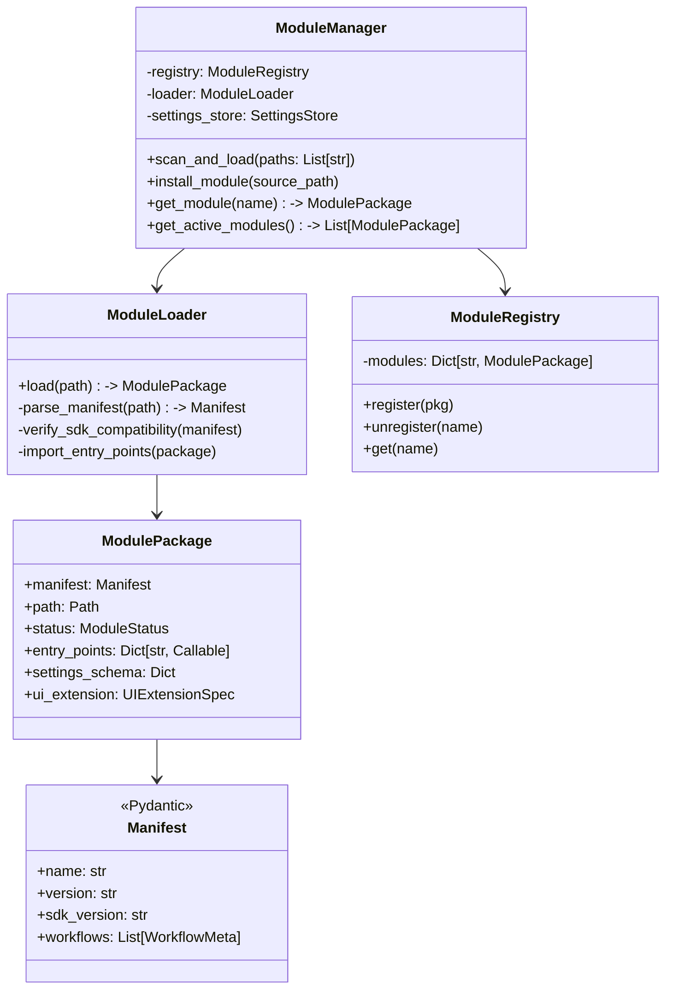
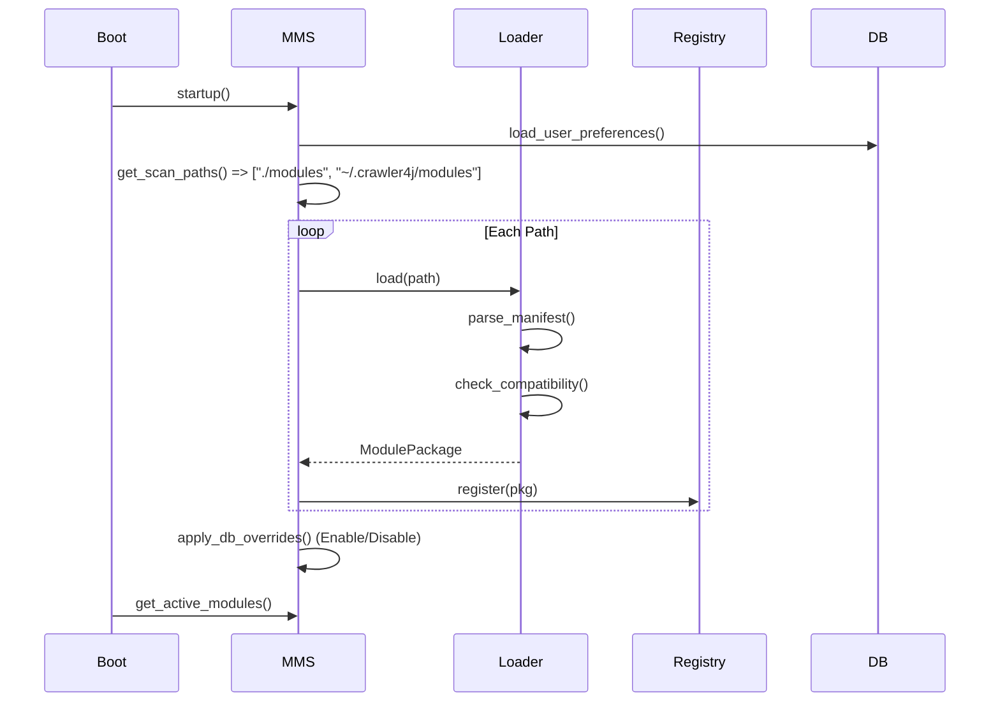

# 详细开发设计文档：[Module-03] 模块管理系统 (MMS)

## 1. 模块功能概述 (Module Overview)

**模块管理系统 (Module Management System, MMS)** 负责管理蛛行演略（crawler4j）生态中“业务插件 (Modules)”的全生命周期。其核心职责是将文件系统上的 **“标准模块包”** 加载为运行时可用的 **Registry Entry**，并提供配置管理、版本验证以及 UI 扩展的索引服务。它充当了系统内核 (Core) 与业务扩展 (Modules) 之间的“海关”，确保只有合法、兼容的模块才能进入系统。

---

## 2. 类设计与接口定义 (Class Design & Interfaces)

### 2.1 核心类图 (Logic View)



### 2.2 核心类定义 (Pseudo-code)

#### 2.2.1 Data Models (Pydantic / Manifest)

```python
from pydantic import BaseModel, Field
from typing import List, Optional, Dict

class WorkflowMeta(BaseModel):
    name: str # 唯一标识
    display_name: str
    description: Optional[str]

class ModuleManifest(BaseModel):
    """Mapping to module.yaml"""
    name: str  # e.g., "ctrip_flight"
    version: str # Semantic Version
    sdk_version: str # e.g., ">=0.1.0"
    author: Optional[str]
    description: Optional[str]
    workflows: List[WorkflowMeta] = []
    
    # UI Extension definition
    ui: Optional[Dict[str, str]] = None # e.g. {"type": "declarative", "entry": "ui/main.yaml"}

class ModuleStatus(StrEnum):
    ACTIVE = "active"
    DISABLED = "disabled"
    ERROR = "error" # 加载失败
    INCOMPATIBLE = "incompatible" # SDK 版本不匹配
```

#### 2.2.2 ModuleManager (Service Facade)

```python
class ModuleManager:
    def __init__(self, settings_store: SettingsStore):
        self.registry = ModuleRegistry()
        self.loader = ModuleLoader()
        self.settings_store = settings_store

    async def reload_all(self):
        """扫描 -> 加载 -> 注册 -> 合并配置"""
        paths = self._get_scan_paths()
        for p in paths:
            try:
                pkg = self.loader.load(p)
                # Apply user disabled status
                if self.settings_store.is_disabled(pkg.manifest.name):
                    pkg.status = ModuleStatus.DISABLED
                self.registry.register(pkg)
            except Exception as e:
                log.error(f"Failed to load module at {p}: {e}")
                # Register a placeholder "Error" module for UI display
```

#### 2.2.3 ModuleLoader (Validation Logic)

```python
import packaging.version

class ModuleLoader:
    def load(self, path: Path) -> ModulePackage:
        # 1. Check module.yaml
        manifest_path = path / "module.yaml"
        if not manifest_path.exists():
            raise InvalidModuleError("Missing module.yaml")
        
        # 2. Parse & Validate Manifest
        manifest = self._parse_manifest(manifest_path)
        
        # 3. Check SDK Compatibility
        current_sdk_ver = get_sdk_version()
        if not check_version(manifest.sdk_version, current_sdk_ver):
             # 此时不抛出异常，而是返回状态为 Incompatible 的包
             # 以便在 UI 上提示“需升级 SDK”
             return ModulePackage(..., status=ModuleStatus.INCOMPATIBLE)
             
        # 4. Import Python Code (Optional for pure config modules)
        # sys.path.insert(0, str(path))...
        
        return ModulePackage(..., status=ModuleStatus.ACTIVE)
```

---

## 3. 数据库设计 (Database Design)

MMS 需要持久化**核心配置**与**模块启用/禁用状态**。

### 3.1 `module_configs` 表

| 字段名 | 类型 | 约束 | 描述 |
| :--- | :--- | :--- | :--- |
| `module_name` | VARCHAR(64) | PK | 模块名 |
| `is_enabled` | BOOL | | 是否启用（默认 True） |
| `user_config` | TEXT | | 用户覆盖的配置 (JSON Merger) |
| `installed_version` | VARCHAR(32) | | 当前安装版本 (缓存用) |
| `updated_at` | BIGINT | | |

### 3.2 逻辑存储 (Settings Store Logic)

系统采用 **三层配置合并策略**：

1.  **Code Default**: 模块代码中硬编码的默认值。
2.  **Manifest Config**: `module.yaml` 中定义的 `config_schema` 及默认值。
3.  **User Config**: 用户在 UI 上修改并保存到数据库的 `user_config`。

**读取逻辑**:
`final_config = merge(manifest_defaults, db.user_config)`

---

## 4. 业务流程逻辑 (Business Logic)

### 4.1 启动加载流程 (Startup Sequence)



### 4.2 模块安装流程 (Install from ZIP)

1.  用户上传 `my_crawler_v1.0.zip`。
2.  MMS 校验 ZIP 头，确认为合法归档。
3.  解压至临时目录，检查是否存在 `module.yaml`。
4.  读取 `module.yaml` 获取 `module_name` (`ctrip`)。
5.  检查是否已存在同名模块：
    *   若存在且版本较低 -> 覆盖流程 (Upgrade)。
    *   若存在且版本较高 -> 报错或提示降级。
6.  将文件移动至 `./modules/ctrip/` (原子操作)。
7.  调用 `reload_all()` 或局部刷新，更新 Registry。
8.  EventBus 广播 `MODULE_INSTALLED` 事件。

### 4.3 UI 扩展加载策略

*   **声明式 UI (Declarative)**:
    *   MMS 解析 YAML 定义，UI Host 直接根据 JSON Schema 渲染表单。安全，**推荐默认使用**。
*   **Micro-app (Python/Qt)**:
    *   仅当模块带有 `trusted` 签名（未来特性）或在 `config/allowlist.yaml` 中白名单通过时，MMS 才允许加载其 `.py` UI 入口。
    *   否则，强制降级到通用信息页。

---

## 5. 异常处理规范

*   **InvalidManifest**: `module.yaml` 解析失败 -> 记录 ERROR 日志，标记模块状态为 `INVALID`，UI 显示红色警告。
*   **ImportError**: 模块 Python 代码依赖缺失 -> 标记状态 `BROKEN`，提示用户运行 `uv sync` 或安装依赖。
*   **VersionConflict**: 依赖的 SDK 版本不兼容 -> 标记 `INCOMPATIBLE`，UI 提示“需要升级 Core”或“降级模块”。
