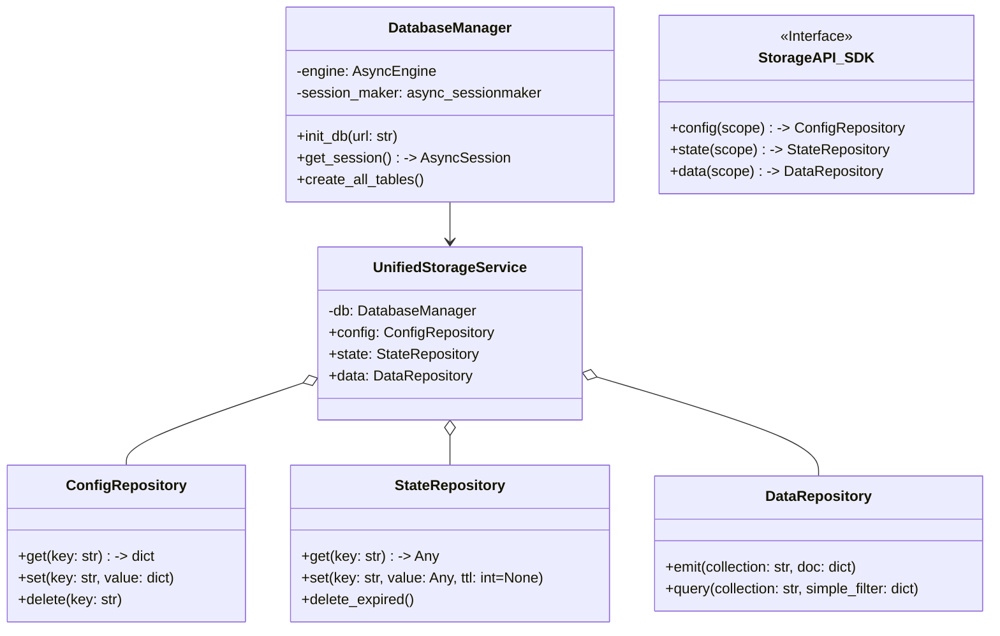

# 详细开发设计文档：[Module-04] 数据持久化层 (Data Persistence)

## 1. 模块功能概述 (Module Overview)

**数据持久化层 (Data Persistence Layer)** 是 Framework Core 的统一数据访问底座。它基于 **SQLite** (默认) 和 **SQLAlchemy (Async)** 构建，为系统提供轻量级、零配置但高性能的异步数据存储服务。它将数据划分为 **Config (配置域)**、**State (状态域)** 和 **Data (数据域)** 三个逻辑分区，并对 Module SDK 屏蔽底层的 SQL 细节。

---

## 2. 类设计与接口定义 (Class Design & Interfaces)

### 2.1 核心类图 (Logic View)



### 2.2 核心类定义 (Pseudo-code)

#### 2.2.1 DatabaseManager (Infrastructure)

```python
from sqlalchemy.ext.asyncio import create_async_engine, async_sessionmaker

class DatabaseManager:
    """单例，管理数据库连接池"""
    
    def __init__(self, db_url: str = "sqlite+aiosqlite:///crawler4j.db"):
        self.engine = create_async_engine(
            db_url, 
            echo=False,
            pool_recycle=3600
        )
        self.session_factory = async_sessionmaker(self.engine)

    async def init_schema(self):
        """应用 Alembic 迁移或 create_all"""
        async with self.engine.begin() as conn:
            await conn.run_sync(Base.metadata.create_all)
```

#### 2.2.2 StateRepository (KV Store Logic)

```python
class StateRepository:
    def __init__(self, session_factory):
        self.session_factory = session_factory

    async def set(self, key: str, value: Any, ttl: Optional[int] = None):
        """
        Upsert Key-Value Pair.
        value 将被 JSON 序列化存储。
        """
        expires_at = int(time.time() + ttl) if ttl else None
        blob = json.dumps(value)
        
        async with self.session_factory() as session:
            stmt = insert(KVStoreTable).values(
                key=key, value=blob, expires_at=expires_at, updated_at=now()
            ).on_conflict_do_update(...)
            await session.execute(stmt)
            await session.commit()

    async def get(self, key: str) -> Optional[Any]:
        """
        Get Value, return None if expired.
        """
        async with self.session_factory() as session:
            row = await session.execute(select(KVStoreTable).where(key==key))
            item = row.scalar_one_or_none()
            
            if not item: return None
            if item.expires_at and item.expires_at < time.time():
                # Lazy delete (optional)
                return None
                
            return json.loads(item.value)
```

#### 2.2.3 DataRepository (Collection Logic)

```python
class DataRepository:
    """Append-only data store for scraped results"""
    
    async def emit(self, collection: str, doc: dict):
        """
        Insert a document into a collection.
        自动注入 _id, _created_at
        """
        doc['_id'] = uuid.uuid4().hex
        doc['_ts'] = int(time.time() * 1000)
        
        async with self.session_factory() as session:
            await session.execute(
                insert(DataTable).values(
                    collection=collection,
                    doc_json=json.dumps(doc),
                    created_at=time.time()
                )
            )
            await session.commit()
```

---

## 3. 数据库设计 (Database Schema)

所有表均前缀为 `sys_` 以避免与特定业务表冲突（如果有）。

### 3.1 `sys_configs` 表
存储全局设置与模块配置。

| 字段名 | 类型 | 描述 |
| :--- | :--- | :--- |
| `key` | VARCHAR(128) | PK, e.g. `module:ctrip:config` |
| `value` | TEXT | JSON String |
| `description` | TEXT | 可选备注 |
| `updated_at` | BIGINT |  |

### 3.2 `sys_kv_store` 表
存储高频运行时状态 (Cookies, Tokens)。

| 字段名 | 类型 | 索引 | 描述 |
| :--- | :--- | :--- | :--- |
| `key` | VARCHAR(256) | PK | 状态键 |
| `value` | TEXT | | JSON String |
| `expires_at` | BIGINT | INDEX | 过期时间戳 (NULL=永不过期) |
| `updated_at` | BIGINT | | |

### 3.3 `sys_collections` 表
存储业务抓取数据。

| 字段名 | 类型 | 索引 | 描述 |
| :--- | :--- | :--- | :--- |
| `id` | INTEGER | PK | 自增主键 |
| `collection` | VARCHAR(64) | INDEX | 集合名 e.g. `orders` |
| `doc_json` | TEXT | | 数据主体 |
| `created_at` | BIGINT | INDEX | 写入时间 |
| `task_run_id`| VARCHAR(64)| INDEX | 关联的任务运行ID |

---

## 4. 业务流程逻辑 (Business Logic)

### 4.1 TTL 过期清理 (TTL Cleanup)

为了保持 `sys_kv_store` 轻量，需要定期清理过期键。
**实现:**
1. 背景任务 `_cleanup_loop` 每 5 分钟运行一次。
2. 执行 SQL: `DELETE FROM sys_kv_store WHERE expires_at < now()`。
3. 记录删除行数到日志。

### 4.2 数据隔离 (Data Isolation)

SDK 在调用 API 时，会自动注入Scope前缀，确保 Module A 无法误写 Module B 的数据。

*   **Config**: `module:{name}:UserConfig` (只读)
*   **State**: 只能操作以 `module:{name}:` 开头的 Key (建议约定, 代码层面可暂不做强制隔离，依赖命名空间规范)。
*   **Data**: `collection` 字段不强制隔离，允许不同模块向同一个 `orders` 集合写入数据（便于后续数据清洗）。

### 4.3 连接池管理

由于 SQLite 的写锁特性，连接池配置至关重要：
*   **Pool Size**: 1 (SQLite 默认建议单线程写，多线程读)。*注：开启 WAL 模式后可支持并发读写，但 AsyncIO + aiosqlite 通常不需要多连接。*
*   **WAL Mode**: 初始化时必须执行 `PRAGMA journal_mode=WAL;` 以极大提升并发性能。

```python
async def enable_wal(engine):
    async with engine.connect() as conn:
        await conn.execute(text("PRAGMA journal_mode=WAL;"))
        await conn.execute(text("PRAGMA synchronous=NORMAL;"))
```
