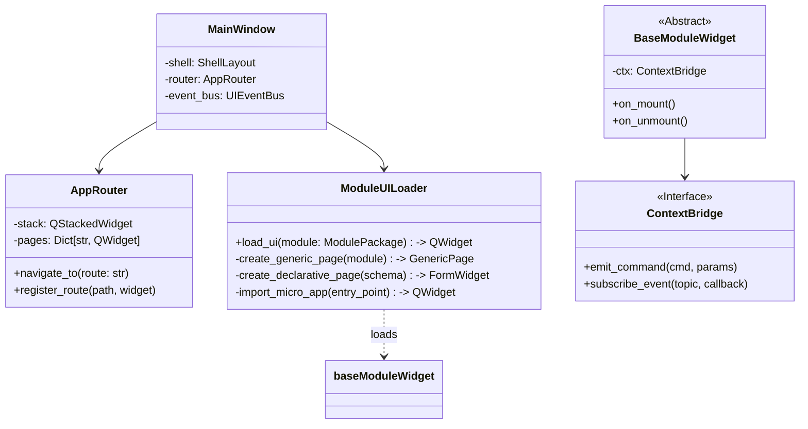

# 详细开发设计文档：[Module-06] UI - 宿主程序与扩展机制 (UI Host)

## 1. 模块功能概述 (Module Overview)

**UI Host** 是 Crawler4j 的桌面端主程序，基于 **PyQt6** 构建。它不仅是 Core 的管理控制台，更是一个**微前端容器 (Micro-frontend Host)**。它提供统一的 Shell（导航/菜单/状态栏），并根据模块定义动态加载“声明式 UI”或“编程式 Widget”，实现业务与界面的解耦。

---

## 2. 类设计与接口定义 (Class Design & Interfaces)

### 2.1 核心类图 (Logic View)



### 2.2 核心类定义 (Pseudo-code)

#### 2.2.1 异步 UI 架构 (Async UI)

为了不阻塞 UI 线程，我们使用 `qasync` 将 PyQt 的 Event Loop 与 Python 的 `asyncio` Event Loop 融合。

```python
import sys
import asyncio
from qasync import QEventLoop, asyncSlot
from PyQt6.QtWidgets import QApplication

def main():
    app = QApplication(sys.argv)
    loop = QEventLoop(app)
    asyncio.set_event_loop(loop)
    
    window = MainWindow()
    window.show()
    
    with loop:
        loop.run_forever()
```

#### 2.2.2 Context Bridge (安全桥接)

所有 UI 组件（包括 Core 的和 Module 的）都只能通过 Bridge 与后端通信，**禁止直接调用 Core 的 Singleton**。

```python
class UIContextBridge(QObject):
    """
    UI 组件与后端 Core 交互的唯一通道。
    """
    
    def __init__(self, core_facade):
        super().__init__()
        self._core = core_facade
        self.signals = GlobalSignals() # Qt Signals for updates

    @asyncSlot()
    async def invoke_command(self, cmd: str, **kwargs):
        """
        发送命令到 Core (RPC-like)
        :return: Result or Raise Error
        """
        try:
            handler = getattr(self._core, f"cmd_{cmd}")
            result = await handler(**kwargs)
            return result
        except Exception as e:
            self.show_error_toast(str(e))
            raise
```

#### 2.2.3 Module UI Loader (加载策略)

```python
class ModuleUILoader:
    def load_ui(self, pkg: ModulePackage) -> QWidget:
        try:
            # 1. 优先尝试 micro-app (及检查受信状态)
            if pkg.ui_extension.type == 'micro-app' and pkg.is_trusted:
                return self._load_python_widget(pkg)
            
            # 2. 其次尝试声明式 UI
            elif pkg.ui_extension.type == 'declarative':
                return self._render_schema_form(pkg.ui_extension.schema)
            
            # 3. 默认通用页
            return GenericModulePage(pkg)
            
        except Exception as e:
            log.error(f"UI Load Failed: {e}")
            return ErrorPage(error=e)
```

---

## 3. UI 布局与交互设计 (Layout Design)

### 3.1 主界面布局 (Shell)

系统采用经典的**侧边导航 (Sidebar Navigation)** 布局：

*   **Left Sidebar (一级导航)**:
    *   `Dashboard`: 全局仪表盘（运行中任务数、系统负载）。
    *   `Modules`: 模块列表（二级菜单展开）。
    *   `Tasks`: 运行记录 (History) 与 调度队列。
    *   `Settings`: 系统全局设置。
*   **Main Content (路由区域)**:
    *   使用 `QStackedWidget` 实现页面切换。
    *   页面状态保持 (Keep-Alive) 或 惰性加载 (Lazy Load) 可配置。
*   **Bottom Bar (状态栏)**:
    *   显示 Core 连接状态、后台任务进度、当前活跃环境数。

### 3.2 声明式表单引擎 (Schema Form Engine)

Core 提供一组基于 `JSON Schema` 的标准控件映射，模块只需提供 JSON 即可生成配置界面。

**Schema 示例**:
```json
{
  "properties": {
    "username": { "type": "string", "title": "用户名" },
    "max_pages": { "type": "integer", "title": "最大页数", "minimum": 1 },
    "mode": { 
      "type": "string", 
      "enum": ["fast", "deep"], 
      "title": "抓取模式" 
    }
  }
}
```

**渲染映射**:
*   `string` -> `QLineEdit`
*   `integer` -> `QSpinBox`
*   `boolean` -> `QCheckBox`
*   `enum` -> `QComboBox`
*   `object` -> `QGroupBox`

---

## 4. 业务流程逻辑 (Business Logic)

### 4.1 启动与路由初始化

1.  **Splash Screen**: 显示 Logo，后台并行初始化 Core 和 SQLite。
2.  **Dashboard Load**: 进入主 Dashboard，订阅 `sys.stats` 事件更新图表。
3.  **Module Discovery**:
    *   调用 `core.list_modules()`。
    *   遍历结果，在 Sidebar 动态添加模块菜单项。
    *   点击菜单时，惰性调用 `loader.load_ui(pkg)` 并缓存 Widget 实例。

### 4.2 实时日志流 (Live Log Streaming)

当用户点击“查看任务详情”时：
1.  UI 调用 `bridge.invoke("subscribe_logs", run_id=123)`。
2.  Core 的 EventBus 将日志 LogRecord 推送给 UI。
3.  UI 收到信号 `sig_log_received`，将日志追加到 `QTextEdit` 中（需注意控制缓冲区大小，避免内存溢出）。
4.  页面关闭时，调用 `bridge.invoke("unsubscribe_logs")`。

---

## 5. 异常处理

*   **UI 线程阻塞**: 严格禁止在 UI 线程执行 `time.sleep` 或同步 IO。必须使用 `await` 或 `run_in_executor`。
*   **Module UI 崩溃**: 使用 `excepthook` 或 Try-Catch 包裹 Widget 初始化。若 Widget 内部抛出异常，UI Host 捕获并替换为“崩溃提示页”，同时提供“重载”按钮，**不可导致整个 App 闪退**。
