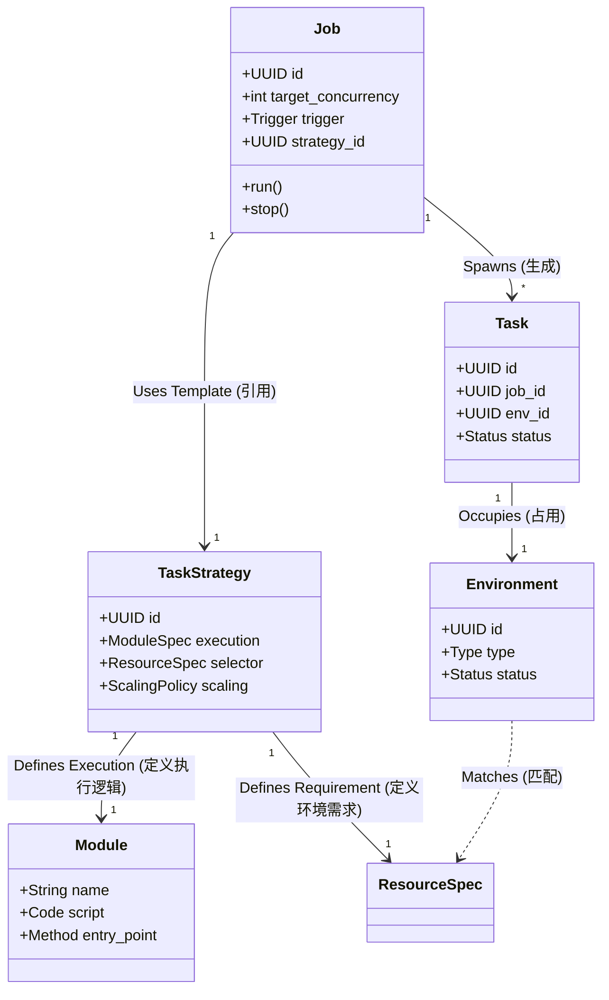

# Task Engine V2 架构设计方案

> **Metaphor**: 将当前的一次性“发令枪”模式升级为 Kubernetes 风格的“期望状态管理”模式。

## 1. 核心设计理念

为了满足“定时”、“单次”、“常驻并发”等多种需求，我们需要引入**双层抽象模型**：
1.  **Job (作业)**: 定义“做什么”以及“怎么做”（期望状态）。它是长生命周期的管理对象。
2.  **Task (任务)**: `Job` 的一次具体执行实例（实际状态）。它是短生命周期的执行单元。

### 1.1 关键差异：Controller 模式
目前的系统是 **Trigger-Based**（触发器模式）：时间到了 -> 触发 -> 结束。
新系统应采用 **Controller-Based**（控制器模式）：
- **Daemon Job**: 用户期望并发数为 5。Controller 每秒检查：当前只有 3 个在跑 -> 立即启动 2 个。
- **Cron Job**: 用户期望每天 8:00 运行。Controller 在时间点生成一个 Task。

---

## 2. 核心对象模型 (Domain Model)

### 2.1 Job (作业定义)
Job 是用户管理的实体，配置了所有的运行参数。

| 字段 | 类型 | 说明 |
| :--- | :--- | :--- |
| `id` | UUID | 作业唯一标识 |
| `type` | Enum | `BATCH` (批处理) / `SERVICE` (常驻服务) |
| `strategy_id` | UUID | 关联的策略模板 ID |
| `trigger` | Config | 触发规则 (Manual / Cron / Always-On) |
| `concurrency` | Int | **期望并发数** (Target Concurrency) |
| `state` | Enum | `ACTIVE` (启用) / `PAUSED` (暂停) |

### 2.2 Task (任务实例)
Task 是 Job 的原子执行单元。一个 Job 可以产生无数个 Task。

| 字段 | 类型 | 说明 |
| :--- | :--- | :--- |
| `id` | UUID | 任务实例 ID |
| `job_id` | UUID | 关联的 Job ID |
| `status` | Enum | `PENDING` -> `RUNNING` -> `SUCCEEDED`/`FAILED` |
| `lease_id` | UUID | 占用的环境资源租约 |

---

## 3. 运行模式设计

### 3.1 模式一：Manual / One-off (手动单次)
*   **Job 配置**: `type=BATCH`, `concurrency=1`, `trigger=Manual`, `strategy_id="str-01"`
*   **行为**: 用户点击“运行” -> Controller 创建 1 个 Task -> Task 结束 -> Job 变回 Idle。

### 3.2 模式二：Cron / Interval (定时/间隔)
*   **Job 配置**: `type=BATCH`, `concurrency=1`, `trigger=Cron("0 8 * * *")`
*   **行为**: 调度器在特定时间点给 Controller 发信号 -> Controller 创建 1 个 Task -> Task 结束。

### 3.3 模式三：Manual Parallel (手动批处理并行)
*   **Job 配置**: `type=BATCH`, `concurrency=10`, `trigger=Manual`
*   **行为**: 用户点击“运行” -> Controller 一次性创建 10 个 Task -> 等待这 10 个全部结束 -> Job 结束。

### 3.4 模式四：Continuous Concurrency (常驻并发服务) **[新需求核心]**
*   **Job 配置**: `type=SERVICE`, `concurrency=5`, `trigger=Always-On`
*   **行为**:
    1.  用户启用 Job (`ACTIVE`)。
    2.  **Reconciliation Loop (调和循环)** 启动：监测 `Target` vs `Actual`。
    3.  **自动补齐**: 发现只有 4 个运行，立即启动 1 个。

---

## 4. 并发控制与竞态防护 (Concurrency Safety)

当 Controller 决定同时启动 100 个任务时，如何保证不超卖环境？

### 4.1 方案：原子化资源抢占 (Atomic Leasing)
放弃应用层锁（Application Lock），直接利用数据库的原子性 (ACID)。

**SQL 逻辑 (伪代码):**
```sql
UPDATE environments
SET 
  status = 'leased', 
  lease_id = :new_lease_id,
  leased_at = NOW()
WHERE id = (
  SELECT id FROM environments
  WHERE status = 'ready' AND type = :type
  LIMIT 1
  FOR UPDATE SKIP LOCKED  -- 关键：跳过被锁定的行 (PostgreSQL/MySQL)
)
RETURNING id;
```
*注：对于 SQLite，使用单线程写入或 `IMMEDIATE` 事务模式即可保证串行安全。*

### 4.2 流程
1.  **TaskDispatcher** 接收到“启动 N 个任务”的指令。
2.  **并行发起** N 个 `acquire_env` 请求。
3.  数据库层面通过原子操作，确保每个环境 ID 只能被一个请求返回。
4.  抢不到环境的任务进入 `PENDING` 队列，等待资源释放。

---

## 5. UI/UX 交互设计方案

引入 **"双层视图"** 设计。

### 5.1 视图一：Job Management (作业管理台)
*   **定位**: 运维控制台，关注“服务状态”。
*   **展示项**:
    *   Job Name / Strategy
    *   **State**: `Running` (Green), `Paused` (Grey), `Error` (Red)
    *   **Concurrency**: `8 / 10` (Actual / Target)
    *   **Metrics**: Today's Success Rate, RPS
*   **操作**:
    *   `Enable` / `Disable` (开关服务)
    *   `Scale` (调整并发数滑块)
    *   `Edit` (修改配置)

### 5.2 视图二：Task Monitor (任务监控台)
*   **定位**: 历史日志，关注“单次执行细节”。
*   **入口**: 点击某个 Job 进入其详情页 -> 下方显示 Task 列表。
*   **展示项**:
    *   Task ID
    *   Status (`Success`, `Fail`)
    *   Time (`Created`, `Duration`)
    *   Logs link
*   **交互**:
    *   对于 **Batch Job**：展示完整的任务列表。
    *   对于 **Service Job**：仅展示最近 100 条 + 失败记录（提供筛选器）。

### 5.3 创建向导 (Wizard)
1.  **Select Strategy**: 选择模板（如 "Ctrip Crawler"）。
    - *此处 Strategy 定义了要做什么（Module）和在哪做（Environment）。*
2.  **Configure Job**:
    - **Name**: "Prod Service 1"
    - **Mode**: `[One-off]`, `[Scheduled]`, `[Continuous]`。
    - **Concurrency**: 设定目标并发数。
3.  **Deploy**: 创建 Job 并立即启动。

---

## 6. 实体关系详解 (Entity Relationships)

您问到关于“Job 和 Strategy 的关系”以及“环境与脚本的关系”，以下是详细定义：

### 6.1 实体关系图 (ERD)



### 6.2 详细角色定义

#### 1. Module (脚本代码) - "The What"
- **定义**: 实际的 Python 业务代码（如 `ctrip_spider.py`）。
- **职责**: 包含具体的业务逻辑。它不知道自己会被谁调用，也不知道运行在什么环境，它只负责接收参数，执行逻辑，返回结果。
- **关系**: 它是最底层的执行体。

#### 2. Environment (环境资源) - "The Where"
- **定义**: 运行代码的容器（如 `Browser Profile #105`, `Android Device #02`）。
- **职责**: 提供 Module 运行所需的物理或虚拟资源（IP、Cookie、Browser Context）。
- **关系**: 它是被动资源，等待被分配。

#### 3. Strategy (策略模板) - "The Template"
- **定义**: **静态配置**。它将 `Module` 和 `Environment Requirement` 绑定在一起。
- **配置内容**:
    - **执行谁？**: `execution.module = "ctrip_spider"`
    - **在哪执行？**: `selector.env_type = "chrome"`, `match_labels = {"region": "us"}`
    - **怎么容错？**: `retry.max_attempts = 3`
- **作用**: 它是“配方”。它不包含“什么时候运行”或“运行几次”的信息。
- **创建 Job 时**: 用户必须先选择一个 Strategy。

#### 4. Job (作业实例) - "The Instance"
- **定义**: **动态运行配置**。
- **配置内容**:
    - **引用哪个配方？**: `strategy_id = "strategy-ctrip-us"`
    - **运行多少个？**: `concurrency = 50`
    - **什么时候跑？**: `trigger = "Manual"` (现在) 或 `Cron` (每天)。
- **作用**: 它是“指挥官”。它根据 Strategy 的定义，指挥调度器生成 Task。

### 6.3 关系总结
- **Job -> Strategy**: 1对1引用。Job 是 Strategy 的实例化。
- **Strategy -> Module**: 1对1绑定。表明该策略是用哪个脚本。
- **Strategy -> Environment**: 1对1需求定义。Strategy 定义了“我要什么样的环境”，Task 运行时再去寻找具体匹配的 Environment。

此设计实现了**业务逻辑（Module）、资源管理（Environment）与 调度控制（Job）** 的完美解耦。
