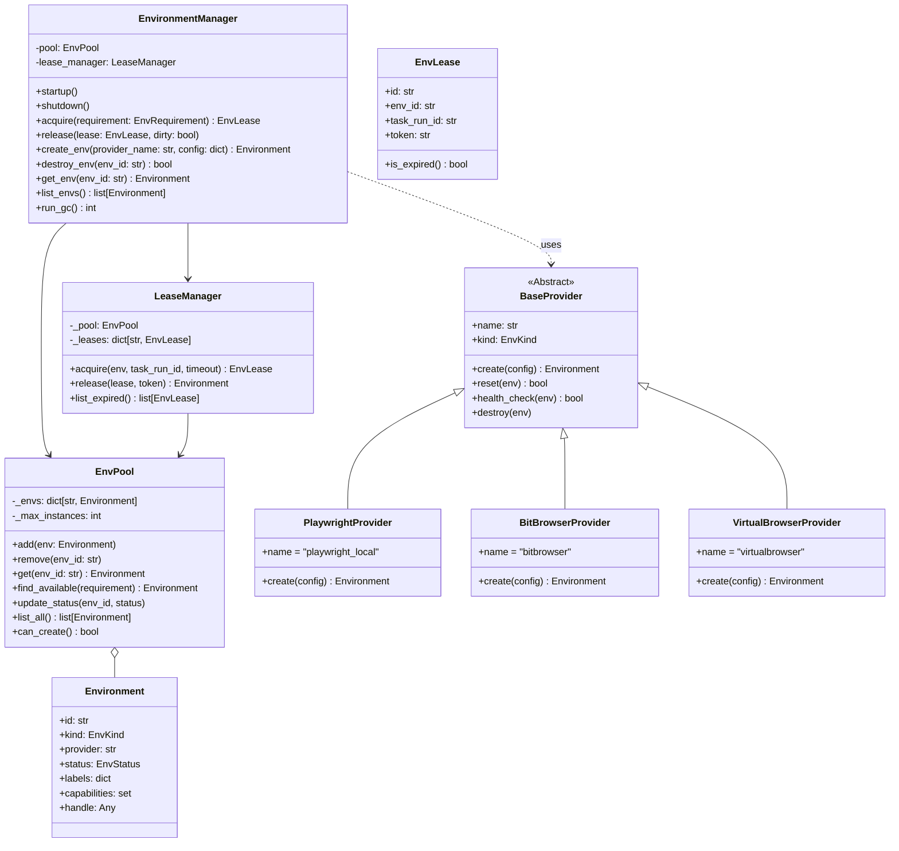
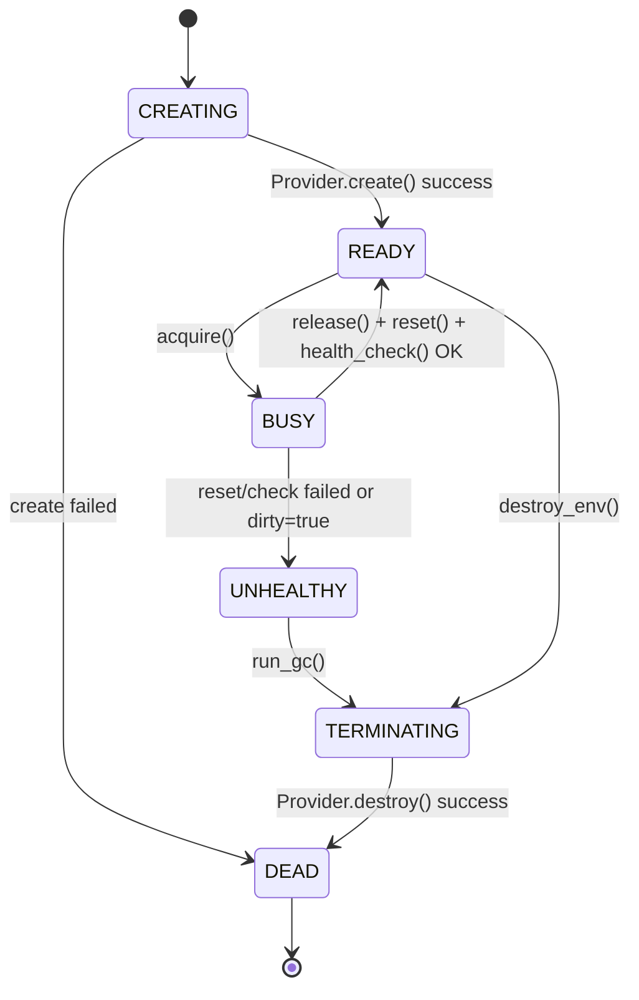
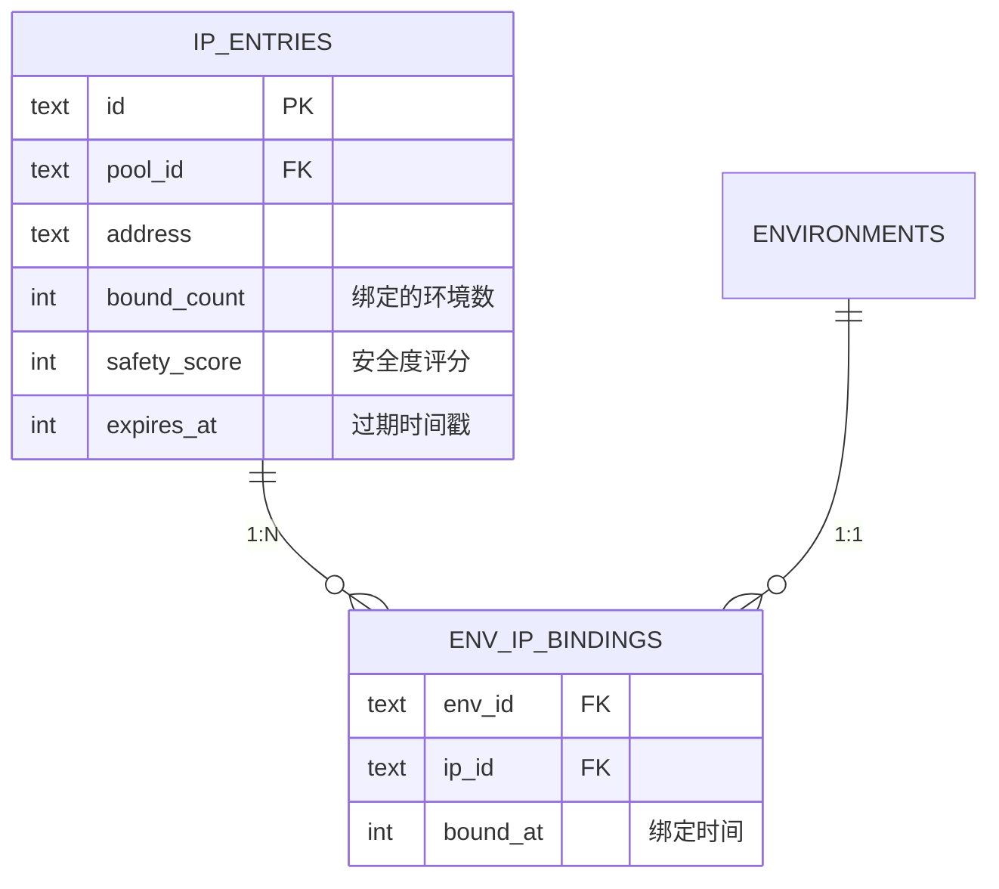
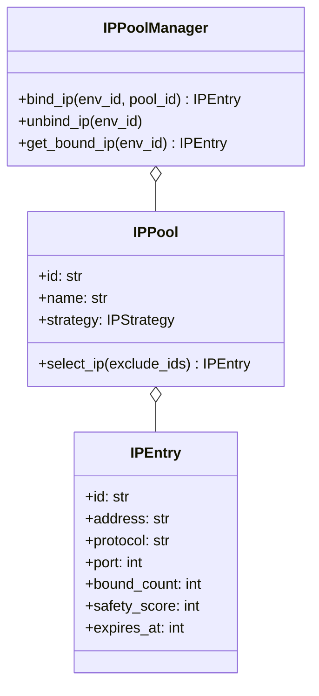
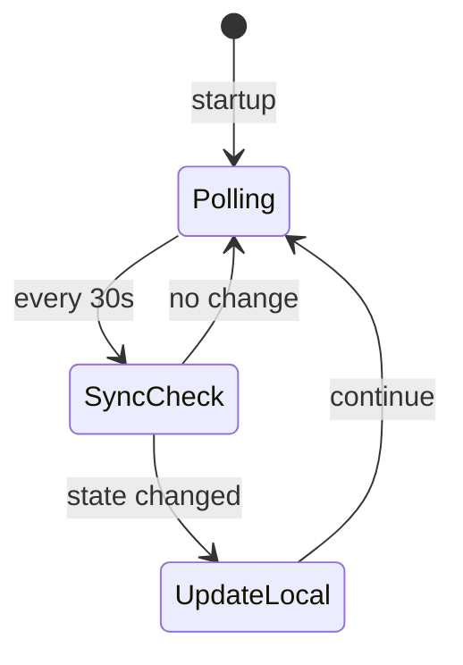

# 详细开发设计文档：[Module-01] 运行时环境管理 (REM)

## 1. 模块功能概述 (Module Overview)

**运行时环境管理 (Runtime Environment Management, REM)** 是 Framework Core 的基础设施模块。它的核心职责是统一**管理底层执行资源 (Execution Resources)** 的全生命周期，包括创建 (Spawn)、池化 (Pool)、租借 (Lease)、健康检查 (Health Check) 与回收 (Reap)。它屏蔽了底层的技术差异（如 Playwright 浏览器进程、HTTP Client Session、Docker Container），向调度器提供标准的 `EnvLease` 对象。

---

## 2. 类设计与接口定义 (Class Design & Interfaces)

### 2.1 核心类图 (Logic View)



### 2.2 核心类定义 (Pseudo-code)

#### 2.2.1 Environment (Data Entity)

```python
from enum import StrEnum
from pydantic import BaseModel, Field
from typing import Any, Optional

class EnvStatus(StrEnum):
    CREATING = "creating"
    READY = "ready"      # 空闲，在池中
    BUSY = "busy"        # 已租出，正在执行任务
    CLEANING = "cleaning" # 归还中/重置中
    UNHEALTHY = "unhealthy"
    TERMINATING = "terminating"
    DEAD = "dead"

class Environment(BaseModel):
    id: str
    kind: str  # browser, http, desktop
    provider: str # e.g., "playwright_local"
    status: EnvStatus = EnvStatus.CREATING
    
    # 物理句柄，不序列化存储，仅内存持有
    # 例如 Playwright BrowserContext 对象
    handle: Any = Field(default=None, exclude=True)
    
    # 元数据，描述环境能力，如 {'ip': '1.2.3.4', 'fingerprint': 'windows_chrome'}
    capabilities: dict = {} 
    
    created_at: int
    updated_at: int

class EnvLease(BaseModel):
    id: str  # UUID
    env_id: str
    task_run_id: str
    acquired_at: float
    token: str # 安全令牌，防止越权释放
```

#### 2.2.2 EnvironmentManager (Service Facade)

```python
class EnvironmentManager:
    async def startup(self):
        """初始化，启动 GC task，从数据库恢复环境状态"""
        pass

    async def shutdown(self):
        """关闭管理器，释放所有环境"""
        pass

    async def acquire(self, requirement: EnvRequirement) -> EnvLease:
        """
        租用环境（供调度器调用）：
        1. 在 READY 实例中查找匹配项
        2. 若无匹配，调用 Provider.create() 创建
        3. 发放租约，将实例置为 BUSY
        """
        pass

    async def release(self, lease: EnvLease, dirty: bool = False) -> bool:
        """
        释放环境：
        1. 验证 token
        2. 调用 Provider.reset() 清理
        3. 健康检查 Provider.health_check()
        4. 成功 -> READY; 失败/dirty -> UNHEALTHY
        """
        pass

    async def create_env(self, provider_name: str, config: dict | None = None) -> Environment:
        """直接创建环境（供 UI 调用）"""
        pass

    async def destroy_env(self, env_id: str) -> bool:
        """直接销毁环境（供 UI 调用）"""
        pass

    async def get_env(self, env_id: str) -> Environment | None:
        """获取环境实例"""
        pass

    async def list_envs(self) -> list[Environment]:
        """列出所有环境"""
        pass

    async def run_gc(self) -> int:
        """手动触发垃圾回收，返回回收数量"""
        pass
```

#### 2.2.3 BaseProvider (SPI Interface)

```python
class BaseProvider(ABC):
    @abstractmethod
    async def create_env(self, config: dict) -> Environment:
        """创建一个物理环境，返回包装对象"""
        pass
        
    @abstractmethod
    async def reset_env(self, env: Environment) -> bool:
        """重置环境状态 (清理 Cache/Cookies, 关闭多余 Tag)"""
        pass
        
    @abstractmethod
    async def health_check(self, env: Environment) -> bool:
        """检查环境是否存活且可用"""
        pass
        
    @abstractmethod
    async def destroy_env(self, env: Environment):
        """销毁物理资源 (kill process)"""
        pass
```

---

## 3. 数据库设计 (Database Design)

虽然环境大部分是**内存对象 (Volatile)**，但为了**崩溃恢复 (Crash Recovery)**，我们需要将 Environment 的元数据与状态持久化到 SQLite。

### 3.1 `environments` 表

用于记录当前所有受管环境的状态。系统启动时需扫描此表，将 `BUSY` 状态的环境标记为“崩溃残留”并执行清理。

| 字段名 | 类型 | 约束 | 描述 |
| :--- | :--- | :--- | :--- |
| `id` | TEXT | PK | 环境唯一 ID (UUID) |
| `kind` | TEXT | NOT NULL | browser / http / desktop |
| `provider` | TEXT | NOT NULL | 提供者标识 |
| `status` | TEXT | NOT NULL | EnvStatus |
| `external_id` | TEXT | INDEX | 外部系统环境 ID |
| `lease_id` | TEXT | INDEX | 当前租约 ID |
| `task_run_id` | TEXT | INDEX | 关联的任务运行 ID |
| `last_used_at` | INTEGER | INDEX | 最后使用时间戳 |
| `daily_usage_count` | INTEGER | DEFAULT 0 | 当天使用次数 |
| `daily_usage_date` | TEXT | | 使用统计日期 |
| `proxy_config_json` | TEXT | | 代理配置 JSON |
| `fingerprint_config_json` | TEXT | | 指纹配置 JSON |
| `created_at` | INTEGER | NOT NULL | 创建时间戳 |
| `updated_at` | INTEGER | NOT NULL | 状态变更时间 |
| `meta_json` | TEXT | | capabilities/labels |

### 3.2 `ip_pools` 表

| 字段名 | 类型 | 约束 | 描述 |
| :--- | :--- | :--- | :--- |
| `id` | TEXT | PK | IP 池 ID |
| `name` | TEXT | NOT NULL | 池名称 |
| `provider` | TEXT | NOT NULL | 提供商 |
| `config_json` | TEXT | | 配置 |
| `created_at` | INTEGER | NOT NULL | 创建时间 |
| `updated_at` | INTEGER | NOT NULL | 更新时间 |

### 3.3 `ip_entries` 表

| 字段名 | 类型 | 约束 | 描述 |
| :--- | :--- | :--- | :--- |
| `id` | TEXT | PK | 条目 ID |
| `pool_id` | TEXT | FK, INDEX | 所属 IP 池 |
| `address` | TEXT | NOT NULL | IP 地址 |
| `protocol` | TEXT | NOT NULL | http/socks5 |
| `port` | INTEGER | NOT NULL | 端口 |
| `username` | TEXT | | 用户名 |
| `password` | TEXT | | 密码 |
| `bound_count` | INTEGER | DEFAULT 0 | 绑定的环境数量 |
| `safety_score` | INTEGER | DEFAULT 100 | 安全度评分 (0-100) |
| `expires_at` | INTEGER | | 过期时间戳 |
| `created_at` | INTEGER | NOT NULL | 创建时间 |

### 3.4 `env_ip_bindings` 表

| 字段名 | 类型 | 约束 | 描述 |
| :--- | :--- | :--- | :--- |
| `env_id` | TEXT | PK, FK | 环境 ID |
| `ip_id` | TEXT | FK, INDEX | IP 条目 ID |
| `bound_at` | INTEGER | NOT NULL | 绑定时间 |

### 3.5 SQL 定义

```sql
CREATE TABLE environments (
    id TEXT PRIMARY KEY,
    kind TEXT NOT NULL,
    provider TEXT NOT NULL,
    status TEXT NOT NULL,
    external_id TEXT,
    lease_id TEXT,
    task_run_id TEXT,
    last_used_at INTEGER,
    daily_usage_count INTEGER DEFAULT 0,
    daily_usage_date TEXT,
    proxy_config_json TEXT,
    fingerprint_config_json TEXT,
    created_at INTEGER NOT NULL,
    updated_at INTEGER NOT NULL,
    meta_json TEXT
);

CREATE INDEX idx_env_status ON environments(status);
CREATE INDEX idx_env_external ON environments(external_id);
CREATE INDEX idx_env_last_used ON environments(last_used_at);

CREATE TABLE ip_pools (
    id TEXT PRIMARY KEY,
    name TEXT NOT NULL,
    provider TEXT NOT NULL,
    strategy TEXT DEFAULT 'least_bound',
    config_json TEXT,
    created_at INTEGER NOT NULL,
    updated_at INTEGER NOT NULL
);

CREATE TABLE ip_entries (
    id TEXT PRIMARY KEY,
    pool_id TEXT NOT NULL REFERENCES ip_pools(id) ON DELETE CASCADE,
    address TEXT NOT NULL,
    protocol TEXT NOT NULL,
    port INTEGER NOT NULL,
    username TEXT,
    password TEXT,
    bound_count INTEGER DEFAULT 0,
    safety_score INTEGER DEFAULT 100,
    expires_at INTEGER,
    created_at INTEGER NOT NULL
);

CREATE INDEX idx_ip_pool ON ip_entries(pool_id);
CREATE INDEX idx_ip_bound ON ip_entries(bound_count);

CREATE TABLE env_ip_bindings (
    env_id TEXT PRIMARY KEY REFERENCES environments(id) ON DELETE CASCADE,
    ip_id TEXT NOT NULL REFERENCES ip_entries(id) ON DELETE CASCADE,
    bound_at INTEGER NOT NULL
);

CREATE INDEX idx_binding_ip ON env_ip_bindings(ip_id);
```

---

## 4. 业务流程逻辑 (Business Logic)

### 4.1 环境生命周期状态机



### 4.2 崩溃恢复流程 (Crash Recovery Logic)

当 Core 重启时，内存状态丢失，物理进程可能变成僵尸。
**流程**:
1. `EnvironmentManager.startup()` 连接 SQLite。
2. 查询 `SELECT * FROM environments WHERE status IN ('BUSY', 'CLEANING', 'CREATING')`。
3. 遍历这些“非稳态”环境：
   - 判定为 **Zombie (僵尸)**。
   - 记录警告日志: `Found zombie env {id} leased to task {task_run_id}`.
   - 尽管物理句柄丢失，但仍尝试调用清理逻辑（可能涉及通过 PID 杀进程，或调用 Docker API 强删）。
   - 更新 DB 状态为 `DEAD`。
   - 触发事件 `ENV_RECOVERED`，通知调度器标记对应任务为 FAILED。

### 4.3 垃圾回收 (Garbage Collection)

后台协程 `_gc_loop` 每隔 60s 运行一次：
1. 扫描 `UNHEALTHY` 和 `DEAD` 状态的环境，执行物理销毁（如果尚未销毁），并从 DB 删除记录。
2. 扫描 `READY` 状态但 `idle_time > max_idle_ttl` 的环境，执行缩容逻辑（Scale Down），销毁以释放系统资源。

---

## 5. 增强设计 (Enhanced Features)

### 5.1 环境统计字段

为支持策略多条件匹配，Environment 新增以下统计字段：

| 字段 | 类型 | 说明 |
|:---|:---|:---|
| `last_used_at` | int | 最后使用时间戳 |
| `daily_usage_count` | int | 当天使用次数 |
| `daily_usage_date` | str | 统计日期 (YYYY-MM-DD) |

#### 5.1.1 使用次数计算与清零

**计算逻辑**：每次使用环境时调用，自动检测日期变化并清零。

```python
def increment_usage(env: Environment) -> None:
    """增加使用次数，跨日自动清零。"""
    today = datetime.now().strftime("%Y-%m-%d")
    if env.daily_usage_date != today:
        # 跨日清零
        env.daily_usage_date = today
        env.daily_usage_count = 1
    else:
        env.daily_usage_count += 1
    env.last_used_at = int(time.time())
```

**清零时机**：
1. **惰性清零（推荐）**：在 `acquire()` 时检测日期，若跨日则重置为 1（上述逻辑）
2. **主动清零（可选）**：GC 循环中检测并批量清零

```python
async def reset_daily_usage_if_needed(pool: EnvPool) -> int:
    """GC 中批量清零过期的日使用统计。"""
    today = datetime.now().strftime("%Y-%m-%d")
    count = 0
    for env in await pool.list_all():
        if env.daily_usage_date and env.daily_usage_date != today:
            env.daily_usage_count = 0
            env.daily_usage_date = today
            count += 1
    return count
```

### 5.2 IP 池管理

#### 5.2.1 关系模型

**一个 IP 可绑定多个环境**（一对多关系）：



#### 5.2.2 类图



#### 5.2.3 IP 分配策略

```python
class IPStrategy(StrEnum):
    LEAST_BOUND = "least_bound"      # 最少绑定数量（负载均衡）
    HIGHEST_SAFETY = "highest_safety" # 最高安全度评分
    LONGEST_TTL = "longest_ttl"       # 最长有效期
    SYSTEM_PROXY = "system_proxy"     # 使用系统代理
    NONE = "none"                     # 不使用代理
```

**策略实现**：

```python
async def select_ip(pool: IPPool, exclude_ids: set[str] = None) -> IPEntry | None:
    """根据策略选择 IP。"""
    candidates = [ip for ip in pool.entries if ip.id not in (exclude_ids or set())]
    
    if not candidates:
        return None
    
    match pool.strategy:
        case IPStrategy.LEAST_BOUND:
            # 选择绑定数量最少的 IP
            return min(candidates, key=lambda ip: ip.bound_count)
        
        case IPStrategy.HIGHEST_SAFETY:
            # 选择安全度最高的 IP
            return max(candidates, key=lambda ip: ip.safety_score)
        
        case IPStrategy.LONGEST_TTL:
            # 选择离过期时间最远的 IP
            now = int(time.time())
            valid = [ip for ip in candidates if ip.expires_at > now]
            return max(valid, key=lambda ip: ip.expires_at) if valid else None
        
        case IPStrategy.SYSTEM_PROXY:
            # 返回特殊标记，使用系统代理
            return IPEntry(id="system", address="system://proxy")
        
        case IPStrategy.NONE:
            return None
```

#### 5.2.4 代理配置模式

```python
class ProxyMode(StrEnum):
    NONE = "none"           # 无代理
    STATIC = "static"       # 固定代理地址
    POOL = "pool"           # 从 IP 池自动分配
    SYSTEM = "system"       # 使用系统代理
```

#### 5.2.5 IP 生命周期

| 字段 | 默认值 | 说明 |
|:---|:---|:---|
| `expires_at` | 创建时间 + 30天 | IP 过期时间 |
| `safety_score` | 100 | 安全度评分（0-100，检测到风险时降低） |
| `bound_count` | 0 | 当前绑定的环境数量 |

**自动解绑**：环境销毁时自动调用 `unbind_ip(env_id)` 减少 `bound_count`。

### 5.3 外部状态同步

#### 5.3.1 问题场景

| 场景 | 问题 | 解决方案 |
|:---|:---|:---|
| 外部手动关闭浏览器 | 程序状态仍为 BUSY | 心跳检测 |
| 程序崩溃 | 外部环境仍在运行 | 启动时同步 |
| 外部删除环境 | 程序环境失效 | 定期校验 |

#### 5.3.2 同步策略



### 5.4 指纹配置抽象

统一 BitBrowser/VirtualBrowser 指纹接口：

```python
class FingerprintProvider(Protocol):
    async def randomize(self, env_id: str) -> bool:
        """随机化指纹。"""
        ...
    
    async def get_fingerprint(self, env_id: str) -> dict:
        """获取当前指纹配置。"""
        ...
    
    async def update_fingerprint(self, env_id: str, config: dict) -> bool:
        """更新指纹配置。"""
        ...
```

| 字段 | BitBrowser | VirtualBrowser |
|:---|:---|:---|
| User-Agent | ✅ | ✅ |
| 分辨率 | ✅ | ✅ |
| 时区 | ✅ | ✅ |
| WebGL | ✅ | ✅ |
| Canvas | ✅ | ✅ |

### 5.5 IP 池管理 UI

#### 5.5.1 界面结构

```
┌─────────────────────────────────────────────────────────────┐
│  环境管理器                                                │
├─────────────────────────────────────────────────────────────┤
│  [环境列表] [IP池管理]                        ← Tab 切换    │
├─────────────────────────────────────────────────────────────┤
│  IP 池列表                    [+新建池] [刷新]              │
│  ┌──────────────────────────────────────────────────────┐  │
│  │ 名称      │ 策略       │ IP数量 │ 在用 │ 操作        │  │
│  ├──────────────────────────────────────────────────────┤  │
│  │ 默认池    │ 最少绑定   │ 10     │ 3    │ [编辑][删除]│  │
│  │ 高安全池  │ 最高安全度 │ 5      │ 1    │ [编辑][删除]│  │
│  └──────────────────────────────────────────────────────┘  │
│                                                             │
│  选中池: 默认池                   [+添加IP] [批量导入]      │
│  ┌──────────────────────────────────────────────────────┐  │
│  │ IP地址         │ 端口 │ 绑定数 │ 安全度 │ 过期    │  │
│  ├──────────────────────────────────────────────────────┤  │
│  │ 192.168.1.1    │ 8080 │ 2      │ 100    │ 30天后  │  │
│  │ 10.0.0.5       │ 1080 │ 1      │ 85     │ 15天后  │  │
│  └──────────────────────────────────────────────────────┘  │
└─────────────────────────────────────────────────────────────┘
```

#### 5.5.2 功能组件

| 组件 | 功能 |
|:---|:---|
| `IPPoolTab` | IP 池管理主页面（Tab 页） |
| `IPPoolListWidget` | IP 池列表 |
| `IPEntryTableWidget` | IP 条目表格 |
| `AddPoolDialog` | 新建 IP 池对话框 |
| `AddIPDialog` | 单个添加 IP 对话框 |
| `BatchImportDialog` | 批量导入 IP 对话框 |

#### 5.5.3 单个添加 IP 对话框

```
┌─────────────────────────────────────┐
│  添加 IP                        [X] │
├─────────────────────────────────────┤
│  IP 地址:    [________________]     │
│  端口:       [____]                 │
│  协议:       [HTTP ▼]               │
│  用户名:     [________________]     │
│  密码:       [________________]     │
│  过期天数:   [30] 天                │
│                                     │
│         [取消]     [确定]           │
└─────────────────────────────────────┘
```

#### 5.5.4 批量导入对话框

支持格式：
- 每行一个 IP，格式：`ip:port` 或 `ip:port:user:pass`
- 支持从剪贴板粘贴或文件导入

```
┌───────────────────────────────────────────────┐
│  批量导入 IP                              [X] │
├───────────────────────────────────────────────┤
│  协议:  [HTTP ▼]    过期天数: [30] 天         │
│                                               │
│  ┌─────────────────────────────────────────┐  │
│  │ 每行一个 IP，格式:                      │  │
│  │ ip:port 或 ip:port:user:pass            │  │
│  │                                         │  │
│  │ 192.168.1.1:8080                        │  │
│  │ 10.0.0.5:1080:admin:123456              │  │
│  │ ...                                     │  │
│  └─────────────────────────────────────────┘  │
│                                               │
│  [从文件导入...]   解析到: 0 条               │
│                                               │
│            [取消]     [导入]                  │
└───────────────────────────────────────────────┘
```

#### 5.5.5 文件结构

```
src/core/rem/ui/
├── __init__.py
├── env_list_widget.py      # 现有环境列表
├── env_settings_page.py    # 现有设置页
├── ip_pool_tab.py          # [新增] IP 池管理主页
├── ip_pool_dialogs.py      # [新增] IP 池相关对话框
└── ip_entry_table.py       # [新增] IP 条目表格组件
```
