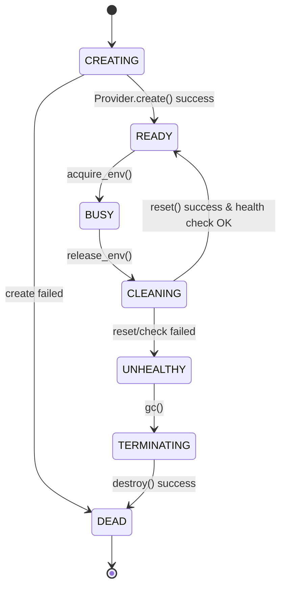

# 详细开发设计文档：[Module-01] 运行时环境管理 (REM)

## 1. 模块功能概述 (Module Overview)

**运行时环境管理 (Runtime Environment Management, REM)** 是 Framework Core 的基础设施模块。它的核心职责是统一**管理底层执行资源 (Execution Resources)** 的全生命周期，包括创建 (Spawn)、池化 (Pool)、租借 (Lease)、健康检查 (Health Check) 与回收 (Reap)。它屏蔽了底层的技术差异（如 Playwright 浏览器进程、HTTP Client Session、Docker Container），向调度器提供标准的 `EnvLease` 对象。

---

## 2. 类设计与接口定义 (Class Design & Interfaces)

### 2.1 核心类图 (Logic View)

```mermaid
classDiagram
    class EnvironmentManager {
        -pool: EnvPool
        -providers: Map[str, SchemaProvider]
        +register_provider(kind, provider)
        +acquire(request: Requirements) -> EnvLease
        +release(lease: EnvLease)
        +run_gc()
    }

    class EnvPool {
        -slots: Map[str, Environment]
        -waiting_queue: PriorityQueue
        -audit_log: List
        +match_and_lease(req) -> Environment
        +return_to_pool(env)
    }

    class BaseProvider {
        <<Abstract>>
        +create(config) -> Environment
        +health_check(env) -> bool
        +reset(env)
        +destroy(env)
    }

    class PlaywrightProvider {
        -playwright_instance
        +create() 
        +reset(env: Page)
    }

    class Environment {
        +id: str
        +kind: EnvKind
        +status: EnvStatus
        +metadata: dict
        +handle: Any (Process/Context)
        +lease_info: LeaseRecord
    }

    class EnvLease {
        +lease_id: str
        +env: Environment
        +token: str
        +verify_token()
    }

    EnvironmentManager --> EnvPool
    EnvironmentManager --> BaseProvider
    BaseProvider <|-- PlaywrightProvider
    EnvPool o-- Environment
```



### 2.2 核心类定义 (Pseudo-code)

#### 2.2.1 Environment (Data Entity)

```python
from enum import StrEnum
from pydantic import BaseModel, Field
from typing import Any, Optional

class EnvStatus(StrEnum):
    CREATING = "creating"
    READY = "ready"      # 空闲，在池中
    BUSY = "busy"        # 已租出，正在执行任务
    CLEANING = "cleaning" # 归还中/重置中
    UNHEALTHY = "unhealthy"
    TERMINATING = "terminating"
    DEAD = "dead"

class Environment(BaseModel):
    id: str
    kind: str  # browser, http, desktop
    provider: str # e.g., "playwright_local"
    status: EnvStatus = EnvStatus.CREATING
    
    # 物理句柄，不序列化存储，仅内存持有
    # 例如 Playwright BrowserContext 对象
    handle: Any = Field(default=None, exclude=True)
    
    # 元数据，描述环境能力，如 {'ip': '1.2.3.4', 'fingerprint': 'windows_chrome'}
    capabilities: dict = {} 
    
    created_at: int
    updated_at: int

class EnvLease(BaseModel):
    id: str  # UUID
    env_id: str
    task_run_id: str
    acquired_at: float
    token: str # 安全令牌，防止越权释放
```

#### 2.2.2 EnvironmentManager (Service Facade)

```python
class EnvironmentManager:
    async def startup(self):
        """初始化，启动 GC task，加载 providers"""
        pass

    async def register_provider(self, kind: str, provider: BaseProvider):
        """注册具体实现，如 BrowserProvider"""
        pass

    async def acquire_env(self, request: EnvRequirement) -> EnvLease:
        """
        核心方法：
        1. 检查 Pool 中是否有匹配的 READY 环境 (tags匹配)
        2. 若有 -> 锁定状态 -> 返回 Lease
        3. 若无 -> 检查配额 -> 调用 Provider.create() -> 入池 -> 返回 Lease
        4. 若无且满 -> 抛出 EnvBusyError 或入队等待
        """
        pass

    async def release_env(self, lease: EnvLease, dirty: bool = False):
        """
        核心方法：
        1. 验证 token
        2. 将 Environment 状态置为 CLEANING
        3. 调用 Provider.reset(env) (如关闭 Page, 清除 Cookies)
        4. 健康检查 Check
        5. 成功 -> 置为 READY; 失败/Dirty -> 置为 UNHEALTHY/DEAD
        """
        pass
```

#### 2.2.3 BaseProvider (SPI Interface)

```python
class BaseProvider(ABC):
    @abstractmethod
    async def create_env(self, config: dict) -> Environment:
        """创建一个物理环境，返回包装对象"""
        pass
        
    @abstractmethod
    async def reset_env(self, env: Environment) -> bool:
        """重置环境状态 (清理 Cache/Cookies, 关闭多余 Tag)"""
        pass
        
    @abstractmethod
    async def health_check(self, env: Environment) -> bool:
        """检查环境是否存活且可用"""
        pass
        
    @abstractmethod
    async def destroy_env(self, env: Environment):
        """销毁物理资源 (kill process)"""
        pass
```

---

## 3. 数据库设计 (Database Design)

虽然环境大部分是**内存对象 (Volatile)**，但为了**崩溃恢复 (Crash Recovery)**，我们需要将 Environment 的元数据与状态持久化到 SQLite。

### 3.1 `environments` 表

用于记录当前所有受管环境的状态。系统启动时需扫描此表，将 `BUSY` 状态的环境标记为“崩溃残留”并执行清理。

| 字段名 | 类型 | 约束 | 不可空 | 描述 |
| :--- | :--- | :--- | :--- | :--- |
| `id` | VARCHAR(64) | PK | Y | 环境唯一 ID (UUID) |
| `kind` | VARCHAR(32) | | Y | browser / http |
| `provider` | VARCHAR(64) | | Y | 提供者标识 |
| `status` | VARCHAR(32) | | Y | mapping to EnvStatus |
| `lease_id` | VARCHAR(64) | INDEX | N | 当前租约 ID (若 BUSY) |
| `task_run_id` | VARCHAR(64)| INDEX | N | 关联的任务运行 ID |
| `created_at` | BIGINT | | Y | 创建时间戳 |
| `updated_at` | BIGINT | | Y | 最后状态变更时间 |
| `meta_json` | TEXT | | N | JSON 存储 capabilities 和 tags |

### 3.2 SQL 定义

```sql
CREATE TABLE environments (
    id TEXT PRIMARY KEY,
    kind TEXT NOT NULL,
    provider TEXT NOT NULL,
    status TEXT NOT NULL,
    lease_id TEXT,
    task_run_id TEXT,
    created_at INTEGER NOT NULL,
    updated_at INTEGER NOT NULL,
    meta_json TEXT -- {"browser": "chromium", "proxy": "..."}
);

CREATE INDEX idx_env_status ON environments(status);
CREATE INDEX idx_env_task ON environments(task_run_id);
```

---

## 4. 业务流程逻辑 (Business Logic)

### 4.1 环境生命周期状态机



### 4.2 崩溃恢复流程 (Crash Recovery Logic)

当 Core 重启时，内存状态丢失，物理进程可能变成僵尸。
**流程**:
1. `EnvironmentManager.startup()` 连接 SQLite。
2. 查询 `SELECT * FROM environments WHERE status IN ('BUSY', 'CLEANING', 'CREATING')`。
3. 遍历这些“非稳态”环境：
   - 判定为 **Zombie (僵尸)**。
   - 记录警告日志: `Found zombie env {id} leased to task {task_run_id}`.
   - 尽管物理句柄丢失，但仍尝试调用清理逻辑（可能涉及通过 PID 杀进程，或调用 Docker API 强删）。
   - 更新 DB 状态为 `DEAD`。
   - 触发事件 `ENV_RECOVERED`，通知调度器标记对应任务为 FAILED。

### 4.3 垃圾回收 (Garbage Collection)

后台协程 `_gc_loop` 每隔 60s 运行一次：
1. 扫描 `UNHEALTHY` 和 `DEAD` 状态的环境，执行物理销毁（如果尚未销毁），并从 DB 删除记录。
2. 扫描 `READY` 状态但 `idle_time > max_idle_ttl` 的环境，执行缩容逻辑（Scale Down），销毁以释放系统资源。
