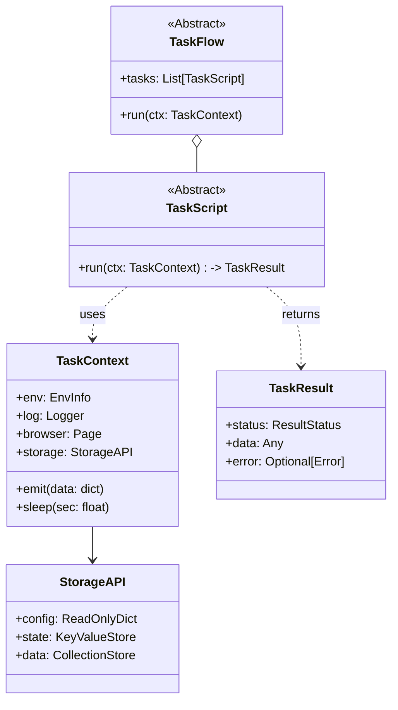

# 详细开发设计文档：[Module-05] SDK - 核心契约与开发套件

## 1. 模块功能概述 (Module Overview)

**SDK (Software Development Kit)** 是连接 Framework Core 与 Modules 的唯一契约层。它定义了 Python 包 `crawler4j-sdk` 的公开 API，目标是让模块开发者(User)能够独立于 Core 开发业务逻辑，同时让 Core(System)能够以统一的方式调度任何模块。SDK 严格遵循 **SemVer** 语义化版本控制。

---

## 2. 类设计与接口定义 (Class Design & Interfaces)

### 2.1 核心类图 (Logic View)



### 2.2 核心类定义 (Contracts)

**注意**: 所有 SDK 类必须是纯 Python 实现，不依赖 Core 的任何内部模块。

#### 2.2.1 TaskContext (Context Injection)

```python
from abc import ABC, abstractmethod
from typing import Any, Optional, Dict
from playwright.async_api import Page, BrowserContext

class StorageInterface(ABC):
    @property
    @abstractmethod
    def config(self) -> Dict[str, Any]: ...
    
    @property
    @abstractmethod
    def state(self) -> 'KeyValueStoreInterface': ...
    
    @property
    @abstractmethod
    def data(self) -> 'DataStoreInterface': ...

class TaskContext:
    def __init__(self, 
                 task_run_id: str, 
                 page: Optional[Page], 
                 storage: StorageInterface,
                 logger: Any):
        self._task_run_id = task_run_id
        self.page = page  # Playwright Page Object
        self.storage = storage
        self.log = logger

    async def emit(self, data: Dict[str, Any], collection: str = "default"):
        """语法糖：发送数据到 data store"""
        await self.storage.data.emit(collection, data)

    async def screenshot(self, name: str = None) -> str:
        """帮助方法: 截图并保存到 Artifacts 目录"""
        pass
```

#### 2.2.2 TaskScript (Atomic Unit)

```python
from abc import ABC, abstractmethod

class TaskScript(ABC):
    """
    开发者继承此类编写具体的业务逻辑。
    """
    class Meta:
        name: str          # 唯一标识，如 'ctrip.login'
        version: str = "1.0"
        timeout: int = 300 # 秒

    @abstractmethod
    async def run(self, ctx: TaskContext) -> TaskResult:
        """
        核心入口。
        :param ctx: 运行时上下文，包含浏览器句柄与存储接口
        :return: 任务结果
        """
        pass

    async def on_error(self, ctx: TaskContext, error: Exception):
        """Hook: 异常处理 (可选)"""
        pass
```

#### 2.2.3 TaskResult (Generic Result)

```python
from enum import StrEnum
from pydantic import BaseModel

class ResultStatus(StrEnum):
    SUCCESS = "success"
    FAILED = "failed"
    RETRY_NEEDED = "retry_needed"

class TaskResult(BaseModel):
    status: ResultStatus
    data: Optional[Dict[str, Any]] = None # 结构化产出
    error_message: Optional[str] = None
```

---

## 3. 命令行工具设计 (CLI Design)

SDK 提供 `crawler4j` 命令行工具，帮助快速开始。

### 3.1 `init` 命令
`uv run crawler4j init my_project`
*   创建标准目录结构：
    ```text
    my_project/
    ├── module.yaml        # Manifest
    ├── workflows/         # 存放 TaskFlow
    ├── tasks/             # 存放 TaskScript
    └── ui/                # UI 扩展
    ```

### 3.2 `validate` 命令
`uv run crawler4j validate .`
*   检查 `module.yaml` schema。
*   静态分析 Python 代码，确保 `TaskScript` 子类实现了 `run` 方法。
*   检查 SDK 版本约束。

---

## 4. 业务流程逻辑 (Interaction Logic)

### 4.1 异常传递机制

SDK 内部不吞噬异常，而是将其包装后向外抛出，由 Core 捕获。

```python
# In TaskScript.run
try:
    await ctx.page.goto("...")
except PlaywrightTimeoutError as e:
    # 开发者可以选择处理
    ctx.log.warning("Timeout, retrying...")
    return TaskResult(status=ResultStatus.RETRY_NEEDED)
except Exception as e:
    # 或者直接抛出，由 Core 处理兜底
    raise TaskExecutionError("Critical failure") from e
```

### 4.2 数据流向

Module 代码 -> `ctx.storage` (SDK Interface) -> `StorageService` (Core Implementation) -> `SQLite`

SDK 中不仅定义 Interface，还提供 **Mock 实现** (`MockStorage`)，方便开发者在不依赖 Core 的情况下进行单元测试。

```python
# Unit Test Example
async def test_my_task():
    ctx = MockTaskContext()
    task = MyTask()
    result = await task.run(ctx)
    assert result.status == "success"
    assert ctx.storage.data.emitted_docs[0]['price'] == 100
```
