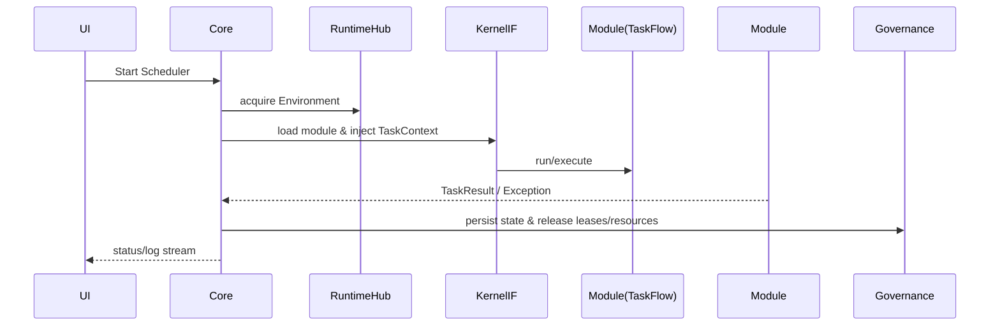
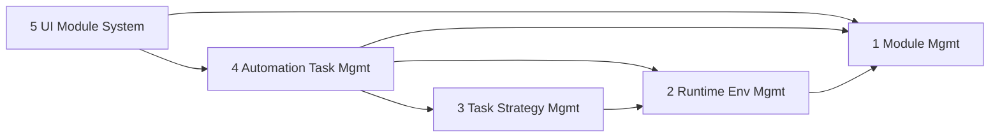
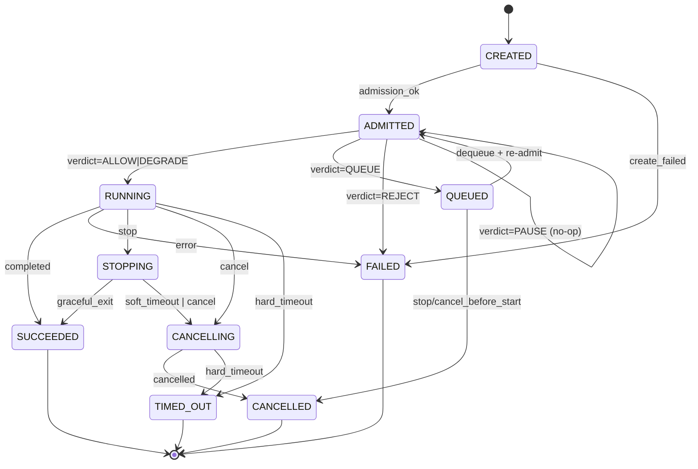
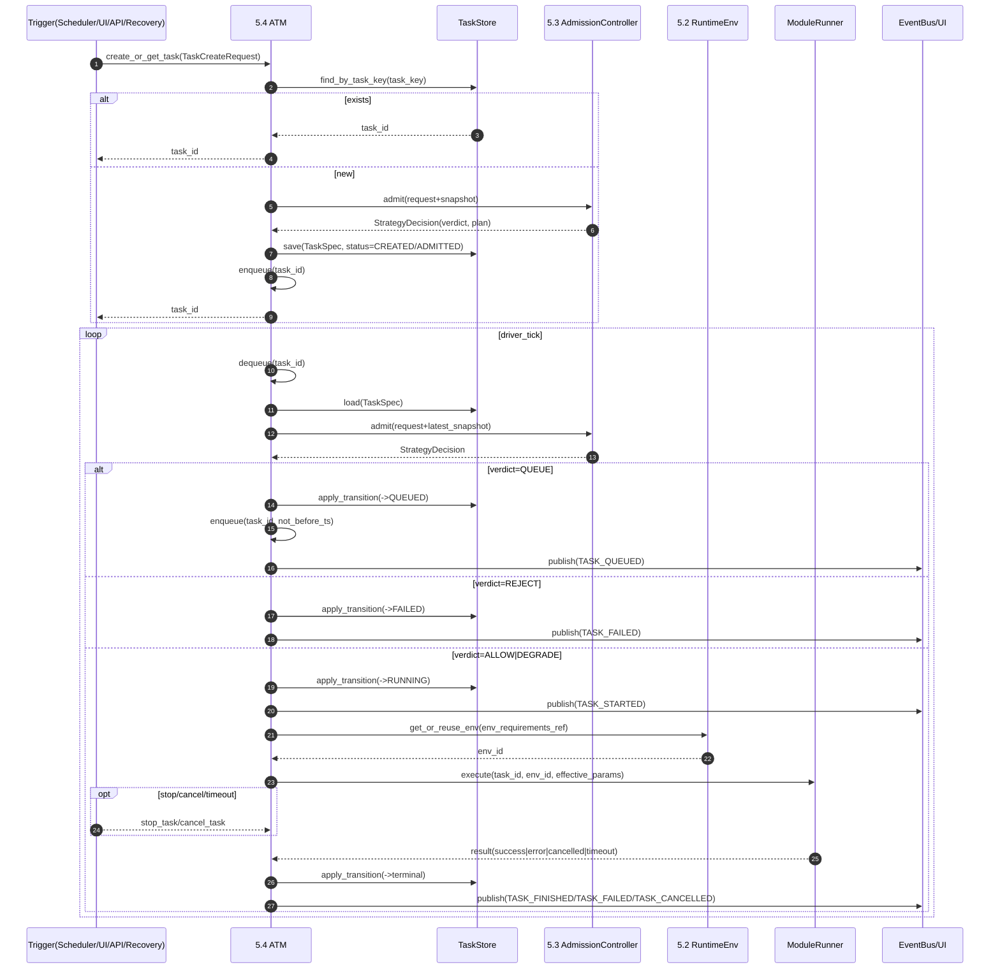

# Crawler4j《系统需求与功能规格说明书》（SRS/FSD）

> 约定：后续所有章节编制均在本文件中增量完善（使用 `apply_patch` 追加/修改）。

---

## 第 1 章 文档控制信息（Document Control）

### 1.1 文档目的与适用范围

#### 1.1.1 文档目的

本《系统需求与功能规格说明书》（SRS/FSD）用于对 **Crawler4j** 平台进行一致、可审计的需求与规格定义，作为项目 **开发、测试、发布与维护** 的权威参考依据。

该文档的主要作用包括（但不限于）：

- **统一口径**：对三层架构（Framework Core / SDK / Modules）给出统一的职责边界、接口契约、数据与状态模型。
- **指导实现**：为研发提供可落地的功能拆解、接口定义、数据流与错误处理要求，降低实现偏差。
- **指导测试**：为测试团队提供可追溯的验收标准、用例设计依据与失败注入点。
- **支持运维**：为运行监控、排障与升级迁移提供约束、运行手册要点与兼容性规则。

#### 1.1.2 适用范围（Scope）

本规格说明书覆盖 Crawler4j 在“微内核 + SDK + 插件/模块”的体系下，**从总体架构到子项目自包含规格** 的全部内容，包含：

- **系统级**：总体架构、关键概念、系统边界、外部依赖与横切关注点。
- **子项目级（自包含）**：
  - Framework Core：架构设计、功能规格、数据模型与持久化、错误处理与可靠性、非功能需求、测试与验收、部署发布与运维。
  - SDK：同上（以 API 契约稳定性与开发者体验为重点）。
  - Modules：同上（以模块规范、业务流程建模、业务模块目录与扩展位为重点）。

#### 1.1.3 不在范围内（Out of Scope）

以下内容不作为本规格说明书的强制覆盖范围（如需可在后续专项文档补充）：

- 具体站点的页面结构、选择器细节与反爬策略细节（属于各业务模块的实现文档/代码注释范畴）。
- 第三方服务本身的 SLA/合规条款（如指纹浏览器/接码平台的服务条款）。
- 与业务无关的组织流程制度（如人事审批、采购流程等）。

### 1.2 读者对象与使用方式

#### 1.2.1 目标读者

本规格说明书面向以下角色（按典型关注点划分）：

- **架构/核心研发（Core Maintainers）**：关注 Core 子项目的资源治理、调度与隔离、GUI 异步模型、全局可靠性。
- **SDK 维护者（SDK Maintainers）**：关注 API 契约、兼容性策略、CLI 与脚手架质量、类型标注与可测试性。
- **业务模块开发者（Module Developers）**：关注 Modules 规范、TaskScript/TaskFlow 开发模板、错误处理与可恢复执行。
- **测试/质量（QA/QE）**：关注验收标准、测试矩阵、失败注入、回归策略与可追溯性。
- **运维/值守（Ops）**：关注运行依赖、发布方式、日志与审计、排障路径、升级与迁移。
- **安全审计/合规（Security/Compliance）**：关注沙箱与隔离边界、危险能力限制、敏感数据脱敏与审计。

#### 1.2.2 阅读指南（如何快速定位你需要的内容）

- 想理解系统全貌：优先阅读 **第 3 章 总体架构**。
- 负责 Core：阅读 **第 5 章 Framework Core 子项目**（含架构/功能/可靠性/运维）。
- 负责 SDK：阅读 **第 6 章 SDK 子项目**（重点：API、兼容性、CLI、测试）。
- 负责业务模块：阅读 **第 7 章 Modules 子项目** 与对应业务模块小节（如 Ctrip）。
- 负责测试：以各子项目的“测试规格与验收标准”章节为主，并回溯到其“功能规格/数据契约”。

#### 1.2.3 使用方式（作为“权威参考”的规则）

- 本文档与代码同仓库管理，**以 Git 版本控制** 为准；任何影响对外契约/行为的变更应同步更新本文档。
- 当本文档与实现不一致时：
  - 若实现为既定事实但未记录：应补齐规格说明并标注变更原因。
  - 若实现偏离规格：应提交修复实现或调整规格，并在变更记录中说明。
- 本文档中的规范性关键词（MUST/SHOULD/MAY 等）具备约束力；违反 MUST/MUST NOT 的实现应视为缺陷或必须的技术债。

### 1.3 版本历史与变更记录

#### 1.3.1 版本编号规则

本文档版本遵循 **语义化版本（SemVer 2.0.0）** 的思想，采用 `MAJOR.MINOR.PATCH`：

- **MAJOR**：发生破坏性变更（Breaking Change），例如：
  - 子项目契约（SDK API、模块加载规范、数据契约）发生不兼容调整；
  - 系统关键概念/边界被重定义，导致既有模块无法按原方式运行。
- **MINOR**：新增向后兼容的能力/规格，例如：新增模块规范、扩展点、可选字段与新流程。
- **PATCH**：不改变外部行为的修订，例如：措辞澄清、示例完善、错别字修复、补充测试点。

> 建议：文档版本可与产品版本保持同一节奏发布；若产品版本策略另有规定，可在发布流程中建立“对应关系表”。

#### 1.3.2 变更流程与审批机制

- 所有变更通过 **Pull Request（PR）** 进入主分支；PR 描述必须注明：变更动机、影响范围、是否 Breaking。
- 变更需要至少以下角色之一审阅通过：
  - Core 相关：Core Maintainer/架构负责人
  - SDK 相关：SDK Maintainer
  - Modules 规范相关：模块负责人/架构负责人
  - 影响测试与验收：QA 负责人
- 若变更涉及外部接口/数据契约：必须补齐“兼容性说明”与“迁移建议”。

#### 1.3.3 版本历史（Change Log）

| 文档版本 | 日期       | 变更类型 | 变更摘要                                            | 影响范围 | 兼容性备注   |
| -------- | ---------- | -------- | --------------------------------------------------- | -------- | ------------ |
| 0.1.0    | 2026-01-08 | INIT     | 建立文档骨架与总体架构章节；补齐第 1 章文档控制信息 | 全局     | 无破坏性变更 |

### 1.4 术语规范（MUST/SHOULD/MAY）

#### 1.4.1 规范性关键词的来源

本文档中的规范性关键词采用 **RFC 2119** 与 **RFC 8174** 的定义（当且仅当使用大写形式时具备规范性约束）。

#### 1.4.2 关键词定义

- **MUST / SHALL / REQUIRED**：必须满足；不满足即视为不符合规格。
- **MUST NOT / SHALL NOT**：绝对禁止；出现即视为违反规格。
- **SHOULD / RECOMMENDED**：强烈建议；允许存在例外，但必须给出充分理由并记录。
- **SHOULD NOT / NOT RECOMMENDED**：强烈不建议；若采用必须说明原因并评估风险。
- **MAY / OPTIONAL**：可选；实现可支持也可不支持，但若支持必须按本文档约束实现。

#### 1.4.3 本文档的附加标记约定

- **[GAP]**：表示“理想模型/规格”与“当前实现”存在差距，需要补齐实现或调整设计。
- **[RISK]**：表示已知风险点（性能/稳定性/合规/安全），需要在测试或运维中重点关注。
- **[TODO]**：表示明确的后续工作项（不作为“待补充内容”的占位标记使用）。

#### 1.4.4 术语一致性要求

- 文档中关于关键对象（Environment/Profile/Process、TaskScript/TaskFlow/TaskContext、Module/Plugin/Hook）的命名必须与代码与 UI 展示保持一致。
- 当同一概念存在别名时，必须在首次出现处给出“首选术语 + 别名”。

### 1.5 参考资料索引

#### 1.5.1 仓库内参考资料（Repo References）

- `README.md`：项目总体介绍与快速入门
- `spec/SYSTEM_DEEP_DESIGN_WHITEPAPER.md`：微内核深度建模白皮书（设计哲学与 GAP 分析）
- `crawler4j_sdk/README.md`：SDK 使用说明
- `crawler4j_sdk/`：SDK 源码（TaskScript/TaskContext/TaskResult/CLI 等）
- `src/`：Core 源码（调度、环境管理、插件系统、GUI）
- `modules/`：内置业务模块示例
- `migrations/`：数据库迁移脚本与版本演进
- `pyproject.toml` / `uv.lock`：依赖与构建配置（以 uv 为准）

#### 1.5.2 外部技术文档与标准（External References）

- RFC 2119：Key words for use in RFCs to Indicate Requirement Levels
- RFC 8174：Ambiguity of Uppercase vs Lowercase in RFC 2119 Key Words
- Semantic Versioning 2.0.0（SemVer）：版本编号与兼容性约定
- Python 3.12 官方文档：语言特性、类型标注、异步模型
- uv 官方文档：Python 环境与依赖管理
- Playwright for Python 官方文档：异步浏览器自动化
- PyQt6 官方文档：GUI 框架
- qasync 项目文档：Qt 事件循环与 asyncio 集成
- APScheduler 官方文档：调度框架（如项目启用/兼容该能力）
- SQLite 官方文档：本地数据库

> 注：外部参考链接建议在发布时补充为可点击 URL；本节首先保证“名称 + 可检索性”。

### 1.6 规格书写模板（递归展开模板）

#### 1.6.1 模块职责与边界（Responsibility & Boundary）

每个章节/子模块在编制时 MUST 给出：

- **模块职责**：该模块“负责什么、不负责什么”。
- **边界与依赖**：允许依赖的上/下游模块与禁止的越层依赖（例如 Modules 禁止直接依赖 `src.*`）。
- **输入输出**：该模块对外提供的能力、对外承诺的行为，以及被上游调用的前置条件。
- **不变量（Invariants）**：模块运行期间必须始终成立的条件（例如：资源回收必须可达）。

输出格式建议：用“职责清单 + 边界清单 + 非目标清单”的结构。

#### 1.6.2 对外接口定义（Interfaces）

对外接口定义 MUST 包含：

- **接口类型**：API（类/方法）、事件/信号、CLI 命令、GUI 交互点、配置接口。
- **接口签名**：输入参数、类型/约束、返回值、同步/异步语义。
- **调用约束**：调用方身份、调用时机、幂等性、并发与线程/协程安全要求。
- **失败语义**：错误码/异常类型、重试建议、是否会触发熔断/降级。

若接口属于 SDK 或跨模块契约：必须显式标注“稳定性等级”（稳定/试验/废弃）。

#### 1.6.3 输入/输出与数据契约（Data Contract）

数据契约 MUST 说明：

- **数据结构**：字段、类型、是否必填、默认值、取值范围、枚举值。
- **语义与来源**：字段含义、产生时机、消费方、生命周期。
- **序列化/持久化**：是否需要可序列化（JSON）、写入表/文件的位置、索引与查询维度。
- **敏感数据**：哪些字段需要脱敏/加密/审计（如账号、token、手机号）。

建议为关键对象提供“示例实例（Example Payload）”，并注明是否为稳定契约。

#### 1.6.4 关键流程与数据流向（Flow & Dataflow）

流程描述 MUST 覆盖：

- **主流程**：从触发条件到完成的端到端路径。
- **分支与异常路径**：超时、资源不足、加载失败、外部依赖失败等。
- **状态变化**：关键状态机或阶段（Stage）迁移条件；必要时给出时序图/状态图。
- **数据流向**：输入从何而来、经由哪些模块转换、最终输出到哪里（UI/DB/文件/外部系统）。

要求：流程拆解到“最小可测试单元”，保证 QA 可据此直接设计用例与断言点。

#### 1.6.5 错误处理与恢复策略（Error Handling & Recovery）

错误处理 MUST 包含：

- **错误分类**：可重试/不可重试/需人工介入/需熔断；并说明判定依据。
- **恢复策略**：重试次数与退避、回滚/补偿动作、资源回收策略（必须可达）。
- **失败传播**：错误如何从 Modules→SDK→Core→UI 传播，谁负责最终决策与告警。
- **崩溃恢复**：重启后如何处理残留状态（锁、未回收资源、未完成记录）。

要求：明确“失败时的系统安全状态”（Fail-safe State），避免资源泄漏与死锁。

#### 1.6.6 日志/指标/审计（Observability）

可观测性章节 MUST 定义：

- **日志规范**：最小字段集合（建议：`env_id`、`module_name`、`task_name/workflow_id`、阶段、错误摘要）。
- **指标/统计**（如适用）：并发槽位利用率、成功率、失败类型分布、平均耗时、重试次数。
- **审计事件**：哪些操作必须落审计（启动/停止、环境创建/销毁、账号封禁判定、迁移执行）。
- **UI 展示策略**：高频日志不得阻塞主线程，需异步队列与批量刷新。

要求：定义“排障最短路径”，即出现故障时应优先查看哪些日志/指标。

#### 1.6.7 安全与隔离（Sandbox/权限/依赖边界）

安全与隔离 MUST 描述：

- **权限边界**：哪些能力可暴露给 Modules，哪些必须由 Core 独占（例如环境管理、模块加载）。
- **沙箱策略**：危险导入/危险调用限制（静态检查 + 运行时约束的组合），以及违规时的处理方式。
- **数据隔离**：临时目录、缓存、日志、账号数据的隔离与访问范围。
- **第三方依赖风险**：外部服务调用的超时、失败回退、敏感信息泄露风险控制。

要求：每个子项目至少提供一份“安全基线清单（Baseline Checklist）”。

#### 1.6.8 测试点与验收标准（Test Cases & Acceptance）

测试与验收 MUST 包含：

- **测试分层**：unit/integration/e2e/manual 的覆盖范围与边界。
- **关键用例矩阵**：按功能点列出必须覆盖的 happy path 与失败路径。
- **失败注入**：断网、超时、外部服务不可用、崩溃恢复、资源不足等。
- **验收口径**：明确可量化的通过条件（成功率、耗时阈值、资源回收、日志完整性）。

要求：建立“需求—测试用例”可追溯关系（Traceability），并在各子项目附录中维护。

---

## 第 2 章 系统概述（System Overview）

### 2.1 项目背景与问题域定义

#### 2.1.1 背景

Crawler4j 面向“以浏览器为载体的自动化任务”场景：需要在本地/桌面端稳定运行多个任务，并对账号、代理、指纹环境、浏览器进程等资源进行治理。

在此类场景中，业务需求通常以“站点/流程”为单位快速迭代，而底层执行与治理能力（环境生命周期、并发调度、失败恢复、隔离安全、可观测性）需要保持稳定、可复用与可审计。

#### 2.1.2 问题域（Problem Domain）

本系统聚焦解决以下核心问题：

- **执行问题**：如何以统一的契约描述“原子动作（TaskScript）”与“业务编排（TaskFlow）”，并可靠地执行。
- **资源治理问题**：如何管理 Environment/Profile/Process 的生命周期与回收，避免资源泄漏与僵尸进程。
- **调度问题**：如何在多任务并发下做“需求—供给”撮合（任务需求 ↔ 环境/账号/并发槽位供给），并支持背压。
- **工程化问题**：如何为模块开发者提供稳定 SDK、脚手架与校验工具，降低实现偏差。
- **可靠性问题**：如何定义一致的错误语义、重试/回退/熔断策略，并支持断点恢复。

#### 2.1.3 约束与典型挑战

- 任务执行依赖第三方组件（浏览器、自动化驱动、指纹环境），存在不确定性与失败噪声。
- 模块侧业务逻辑频繁变化，必须与 Core 的治理能力隔离，避免“业务侵入内核”。
- GUI 需要可视化状态与日志，但 **MUST NOT** 阻塞核心执行链路。

### 2.2 系统目标与非目标

#### 2.2.1 系统目标（Goals）

系统目标 MUST/SHOULD 定义如下：

- **G1（MUST）统一契约**：提供清晰稳定的 SDK 契约（TaskScript/TaskFlow/TaskContext/TaskResult），并作为 Modules 与 Core 的唯一交互边界。
- **G2（MUST）资源可控**：Environment/Profile/Process 生命周期必须可治理、可回收、可观测，出现异常时可收敛至 fail-safe 状态。
- **G3（MUST）可调度**：支持可配置的并发、优先级与背压策略，实现任务需求与资源供给的撮合。
- **G4（MUST）可恢复**：对可重试失败提供可配置重试与退避；对不可重试失败给出明确错误语义与处置路径；支持崩溃后的状态恢复。
- **G5（SHOULD）可审计**：关键操作（启动/停止、环境创建/销毁、账号风控判定、迁移执行）应产生日志与审计事件，并具备可追溯关联（env_id/workflow_id 等）。
- **G6（SHOULD）开发者体验**：提供 CLI/模板/校验，帮助模块开发者快速生成符合规范的工程结构。

#### 2.2.2 非目标（Non-goals）

以下能力明确不作为系统必须达成的目标：

- **NG1**：不承诺对任何特定站点的“长期可用性”或绕过反爬策略的效果；站点对抗属于各业务模块的实现与运营范畴。
- **NG2**：不提供通用的分布式集群调度与多机资源池（本阶段以桌面/单机运行为主）。
- **NG3**：不内置统一“账号/代理/指纹”商业服务，系统仅提供接入与治理边界。
- **NG4**：不提供通用数据中台/BI；仅提供任务结果与运行状态的持久化与导出能力。

#### 2.2.3 成功指标（可验收口径示例）

验收口径 SHOULD 具备可度量性，建议至少包含：

- 任务执行成功率、失败类型分布、平均/分位耗时（P50/P90）。
- 环境与进程回收的可达性（例如：任务结束后 N 秒内无残留进程/锁/临时目录）。
- 崩溃恢复能力（例如：重启后能够识别并清理“未完成环境”，并恢复可继续执行的任务队列）。

### 2.3 系统边界与上下游依赖

#### 2.3.1 系统边界（System Boundary）

Crawler4j 系统由以下三部分构成：

- **Framework Core**：微内核与运行底座（调度、治理、隔离、GUI、可观测性汇聚）。
- **SDK**：对外契约与开发工具（稳定 API + CLI/校验/模板）。
- **Modules**：业务模块（站点/流程实现）。

系统边界 MUST 满足：Modules 仅通过 SDK 与 Core 交互，Modules **MUST NOT** 直接依赖 `src.*`。

#### 2.3.2 上游依赖（Upstream Dependencies）

系统运行依赖的关键上游能力包括（按类别列举）：

- **运行时与构建**：Python 运行时、uv（环境与依赖管理）。
- **浏览器自动化**：Playwright（或同类自动化组件），用于驱动浏览器与页面交互。
- **桌面 GUI**：PyQt6 + qasync（用于异步 UI 刷新与事件循环整合）。
- **本地存储**：SQLite（用于状态/结果持久化，或作为默认实现）。

可选依赖 MAY 包括：指纹浏览器/虚拟浏览器服务、验证码处理服务、代理/网络服务等。对这些服务的稳定性与 SLA 不由本系统承诺，但系统 MUST 提供超时、失败回退与降级语义。

#### 2.3.3 下游对象（Downstream Consumers）

- **模块开发者**：使用 SDK 编写业务模块与工作流。
- **运维/值守**：通过 GUI/日志/状态库进行运行监控、排障与升级。
- **测试/质量**：依据本规格的验收口径与可追溯关系设计用例。

#### 2.3.4 数据边界与权限边界（概述）

- 系统必须区分 **运行态数据**（状态、日志、指标）与 **敏感配置**（账号、token、代理凭证）。
- 对敏感字段 SHOULD 进行脱敏展示与审计记录；具体加密与密钥管理方案在各子项目“安全基线清单”中定义。

### 2.4 关键概念总览

本节用于对跨章节反复出现的核心概念给出统一定义（术语必须与代码/GUI 展示一致）。

| 概念           | 定义（简述）                                               | 所属层      | 关键约束/备注                   |
| -------------- | ---------------------------------------------------------- | ----------- | ------------------------------- |
| Framework Core | 微内核与运行治理层，负责调度、资源生命周期、隔离、GUI 汇聚 | Core        | 不理解业务语义（Agnostic Core） |
| SDK            | 对外稳定契约与开发工具包                                   | SDK         | 必须可独立发布；不反向依赖 Core |
| Module         | 业务模块（站点/流程实现）                                  | Modules     | 仅依赖 SDK；不得导入 `src.*`    |
| Plugin/Hook    | 可插拔扩展点（可选）                                       | Core/SDK    | 需定义加载顺序、隔离与失败语义  |
| TaskScript     | 原子任务契约（可执行动作单元）                             | SDK/Modules | 输入输出、失败语义必须明确      |
| TaskFlow       | 工作流编排契约（多个 TaskScript 的有序/条件组合）          | SDK/Modules | 需定义状态迁移与断点恢复点      |
| TaskContext    | 执行上下文与能力注入（如 logger、存储、环境句柄）          | SDK/Core    | 作为 Modules 获取能力的唯一入口 |
| TaskResult     | 结果模型（成功/失败/部分成功 + 产物）                      | SDK         | 需可序列化/可持久化             |
| Environment    | 隔离运行单元（浏览器上下文、代理、临时目录等）             | Core        | 必须可回收；具有 env_id         |
| Profile        | 与环境绑定的指纹/画像配置                                  | Core        | 可选依赖第三方能力；需可审计    |
| Process        | 进程实体（浏览器/驱动等）及其治理                          | Core        | 必须处理僵尸进程与泄漏          |
| Runtime Hub    | 环境生命周期闭环：Spawn/KeepAlive/Kill                     | Core        | 需提供 fail-safe 回收路径       |
| Scheduler Slot | 并发槽位/配额抽象                                          | Core        | 支持背压与资源不足的明确语义    |
| State Store    | 状态持久化（任务/环境/执行记录）                           | Core        | 支持恢复与追溯                  |

---

## 第 3 章 总体架构（Top-level Architecture）

### 3.1 三层架构总览：Framework Core + SDK + Modules

**Framework Core（框架核心）**：系统“微内核”与桌面端运行底座，负责资源与生命周期治理、调度与执行编排、模块加载与隔离、GUI 与可观测性汇聚。

- 典型目录：`src/core/`、`src/plugins/`、`src/ui/`、`src/automation/`

**SDK（开发工具包）**：面向模块开发者的能力桥/契约层，提供稳定 API：`TaskScript`/`TaskFlow`/`TaskContext`/`TaskResult`/CLI。

- 典型目录：`crawler4j_sdk/`（可独立发版）

**Modules（任务模块）**：具体业务逻辑（如 Ctrip），以 TaskScript/TaskFlow 组织业务动作与流程；通过 SDK 与 Core 交互。

- 典型目录：`modules/<module_name>/`

**依赖方向 MUST：**

- Modules **MUST ONLY** 依赖 SDK（`crawler4j_sdk`），**MUST NOT** 直接导入 `src.*`
- Core **MAY** 依赖 SDK（用于创建/注入 `TaskContext`、执行契约），但 **MUST NOT** 含业务语义
- SDK **MUST NOT** 反向依赖 Core（避免循环依赖，确保可独立发布）

**职责边界判定法（用于评审/测试分层）：**

- “如何跑得稳/怎么管资源/怎么调度/怎么加载隔离” → Core
- “模块开发者怎么调用/怎么编排/怎么拿能力/怎么返回结果” → SDK
- “具体站点/业务流程怎么点填/验证码/风控封禁” → Modules

---

### 3.2 微内核建模与职责边界审计（Microkernel, Agnostic Core）

**不可知论原则：**Core 不理解业务名词；它只治理三类原子资源与其闭环：

- **Environment（环境）**：一次任务执行的隔离运行单元（浏览器上下文、代理、临时目录等；可附带业务侧身份/凭证引用，但由业务模块管理）
- **Profile（指纹/画像）**：与环境绑定的身份与指纹配置（依赖 BitBrowser/VirtualBrowser 能力）
- **Process（进程）**：浏览器/驱动相关进程及其回收（含僵尸进程治理）

**四大闭环能力（Core 逻辑构件）：**

- Runtime Hub：Spawn → KeepAlive → Kill
- Elastic Scheduler：需求（Task/Workflow）↔ 供给（Environment/Slot/Resource）撮合（Resource 为抽象资源，不绑定账号语义）
- Kernel Interface：模块加载（Load）→ 隔离（Sandbox）→ 通信（Bridge/Injection）
- Governance Center：状态持久化（State Store）+ 背压（Backpressure）+ 全局策略（Policy）

---

### 3.3 逻辑组件图（模块视图）

**逻辑组件清单：**

- UI 子系统：用户操作入口、状态可视化、日志流展示（PyQt6 + 异步桥接）
- 调度子系统：并发槽位管理、循环调度、停止与回收
- 环境管理子系统：创建/复用/销毁环境；驱动适配（BitBrowser/VirtualBrowser）
- 插件与模块管理子系统：模块发现/加载/校验/隔离执行；生命周期 hooks
- 数据与治理子系统：运行记录、迁移与恢复、诊断导出与治理策略落地（不包含账号治理；业务侧资源治理由 Modules 负责）
- SDK 子系统：任务契约与 CLI
- 业务模块子系统：业务任务与工作流实现

**关键接口边界（高层契约）：**

- Core → SDK：创建/注入 `TaskContext`；调用 TaskScript/TaskFlow；接收 `TaskResult`
- Modules → SDK：实现 TaskScript/TaskFlow；使用 `TaskContext` 能力（page/http/db/logger/state）
- Core ↔ UI：通过事件/信号桥传递状态、日志与错误提示

---

### 3.4 运行时视图（Runtime View）

**主运行链路：**

1. 启动：配置/数据库迁移/日志 → UI 事件循环（qasync）→ 调度器与事件系统
2. 调度：读取并发上限 → 填满槽位 → 等待“槽位释放/停止/超时兜底” → 再补位
3. 撮合：获取环境（浏览器内核/指纹/代理）+ 可选业务资源租约（由业务模块提供，如身份/凭证/配额）
4. 执行：加载模块 → 校验/沙箱 → 创建并注入 `TaskContext` → 运行 Task/Workflow
5. 回收：释放业务资源租约（由业务模块/回调释放）、关闭 page/context、必要时销毁环境并清理残留
6. 同步：日志/状态/错误持续推送到 UI；关键操作写审计/运行记录

（简化时序）



---

### 3.5 部署视图（Deployment View）

- 桌面应用（主形态）：GUI + 本地 DB + 本地日志 + 外部浏览器服务（BitBrowser/VirtualBrowser）
- CLI（辅助形态）：SDK CLI 为主，用于脚手架/校验/构建与排障

**关键外部依赖面：**Playwright（Async）、BitBrowser/VirtualBrowser、本地持久化（SQLite 为主）、验证码/OCR（模块侧常用能力）

---

### 3.6 关键数据对象与标识体系（Data Objects & IDs）

**全局标识 MUST 统一：**

- `env_id`：环境标识（调度、日志、回收主键）
- `task_name`：原子任务标识（TaskScript 唯一名）
- `workflow_id/workflow_name`：工作流标识（TaskFlow 追踪维度）
- `module_name`：模块标识（加载、版本与隔离维度）

**状态域划分：**

- Core 状态域：环境/槽位/资源租约（抽象）/运行记录/失败统计/全局策略状态
- Module 状态域：业务流程中间态（如 `ctx.state`）、业务输出数据
- SDK 状态域：契约级数据结构（Context 能力面、Result 模型），不承载业务状态机

---

### 3.7 横切关注点（Cross-cutting Concerns）

**配置：**Core 配置（并发/调度/浏览器类型/资源上限/日志等）；Modules 配置（业务参数）；敏感信息必须脱敏展示；配置必须可校验。

**可观测性：**日志最小维度建议 `env_id + module_name + task/workflow`；UI 不得被高频日志阻塞（队列/定时刷新）；关键审计事件固化（启动/停止、环境创建/销毁、加载失败、业务侧风控事件上报等）。

**错误与可靠性：**区分“调度失败/环境失败/加载失败/执行失败/外部依赖失败”；启动强力清理残留；执行回收必须走 `try/finally` 语义；停止链路：UI→ 调度停止补位 → 任务响应 stop→ 回收。

**安全与隔离：**加载侧（Core）需具备最小安全基线（危险导入/执行限制 + 运行时约束）；临时目录至少按 env 或模块隔离；模块必须遵守 SDK 边界。

---

## 第 4 章 需求规格总览（Requirements Summary）

### 4.1 用户角色与使用场景

本章从“谁在用 / 怎么用”的角度给出需求总览。角色定义以职责划分为主，**同一人可同时扮演多个角色**（例如核心研发兼任运维）。

#### 4.1.1 用户角色（Actors）

- **R1 终端操作者（Operator）**：通过桌面 UI 发起/停止/观察自动化任务；关注任务状态、日志、失败原因与可恢复性。
- **R2 模块开发者（Module Developer）**：基于 SDK 开发业务模块（TaskScript/TaskFlow），在本地调试、打包、发布；关注契约稳定性与调试体验。
- **R3 Core 维护者（Core Maintainer）**：维护 Core 内核（调度、资源治理、模块加载隔离、状态持久化）；关注稳定性、隔离边界与回归风险。
- **R4 测试/质量（QA/QE）**：基于需求分组构建用例与验收矩阵；关注错误分级、失败注入、可观测性与可追溯性。
- **R5 运维/值守（Ops）**：安装、升级、配置、监控、排障；关注运行依赖、数据落盘、日志与审计、升级兼容。
- **R6 安全/合规（Security/Compliance）**：审查模块加载安全基线、危险能力限制、敏感数据处理与审计链路。

#### 4.1.2 典型使用场景（Use Cases）

为便于后续章节追溯，场景以 UC 编号标记。

- **UC-01 启动应用并加载模块**：启动 Core → 初始化状态存储/日志 → 模块发现与校验 → UI 展示可用模块清单。
- **UC-02 从 UI 发起单个任务/工作流**：选择模块/任务 → 选择策略（或默认）→ 创建任务实例 → 调度执行 → UI 订阅状态与日志。
- **UC-03 任务停止/取消与资源回收**：用户点击停止 → Core 发出 cancel/stop 信号 → 任务响应中断点 → 环境/锁/进程回收 → UI 展示最终态。
- **UC-04 并发执行与背压**：一次发起多个任务 → 策略仲裁并发/优先级 → 环境池供给不足时排队/降级 → UI 告知原因与预计等待。
- **UC-05 环境生命周期治理**：创建/池化环境 → 健康检查 → 异常环境隔离/销毁 → 残留进程清理与告警。
- **UC-06 失败处理与自动恢复**：执行失败 → 归类错误 → 按策略重试/退避/熔断 → 记录可追溯上下文（env_id/task_id）。
- **UC-07 崩溃重启后的状态恢复**：应用异常退出后重启 → 识别未完成任务/孤儿环境 → 清理或恢复队列 → UI 提示恢复结果。
- **UC-08 模块开发、调试与发布**：脚手架创建模块 → 本地运行调试（可注入 mock/录制回放）→ 打包版本 → 被 Core 发现并校验通过。
- **UC-09 运维升级与回滚**：升级 Core/SDK/模块 → 兼容性校验 → 数据迁移（如有）→ 出现问题可回滚到上一版本。

### 4.2 功能需求分组（FR）

功能需求以“可实现/可测试/可追溯”为原则分组，并与第 5 章的 5 个核心模块职责对齐。

> 记号：MUST=必须实现；SHOULD=建议实现；MAY=可选实现。

#### 4.2.1 FR 分组清单（按能力域）

- **FR-MM（模块管理 / Module Management）**：模块发现、加载、隔离、服务注册、生命周期。
- **FR-REM（运行环境管理 / Runtime Environment Management）**：环境创建/池化、健康检查、回收、配额与隔离。
- **FR-TSM（任务策略管理 / Task Strategy Management）**：策略定义、仲裁（需求 ↔ 供给）、背压与重试/退避规则输出。
- **FR-ATM（自动化任务管理 / Automation Task Management）**：任务实例化、状态机、执行驱动、取消停止、持久化与恢复。
- **FR-UI（UI 界面构建 / UI Module System）**：任务操作入口、状态展示、日志流、模块与环境可视化。
- **FR-X（横切能力）**：可观测性、错误语义、安全与合规、数据持久化与导出。

#### 4.2.2 关键功能需求（可追溯条目）

**FR-MM：模块管理**

- **FR-MM-001（MUST）模块发现**：Core 必须能从约定目录（如 `modules/<name>/`）发现模块并生成清单（name/version/capabilities）。
- **FR-MM-002（MUST）加载与校验**：加载前必须进行最小校验（结构、依赖、入口点、SDK 版本约束），失败需可解释且可定位。
- **FR-MM-003（MUST）隔离与边界**：模块运行必须受 SDK 边界约束，禁止直接依赖 Core 内部实现（如 `src.*`）。
- **FR-MM-004（SHOULD）生命周期钩子**：模块应支持 `on_load/on_unload` 等生命周期 hook，用于资源初始化与清理。

**FR-REM：运行环境管理**

- **FR-REM-001（MUST）环境池与生命周期**：支持创建/复用/销毁环境；环境与任务实例必须可关联（`env_id`）。
- **FR-REM-002（MUST）健康检查与隔离**：对异常环境（启动失败、频繁崩溃、不可用）必须隔离并退出池，避免污染后续任务。
- **FR-REM-003（MUST）资源回收兜底**：任务结束/取消/异常时必须回收页面、上下文、进程与临时目录（fail-safe）。
- **FR-REM-004（SHOULD）配额与上限**：支持最大并发环境数、进程数、磁盘临时目录大小等上限。

**FR-TSM：任务策略管理**

- **FR-TSM-001（MUST）策略输入输出**：策略模块必须基于任务需求（优先级/资源约束/业务资源需求（如身份/凭证）等）输出可执行计划（选定 env/slot、重试与退避参数）。
- **FR-TSM-002（MUST）仲裁与背压**：资源不足时必须给出排队/拒绝/降级的明确决定与原因。
- **FR-TSM-003（SHOULD）可插拔策略**：支持按模块/任务选择不同策略实现（例如保守重试、快速失败、限流）。

**FR-ATM：自动化任务管理**

- **FR-ATM-001（MUST）任务实例化**：系统必须将“策略 × 环境 × 业务模块”组合成任务实例并驱动执行（唯一允许的组合点）。
- **FR-ATM-002（MUST）任务状态机**：至少包含 `PENDING/RUNNING/SUCCEEDED/FAILED/CANCELLED`；状态变更必须可订阅。
- **FR-ATM-003（MUST）停止/取消语义**：支持用户停止（graceful）与强制取消（force）；必须有超时兜底。
- **FR-ATM-004（MUST）持久化与恢复**：关键状态（任务元数据、最后心跳、错误摘要、env 绑定）应可落盘，以支持重启恢复与审计。
- **FR-ATM-005（SHOULD）失败处置**：按错误分级触发重试/退避/熔断/降级，并记录决策链路。

**FR-UI：UI 界面构建**

- **FR-UI-001（MUST）任务操作入口**：UI 必须支持发起/停止任务，并展示任务列表与状态。
- **FR-UI-002（MUST）日志与事件流展示**：UI 必须支持按 `task_id/env_id/module` 过滤日志与关键事件。
- **FR-UI-003（SHOULD）模块可视化**：展示模块清单、版本、加载状态、校验失败原因。
- **FR-UI-004（SHOULD）环境可视化**：展示环境池容量、健康状态、异常隔离数量。

**FR-X：横切能力**

- **FR-X-OBS-001（MUST）结构化日志**：日志至少包含 `timestamp/level/task_id/env_id/module_name`，支持关联追踪。
- **FR-X-ERR-001（MUST）错误分级与错误码**：对调度/环境/加载/执行/外部依赖失败给出一致错误语义。
- **FR-X-SEC-001（MUST）最小安全基线**：模块加载必须具备危险能力限制与审计（例如危险导入/执行限制）。
- **FR-X-DATA-001（SHOULD）结果导出**：支持将任务运行记录/结果导出（如 JSON/CSV），并支持脱敏。

### 4.3 非功能需求（NFR）

非功能需求用于约束“质量属性”，并作为测试验收的补充依据。

#### 4.3.1 可靠性与可恢复性

- **NFR-REL-001（MUST）资源不泄漏**：任务结束后必须无残留浏览器进程/锁/临时目录（允许短暂延迟，但需可观测）。
- **NFR-REL-002（MUST）失败可归因**：失败必须可定位到错误类别（调度/环境/加载/执行/外部依赖）。
- **NFR-REL-003（SHOULD）崩溃可恢复**：重启后能识别未完成任务与孤儿环境，并进行清理或恢复。

#### 4.3.2 性能与响应性

- **NFR-PERF-001（MUST）UI 不阻塞核心链路**：UI 刷新与日志渲染必须通过队列/节流，不得阻塞任务执行线程。
- **NFR-PERF-002（SHOULD）停止响应**：用户发起停止后，应在可配置超时内进入终态（CANCELLED/FAILED），并完成回收。

#### 4.3.3 可观测性与可运维性

- **NFR-OBS-001（MUST）可追溯关联**：日志、事件、状态变更应通过 `task_id/env_id` 串联。
- **NFR-OPS-001（SHOULD）一键收集诊断**：支持导出诊断包（版本/配置摘要/最近日志/失败摘要，脱敏后）。

#### 4.3.4 安全与合规

- **NFR-SEC-001（MUST）敏感信息脱敏**：UI/日志/导出中敏感字段必须脱敏（token、账号、验证码、代理密码等）。
- **NFR-SEC-002（SHOULD）最小权限原则**：模块能力面应默认收敛（按需暴露 SDK 能力）。

#### 4.3.5 可维护性与兼容性

- **NFR-MNT-001（MUST）分层不破坏**：Modules 不得直接依赖 Core 内部实现；SDK 必须可独立发布。
- **NFR-COMP-001（SHOULD）版本兼容策略**：Core/SDK/Modules 版本升级需具备兼容检查与清晰报错（尤其是 SDK 契约变更）。

### 4.4 约束与假设

本节列出系统设计与实现中必须遵守的外部约束与合理假设。

#### 4.4.1 运行与技术栈约束

- **CST-001（MUST）运行时约束**：系统运行于 Python 运行时；依赖管理采用 `uv`；默认本地存储为 SQLite。
- **CST-002（MUST）GUI 与事件循环约束**：桌面 GUI 使用 PyQt6；UI 线程不得执行耗时任务；异步桥接使用 qasync 或等价方案。
- **CST-003（MUST）自动化依赖约束**：浏览器自动化基于 Playwright（或同类组件）；外部驱动失败属于常态，必须以超时与重试策略收敛。

#### 4.4.2 部署形态与边界假设

- **ASM-001（MUST）单机优先**：本阶段以桌面/单机运行为主，不承诺跨主机分布式调度。
- **ASM-002（SHOULD）离线可运行**：除非业务模块显式依赖外部服务，Core/SDK 的基础能力应尽量支持离线运行与本地调试。

#### 4.4.3 安全与隔离假设

- **ASM-SEC-001（MUST）隔离为“工程隔离”**：在 Python 生态下，模块隔离以目录/进程/权限控制等工程手段为主，**不假设**具备强沙箱的内核级安全保证；因此模块来源需受控。
- **ASM-SEC-002（MUST）敏感数据治理**：不假设本地磁盘默认安全；敏感信息必须避免明文落盘（至少脱敏日志/导出）。

---

## 第 5 章 子项目 A：Framework Core（框架核心）规格说明（自包含）

### 本章目录索引（TOC）

- 5.0（5 模块重构版）章节结构与依赖图（先行）
  - 5.0.1 章节划分（按 5 个核心模块）
  - 5.0.2 模块单向依赖关系图（必须无环）
  - 5.0.3 依赖规则（编码级约束）
- 5.1 模块管理系统（Module Management）
  - 5.1.1 数据设计（Data Design）
  - 5.1.2 流程设计（Process Design）
  - 5.1.3 接口设计（Interface Design）
  - 5.1.4 异常与降级（Exception & Degradation）
- 5.2 运行环境管理（Runtime Environment Management）
  - 5.2.1 数据设计（Data Design）
  - 5.2.2 流程设计（Process Design）
  - 5.2.3 接口设计（Interface Design）
  - 5.2.4 异常与降级（Exception & Degradation）
- 5.3 任务策略管理（Task Strategy Management）
  - 5.3.1 TSM 总览与公共契约（TSM Core Contracts）
  - 5.3.2 PolicyRegistry 模块（策略加载与版本）
  - 5.3.3 AdmissionController 模块（仲裁编排）
  - 5.3.4 QuotaManager 模块（配额/并发预算）
  - 5.3.5 RateLimiter 模块（限流）
  - 5.3.6 ResourceMatcher 模块（资源撮合与需求精化）
  - 5.3.7 BackoffPlanner 模块（退避与重试计划）
  - 5.3.8 DegradationPlanner 模块（降级规划）
  - 5.3.9 CircuitBreaker 模块（熔断，可选）
  - 5.3.10 StrategyStateStore 模块（策略状态存储，可选）
  - 5.3.11 UI 设计：策略管理页/配额页（Strategy Admin UI）
  - 5.3.12 验收标准（Acceptance）
- 5.4 自动化任务管理（Automation Task Management）
  - 5.4.1 ATM 总览与公共契约（ATM Core Contracts）
  - 5.4.2 TaskIdentity & TaskSpec（任务身份与实例化契约）
  - 5.4.3 TaskStateMachine（任务状态机）
  - 5.4.4 ExecutionDriver（驱动执行与编排）
  - 5.4.5 Stop/Cancel/Timeout（停止/取消/超时语义）
  - 5.4.6 Persistence & Recovery（持久化与重启恢复）
  - 5.4.7 Subscription & Query API（订阅与摘要查询）
  - 5.4.8 验收标准（Acceptance）
- 5.5 UI 框架与微框架承载层（UI Framework & Micro-frontend Host）
  - 5.5.1 UI Host 总览与公共契约（UI Host Core Contracts）
  - 5.5.2 微前端分层架构与路由模型（Shell & Routing）
  - 5.5.3 Core UI：模块管理与通用页面（Core Module Mgmt UI）
  - 5.5.4 Module UI：TaskModule micro-app（代码型，受信路径）
  - 5.5.5 Module UI：声明式 UI（ui/\*\*，零代码执行）
  - 5.5.6 UI Host API 与命令通道（Host API & Command Channel）
  - 5.5.7 事件总线与状态同步（Event Bus & State Sync）
  - 5.5.8 信任边界与安全校验（Trust & Security Gate）
  - 5.5.9 异常与降级（Exception & Degradation）
  - 5.5.10 验收标准（Acceptance）
- 5.6 可观测性、错误模型与线程安全（Observability, Error Model & Thread Safety）
  - 5.6.1 数据设计（Data Design）
  - 5.6.2 流程设计（Process Design）
  - 5.6.3 接口设计（Interface Design）
  - 5.6.4 异常与降级（Exception & Degradation）
- 5.7 测试规格与验收标准（Testing & Acceptance）
  - 5.7.1 数据设计（Data Design）
  - 5.7.2 流程设计（Process Design）
  - 5.7.3 接口设计（Interface Design）
  - 5.7.4 异常与降级（Exception & Degradation）
- 5.8 部署发布与运维（Release & Operations）
  - 5.8.1 数据设计（Data Design）
  - 5.8.2 流程设计（Process Design）
  - 5.8.3 接口设计（Interface Design）
  - 5.8.4 异常与降级（Exception & Degradation）
- 5.9 子项目附录（API 索引/错误码/配置项/追溯矩阵）
  - 5.9.1 数据设计（Data Design）
  - 5.9.2 流程设计（Process Design）
  - 5.9.3 接口设计（Interface Design）
  - 5.9.4 异常与降级（Exception & Degradation）

### 5.0（5 模块重构版）章节结构与依赖图（先行）

> 说明：本章采用“方案 B：模块编号与 5.1~5.5 对齐”，并为 5.6~5.9 补齐与 5.1~5.5 一致的四级标题结构。
> 当前版本已完成结构调整、依赖关系对齐与 Core 职责边界澄清；各小节的详细规格正文可在后续迭代中逐步充实。

#### 5.0.1 章节划分（按 5 个核心模块）

- **模块 1：模块管理系统（Module Management）** → 对应 5.1
  - 数据设计 / 流程设计 / 接口设计 / 异常与降级
- **模块 2：运行环境管理（Runtime Environment Management）** → 对应 5.2
  - 数据设计 / 流程设计 / 接口设计 / 异常与降级
- **模块 3：任务策略管理（Task Strategy Management）** → 对应 5.3
  - 数据设计 / 流程设计 / 接口设计 / 异常与降级
- **模块 4：自动化任务管理（Automation Task Management）** → 对应 5.4
  - 数据设计 / 流程设计 / 接口设计 / 异常与降级
- **模块 5：UI 界面构建模块（UI Module System）** → 对应 5.5
  - 数据设计 / 流程设计 / 接口设计 / 异常与降级

#### 5.0.2 模块单向依赖关系图（必须无环）



#### 5.0.3 依赖规则（编码级约束）

- UI 只能依赖 `Automation Task Mgmt`（发起/停止/订阅任务态）与 `Module Mgmt`（发现/注册 UI 扩展），**不得**直接操作环境池与策略引擎内部状态。
- `Automation Task Mgmt` 是唯一允许把“策略 × 环境 × 业务模块”组合成任务实例并驱动执行的模块。
- `Task Strategy Mgmt` 只输出“可执行计划/参数/仲裁结果”，不直接触发 UI，也不直接调用业务模块。
- `Runtime Env Mgmt` 只做资源与生命周期（创建/池化/健康检查/回收），不感知业务流程。
- `Module Mgmt` 作为微内核基础设施（模块生命周期/隔离/服务注册/事件总线），不依赖上层模块。

**关键澄清（MUST）：Framework Core 必须保持业务无关性（agnostic）。**

- Core **MUST NOT** 包含账号管理相关逻辑（账号锁定/释放、账号状态机、账号分配策略、封禁判定等）。这些能力 **MUST** 归属于具体业务 Modules 的实现与其数据/外部依赖。
- Core **MUST** 仅提供：环境资源生命周期治理（浏览器环境创建/池化/回收）、任务调度与执行框架（不含业务语义）、模块加载与隔离机制、UI 框架与事件总线/状态订阅通道。

**FR-X 归属约定（用于评审与验收追溯）：**

- **错误模型（分类/语义/处置原则）**：在 **5.6** 定义；**错误码清单/索引** 放在 **5.9**。
- **最小安全基线（模块加载侧）**：加载校验与隔离要求在 **5.1** 固化；审计事件/安全告警的可观测性要求在 **5.6** 固化。
- **数据导出（结果/诊断包）**：导出流程与运维口径在 **5.8**；导出格式/字段/脱敏规则索引在 **5.9**。

### 5.1 模块管理系统（Module Management）

**职责边界（Scope & Boundary）**

- **MUST**：模块发现、加载前校验（结构/入口/依赖/SDK 兼容）、隔离执行边界、模块生命周期管理（load/unload hooks）、服务注册/事件发布的基础设施。
- **MUST NOT**：任务执行编排、环境租赁/回收、策略仲裁、任何账号管理/账号分配相关逻辑。

#### 5.1.1 数据设计（Data Design）

本节描述模块管理的**数据结构/约束/落盘形态**，用于支撑模块发现、加载、安装与执行侧集成。

**（A）模块包结构（Module Package Layout）**

- 模块以“目录”为最小发布单元，目录名通常与 `module.yaml:name` 保持一致。
- 推荐（并已在当前代码路径中默认采用）的目录结构：
  - `module.yaml`：模块清单（manifest），包含元信息、默认配置与工作流声明。
  - `module.py`：**可选**，UI 微框架入口（`TaskModule`/UI micro-app），用于向 UI Host 提供页面/交互片段（见 5.1.10、5.5）。
  - `workflows/*.py`：任务链脚本（复合工作流）。
  - `tasks/*.py`：子任务脚本（可被工作流 `ctx.run_subtask()` 调用）。
  - `ui/**`：**可选**，UI 资源与声明片段（assets/schema/snippets），由 UI Host 加载渲染（见 5.1.10、5.5）。
  - 其他目录（如 `resources/`、`assets/`）可选；`__pycache__/` 必须被忽略。

**（B）模块清单（module.yaml）字段约定**（与 `src/plugins/module_loader.py::_parse_module_yaml`、CLI 模板一致）

- 顶层字段：

  - `name` _(string, required)_：模块唯一标识（同一目录扫描域内必须唯一）。缺省时可回退为目录名。
  - `display_name` _(string, optional)_：展示名。
  - `description` _(string, optional)_：描述。
  - `version` _(string, optional, default=1.0.0)_：版本号。
  - `author` _(string, optional)_：作者。
  - `config` _(object, optional, default={})_：模块级默认配置（会与工作流配置合并）。
  - `workflows` _(array<object>, optional, default=[])_：工作流声明列表。

- `workflows[]` 元素结构（映射到 `WorkflowInfo`）：
  - `name` _(string, required)_：工作流唯一名。
  - `display_name` _(string, optional)_：展示名。
  - `description` _(string, optional)_：描述。
  - `config` _(object, optional, default={})_：工作流默认配置。

**命名一致性约束（MUST）**

- `workflows[]:name` 必须能与工作流脚本中暴露的工作流标识对应（推荐：`TaskFlow.name` 与之一致）。否则执行侧无法正确解析 `get_workflow_config()` 的合并配置，且 `module.get_workflow(name)` 可能找不到对应类。
- `tasks/*.py` 中的 `TaskScript.name` 必须在模块内唯一；若未声明，则可回退为文件名 stem。

**（C）核心内存模型（in-memory model）**（与当前实现一致）

- `WorkflowInfo`（`src/plugins/module_models.py`）：

  - `name: str`
  - `display_name: str`
  - `description: str`
  - `config: dict`

- `ModuleInfo`（`src/plugins/module_models.py`）：

  - `name, display_name, description, version, author`
  - `path: Path`：模块根目录（加载时写入）
  - `config: dict`：模块级默认配置
  - `workflows: list[WorkflowInfo]`：来自 `module.yaml` 的声明
  - `tasks: list[str]`：加载阶段从 `tasks/` 目录动态汇总（当前实现并不从 `module.yaml` 声明任务）

- `Module`（`src/plugins/module_models.py`）：
  - `info: ModuleInfo`
  - `workflows: dict[str, Type[TaskFlow]]`：已加载的工作流类（键为工作流名）
  - `tasks: dict[str, Type[TaskScript]]`：已加载的子任务类（键为子任务名）
  - `get_workflow_config(name)`：默认合并策略为 `ModuleInfo.config` 覆盖在前，`WorkflowInfo.config` 覆盖在后；若启用持久化 settings/单次 overrides，则按 5.1.10.6 的层级顺序叠加。

**（D）模块注册表（Module Registry）**

- 运行期模块注册表是一个内存字典：`modules: dict[module_name, Module]`。
- 扫描时允许“同名覆盖”（外部覆盖内置）：后加载的条目覆盖先加载条目。

**（E）安装来源与落盘位置（Module Distribution）**

- 支持来源（与 `ModuleLoader.install_module()` 的分流逻辑一致）：

  - 本地 `*.zip` 包
  - Git URL（`http(s)://` 或 `git@`）
  - 本地目录（直接复制）

- 默认目录语义（与 `src/plugins/module_loader.py` 常量一致）：
  - 内置模块：`modules/`
  - 外部（用户安装）模块：`user_modules/`
  - 具体使用哪一类目录由 `ModuleLoader.set_paths()` / `set_base_path()` 决定（CLI 当前通过 `set_base_path(Path("modules"))` 也可将安装目录指向 `modules/`）。

**（F）脚本安全策略数据（Sandbox Policy）**

- 脚本加载侧有静态安全检查（`src/plugins/script_executor.py`），主要由两类黑名单构成：
  - 禁止导入模块集合（如 `os/sys/subprocess/...`）
  - 禁止调用函数集合（如 `eval/exec/open/__import__/getattr/...`）
- 该策略用于约束 `tasks/*.py` 与 `workflows/*.py` 的脚本能力边界（详见 5.1.4）。

**（G）UI 扩展交付物（UI Extension Artifacts）**

- 模块可选交付 UI 扩展，用于“模块内聚交互页面”（见 5.1.10）：
  - `module.py`：代码型 UI micro-app（`TaskModule`，受信代码路径，见 5.1.2-F/5.1.10）。
  - `ui/manifest.yaml`：声明式 UI 清单（推荐，主格式，见 5.1.10.5）。
  - `ui/manifest.json`：声明式 UI 清单（兼容格式，可选；与 yaml 同时存在时的优先级见 5.1.10.5）。
  - `ui/schemas/*.json`：JSON Schema（用于配置表单与校验，见 5.1.10.6）。
  - `ui/assets/**`：静态资源（图标/文案/示例配置等，可选）。
- **MUST**：声明式 UI 交付物不得依赖动态导入 Python 代码；UI Host 加载 `ui/**` 时不得触发任意代码执行。

**（H）模块设置（Module Settings Store, MUST）**

- 系统 **MUST** 提供一个持久化设置存储，用于保存用户对模块/工作流的长期配置（见 5.1.10.6 的 `module_settings/workflow_settings`）。
- 默认实现 **MUST** 基于 SQLite；SQLite 数据库文件路径/文件名由应用固定决定，**不可配置**。
- 不变量（MUST）：
  - settings 必须存储在 Core 管理的数据域（SQLite）中，**不得**写回模块安装目录（避免覆盖安装丢失、避免模块读取/篡改平台配置）。
  - settings 的 key 必须至少包含：`module_name`，并可扩展 `workflow_name`（用于 workflow_settings）。
  - settings **SHOULD** 记录 `updated_at/schema_ref?` 等元信息，便于 UI 展示与迁移。

#### 5.1.2 流程设计（Process Design）

本节描述模块管理的关键流程（扫描加载、安装、验证、执行侧集成）以及建议的子模块划分。

**（A）内部子模块划分（3–5 个功能模块）**

为保证职责清晰并便于测试/演进，模块管理系统在逻辑上拆分为 5 个子模块（实现可合并，但职责不可混淆）：

1. **路径与仓库（Path & Repository）**

   - 管理内置/外部模块根目录；提供统一的“扫描域（scan scope）”。
   - 对应现有：`ModuleLoader.set_paths()` / `set_base_path()`。

2. **清单解析器（Manifest Parser）**

   - 解析 `module.yaml` → `ModuleInfo/WorkflowInfo`。
   - 对应现有：`ModuleLoader._parse_module_yaml()`。

3. **加载器与隔离（Loader & Isolation）**

   - 从目录加载脚本类；执行静态安全校验；构建 `Module` 对象。
   - 对应现有：`ModuleLoader._load_module_from_dir()` + `ScriptExecutor`。

4. **注册表与查询（Registry & Query）**

   - 维护 `modules` 内存注册表；提供查询（list/get/workflow/task）。
   - 对应现有：`ModuleLoader._modules` + `get_module/list_modules/get_workflow/get_task`。

5. **分发与安装（Distribution）**
   - 处理 zip/git/dir 安装、覆盖、清理临时目录；必要时触发重新扫描。
   - 对应现有：`ModuleLoader.install_module()` 及其 `_install_from_*`。

**（B）启动/刷新：扫描并加载模块（Scan & Load）**

目标：将模块目录中的模块加载为可查询的 `ModuleInfo/Module`。

典型流程（与 `ModuleLoader.scan_all_modules()` 一致）：

1. 清空注册表 `modules`。
2. 扫描“内置模块目录”（若配置且存在）：
   - 遍历一级子目录，跳过 `.`/`_` 前缀目录。
   - 对每个候选目录执行 `_load_module_from_dir()`：
     - 校验 `module.yaml` 存在。
     - 解析清单为 `ModuleInfo`，并写入 `info.path`。
     - 加载 `workflows/*.py` 与 `tasks/*.py`：跳过 `_` 前缀文件；加载失败记录 warning/error。
     - 生成 `Module(info, workflows, tasks)`。
   - 以 `ModuleInfo.name` 为 key 写入注册表。
3. 扫描“外部模块目录”（若配置且存在）：流程同上。
4. 冲突处理：外部目录中的同名模块覆盖内置模块（后写入覆盖）。
5. 输出加载统计日志，并返回 `list[ModuleInfo]`。

**（C）执行侧集成：按环境绑定执行模块任务链（Execute Module Workflow）**

执行侧并不属于模块管理系统的职责，但模块管理必须提供可被执行侧消费的稳定抽象。

现有执行侧集成路径（`src/core/workflow_executor.py::execute_module_workflow`）：

1. 从 `Environment` 读取 `module_name, workflow_name` 绑定；未绑定则回退默认工作流。
2. 调用 `ModuleLoader.scan_modules("modules")` 刷新注册表。
3. 通过 `loader.get_module(module_name)` 获取模块；不存在则返回错误结果。
4. 通过 `module.get_workflow(workflow_name)` 获取工作流类；不存在则返回错误结果。
5. 通过 `module.get_workflow_config(workflow_name)` 获取合并后的默认配置，用于构建 `TaskContext.config`。
6. 为支持 `ctx.run_subtask()`：将 `module/tasks` 目录注入脚本管理器并加载，然后把子任务执行器注入 `ctx._subtask_executor`。
7. 实例化工作流并调用 `await workflow.run(ctx)`。

**接口一致性要求（MUST）**

- 执行侧以 `TaskFlow.run(ctx)` 为工作流入口，因此工作流脚本必须提供 `run` 协程方法（推荐继承 `crawler4j_sdk.TaskFlow`）。
- 子任务脚本以 `TaskScript.execute(ctx)` 为入口（继承 `crawler4j_sdk.TaskScript`）。
- `module.yaml:workflows[].name` 与工作流类的 `name` 应保持一致，否则会导致“取不到工作流/取不到配置”的问题。

> 备注：当前 `ScriptExecutor.load_script()` 的类型判定仅覆盖 `TaskScript` 子类，而工作流类为 `TaskFlow`；该不一致会在实现侧引发加载失败，属于已知问题，应在实现中扩展加载器以同时支持 `TaskFlow/TaskScript`。

**（D）模块安装流程（Install）**

目标：将外部模块落盘到外部模块目录，并可被后续扫描加载。

现有流程（与 `ModuleLoader.install_module()` 一致）：

1. 前置：必须配置外部模块目录（`_external_path`），否则安装失败。
2. 分流：
   - `*.zip` → `_install_from_zip(zip_path)`
   - `http(s)://` 或 `git@` → `_install_from_git(url)`
   - 本地目录 → `_install_from_dir(source_dir)`
3. 覆盖策略：若目标目录 `<external>/<module_name>` 已存在，则递归删除后复制/解压新版本。
4. 失败处理：清理临时目录/中间文件，不产生半安装状态（详见 5.1.4）。

**（E）模块结构校验（Validate）**

校验用于“快速发现结构问题”，与安全校验不同。

现有校验（`ModuleLoader.validate_module()`）：

- 检查 `module.yaml` 是否存在、是否可解析、是否包含 `name`。
- 检查至少存在 `workflows/` 或 `tasks/` 目录之一。

**（F）兼容：TaskModule 插件加载路径（Legacy PluginLoader）**

项目中还存在一套 `module.py + TaskModule` 的加载方式（`src/core/plugins/loader.py::PluginLoader`），主要用于 UI 动态渲染（`PluginCenterPage`）。在本规格中将其定义为**UI 微框架（micro-frontend / micro-app）机制**：UI Host 负责承载与渲染，具体 UI 交互/页面由模块与其功能实现一体交付（内聚）。其流程为：

1. 遍历 `modules/<module_name>/module.py`；通过 `importlib` 动态导入。
2. 扫描 `TaskModule` 子类并实例化；以 `module_id` 作为 key 注册到 `PluginLoader.modules`。

该路径与 `module.yaml + workflows/tasks` 并存，属于兼容/演进阶段的“双栈”加载方式；在需求层面应明确两者边界与对齐规则：

- `module.py + TaskModule`：更偏“可配置 UI/业务插件”。
- `module.yaml + TaskFlow/TaskScript`：更偏“可执行任务链/脚本插件”。

**对齐规则（MUST）**

- 若同一模块目录同时提供 `module.yaml` 与 `module.py`：
  - `TaskModule.module_id` **MUST** 与 `module.yaml:name` 一致（UI 与执行侧统一同一个 module_name）。
  - UI micro-app 中触发的“启动工作流/任务”等动作 **MUST** 经由 5.4（自动化任务管理）完成，不得直接调用业务脚本入口。
- 若仅提供 `module.py`（无 `module.yaml`）：该模块仅作为 UI 插件存在；不得在任务执行侧被当作可执行模块。
- 若仅提供 `module.yaml`（无 `module.py`）：UI Host 仍应提供基础的“配置表单 + 启动/停止 + 日志/状态”通用页面（见 5.5），但该模块不提供自定义 UI。

**安全与信任边界（MUST）**

- `module.py + TaskModule` 属于“非沙箱动态导入”路径：UI Host **MUST** 将其视为受信代码路径，仅允许来自内置模块目录或经过签名/白名单校验的外部来源（与 5.1.4 的要求一致）。
- UI 插件加载失败时：不得影响任务执行与核心链路；必须产出可诊断错误（建议：`ErrorEnvelope.category=MODULE_LOAD`，并在 subject 中标记 `ui_plugin`）。

> UI 交互与模块功能“内聚交付”的规范详见 **5.1.10**。

#### 5.1.3 接口设计（Interface Design）

本节以“接口清单 + 语义规范（API Spec）”的方式，定义 **5.1 模块管理系统** 对外提供的稳定能力边界。
接口的主要消费者包括：

- **5.4 执行侧**：解析并获取指定 `module/workflow/task` 的可执行入口与配置。
- **5.5 UI**：展示可用模块、工作流/任务清单、可用性状态与失败原因摘要。
- **安装/运维侧**：安装模块、触发刷新、导出诊断信息（与 5.6/5.8/5.9 对接）。

**5.1.3.1 接口分层（API Layers）**

- **门面层（Facade, SHOULD）**：提供稳定的 `ModuleManager`/`ModuleLoader` 对外接口；上层不直接调用 5.1.5 ～ 5.1.9 的内部子模块。
- **内部子模块接口（Internal, MUST）**：5.1.5（路径与仓库）、5.1.6（清单解析器）、5.1.7（加载器与隔离）、5.1.8（注册表）、5.1.9（安装）仅在模块管理系统内部使用。

**5.1.3.2 核心数据结构（DTOs）**

- `ModuleInfo`（见 5.1.6）：至少包含 `name, display_name?, description?, version?, author?, config, workflows, path`。
- `WorkflowInfo`（见 5.1.6）：至少包含 `name, display_name?, description?, config`。
- `ModuleStatus`（MUST）：`AVAILABLE | PARTIAL | UNAVAILABLE`。
- `ModuleRef`（SHOULD）：`{ module_name: str, source: builtin|external, path: str }`。
- `ModuleLoadReport`（MUST，见 5.1.4/5.1.7）：用于承载扫描/加载失败原因与修复建议；至少包含：

  - `module_name, module_version?, source, module_path`
  - `status`（AVAILABLE/PARTIAL/UNAVAILABLE）
  - `errors[]/warnings[]`（含阶段、文件路径、异常摘要、建议修复）
  - `blocked_scripts[]`（因安全策略被阻断的脚本清单，见 5.1.1-F）

- `UiExtensionRef`（SHOULD）：模块可交付 UI 扩展的**索引与承载信息**（供 5.5 UI Host 装载/降级决策），建议字段：

  - `module_name`
  - `kind`：`none | declarative | taskmodule`
  - `entry`：
    - `declarative` → `ui/manifest.(json|yaml)`
    - `taskmodule` → `module.py:TaskModule`
  - `trusted: bool`：是否允许装载（`taskmodule` 默认需要受信；`declarative` 可按策略放宽，见 5.1.10）
  - `pages_count/forms_count/commands_count?`

- `ModuleSettings`/`WorkflowSettings`（SHOULD）：用户持久化设置条目（见 5.1.1-H/5.1.10.6），建议字段：
  - `module_name` / `workflow_name?`
  - `data: dict`
  - `updated_at`

**5.1.3.2.1 `ModuleLoadReport` 字段级规范（Schema, MUST）**

`ModuleLoadReport` 用于将“扫描/解析/加载/安装”的诊断结果结构化并对上层稳定输出。

- 顶层字段（Top-level Fields）：

  - `report_id` _(string, SHOULD)_：报告唯一标识（便于审计关联/幂等去重）。
  - `generated_at` _(string|datetime, SHOULD)_：生成时间。
  - `module_name` _(string, MUST)_：模块名（解析/回退后的最终名）。
  - `module_version` _(string, OPTIONAL)_：模块版本（来自 `module.yaml`）。
  - `source` _(enum, MUST)_：`builtin | external | unknown`。
  - `module_path` _(string, MUST)_：模块目录路径。
  - `status` _(enum, MUST)_：`AVAILABLE | PARTIAL | UNAVAILABLE`。
  - `summary` _(string, SHOULD)_：面向 UI 的一句话摘要（例如“1 个脚本被安全策略阻断，2 个脚本导入失败”）。

- 诊断条目（Issues, MUST）：

  - `errors` _(array<Issue>, MUST, default=[])_：导致不可用/部分可用的错误。
  - `warnings` _(array<Issue>, SHOULD, default=[])_：不阻断加载但应提示开发者/运维关注的问题。

- 被阻断脚本（Blocked, MUST）：

  - `blocked_scripts` _(array<BlockedScript>, MUST, default=[])_：因安全策略被拒绝加载的脚本清单（见 5.1.1-F/5.1.4）。

- 关联信息（Relations, SHOULD）：
  - `overridden_by` _(ModuleRef, OPTIONAL)_：若该模块被同名 external 覆盖（见 5.1.8），用于审计/排查。
  - `overrides` _(ModuleRef, OPTIONAL)_：若该模块覆盖了 builtin 同名模块。

`Issue` 结构（MUST）：

- `code` _(string, SHOULD)_：错误码（建议复用 5.1.3.3 的枚举语义，如 `MANIFEST_INVALID/SECURITY_POLICY_VIOLATION/INSTALL_FAILED/...`）。
- `stage` _(enum, MUST)_：`DISCOVERY | MANIFEST_PARSE | SCRIPT_SCAN | SECURITY_CHECK | IMPORT | TYPE_CHECK | REGISTRY_APPLY | INSTALL`。
- `message` _(string, MUST)_：简明错误描述（面向开发者/运维）。
- `hint` _(string, SHOULD)_：可执行的修复建议（例如“请对齐 module.yaml:workflows[].name 与脚本类 name”）。
- `module_path` _(string, SHOULD)_：默认可继承顶层 `module_path`，但在聚合场景中建议冗余写入。
- `subject` _(object, SHOULD)_：定位对象，建议字段：
  - `kind` _(enum, SHOULD)_：`module | workflow | task | script | manifest | install`。
  - `name` _(string, OPTIONAL)_：workflow/task 名或模块名。
  - `path` _(string, OPTIONAL)_：脚本文件路径或 manifest 路径。
  - `entry_class` _(string, OPTIONAL)_：入口类名（若可解析）。
- `exception` _(object, OPTIONAL)_：异常摘要（不得输出敏感信息；脱敏规则见 5.9）：
  - `type` _(string, OPTIONAL)_
  - `message` _(string, OPTIONAL)_
  - `trace_id` _(string, OPTIONAL)_：若系统有链路追踪/日志 trace id，建议写入便于关联。

`BlockedScript` 结构（MUST）：

- `path` _(string, MUST)_：被阻断的脚本路径。
- `reason` _(string, MUST)_：被阻断原因摘要（例如“import os 被禁止”）。
- `rule_id` _(string, SHOULD)_：触发的规则标识（便于统计与审计）。
- `rule_ref` _(string, SHOULD)_：规则引用（如 `5.1.1-F` 或更细粒度编号）。

输出约束（MUST）：

- **稳定性**：同一输入在同一版本规则下输出字段顺序、条目排序应稳定（建议按 `stage` + `subject.path/name` 排序）。
- **最小泄露**：`exception` 字段禁止包含密钥/令牌/个人信息；必要时仅输出摘要并将完整堆栈留在日志系统（与 5.6/5.9 对接）。
- **局部化**：单脚本失败应以 `Issue(subject.kind=script)` 表达，模块可保持 `PARTIAL`（见 5.1.4）。

**5.1.3.3 统一错误模型（Error Model）**

对外接口在失败时 **MUST** 返回可区分、可定位的错误；错误模型建议统一为：

- `code`（枚举，MUST）：
  - `MODULE_NOT_FOUND` / `WORKFLOW_NOT_FOUND` / `TASK_NOT_FOUND`
  - `MODULE_UNAVAILABLE`（模块整体不可用）
  - `MODULE_PARTIAL`（模块部分可用：请求的入口缺失或被阻断）
  - `MANIFEST_INVALID` / `INSTALL_FAILED` / `SECURITY_POLICY_VIOLATION`
- `message`（面向使用者的简述，MUST）
- `details`（可选结构化细节：路径、阶段、异常摘要、冲突名称等，SHOULD）
- `hint`（可修复建议，SHOULD；例如“请对齐 module.yaml 与脚本类 name”，见 5.1.4）

说明：

- 内部实现可以使用异常机制，但门面层对上层暴露时 **SHOULD** 统一为上述错误结构，避免上层拼装错误信息。
- 发生扫描/加载失败时，**MUST** 产出/汇聚 `ModuleLoadReport`（5.1.4），并可被 UI/审计消费（5.6）。

**5.1.3.4 模块管理门面接口（ModuleManager / ModuleLoader Facade）**

以下为语义级接口定义（示例签名）：

- 路径配置（见 5.1.5）：

  - `set_paths(builtin_path?: PathLike, external_path?: PathLike) -> None`
  - `get_paths() -> (builtin_path?: Path, external_path?: Path)`

- 刷新与扫描（见 5.1.5/5.1.6/5.1.7/5.1.8）：

  - `refresh_registry() -> { modules: list[ModuleInfo], reports: list[ModuleLoadReport] }`
    - **MUST**：刷新过程采用“清空后重建/原子替换”的固定策略（见 5.1.8）。
    - **SHOULD**：返回完整的报告列表，以便上层展示“不可用/部分可用”的原因摘要。

- 查询（见 5.1.8）：

  - `list_modules() -> list[{ info: ModuleInfo, status: ModuleStatus, source: builtin|external, report?: ModuleLoadReport, ui?: UiExtensionRef }]`
  - `get_module(module_name: str) -> Module | error(MODULE_NOT_FOUND|MODULE_UNAVAILABLE)`
  - `get_workflow(module_name: str, workflow_name: str) -> Type[TaskFlow] | error(MODULE_NOT_FOUND|WORKFLOW_NOT_FOUND|MODULE_PARTIAL)`
  - `get_task(module_name: str, task_name: str) -> Type[TaskScript] | error(MODULE_NOT_FOUND|TASK_NOT_FOUND|MODULE_PARTIAL)`
  - `get_workflow_config(module_name: str, workflow_name: str) -> dict | error(...)`

    - **MUST**：配置合并语义遵循 5.1.10.6（defaults/settings/overrides 三层，且“模块级在前、工作流级在后”的顺序固定）。

  - `get_ui_extension(module_name: str) -> UiExtensionRef | None`

    - **SHOULD**：返回已解析的 `entry`（包含 module_path 的相对资源解析结果），便于 UI Host 安全装载。
    - **MUST**：若 `kind=taskmodule` 且 `trusted=false`，必须返回 `trusted=false` 并提示 UI Host 降级为通用页面。

  - `set_module_enabled(module_name: str, enabled: bool) -> { ok: bool, error? }`

    - **SHOULD**：用于 UI 侧“禁用/启用模块”（不改变安装目录，仅影响扫描加载与可见性）。
    - **MUST**：禁用信息必须存放在 Core 数据域（可复用 5.1.1-H 的 settings/状态存储），不得写回模块安装目录。

  - `set_ui_trust(module_name: str, trusted: bool) -> { ok: bool, error? }`

    - **SHOULD**：用于外部模块存在 `module.py:TaskModule` 时的显式信任/撤销信任。
    - **MUST**：仅影响 UI micro-app（代码导入）通道；不得绕过 5.1.7 的脚本静态安全检查与 5.4 的执行入口约束。

  - `get_module_settings(module_name: str) -> dict`
  - `update_module_settings(module_name: str, data: dict) -> { ok: bool, updated_at?, error? }`
  - `get_workflow_settings(module_name: str, workflow_name: str) -> dict`
  - `update_workflow_settings(module_name: str, workflow_name: str, data: dict) -> { ok: bool, updated_at?, error? }`
    - **MUST**：settings 存储在 Core 数据域（见 5.1.1-H），不得写回模块安装目录。

- 安装（见 5.1.9）：
  - `install_module(source: str, overwrite: bool = true) -> { ok: bool, module_name?: str, installed_path?: Path, overwritten?: bool, report?: ModuleLoadReport, error? }`
    - `source` 支持：本地 zip、Git URL、本地目录（见 5.1.9）。
    - **MUST**：安装失败不得留下半成品目录（见 5.1.9）。
  - `uninstall_module(module_name: str, purge_settings: bool = false) -> { ok: bool, removed_path?: Path, error? }`
    - **MUST**：仅允许卸载 external 模块；builtin 模块默认只允许 disable（若引入 disable 机制）。
    - **MUST**：卸载失败不得破坏现有其他模块目录。
    - `purge_settings=true` 时可同时清除对应 settings（见 5.1.1-H）。
  - `validate_module(module_dir: PathLike) -> (ok: bool, errors: list[str], warnings: list[str])`（结构校验，见 5.1.2-E/5.1.9）

**5.1.3.5 脚本加载接口（ScriptExecutor, Internal API）**

加载器（5.1.7）依赖脚本执行器提供统一入口：

- `load_script(path: PathLike) -> Type[TaskScript | TaskFlow]`
  - **MUST**：在动态导入前执行静态安全校验（见 5.1.1-F/5.1.4）。
  - **MUST**：同时支持 `TaskFlow` 与 `TaskScript` 两类入口（见 5.1.7.6 已知差距）。

**5.1.3.6 兼容接口：TaskModule 插件加载（Legacy, module.py）**

- 该接口面主要服务 UI 插件中心（见 5.1.2-F），与 `module.yaml + workflows/tasks` 属于“双栈兼容”。
- **MUST**：当启用 `module.py + TaskModule` 的动态导入路径时，应将其视为“受信代码路径”，仅允许来自内置目录或经过签名/白名单校验的外部来源（签名/白名单机制若引入，需与 5.6 的审计事件联动）。

**5.1.3.7 可观测性（Observability Hooks）**

- **MUST**：扫描/加载/安装等关键接口需要输出可定位日志，并可产出审计事件（见 5.6）。
- **SHOULD**：对外返回 `ModuleLoadReport` 的摘要字段，以支持 UI 展示“模块不可用/部分可用”的原因。

#### 5.1.4 异常与降级（Exception & Degradation）

**错误来源（Error Sources）**

1. **结构/清单错误**：缺少 `module.yaml`、YAML 语法错误、字段缺失（如 `name`）、目录结构缺失（无 `workflows/` 且无 `tasks/`）。
2. **命名/映射错误**：
   - `module.yaml:workflows[].name` 与脚本类 `name` 不一致导致“取不到配置/取不到工作流”。
   - 同模块内 task/workflow 名称冲突或重复。
3. **脚本加载错误**：入口类不存在、动态导入失败、运行时异常、依赖模块缺失。
4. **安全策略违规（脚本侧）**：触发脚本静态安全检查（禁止 import/禁止函数调用）。
5. **安装错误**：zip 包缺失 `module.yaml`、解压失败、复制失败、目标目录权限不足、Git clone 失败。
6. **兼容栈差异**：`TaskModule(module.py)` 与 `module.yaml + workflows/tasks` 两套机制并存时可能出现“同目录下两种定义冲突/预期不一致”。

**处理原则（MUST）**

- 任何“扫描/加载”失败必须：
  - **记录可定位日志**（模块名、路径、阶段、异常摘要）。
  - 产出结构化的 `ModuleLoadReport`（至少包含：模块名/版本/来源路径/失败原因/建议修复）。
- **安全校验失败必须阻断该脚本/模块的加载**；不得通过降级绕过安全基线。
- 失败必须“局部化”：单模块失败不应导致整个系统不可用（除非该模块被声明为强依赖的核心模块）。

**降级策略（SHOULD）**

- **跳过失败模块继续启动**：扫描阶段对失败模块做隔离，其他模块照常可用。
- **执行侧回退**：当环境未绑定模块工作流时，回退到默认工作流；当绑定的模块/工作流不存在时，返回明确错误并终止该环境任务。
- **可观测性**：
  - 将失败写入审计/事件系统（见 5.6），支持 UI 侧“模块不可用”提示。
  - 对常见开发者错误（如 `workflows[].name` 与脚本 `name` 不一致）给出明确建议（例如“请对齐 module.yaml 与脚本类 name”）。

**安装阶段的幂等与一致性（MUST/SHOULD）**

- **MUST**：安装过程不得留下半成品目录；zip 解压/复制失败必须回滚或清理临时目录。
- **SHOULD**：覆盖安装应是幂等的（同一包重复安装结果一致），并在覆盖前输出明确日志。

**安全策略失效时的处置（MUST）**

- 若脚本包含被禁止的 import/调用（见 5.1.1-F），必须拒绝加载该脚本；对应模块可继续加载其余合规脚本，但应标记为“部分可用”。
- 对于 `module.py + TaskModule` 这类“非沙箱动态导入”，**MUST** 将其视为“受信代码路径”，仅允许来自内置模块目录或经过签名/白名单校验的外部来源（签名机制若引入，应在 5.6/5.1.3 明确）。

#### 5.1.5 路径与仓库（Path & Repository）

本章定义模块扫描域（内置/外部根目录）的**配置、校验、枚举与覆盖优先级**规则。该子模块负责“找到模块在哪里”，不负责“模块是什么/如何加载/如何安装”。

**5.1.5.1 职责边界（Scope & Boundary）**

- **MUST：**

  - 管理模块扫描域（scan scope）：内置模块根目录（builtin path）与外部模块根目录（external path）的设置、校验与归一化。
  - 定义并固化扫描顺序与覆盖优先级（例如：外部覆盖内置）。
  - 提供“候选模块目录枚举”能力：仅枚举一级子目录，并执行统一过滤规则（跳过以 `.`/`_` 开头目录、跳过非目录、忽略 `__pycache__/` 等）。
  - 为后续子模块提供“候选目录的来源标识”（builtin/external），以支持覆盖与审计。

- **MUST NOT：**

  - 不解析 `module.yaml`（归属 5.1.6）。
  - 不加载/执行任何脚本、不做安全校验（归属 5.1.7）。
  - 不维护模块注册表、不提供模块查询（归属 5.1.8）。
  - 不处理 zip/git/dir 安装（归属 5.1.9）。

- **依赖关系（Dependencies）：**
  - 被 5.1.7（加载器）与 5.1.9（安装）依赖，用于确定扫描域与落盘位置。
  - 不依赖 5.1.6/5.1.7/5.1.8 的输出，避免循环依赖。

**5.1.5.2 数据设计（Data Design）**

- 扫描域配置（概念模型）：
  - `builtin_path: Path | None`：内置模块根目录（只读、随应用分发）。
  - `external_path: Path | None`：外部模块根目录（用户安装、可写）。
- 候选模块目录（概念模型）：
  - `module_dir: Path`：模块目录（一级子目录）。
  - `source: builtin | external`：来源标识。
- 不变量（MUST）：
  - 扫描顺序必须固定且可复现（用于测试与可审计）。
  - 枚举规则必须稳定（过滤与排序策略固定，避免 UI/执行侧“抖动”）。

**5.1.5.3 流程设计（Process Design）**

- 配置流程：设置路径 → 归一化为 `Path` → 校验存在性/可读性（builtin）与可写性（external）→ 记录生效配置。
- 枚举流程：对每个扫描域，枚举一级子目录 → 应用过滤规则 → 稳定排序（例如按目录名排序）→ 输出候选列表（含来源）。

**5.1.5.4 接口设计（Interface Design）**

- 对内接口（示例语义）：
  - `set_paths(builtin_path?, external_path?)`：设置扫描域。
  - `get_paths() -> (builtin_path?, external_path?)`：读取生效扫描域（用于调试/验收）。
  - `iter_module_dirs() -> list[(Path, source)]`：输出候选目录列表。

**5.1.5.5 异常与降级（Exception & Degradation）**

- builtin_path 不存在/不可读：允许降级为仅扫描 external（但必须报告）。
- external_path 不存在：允许创建目录；若创建失败或不可写，则安装能力不可用（5.1.9 MUST fail），扫描能力可降级为仅 builtin。

**5.1.5.6 实现对接（Implementation Mapping）**

- 现有实现对应：
  - `src/plugins/module_loader.py::ModuleLoader.set_paths()`：设置 builtin/external。
  - `src/plugins/module_loader.py::ModuleLoader.set_base_path()`：兼容旧 API（语义为设置 external）。
- 现状差距（若存在）：候选目录枚举/稳定排序/过滤规则目前与扫描逻辑耦合在 `scan_all_modules()` 内，可在后续重构为可单测的独立方法。

**5.1.5.7 验收与测试要点（Acceptance & Tests）**

- 给定 builtin/external 两个目录：枚举候选目录顺序稳定、来源标识正确。
- 忽略规则：能正确跳过 `.`/`_` 前缀目录与 `__pycache__/`。
- 权限边界：external 不可写时，安装失败但扫描不应崩溃。

#### 5.1.6 清单解析器（Manifest Parser）

本章定义 `module.yaml` 的解析、校验、默认值填充与结构化输出。该子模块负责“模块声明是什么”，不负责“脚本如何加载”。

**5.1.6.1 职责边界（Scope & Boundary）**

- **MUST：**

  - 解析 `module.yaml` → `ModuleInfo/WorkflowInfo`（字段读取、类型校验、默认值填充）。
  - 对关键字段提供校验与可修复建议（例如缺少 `name`、`workflows` 结构非法）。
  - 将模块目录路径写入解析产物（`ModuleInfo.path`），确保后续加载/审计可定位。

- **MUST NOT：**

  - 不决定扫描域与目录枚举（归属 5.1.5）。
  - 不加载任何 `workflows/*.py` / `tasks/*.py` 脚本（归属 5.1.7）。
  - 不写入运行期注册表（归属 5.1.8）。
  - 不处理安装来源（归属 5.1.9）。

- **依赖关系（Dependencies）：**
  - 输入来自 5.1.5 的候选模块目录。
  - 输出被 5.1.7 消费（加载器必须先成功解析 manifest）。

**5.1.6.2 数据设计（Data Design）**

- 解析输入：`module.yaml`（字段约定见 5.1.1-B）。
- 解析输出：
  - `ModuleInfo`：`name/display_name/description/version/author/config/workflows/path/tasks`。
  - `WorkflowInfo`：`name/display_name/description/config`。
- 不变量（MUST）：
  - `ModuleInfo.name` 在同一扫描域内必须唯一（冲突处理归属 5.1.8）。
  - `ModuleInfo.workflows[].name` 必须满足命名约束（见 5.1.1“命名一致性约束”），否则执行侧可能“取不到工作流/配置”。

**5.1.6.3 流程设计（Process Design）**

- `parse_manifest(module_dir)`：读取 YAML → decode → 校验/默认值 → 构造 `ModuleInfo/WorkflowInfo` → 写入 `ModuleInfo.path`。
- 校验等级建议：
  - **结构必需（hard fail）**：YAML 无法解析、缺少 `module.yaml`。
  - **字段必需（configurable）**：缺少 `name` 时可回退目录名（若启用回退，必须产生告警与报告条目）。
  - **建议项（soft warn）**：缺少 `display_name/description/version/author`。

**5.1.6.4 接口设计（Interface Design）**

- 对内接口（示例语义）：
  - `_parse_module_yaml(yaml_path) -> ModuleInfo`
  - `validate_manifest(data) -> (ok, errors, warnings)`（建议用于单测与 lint）

**5.1.6.5 异常与降级（Exception & Degradation）**

- YAML 语法错误：该模块标记为不可加载并跳过（不得阻断其他模块扫描）。
- 缺少 `name`：若启用回退为目录名，则必须在 `ModuleLoadReport` 中记录“回退发生”（便于审计/排查重名）。

**5.1.6.6 实现对接（Implementation Mapping）**

- 现有实现对应：`src/plugins/module_loader.py::ModuleLoader._parse_module_yaml()`。
- 现状差距（若存在）：建议将“校验/默认值/告警”从加载流程中显式分离，便于独立测试与复用（安装校验也可复用）。

**5.1.6.7 验收与测试要点（Acceptance & Tests）**

- 正常 manifest：字段解析正确，默认值生效，`workflows[].config` 为 dict。
- 非法 manifest：YAML 语法错误、字段类型错误、workflows 非数组时能给出可定位错误。
- 回退策略：缺少 `name` 的回退行为可测（回退与告警/报告条目一致）。

#### 5.1.7 加载器与隔离（Loader & Isolation）

本章定义从模块目录加载脚本（workflows/tasks）、执行静态安全校验、并构建 `Module` 的完整过程。该子模块负责“把模块变成可执行入口集合”，但不负责实际执行。

**5.1.7.1 职责边界（Scope & Boundary）**

- **MUST：**

  - 加载 `workflows/*.py` 与 `tasks/*.py` 中的脚本类，构建 `Module(workflows, tasks)`。
  - 在加载前/加载时执行静态安全校验（见 5.1.1-F/5.1.4），阻断违反安全基线的脚本。
  - 明确脚本命名与注册 key 的规则（类 `name` 优先；缺省时回退文件名 stem），并处理重名冲突（策略必须固定）。
  - 对每个脚本加载失败提供可定位诊断（文件名、异常摘要、建议修复）。

- **MUST NOT：**

  - 不决定扫描域与目录枚举（归属 5.1.5）。
  - 不负责解析 manifest 结构（归属 5.1.6，仅消费其输出）。
  - 不维护运行期注册表（归属 5.1.8）。
  - 不负责 zip/git/dir 安装（归属 5.1.9）。
  - 不执行工作流/子任务逻辑（归属 5.4）。

- **依赖关系（Dependencies）：**
  - 依赖 5.1.5（候选模块目录）与 5.1.6（ModuleInfo）。
  - 输出交付 5.1.8（注册表写入与查询）。
  - 安全/错误模型引用 5.1.4 与 5.6/5.9。

**5.1.7.2 数据设计（Data Design）**

- 脚本枚举：
  - `workflows_dir = <module_dir>/workflows`（可选）
  - `tasks_dir = <module_dir>/tasks`（可选）
  - 忽略 `_` 前缀文件（作为内部/禁用脚本机制）。
- 加载结果（概念模型）：
  - `loaded_workflows: dict[str, Type[TaskFlow]]`
  - `loaded_tasks: dict[str, Type[TaskScript]]`
  - `blocked_scripts: list[path]`（因安全规则被阻断）
  - `failed_scripts: list[(path, reason)]`
- 部分可用语义（MUST）：
  - 若仅部分脚本失败/被阻断，模块可被标记为“部分可用”（并在查询与 UI 展示中可见）。

**5.1.7.3 流程设计（Process Design）**

- `load_module_from_dir(module_dir)`：
  1. 调用 5.1.6 解析 manifest 得到 `ModuleInfo`。
  2. 枚举 `workflows/*.py` 与 `tasks/*.py`。
  3. 对每个脚本：静态安全检查 → 动态加载 → 类型识别（TaskFlow/TaskScript）→ 注册到映射。
  4. 生成 `Module(info, workflows, tasks)` 与加载报告条目。

**5.1.7.4 接口设计（Interface Design）**

- 对内接口（示例语义）：
  - `ScriptExecutor.load_script(path) -> Type[TaskScript | TaskFlow]`（必须支持两类脚本入口）。
  - `ModuleLoader._load_module_from_dir(module_dir) -> Module | None`。
- 对外接口（供 5.1.8 消费）：
  - 返回 `Module`（成功或部分成功）。
  - 返回/汇聚 `ModuleLoadReport`（失败原因、被阻断脚本、修复建议）。

**5.1.7.5 异常与降级（Exception & Degradation）**

- 安全校验失败：必须阻断对应脚本；模块可继续加载其余合规脚本，但需标记“部分可用”。
- 动态导入失败：建议按脚本粒度失败（不拖垮整个模块），除非该脚本被标记为“必需入口”。
- 重名冲突：必须明确策略并可审计（建议：同名即失败并提示冲突来源）。

**5.1.7.6 实现对接（Implementation Mapping）**

- 现有实现对应：
  - `src/plugins/module_loader.py::ModuleLoader._load_module_from_dir()`：加载模块目录。
  - `src/plugins/script_executor.py::ScriptExecutor.load_script()`：脚本加载与静态检查。
- 已知差距（需纳入验收）：
  - 当前 `ScriptExecutor.load_script()` 类型签名偏 `TaskScript`，但模块工作流为 `TaskFlow`；必须扩展以同时支持 `TaskFlow/TaskScript`，否则 `workflows/*.py` 可能无法正确加载。

**5.1.7.7 验收与测试要点（Acceptance & Tests）**

- 安全阻断：包含禁止 import/调用的脚本必须被拒绝加载，并能定位触发规则与文件。
- 类型识别：`workflows/*.py` 能加载为 `TaskFlow`，`tasks/*.py` 能加载为 `TaskScript`。
- 部分可用：单脚本失败不应导致整个模块不可见；查询侧可看到模块状态与失败原因。
- 冲突处理：同名 task/workflow 的行为可重复、可验证。

#### 5.1.8 注册表与查询（Registry & Query）

本章定义模块运行期注册表与稳定查询接口。该子模块负责“模块可见性与可检索性”，不负责加载实现细节。

**5.1.8.1 职责边界（Scope & Boundary）**

- **MUST：**

  - 维护运行期注册表：`modules: dict[module_name, Module]`。
  - 提供查询接口：list/get module、get workflow/task、get workflow config（含配置合并语义）。
  - 固化覆盖策略：外部模块覆盖内置同名模块，并记录审计信息。
  - 在查询失败时提供可定位原因（模块不存在 vs 工作流/任务不存在 vs 模块不可用）。

- **MUST NOT：**

  - 不解析 manifest（归属 5.1.6）。
  - 不加载脚本（归属 5.1.7）。
  - 不处理安装（归属 5.1.9）。

- **依赖关系（Dependencies）：**
  - 依赖 5.1.7 的加载产物（Module）。
  - 被 5.4 执行侧与 5.5 UI 消费（用于选择与展示）。

**5.1.8.2 数据设计（Data Design）**

- 注册表条目建议包含：`Module` + 来源（builtin/external）+ 可用性状态（可用/部分可用/不可用）+ 报告摘要。
- 一致性策略（MUST）：注册表刷新应采用“清空后重建”或“原子替换”的固定策略，避免并发读取时出现半更新状态。

**5.1.8.3 流程设计（Process Design）**

- `refresh_registry()`：触发扫描加载（调用 5.1.5/5.1.6/5.1.7）→ 聚合结果 → 应用覆盖规则 → 更新注册表。
- `resolve(name)`：统一解析与错误输出路径，避免各调用方自行拼装错误信息。

**5.1.8.4 接口设计（Interface Design）**

- 查询接口建议（示例语义）：
  - `list_modules() -> list[ModuleInfo]`（含来源与状态）。
  - `get_module(name) -> Module | None`。
  - `get_workflow(module_name, workflow_name) -> Type[TaskFlow] | None`。
  - `get_task(module_name, task_name) -> Type[TaskScript] | None`。
  - `get_workflow_config(module_name, workflow_name) -> dict`（合并顺序见 5.1.1-C）。

**5.1.8.5 异常与降级（Exception & Degradation）**

- 注册表为空：执行侧必须返回明确错误（或回退默认模块/默认工作流，视策略而定）。
- 单模块不可用：list 查询仍需返回该模块（状态标记为不可用/部分可用），并提供报告摘要供 UI 展示。

**5.1.8.6 实现对接（Implementation Mapping）**

- 现有实现对应：
  - `src/plugins/module_loader.py::ModuleLoader._modules`：内存注册表。
  - `src/plugins/module_loader.py::ModuleLoader.list_modules/get_module/get_workflow/get_task`：查询入口。
  - `src/plugins/module_models.py::Module.get_workflow_config()`：配置合并实现。

**5.1.8.7 验收与测试要点（Acceptance & Tests）**

- 覆盖规则：external 同名模块必须覆盖 builtin，同名覆盖可被 list 接口观察到（来源与版本）。
- 查询语义：模块不存在与工作流/任务不存在的错误可区分、可定位。
- 配置合并：模块 config 与 workflow config 的覆盖顺序可测。

#### 5.1.9 分发与安装（Distribution）

本章定义模块的分发来源、安装流程、覆盖策略与幂等性要求。该子模块负责“把模块放到正确位置并可被扫描”，不负责脚本安全校验细节。

**5.1.9.1 职责边界（Scope & Boundary）**

- **MUST：**

  - 支持安装来源：本地 zip、Git URL、本地目录复制。
  - 将模块落盘到 external_path 并支持覆盖安装（安全替换旧版本）。
  - 安装完成后保证“可被扫描加载”（触发刷新或返回提示由上层刷新）。
  - 保证安装过程不留下半安装状态（失败必须清理临时目录/中间文件）。

- **MUST NOT：**

  - 不执行脚本静态安全校验（归属 5.1.7）；安装阶段最多做结构校验（见 5.1.2-E）。
  - 不负责注册表查询（归属 5.1.8）。
  - 不承担任务执行编排（归属 5.4）。

- **依赖关系（Dependencies）：**
  - 依赖 5.1.5 的 external_path 配置。
  - 可复用 5.1.6 的 manifest 校验能力与 5.1.2-E 的结构校验。
  - 与 5.1.8 的刷新流程衔接（安装后可见性）。

**5.1.9.2 数据设计（Data Design）**

- 安装请求（概念字段）：`source(type, location)`、`target_dir`、`overwrite`。
- 安装结果（概念字段）：`module_name`、`installed_path`、`overwritten(bool)`、`errors/warnings`。
- 不变量（MUST）：安装失败不得破坏现有已安装模块（建议：先准备新目录，再原子替换）。

**5.1.9.3 流程设计（Process Design）**

- `install_module(source)`：
  1. 校验 external_path 已配置且可写。
  2. 分流：zip/git/dir → 下载/解压/复制到临时目录。
  3. 执行结构校验（`module.yaml` 存在且可解析；至少存在 workflows/ 或 tasks/）。
  4. 覆盖策略：删除旧 `<external>/<module_name>` 后将新目录移入（或使用 rename/原子替换）。
  5. 清理临时目录。
  6. 触发/提示刷新注册表。

**5.1.9.4 接口设计（Interface Design）**

- 对外接口（示例语义）：`install_module(source: str) -> bool | InstallResult`。
- 对内接口：`_install_from_zip/_install_from_git/_install_from_dir`。

**5.1.9.5 异常与降级（Exception & Degradation）**

- Git clone/解压/复制失败：必须清理临时目录并返回明确失败原因。
- external_path 不可写：安装必须失败，但系统仍可继续运行（仅禁用安装能力）。

**5.1.9.6 实现对接（Implementation Mapping）**

- 现有实现对应：
  - `src/plugins/module_loader.py::ModuleLoader.install_module()`
  - `src/plugins/module_loader.py::_install_from_zip/_install_from_git/_install_from_dir`
  - `src/plugins/module_loader.py::ModuleLoader.validate_module()`（结构校验）

**5.1.9.7 验收与测试要点（Acceptance & Tests）**

- 幂等性：同一来源重复安装结果一致。
- 无半成品：安装失败后目标目录不应处于半写入状态。
- 覆盖安装：旧版本存在时能安全替换，并可被扫描加载出来。

#### 5.1.10 UI 微框架与交互内聚（UI Micro-frontend Contract）

本章定义“UI 交互与模块功能内聚交付”的规范：**5.5 UI Host 只提供承载/渲染/路由/订阅等框架能力**；每个业务模块可选提供 UI micro-app（`TaskModule`）或 UI 描述片段（`ui/**`），以实现模块自包含的交互体验。

**交互分层（MUST）**

- **第一层：核心模块管理交互（Core Module Mgmt UI）**

  - 由 UI Host 提供“通用页面/通用组件/通用动作”，覆盖：模块列表、刷新、安装、卸载/删除、信任/禁用、诊断导出等。
  - **MUST** 仅通过 5.1（ModuleManager/ModuleLoader 门面）完成，不得直接操作文件系统目录或绕过模块管理接口。
  - 该层交互与具体业务模块无关，属于平台能力；模块 UI 不得篡改/重定义该层行为（最多扩展附加页面或按钮）。

- **第二层：模块内聚交互页面（Module UI / Business UI）**
  - 由模块交付并内聚：例如“携程模块的参数配置页/账号选择页/调试页”、或“任务链的可视化配置/预览/导出页”。
  - **MUST** 通过“事件总线/命令通道”与 Core 交互（见 5.1.10.3），尤其是执行动作必须经由 5.4（自动化任务管理）创建任务实例；模块 UI 不得直连脚本入口。
  - **SHOULD** 尽量使用声明式 UI（`ui/**`）交付表单与页面；仅在需要复杂交互时才使用 `module.py:TaskModule`（受信代码路径）。

**5.1.10.1 交付形态（Delivery Forms, MUST）**

- **UI micro-app（推荐）**：`module.py` 中提供 `TaskModule` 实现，暴露页面/面板/命令入口。
- **声明式 UI 片段（可选）**：模块目录下 `ui/**` 提供 JSON Schema / 表单描述 / 资源文件；UI Host 负责渲染与绑定。

**5.1.10.2 UI 入口与能力声明（Capabilities, SHOULD）**

- UI micro-app/片段应声明其入口类型与依赖能力，例如：
  - `pages[]`：页面路由（模块详情页子页、工作台面板等）
  - `forms[]`：配置表单（用于编辑 `module_settings/workflow_settings/run_overrides` 之一，见 5.1.10.6）
  - `commands[]`：可触发动作（start/stop/export/refresh 等）
- UI Host 若发现模块缺少声明，则回退到“通用页面”渲染（module/workflow/task 清单 + 通用配置表单）。

**5.1.10.3 与任务执行的连接方式（MUST）**

- UI micro-app **MUST** 通过事件总线/命令通道与 Core 交互：
  - 发起执行：交给 5.4 创建任务实例（UI 不直连业务脚本）。
  - 订阅状态：订阅 5.6 定义的 `ErrorEnvelope`/日志/状态事件。

**5.1.10.4 可用性与降级（MUST/SHOULD）**

- 当模块 `status=PARTIAL/UNAVAILABLE`：UI micro-app 的受影响入口应被 UI Host 禁用，并展示 `ModuleLoadReport` 摘要。
- 模块安装失败的 UI 展示口径（你已确认为 A）：UI **只需**展示 `stage=INSTALL` + `message/hint`（无需细分 clone/unzip/copy 步骤）；进度事件可选。

**5.1.10.5 声明式 UI 清单（ui/manifest.\*，MUST/SHOULD）**

- 模块若以声明式方式交付 UI（`ui/**`），**SHOULD** 提供 `ui/manifest.yaml`（主格式）。
- 模块 **MAY** 同时提供 `ui/manifest.json` 作为兼容格式；若两者同时存在，UI Host **MUST** 以 `ui/manifest.yaml` 为准。
- `ui/manifest.*` 的语义目标：让 UI Host 在**不导入任何模块代码**的前提下，获知该模块提供的页面/表单/命令入口及其 Schema 引用。
- 清单字段约束（MUST）：

  - `version`：清单版本（**SemVer 2.0.0** 字符串，例如 `1.0.0`、`1.0.0-beta.1`）。
    - **MUST**：`version` 缺失时，视为清单不合格；UI Host 必须忽略该声明式 UI 清单并回退到“通用页面”渲染。
    - **MUST**：`version` 不满足 SemVer 语法时，视为清单不合格（同上）。
    - **MUST**：当 `version.major` 为 UI Host 不支持的主版本号时，视为不兼容（同上）。
    - **MUST**：上述“不合格/不兼容”必须以 `ModuleLoadReport` 的 `Issue` 输出（建议：`stage=MANIFEST_PARSE`，`subject.kind=manifest`，`subject.path=ui/manifest.yaml|ui/manifest.json`，并给出 `message/hint`）。

- 清单建议字段（语义级，SHOULD）：
  - `module_name`：必须与 `module.yaml:name` 一致（若填写）。
  - `pages[]`：页面声明（语义级，字段示例：`id/title/route?/placement?/icon?/requires_trust?`）。
    - **SHOULD**：支持 `bind` 字段用于绑定上下文，例如：`{ workflow_name?: str, task_name?: str }`（用于“任务链交互页/工作流详情子页”等场景）。
  - `forms[]`：表单声明（语义级，字段示例：`id/title/schema_ref/target/bind?`）。
    - `target` **MUST** 支持至少三类：`module_settings | workflow_settings | run_overrides`。
    - **MUST**：当 `target=workflow_settings` 或 `target=run_overrides` 时，`bind.workflow_name` 必须提供（用于明确该表单对应的工作流）。
  - `commands[]`：命令入口（`id/title/command`），其执行语义由 Core 定义。
  - `schemas[]`：本模块提供的 JSON Schema 资源索引（便于导出诊断与离线校验）。

**5.1.10.6 配置表单与配置合并语义（MUST）**

- 配置分为三种作用域（scope）：
  1. `module_settings`：模块级持久化设置（用户长期配置）。
  2. `workflow_settings`：工作流级持久化设置（用户长期配置，按 workflow_name 分桶）。
  3. `run_overrides`：单次运行覆盖参数（随任务实例创建提交，不落到模块安装目录）。
- 合并顺序（MUST，稳定且可测）：
  - `defaults`：来自 `module.yaml`（先 `module.config`，后 `workflows[].config`）。
  - `settings`：来自持久化设置（先 `module_settings`，后 `workflow_settings`）。
  - `overrides`：来自单次运行覆盖（最后应用）。
- UI 表单产物约束（MUST）：UI 必须将表单结果序列化为 JSON 兼容对象，并以 `target` 指定的 scope 投递给 Core（模块设置走 5.1；运行覆盖走 5.4）。

**5.1.10.7 命令命名空间与路由（MUST）**

- 命令必须具备稳定命名空间，避免模块之间冲突：
  - 平台模块管理类命令前缀：`mm.*`（例如 `mm.refresh_registry/mm.install/mm.uninstall/mm.update_settings`）。
  - 任务执行类命令前缀：`atm.*`（例如 `atm.start_workflow/atm.stop_task`，详见 5.4）。
- 模块可以声明 `commands[]`，但其 `command` 值 **MUST** 指向平台已定义的命令（`mm.*`/`atm.*` 等），不得引入“任意字符串即执行模块代码”的直连机制。

### 5.2 运行环境管理（Runtime Environment Management）

**职责边界（Scope & Boundary）**

- **MUST**：环境资源生命周期（创建/池化/健康检查/回收/隔离）、资源配额与上限、失败兜底回收（进程/临时目录/上下文）。
- **MUST NOT**：任务状态机与重试策略决策、业务流程编排、任何账号管理/账号分配相关逻辑。

#### 5.2.1 功能清单与模块拆分

本节先明确 5.2 的**功能域**与**模块划分**，再在 5.2.2~5.2.6 逐一细化。

**（A）职责边界与依赖关系（MUST）**

- 5.2 **只负责资源生命周期治理**：provider/profile/process/temp_dir/driver_connection 的创建、池化、健康检查、隔离、回收与启动恢复。
- 5.2 **必须不做**：
  - 业务策略仲裁（排队/拒绝/降级/重试参数）：属于 5.3。
  - 任务实例化与编排、任务状态机、stop/cancel、任务超时兜底：属于 5.4。
  - 任何账号/业务资源分配与绑定（携程账号、劳保账号、代理池选择策略等）：属于业务 Modules 或由 5.4 在任务编排中完成（5.3 只给“策略建议”，不直接分配）。

依赖（MUST）：

- 依赖 5.1 提供的 EventBus、日志/审计上报能力、配置管理能力。
- 对外提供“供给侧事实接口”：环境池快照、可租赁环境列表、环境句柄（供 5.3/5.4 组合）。

**（B）核心功能域清单（MUST）**

1. **Provider 适配与连接管理**：统一 BitBrowser/VirtualBrowser（以及未来 Playwright local）在 create/open/close/delete/health_check 上的差异。
2. **环境目录（Catalog）与持久化元信息**：环境的元数据、状态机、隔离原因、连接信息（ws/http/pid）、标签/能力描述。
3. **环境池（Pool）与容量治理**：容量上限、空闲池、隔离池、错误池；输出可视化快照供 5.3/5.4/UI 使用。
4. **租约（Lease）与互斥占用**：并发下“单环境最多一个 ACTIVE 租约”的原子保证；与 5.4 的任务实例绑定。
5. **健康检查与隔离**：周期性探活、运行中失活判定、隔离策略（QUARANTINE/POISONED）。
6. **回收/销毁与 fail-safe GC**：release 超时兜底、残留进程/临时目录清理、provider 侧 profile 回收。
7. **启动恢复（Recovery）**：程序重启后收敛不一致状态（孤儿租约、残留运行中浏览器、锁未释放）。

**（C）子组件/子模块拆分（MUST）**

为保证“可落地/可测试/可替换”，5.2 内部拆分为以下子组件（均为 5.2 内部模块；UI/业务模块不得直接访问除对外服务接口以外的内部组件）：

- `RuntimeEnvService`（对外门面，Facade）：对 5.3/5.4 提供 acquire/release/destroy/snapshot 等。
- `ProviderAdapter`（适配层）：屏蔽 BitBrowser/VirtualBrowser 差异；只做 provider 调用封装与响应规范化。
- `EnvCatalog`（环境目录/仓库）：环境元信息 CRUD、状态落盘、连接信息更新。
- `LeaseManager`（租约管理器）：租约落盘、互斥占用、ORPHAN 检测与收敛。
- `EnvPool`（池管理器）：容量/配额校验、候选筛选、池快照聚合。
- `HealthMonitor`（健康监控器，后台循环）：周期探活、异常标记、触发隔离/回收。
- `CleanupManager`（回收/GC 管理器，后台队列）：close/kill/temp_dir 清理、失败重试与退避。
- `RecoveryManager`（启动恢复）：启动时执行一次“残留状态收敛”，并可周期性补偿。

**（D）与当前代码库的映射与必须重构点（MUST/SHOULD）**

当前仓库已存在与 5.2 相关的实现，但边界混杂，需在后续迭代中收敛：

- 现状映射（用于落地对齐）：

  - provider 调用：`src/core/browser_api.py::BrowserAPI`（已覆盖 open/close/create/delete；UI 还使用 list/close 清理）。
  - 环境“创建/销毁”流程：`src/core/environment_manager.py::EnvironmentManager`。
  - 环境持久化与状态：`src/utils/init_db.py`（environments 表） + `src/utils/storage.py::EnvironmentRepository`。
  - 环境 UI：`src/ui/pages/environments_page.py` + `src/ui/threads/data_thread.py`。
  - 事件：`src/core/events.py::EventBus/EventType`。

- 必须重构点（MUST）：

  1. `EnvironmentManager.create_environment()` 当前包含携程账号分配/代理选择/账号状态更新等业务资源治理逻辑，违反 5.2 边界；这些逻辑必须迁移到业务 Modules 或由 5.4 在任务编排中完成。
  2. 当前数据库 `environments` 表把账号绑定字段（`ctrip_account_id/labor_account_id/workflow_id/task_flow_id`）与运行时资源字段（`browser_profile_id/ws_endpoint/pid/status`）混放；需要拆分为“运行时环境元信息（5.2）”与“业务绑定/任务绑定（5.4/Modules）”。
  3. `src/core/impl/browser_environment.py` 调用的 `BrowserAPI.open_profile_async/close_profile_async` 在现有 `BrowserAPI` 中并不存在（方法名为 `open_browser_async/close_browser_async`），接口需统一。

- 建议改进（SHOULD）：
  - 将 `DataRefreshThread` 中的“清理残留进程 + 重置状态”逻辑下沉到 `RecoveryManager/CleanupManager`，UI 只触发命令与展示结果。

#### 5.2.2 数据设计

本节按 5.2.1 的子组件归类数据对象、状态机与持久化结构，确保可恢复、可审计、可并发。

**（A）统一状态机与枚举（MUST）**

- `RuntimeEnvStatus`（运行时环境状态，MUST）：
  - `IDLE`：可租赁
  - `BUSY`：被租约占用中
  - `ERROR`：环境异常（连接丢失/浏览器崩溃/driver 不可用）
  - `QUARANTINED`（或 `POISONED`）：隔离（不得再分配，仅允许销毁或人工处置）
  - `DESTROYED`：已销毁并从池移除（可选持久化终态）

约束（MUST）：

- UI 展示与存储层枚举必须同源，避免当前代码中 `EnvironmentStatus` 出现 `running/active/busy` 多套语义混用的问题（见 `src/core/models/environment.py` 与 `src/core/interfaces/environment.py`）。

**（B）EnvCatalog 数据对象（MUST）**

- `RuntimeEnvironmentMeta`（脱敏元信息，MUST）：

  - `env_id: int`
  - `provider: str`（`bitbrowser|virtualbrowser|playwright_local|...`）
  - `profile_id: str`（provider 侧唯一 id；例如 `browser_profile_id`）
  - `status: RuntimeEnvStatus`
  - `labels: dict[str,str]`（用于筛选与诊断，不承载账号明文）
  - `quarantine_reason?: str`
  - `last_seen_at?: datetime`（健康检查/心跳更新时间）
  - `created_at/updated_at`

- `ConnectionInfo`（连接信息，MUST/SHOULD）：
  - `ws_endpoint?: str`
  - `http_endpoint?: str`
  - `pid?: str|int`（若 provider 能返回/可探测）
  - `driver_path?: str`（仅诊断用途；不作为敏感字段）

约束（MUST）：

- `ConnectionInfo` **不得**存储任何账号明文、token、代理密码；代理只允许以引用/脱敏形式存在（见 5.6）。

**（C）LeaseManager 数据对象（MUST）**

- `EnvironmentLease`：一次任务对运行时环境的独占占用记录。
  - `lease_id: str`
  - `env_id: int`
  - `task_id: str`（来自 5.4）
  - `owner: str`（调用方标识，默认 `atm`）
  - `state: ACTIVE|RELEASING|RELEASED|ORPHANED`
  - `acquired_at/released_at?`
  - `expires_at?`（用于超时与孤儿判定，推荐）

不变量（MUST）：

- 同一 `env_id` 在任意时刻**最多一个** `ACTIVE` 租约（通过数据库约束或事务实现）。
- 任意成功 acquire 必须对应一次可达 release；异常路径也必须进入 `RELEASED/ORPHANED`。

**（D）EnvPool 快照对象（MUST）**

- `EnvPoolSnapshot`（供给侧快照，MUST）：
  - `total/idle/busy/error/quarantined` 计数
  - `capacity_limits`（max_total/max_busy/磁盘配额等）
  - `recent_failures`（近 N 分钟 provider 错误数/健康失败数）
  - `by_provider`（分 provider 的聚合）

说明：5.3 使用该快照进行仲裁；5.2 **不得**在此层面做排队/拒绝决策。

**（E）持久化表结构（MUST）**

推荐在 SQLite 中拆分最小集合（逻辑模型，物理表名可随实现调整）：

- `runtime_environments`（5.2 专属）：

  - `env_id INTEGER PRIMARY KEY`
  - `provider TEXT NOT NULL`
  - `profile_id TEXT NOT NULL UNIQUE`
  - `status TEXT NOT NULL`
  - `labels_json TEXT`
  - `quarantine_reason TEXT`
  - `ws_endpoint/http_endpoint/pid`
  - `last_seen_at/created_at/updated_at`

- `environment_leases`（5.2 专属）：

  - `lease_id TEXT PRIMARY KEY`
  - `env_id INTEGER NOT NULL`
  - `task_id TEXT NOT NULL`
  - `owner TEXT NOT NULL`
  - `state TEXT NOT NULL`
  - `acquired_at/released_at/expires_at`

- `cleanup_jobs`（可选，SHOULD）：
  - `job_id/env_id/type/retry_count/next_run_at/last_error`

与现有实现的兼容与重构提示（MUST/SHOULD）：

- 当前 `src/utils/init_db.py` 的 `environments` 表（含 `ctrip_account_id/labor_account_id/workflow_id/...`）属于“混合表”。
  - **MUST**：在重构阶段保持兼容读取，但从 5.2 视角应逐步将业务绑定字段迁移到 5.4/Modules 对应表中。
  - **SHOULD**：新增 `runtime_environments/environment_leases`，并通过迁移脚本逐步替代 `environments` 的运行时字段。

#### 5.2.3 流程设计

本节按功能点详细描述执行流程，并明确每一步归属哪个子组件（见 5.2.1）。

**（A）Acquire（获取环境租约并返回句柄）（MUST）**

输入：`EnvironmentSpec + task_id + owner`（owner 默认 `atm`）。输出：`(lease, EnvironmentHandle)`。

泳道图（Acquire 主链路，MUST）：

```mermaid
flowchart LR
  %% Lanes
  subgraph L0[5.4 调用方（ATM）]
    A0[发起 acquire(spec, task_id)]
  end
  subgraph L1[RuntimeEnvService]
    A1[参数归一化]
    A9[返回 (lease, env_handle)]
  end
  subgraph L2[EnvPool]
    A2[容量/配额校验]
    A3[选择候选 env_id]
  end
  subgraph L3[LeaseManager + EnvCatalog（原子/事务）]
    A4[创建 ACTIVE lease]
    A5[env.status=BUSY]
  end
  subgraph L4[ProviderAdapter]
    A6[open(profile_id)->ConnectionInfo]
  end
  subgraph L5[EnvCatalog]
    A7[update_connection_info()]
  end
  subgraph L6[HealthMonitor/ProviderAdapter]
    A8[快速 health_check]
  end

  A0 --> A1 --> A2 --> A3 --> A4 --> A5 --> A6 --> A7 --> A8 --> A9

  %% Fast-fail points (简化展示)
  A2 -.不足.-> E1[返回 ENV_QUOTA_EXCEEDED]
  A3 -.无候选.-> E2[返回 ENV_POOL_EMPTY]
  A4 -.冲突.-> E3[返回 ENV_LEASE_CONFLICT]
```

1. `RuntimeEnvService.acquire()` 接收请求并做参数归一化（`RuntimeEnvService`）。
2. 校验容量与配额（`EnvPool`）：
   - 仅输出“是否满足/不足原因”；不做排队与退避决策（由 5.3/5.4 决定）。
3. 选择候选环境（`EnvPool`）：
   - 从 `EnvCatalog` 查询 `status=IDLE` 且 provider/labels 匹配的候选列表。
   - 若无候选：返回 `ENV_POOL_EMPTY`（建议 retryable=true）。
4. 原子创建租约 + 标记占用（`LeaseManager` + `EnvCatalog`）：
   - 在同一事务（或等价原子序列）中：创建 `ACTIVE lease`，并将 env 状态置为 `BUSY`。
   - 若冲突：返回 `ENV_LEASE_CONFLICT`。
5. 确保环境可用（`ProviderAdapter`）：
   - 若需要启动/唤醒：调用 `open(profile_id)` 返回 `ConnectionInfo`。
   - 写回连接信息：`EnvCatalog.update_connection_info()`。
6. 快速健康检查（`HealthMonitor`/`ProviderAdapter`）：
   - `health_check(env_meta, connection_info)`。
7. 组装并返回 `EnvironmentHandle`（`RuntimeEnvService`）。

失败兜底（MUST）：

- 若第 5/6 步失败：
  - `LeaseManager.mark_released_or_orphaned()`（不得泄漏 ACTIVE）；
  - `EnvCatalog.update_status(ERROR/QUARANTINED)` 并入 `CleanupManager` 队列；
  - 允许 `EnvPool` 尝试下一候选，但必须有上限（避免无限循环）。

**（B）Release（释放租约并处置环境）（MUST）**

触发：5.4 在任务结束/失败/取消/超时的 `finally` 调用。

输入：`lease_id + disposition(KEEP|QUARANTINE|DESTROY) + summary?`。

泳道图（Release 主链路，MUST）：

```mermaid
flowchart LR
  subgraph R0[5.4 调用方（ATM）]
    R00[finally: release(lease_id, disposition)]
  end
  subgraph R1[RuntimeEnvService]
    R10[编排 release 流程]
    R19[返回（不阻塞任务终态）]
  end
  subgraph R2[LeaseManager]
    R11[幂等校验/读取 lease]
    R13[lease: ACTIVE->RELEASING->RELEASED]
  end
  subgraph R3[ProviderAdapter]
    R12[close(profile_id, conn?)（有超时）]
  end
  subgraph R4[EnvCatalog]
    R14[按 disposition 更新 env.status]
    R15[可选：清理 connection_info]
  end
  subgraph R5[CleanupManager]
    R16[enqueue/执行 GC（temp_dir/pid/provider 回收）]
  end

  R00 --> R10 --> R11 --> R12 --> R13 --> R14 --> R15 --> R16 --> R19

  %% Timeout / failure handling
  R12 -.超时/失败.-> Q1[env.status=QUARANTINED]
  Q1 --> R16
  Q1 --> R19
```

1. 幂等校验（`LeaseManager`）：
   - 已 RELEASED 则直接返回成功；重复释放不应破坏状态机。
2. 尝试关闭执行态连接（`ProviderAdapter`）：
   - `close(profile_id, connection_info?)`，必须有超时。
3. 更新租约状态（`LeaseManager`）：`ACTIVE->RELEASING->RELEASED`。
4. 更新环境状态（`EnvCatalog`）：
   - disposition=KEEP：置回 `IDLE` 并清理可选的 connection_info。
   - disposition=QUARANTINE：置为 `QUARANTINED` 并记录原因。
   - disposition=DESTROY：进入销毁流程（见 C）。
5. 清理/GC（`CleanupManager`）：
   - 清理 temp_dir、残留 pid、provider 侧资源回收（按策略与能力）。

超时兜底（MUST）：

- 若 close/cleanup 超时：release 主链路仍必须返回（不阻塞 5.4 推进任务终态），并将 env 置为 `QUARANTINED`，进入后台 GC 重试。

**（C）Destroy（强制销毁并移出池）（MUST）**

输入：`env_id + reason`。

泳道图（Destroy 主链路，MUST）：

```mermaid
flowchart LR
  subgraph D0[5.4 调用方（ATM/UI 转发）]
    D00[destroy(env_id, reason)]
  end
  subgraph D1[RuntimeEnvService]
    D10[编排 destroy 流程]
    D19[返回（幂等）]
  end
  subgraph D2[EnvCatalog]
    D11[get(env_id)]
    D16[env.status=DESTROYED 或删除记录]
  end
  subgraph D3[ProviderAdapter]
    D12[close(profile_id)（失败不中断）]
    D14[delete(profile_id)（若支持）]
  end
  subgraph D4[CleanupManager]
    D13[kill(pid)/stop 进程树]
    D15[cleanup temp_dir]
  end
  subgraph D5[5.1 EventBus/审计]
    D17[发布 ENVIRONMENT_STATUS_CHANGED/STOPPED 等]
  end

  D00 --> D10 --> D11 --> D12 --> D13 --> D14 --> D15 --> D16 --> D17 --> D19

  %% Idempotency hint
	  D11 -.已 DESTROYED/不存在.-> D19
```

1. 查询 env 元信息（`EnvCatalog`）。
2. 关闭连接（`ProviderAdapter`），失败不阻断后续。
3. Kill 进程树（`CleanupManager`）：
   - 若有 `pid`：优先按 pid kill；若无 pid：按 provider 的 stop/close API 作为替代。
4. 删除/回收 provider 侧 profile（`ProviderAdapter.delete()`，若支持）。
5. 清理本地临时目录（`CleanupManager`）。
6. 标记状态与移出池（`EnvCatalog`）：置为 `DESTROYED` 或直接删除元信息记录（视实现）。
7. 发事件与审计（`RuntimeEnvService` -> 5.1 EventBus，见 5.2.4/5.6）。

约束（MUST）：destroy 必须幂等（重复调用不应报错或产生不一致）。

**（D）健康检查与隔离（MUST）**

泳道图（HealthCheck & Quarantine 周期，MUST）：

```mermaid
flowchart LR
  subgraph H0[HealthMonitor（后台周期）]
    H00[run_health_cycle()]
    H04[隔离决策（失败阈值/熔断）]
  end
  subgraph H1[EnvCatalog]
    H01[list(status=IDLE)]
    H05[update_status(ERROR/QUARANTINED, reason)]
  end
  subgraph H2[ProviderAdapter]
    H02[health_check(profile_id, conn?) -> ok?]
  end
  subgraph H3[CleanupManager]
    H06[enqueue_close/enqueue_destroy（后台 GC）]
  end
  subgraph H4[5.1 EventBus]
    H07[发布 ENVIRONMENT_STATUS_CHANGED/ERROR/QUARANTINED]
  end

  H00 --> H01 --> H02
  H02 -- ok --> H03[update last_seen_at]
  H02 -- fail --> H05 --> H04 --> H06 --> H07
```

1. 定时扫描（`HealthMonitor`）：
   - 对 `IDLE` 环境做轻量 `health_check`。
   - 失败：`EnvCatalog.update_status(ERROR)` 并将其转入隔离队列。
2. 隔离决策（`HealthMonitor`）：
   - 达到阈值（连续失败 N 次、短期崩溃频繁、provider 熔断）则置为 `QUARANTINED`。
3. 触发回收（`CleanupManager`）：
   - ERROR/QUARANTINED 环境进入后台回收/销毁。

**（E）启动恢复（MUST）**

启动时由 `RecoveryManager` 执行一次：

1. 扫描租约表找 `ACTIVE` 且过期/长时间无心跳的记录（`LeaseManager`）。
2. 标记为 `ORPHANED`，并将对应 env 置为 `ERROR` 或 `QUARANTINED`（`EnvCatalog`）。
3. 将 env 推入 GC 队列执行关闭/kill/清理（`CleanupManager`）。

泳道图（启动恢复 Recovery，MUST）：

```mermaid
flowchart LR
  subgraph S0[进程启动]
    S00[启动完成后触发 RecoveryManager]
  end
  subgraph S1[RecoveryManager]
    S10[run_recovery_once()]
    S19[输出恢复摘要/发事件（可选）]
  end
  subgraph S2[LeaseManager]
    S11[查询 ACTIVE 且过期/无心跳 lease]
    S12[mark_orphaned(lease_id)]
  end
  subgraph S3[EnvCatalog]
    S13[env.status=ERROR/QUARANTINED]
  end
  subgraph S4[CleanupManager]
    S14[enqueue GC: close/kill/cleanup]
  end
  subgraph S5[ProviderAdapter]
    S15[close/delete（若支持）]
  end

  S00 --> S10 --> S11 --> S12 --> S13 --> S14 --> S19
  S14 --> S15
```

与当前实现对齐提示（MUST）：

- `src/utils/init_db.py` 当前在初始化时直接把所有非 idle 状态重置为 idle，并清理 ws/http/pid；该逻辑应迁移为 `RecoveryManager` 的标准流程，并配合租约模型避免“误把真实占用重置为空闲”。
- `src/ui/threads/data_thread.py` 的 cleanup 模式当前会关闭远程运行浏览器并重置本地状态；重构后应由 5.2 后台恢复/回收负责，UI 仅触发并展示进度。

#### 5.2.4 接口设计

本节定义：

- **对外接口**：5.3/5.4 调用的最小服务接口（门面）。
- **对内接口**：子组件之间的接口契约（便于单测与替换）。

> UI 约束（MUST）：UI 不得直接调用 5.2 的内部组件；UI 与 5.2 的交互必须经由 5.4 的命令/服务转发（见 5.2.5 与 5.4）。

**（A）对外服务接口：RuntimeEnvService（MUST）**

1. `acquire(spec, task_id, owner) -> (lease, env_handle)`

   - 实现归属：`RuntimeEnvService + EnvPool + LeaseManager + ProviderAdapter + EnvCatalog`

2. `release(lease_id, disposition, summary?) -> None`

   - disposition ∈ {KEEP, QUARANTINE, DESTROY}
   - 实现归属：`RuntimeEnvService + LeaseManager + ProviderAdapter + CleanupManager + EnvCatalog`

3. `destroy(env_id, reason) -> None`

   - 实现归属：`RuntimeEnvService + CleanupManager + ProviderAdapter + EnvCatalog`

4. `get_pool_snapshot() -> EnvPoolSnapshot`

   - 用途：5.3 获取供给侧快照；5.4 转发给 UI。
   - 实现归属：`EnvPool`

5. `list_environments(filter?) -> list[RuntimeEnvironmentMeta]`（SHOULD）
   - 默认仅返回脱敏后的元信息。
   - 实现归属：`EnvCatalog`

**（B）EnvironmentHandle（MUST）**

`EnvironmentHandle`（运行时句柄）最小包含：

- `env_id`
- `provider`
- `connection_info`（例如 CDP ws_endpoint/http_endpoint）
- `temp_dir?`

约束（MUST）：

- 句柄不得携带账号明文/token/验证码/代理密码等敏感字段（见 5.6/5.9）。

**（C）对内组件接口（MUST）**

- `ProviderAdapter`：

  - `create(spec) -> profile_id`
  - `open(profile_id) -> ConnectionInfo`
  - `close(profile_id, connection_info?) -> None`
  - `delete(profile_id) -> None`
  - `health_check(profile_id, connection_info?) -> bool`
  - 说明：当前 `BrowserAPI` 已覆盖 create/open/close/delete 的主要能力，但命名与返回结构需统一并规范化为 `ConnectionInfo`。

- `EnvCatalog`：

  - `create_env(meta) -> env_id`
  - `get(env_id) -> RuntimeEnvironmentMeta`
  - `list(filter) -> list[RuntimeEnvironmentMeta]`
  - `update_status(env_id, status, reason?)`
  - `update_connection_info(env_id, ConnectionInfo?)`

- `LeaseManager`：

  - `acquire_lease(env_id, task_id, owner, expires_at?) -> lease`
  - `release_lease(lease_id) -> None`（幂等）
  - `mark_orphaned(lease_id, reason) -> None`

- `EnvPool`：

  - `select_candidate(spec) -> env_id?`
  - `get_snapshot() -> EnvPoolSnapshot`

- `CleanupManager`：

  - `enqueue_close(env_id)` / `enqueue_destroy(env_id)`
  - `run_gc_cycle()`（后台循环）

- `HealthMonitor/RecoveryManager`：
  - `run_health_cycle()` / `run_recovery_once()`

**（D）事件/信号（MUST/SHOULD）**

5.2 必须向 5.1 EventBus 发布与 UI/诊断相关的生命周期事件（避免 UI 直连 5.2 内部状态）：

- MUST：`ENVIRONMENT_CREATED/ENVIRONMENT_STATUS_CHANGED/ENVIRONMENT_ERROR/ENVIRONMENT_STOPPED`（或等价主题）
- SHOULD：`ENVIRONMENT_QUARANTINED/ENVIRONMENT_ORPHAN_DETECTED/ENV_POOL_SNAPSHOT_UPDATED`

与当前实现对齐：当前 `src/core/events.py` 已存在 `EventType.ENVIRONMENT_CREATED/ENVIRONMENT_STATUS_CHANGED` 等 typed signals；规范化后应由 `RuntimeEnvService` 统一发出，UI 订阅这些信号刷新视图。

#### 5.2.5 UI 交互设计

本节描述运行环境管理在 GUI（PyQt6）中的交互方式、状态展示与用户操作流程。

**（A）UI 入口与页面结构（MUST）**

- 页面：`环境管理`（现有实现：`src/ui/pages/environments_page.py`）。
- 页面分区建议：
  - 顶部状态栏：显示 `EnvPoolSnapshot`（总数/空闲/忙碌/错误/隔离、当前 provider、并发上限）。
  - 工具栏：刷新/清理残留/创建环境/销毁/隔离/导出诊断。
  - 表格区域：环境列表（支持过滤：provider/status/group/标签）。
  - 详情侧栏（可选）：选中 env 的元信息、最近事件、连接信息（脱敏）、最近健康失败原因。

**（B）状态展示与刷新机制（MUST）**

- 列表行建议字段：`ENV-ID | provider | profile_id(部分掩码) | status | last_seen_at | ws/http(隐藏或脱敏) | quarantine_reason | 操作`。
- 状态颜色/徽标（SHOULD）：
  - IDLE=绿色；BUSY=蓝色；ERROR=红色；QUARANTINED=橙色。
- 刷新机制（MUST）：
  - UI 订阅 5.1 EventBus 的 typed signals（例如 `environment_created/environment_status_changed`），事件到达时触发增量刷新。
  - 手动“同步/刷新”按钮触发一次快照拉取（由 5.4 转发调用 5.2 的 `get_pool_snapshot/list_environments`）。

PyQt6 实现约束（MUST）：

- UI 主线程不得做阻塞网络/数据库操作；必须通过 `QThread`/`QRunnable+QThreadPool` 或 `asyncio + qasync`（若引入）执行。
- 后台线程只负责计算/IO；结果必须通过 `pyqtSignal` 回到主线程更新 UI。

**（C）用户操作流程（MUST）**

1. **创建环境（Create）**

   - UI 打开创建对话框（现有：`CreateEnvDialog`），收集：名称、provider、proxy 模式（仅引用/选择，不展示密码明文）、可选标签/分组。
   - UI 触发 5.4 命令（例如 `atm.env.create`），由 5.4 调用 5.2 的 provider 创建与 catalog 入库。
   - 成功：弹 Toast + 订阅到 `ENVIRONMENT_CREATED` 自动刷新；失败：弹错误（脱敏）并给出建议（重试/检查 provider/检查配额）。

2. **同步状态/清理残留（Sync/Cleanup）**

   - UI 提供“清理残留进程”入口（现有 UI 已有 cleanup 文案）。
   - 目标架构：该操作应触发 5.2 的 `RecoveryManager/CleanupManager` 执行（通过 5.4 转发），UI 展示进度与结果摘要。
   - 现状差距：`DataRefreshThread(cleanup=True)` 直接调用 `BrowserAPI.close_browser` 并修改 DB；需逐步下沉到 5.2。

3. **隔离/解除隔离（Quarantine/Unquarantine）**

   - 隔离：对疑似污染 env 执行 `QUARANTINE`（需要确认对话框 + 输入原因）。
   - 解除隔离（SHOULD）：仅允许在健康检查通过且人工确认后解除；或要求先销毁再重建。

4. **销毁环境（Destroy）**
   - UI 二次确认（展示 env_id/provider/profile_id 掩码）。
   - 触发 5.4 命令转发到 5.2 `destroy(env_id)`。
   - UI 必须提示：销毁会回收 provider 侧 profile（若支持）、关闭浏览器、清理本地临时目录。

**（D）用户体验与安全（MUST/SHOULD）**

- MUST：UI 不展示账号/代理密码明文；如需展示仅可做掩码，并提供“复制脱敏信息”用于诊断。
- SHOULD：长耗时操作（创建/销毁/清理）提供进度指示（spinner/状态栏），并禁用重复点击。
- SHOULD：失败时提供“查看诊断信息”按钮（跳转 5.8 导出诊断包或展示最近事件）。

#### 5.2.6 异常与降级

本节按子组件分类错误处理与降级策略。错误归一化结构与脱敏规则遵循 5.6；错误码索引见 5.9。

**（A）错误归一化字段（MUST）**

5.2 产生的错误应归入 `ErrorEnvelope.category = ENVIRONMENT`（或等价枚举），并尽量补齐：

- `code`：错误码（5.9）
- `retryable`：是否建议重试（最终由 5.3/5.4 决策，但 5.2 必须给出建议）
- `message`：面向 UI 的短摘要（可脱敏）
- `detail`：调试细节（可选，可脱敏）
- `context`：至少包含 `env_id?/lease_id?/task_id?/provider/stage`

**（B）按子组件分类的异常与兜底（MUST）**

1. `ProviderAdapter`（外部依赖故障面）

   - `ENV_PROVIDER_UNAVAILABLE`：API 不可达/鉴权失败/接口异常（通常 retryable=true）。
   - `ENV_CREATE_FAILED/ENV_OPEN_FAILED/ENV_CLOSE_FAILED/ENV_DELETE_FAILED`：按动作细分；close/delete 失败不得阻塞 lease 释放终态（进入后台 GC）。
   - 降级：provider 连续失败触发短期熔断（SHOULD），并将相关 env 置为 ERROR/QUARANTINED。

2. `LeaseManager`（一致性故障面）

   - `ENV_LEASE_CONFLICT`：并发冲突/重复释放/状态机不一致（retryable=false，需修复实现）。
   - `ENV_ORPHAN_DETECTED`：启动恢复检测到孤儿租约（不一定失败，但必须审计上报）。
   - 兜底：任何 acquire 失败路径不得遗留 ACTIVE；必须进入 RELEASED/ORPHANED。

3. `EnvCatalog`（持久化故障面）

   - `ENV_STORAGE_ERROR`：SQLite 写失败/事务失败（通常 retryable=true；但需避免无限重试）。
   - 兜底：落盘失败时不得把 env 暴露为可租赁；可将 env 置为 ERROR 并隔离。

4. `EnvPool`（资源不足故障面）

   - `ENV_QUOTA_EXCEEDED/ENV_POOL_EMPTY`：资源不足（通常 retryable=true，并附带 reason：max_total/max_busy/disk_limit 等）。
   - 说明：排队/等待/拒绝由 5.3 输出，5.2 不做调度策略。

5. `CleanupManager/HealthMonitor/RecoveryManager`（后台治理故障面）
   - `ENV_CLEANUP_FAILED/ENV_RELEASE_TIMEOUT/ENV_HEALTHCHECK_FAILED`。
   - 兜底：
     - release 超时：立即返回并隔离 env，进入后台 destroy/GC 重试队列；
     - cleanup 失败：带退避与次数上限重试；超过上限后保持 QUARANTINED 并提示人工处置。

**（C）UI 侧降级与提示（MUST/SHOULD）**

- MUST：UI 只展示脱敏 message；detail 仅在“诊断模式/导出诊断包”中可见。
- SHOULD：当 provider 不可用时，环境页顶部显示“provider 连接失败（只读模式）”，仍允许查看本地 catalog，但禁用创建/销毁等写操作。

**（D）验收标准（MUST/SHOULD）**

- MUST：并发 acquire 下“单 env 仅一个 ACTIVE 租约”不变量成立。
- MUST：release 幂等且不阻塞 5.4 终态；超时兜底可达（最终 QUARANTINED/DESTROYED）。
- MUST：启动恢复能识别并收敛 orphan、重置残留连接信息并触发清理。
- SHOULD：对 provider API 不可用、open/close/delete 失败、kill 失败做失败注入测试，验证错误归一化字段齐全且脱敏。

### 5.3 任务策略管理（Task Strategy Management）

**职责边界（Scope & Boundary）**

- **MUST**：基于任务需求与资源供给快照输出仲裁结果（允许运行/排队/拒绝/降级）、并输出重试/退避/限流等参数建议。
- **MUST NOT**：直接驱动任务执行、直接操作 UI、直接调用业务模块实现、任何账号管理/账号分配相关逻辑。

**在依赖图中的位置（MUST，对齐 5.0.2/5.0.3）**

- 5.3（TSM）仅依赖：
  - 5.2（REM）的“供给侧事实接口”（如 `EnvPoolSnapshot`、可用能力/标签快照）
  - 5.1（MM）的配置/事件总线/基础设施能力（日志、审计、错误归一化依赖 5.6）
- 5.3 被 5.4（ATM）依赖：5.4 在每一次“准备启动/重试/继续执行”前调用 5.3 获取仲裁结果与参数建议。
- 5.3 不得反向依赖 5.4：5.4 可把“当前运行态快照”作为入参传入 5.3（数据流），但 5.3 不得导入/调用 5.4 的代码。

**与当前代码库的映射与差距（MUST/SHOULD）**

当前仓库已存在“调度/策略/并发”相关实现，但边界混杂，与 5.0.3 的编码级约束不一致，需在后续迭代中收敛：

- 现状映射（用于落地对齐）：

  - `src/core/scheduler.py::TaskScheduler`：同时做并发控制、环境获取、任务执行与账号处理（包含业务语义），属于 5.3+5.4+业务 Modules 混合体。
  - `src/core/engine/strategy.py::StrategyEngine`：使用 APScheduler 定时触发并直接发出 `TASK_STARTED`，属于“驱动执行”（应归 5.4），而非 5.3 的“只输出计划/参数”。
  - `src/core/database/models.py::{StrategyGroup, ExecutionStrategy}`：包含 `CRON/INTERVAL` 触发策略与 selection_policy（RANDOM/SEQUENTIAL），可作为“策略定义数据源”的一部分，但其运行期仲裁与背压/限流/退避目前缺失。
  - `src/plugins/flow_engine.py::ExecutionOptions` 与内部重试循环：重试次数、sleep/backoff 等目前由执行层硬编码，未由 5.3 统一输出（违反“策略建议集中管理”的目标）。

- 必须重构点（MUST）：
  1. 将“是否允许运行/排队/拒绝/降级、重试/退避/限流参数建议”等策略决策从 `TaskScheduler` 中剥离为 5.3 的可测试组件；5.4 仅消费策略输出并驱动执行。
  2. `StrategyEngine` 不得直接触发任务执行与事件；若保留 APScheduler，则其触发结果必须先进入 5.4，再由 5.4 调用 5.3 进行 admission 仲裁。
  3. 任何账号锁定/封禁判定/账号分配等业务语义必须移出 Core（见 5.0.3 关键澄清），由具体业务 Modules 自治；5.3 不得依赖/调用账号管理。

#### 5.3.1 TSM 总览与公共契约（TSM Core Contracts）

本章**按子功能模块（内聚）编制**：每个模块章节都包含“职责边界 / 数据设计 / 流程设计 / 接口设计 / 异常与降级 / 验收标准”。

**（A）职责边界（MUST/MUST NOT）**

- **MUST**：根据任务需求与资源供给快照输出仲裁结果（`ALLOW/QUEUE/REJECT/DEGRADE/PAUSE`）与可执行参数建议（配额键/限流键/重试退避/降级计划）。
- **MUST NOT**：创建/销毁环境、驱动任务执行、直接操作 UI、直接导入或调用任何业务模块实现、包含任何账号管理/账号分配逻辑。

**（B）公共数据结构（MUST）**

> 说明：以下对象为 5.3 各子模块共享的**公共契约**；各模块只读写自己负责的字段，不得越界。

- `ArbitrationVerdict`：`ALLOW | QUEUE | REJECT | DEGRADE | PAUSE`
- `ArbitrationReason`（最终落到 5.9 错误码索引）：

  - `QUOTA_EXCEEDED | RATE_LIMITED | ENV_SUPPLY_INSUFFICIENT | PROVIDER_UNAVAILABLE`
  - `CIRCUIT_OPEN | POLICY_INVALID | POLICY_NOT_FOUND | STATE_STORE_ERROR`
  - `DEPENDENCY_SNAPSHOT_STALE`

- `StrategyRequest`（由 5.4 构造传入，MUST）：

  - `request_id, task_id, trigger, module_name, workflow_name?, task_name?`
  - `priority, deadline_at?, attempt, last_error? (ErrorEnvelope@5.6)`
  - `env_spec (EnvironmentSpec), hints?`

- `StrategyContextSnapshot`（由 5.4/5.2 提供，MUST/SHOULD）：

  - `env_pool: EnvPoolSnapshot`（来自 5.2，MUST）
  - `active_tasks_total, active_tasks_by_module?, active_tasks_by_provider?`（来自 5.4，SHOULD）
  - `queue_depth_by_key?`（来自 5.4，SHOULD）
  - `snapshot_at`（MUST）

- `StrategyDecision`（5.3 输出，MUST）：

  - `verdict, reason, retryable, retry_after_ms?`
  - `execution_plan?`（`ALLOW/DEGRADE` 必填）、`queue_plan?`（`QUEUE` 建议填）
  - `policy_version?`（审计/回放）、`debug?`（脱敏，仅诊断导出）

- `ExecutionPlan`（MUST）：

  - `env_spec`（可被资源撮合/降级规划改写为更具体的约束，但**不得**指定 `env_id`）
  - `concurrency_budget_key`、`rate_limit_key?`
  - `time_budget_ms?`、`step_timeout_ms?`
  - `retry_plan`、`degradation?`

- `RetryPlan`（MUST）：`max_retries/backoff_base_ms/backoff_max_ms/jitter_ratio/retry_on?`
- `QueuePlan`（SHOULD）：`queue_key/priority/ttl_ms?/max_queue_depth?`

**（C）子功能模块拆分（MUST）**

TSM 必须拆分为以下模块（对应后续章节），并保持**单向调用**：

- `PolicyRegistry` → 提供 `PolicySet` 与版本
- `AdmissionController` → 编排仲裁链路，产出 `StrategyDecision`
- `QuotaManager` / `RateLimiter` / `ResourceMatcher` / `BackoffPlanner` / `DegradationPlanner`
- 可选：`CircuitBreaker`、`StrategyStateStore`

**（D）流程入口（MUST）**

- 5.4（ATM）在每次“准备启动/重试/恢复”前：
  1. 取 5.2 的 `EnvPoolSnapshot`；2) 构造 `StrategyRequest + StrategyContextSnapshot`；3) 调用 5.3 获取 `StrategyDecision`；4) 由 5.4 决定执行/入队/终止。

**（E）与当前代码库的映射与差距（MUST/SHOULD）**

- 现状映射：

  - `src/core/scheduler.py::TaskScheduler`：同时做并发控制、环境获取、任务执行与账号处理（包含业务语义），属于 5.3+5.4+业务 Modules 混合体。
  - `src/core/engine/strategy.py::StrategyEngine`：使用 APScheduler 定时触发并直接发出 `TASK_STARTED`，属于“驱动执行”（应归 5.4），而非 5.3 的“只输出计划/参数”。
  - `src/core/database/models.py::{StrategyGroup, ExecutionStrategy}`：包含 `CRON/INTERVAL` 触发策略与 selection_policy（RANDOM/SEQUENTIAL），可作为“策略定义数据源”的一部分。
  - `src/plugins/flow_engine.py::ExecutionOptions`：重试/backoff 等由执行层硬编码，未由 5.3 统一输出。

- 必须重构点（MUST）：
  1. 将策略决策从 `TaskScheduler` 中剥离为 5.3 子模块；5.4 仅消费并驱动执行。
  2. `StrategyEngine` 不得直接触发任务执行；调度触发应进入 5.4，再由 5.4 调 5.3。
  3. 账号锁定/封禁/分配等业务语义必须移出 Core，由业务 Modules 自治。

**（F）异常与降级（MUST）**

- 5.3 的错误归一化遵循 5.6：`ErrorEnvelope.category = SCHEDULING`；UI 只展示脱敏 `message`。

**（G）验收标准（MUST）**

- MUST：5.3 对相同输入（`StrategyRequest + Snapshot + PolicySet`）输出确定性决策（允许通过固定随机种子实现）。
- MUST：5.3 不产生任何副作用（不创建 env、不启动任务、不调用模块脚本）。

#### 5.3.2 PolicyRegistry 模块（策略加载与版本）

**（A）职责边界（MUST/MUST NOT）**

- **MUST**：加载/解析/校验策略来源并合并为 `PolicySet`，输出 `policy_version` 与加载报告。
- **MUST NOT**：做仲裁决策、做限流/配额计算、写入任务队列。

**（B）数据设计（MUST）**

- `PolicySource`（策略来源，MUST）：`GLOBAL_SETTINGS | MODULE_DEFAULT | RUNTIME_OVERRIDE | PERSISTED_DB (可选)`
- `PolicySet`（策略集合，MUST）：`quotas/rate_limits/degradation_rules/queueing_rules/circuit_breakers?`
- `PolicyLoadReport`（MUST）：`version/loaded_at/issues[]/source_summary`

合并优先级（MUST）：`RUNTIME_OVERRIDE > MODULE_DEFAULT > GLOBAL_SETTINGS`。

**（C）流程设计（MUST）**

1. 读取策略源（配置文件/settings/module.yaml/DB 可选）
2. Schema 校验 + 语义校验（数值范围、key 格式、重复冲突）
3. 合并并生成 `policy_version`（可为 hash + semver 组合）
4. 缓存最近一次成功版本（last-good）

**（D）接口设计（MUST）**

- `get_policy_set(request: StrategyRequest) -> (PolicySet, policy_version)`
- `reload(source?) -> PolicyLoadReport`（由 5.4 命令触发）
- `get_policy_snapshot(filter?) -> dict`（供 UI 只读展示；必须脱敏）

**（E）异常与降级（MUST/SHOULD）**

- `POLICY_INVALID`：MUST 拒绝新策略并继续使用 last-good；若无 last-good，使用“保守默认策略集”。
- `POLICY_NOT_FOUND`：SHOULD 回退到模块默认/全局默认；并产生 `Issue`。

**（F）验收标准（MUST）**

- MUST：热更新失败不影响正在运行任务；只影响后续仲裁。
- MUST：合并结果可回放（给定 sources 可复现 `PolicySet + version`）。

#### 5.3.3 AdmissionController 模块（仲裁编排）

**（A）职责边界（MUST/MUST NOT）**

- **MUST**：编排整条仲裁链：校验输入 → 熔断评估（可选）→ 配额 → 限流 → 资源撮合/降级 → 退避/重试计划 → 输出 `StrategyDecision`。
- **MUST NOT**：持久化任务队列、直接调用 provider、直接执行任务。

**（B）数据设计（MUST）**

- 输入：`StrategyRequest + StrategyContextSnapshot + PolicySet`
- 输出：`StrategyDecision`（必须填充 `policy_version`；`QUEUE` 时必须有 `retry_after_ms` 或 `QueuePlan.ttl_ms`）

**（C）流程设计（MUST）**

泳道图（仲裁主链路，MUST）：

```mermaid
flowchart LR
  subgraph P0[5.4 ATM]
    P00[构造 StrategyRequest]
    P01[拉取 EnvPoolSnapshot (5.2)]
    P09[消费 StrategyDecision\n(执行/入队/终止)]
  end
  subgraph P2[5.3 AdmissionController]
    P10[admit(request, snapshot)]
  end
  subgraph P3[PolicyRegistry]
    P11[get_policy_set()]
  end
  subgraph P4[QuotaManager]
    P14[check_quota()]
  end
  subgraph P5[RateLimiter]
    P15[try_acquire()]
  end
  subgraph P6[ResourceMatcher]
    P16[refine_env_spec()]
  end
  subgraph P7[DegradationPlanner]
    P17[plan_degradation()]
  end
  subgraph P8[BackoffPlanner]
    P18[compute_retry_plan()]
  end

  P00 --> P01 --> P10
  P10 --> P11 --> P14
  P14 -- ok --> P15
  P14 -- exceed --> Q0[QUEUE/REJECT/DEGRADE]
  P15 -- ok --> P16 --> P17 --> P18 --> D0[ALLOW/DEGRADE]
  P15 -- limited --> Q1[QUEUE reason=RATE_LIMITED]
  Q0 --> P18
  Q1 --> P18
  D0 --> P09
  Q0 --> P09
  Q1 --> P09
```

关键约束（MUST）：

- 5.3 只能输出“建议/计划”，不得做任何副作用操作。
- 5.4 若 override 策略建议，必须记录审计（见 5.6/5.8）。

**（D）接口设计（MUST）**

- `admit(request, snapshot, policy_set, policy_version) -> StrategyDecision`

**（E）异常与降级（MUST/SHOULD）**

- 输入缺失/不可解析：MUST `REJECT`（`POLICY_INVALID` 或 `STATE_STORE_ERROR` 视情况）。
- 依赖快照过旧：SHOULD `QUEUE`（短周期）并提示 5.4 重新拉取 5.2 快照。

**（F）验收标准（MUST）**

- MUST：同一 `request_id` 下输出一致；不得出现“同输入随机拒绝/随机允许”。

#### 5.3.4 QuotaManager 模块（配额/并发预算）

**（A）职责边界（MUST/MUST NOT）**

- **MUST**：基于快照统计对并发预算进行判断，给出 `budget_key` 与超额处置建议（`QUEUE/REJECT/DEGRADE`）。
- **MUST NOT**：做限流 token 获取、做环境撮合、写队列。

**（B）数据设计（MUST）**

- `QuotaRule`：`key/max_running/max_queue?/on_exceed`
- 统计输入：`active_tasks_total/by_module/by_provider`、`queue_depth_by_key?`

**（C）流程设计（MUST）**

1. 计算预算 key（例：`global`、`module:<name>`、`provider:<name>`）
2. 比较 `max_running`；若超额根据 `on_exceed` 选择 `QUEUE/REJECT/DEGRADE`
3. 若提供 `max_queue` 与队列深度，超额则建议 `REJECT` 或 `QUEUE`（按策略）

**（D）接口设计（MUST）**

- `check(policy_set, snapshot, request) -> { ok: bool, verdict_on_exceed?, budget_key, reason=QUOTA_EXCEEDED }`

**（E）异常与降级（MUST/SHOULD）**

- 若运行态计数不可得（snapshot 缺失 active 统计）：MUST 保守处理为 `QUEUE`（短周期），避免盲目放大并发。

**（F）验收标准（MUST）**

- MUST：同一 budget_key 下并发上限生效；不得出现“超额仍允许无限启动”。

#### 5.3.5 RateLimiter 模块（限流）

**（A）职责边界（MUST/MUST NOT）**

- **MUST**：按策略计算分桶 key 并尝试获取 token；失败输出 `retry_after_ms`（带 jitter）。
- **MUST NOT**：做配额判断、做环境撮合。

**（B）数据设计（MUST）**

- `RateLimitRule`：`key/tokens_per_window/window_ms/burst?`
- 运行态（可选）：token 桶状态（建议归入 5.3.10 StateStore）

**（C）流程设计（MUST）**

1. 计算 `rate_limit_key`
2. `try_acquire()`：成功 → 通过；失败 →`QUEUE reason=RATE_LIMITED`，给出 `retry_after_ms`（SHOULD 加 jitter）

**（D）接口设计（MUST）**

- `try_acquire(key, tokens=1, now) -> { ok: bool, retry_after_ms? }`

**（E）异常与降级（MUST/SHOULD）**

- 当限流状态不可用（state store 故障）：MUST 退化为“更严格的保守限流”（例如固定最小间隔），或直接 `QUEUE` 短周期。

**（F）验收标准（MUST）**

- MUST：高并发下限流稳定，不出现负 retry_after 或无限增大。

#### 5.3.6 ResourceMatcher 模块（资源撮合与需求精化）

**（A）职责边界（MUST/MUST NOT）**

- **MUST**：基于 `EnvPoolSnapshot` 对 `EnvironmentSpec` 做需求精化/放宽建议，输出仍为**约束**而非具体资源。
- **MUST NOT**：调用 provider API、直接获取/占用 env、返回 `env_id`。

**（B）数据设计（MUST）**

- 输入：`request.env_spec` + `snapshot.env_pool`
- 输出：新的 `EnvironmentSpec`（可能调整 provider 优先级、labels 约束、能力要求）

**（C）流程设计（MUST/SHOULD）**

- MUST：若 `snapshot_at` 超过策略允许的 staleness，上报 `DEPENDENCY_SNAPSHOT_STALE` 并建议 `QUEUE`。
- SHOULD：当首选 provider 不可用/错误率高时，建议切换备选 provider 或放宽 labels。

**（D）接口设计（MUST）**

- `refine_env_spec(env_spec, env_pool_snapshot, policy_set) -> { ok: bool, refined_env_spec?, reason? }`

**（E）异常与降级（MUST）**

- MUST：快照缺失关键字段时，输出 `QUEUE` 而非盲目 `ALLOW`。

**（F）验收标准（MUST）**

- MUST：不返回 `env_id`，不做资源占用。

#### 5.3.7 BackoffPlanner 模块（退避与重试计划）

**（A）职责边界（MUST/MUST NOT）**

- **MUST**：根据策略与错误类型输出 `RetryPlan` 与 `retry_after_ms` 建议。
- **MUST NOT**：执行 sleep、直接重试任务（由 5.4 执行）。

**（B）数据设计（MUST）**

- 输入：`attempt/last_error/deadline_at?/trigger` + `PolicySet`
- 输出：`RetryPlan`（含 jitter）与 `time_budget_ms/step_timeout_ms` 建议

**（C）流程设计（MUST）**

- MUST：`retry_after_ms` 应为退避 + jitter（避免羊群效应）。
- SHOULD：接近 `deadline_at` 时缩短退避或提高优先级建议（不改变 5.4 最终决定权）。

**（D）接口设计（MUST）**

- `compute_retry_plan(policy_set, request) -> RetryPlan`
- `compute_retry_after(reason, request, retry_plan) -> int`

**（E）异常与降级（MUST）**

- MUST：退避计算失败时，回退到保守固定值（例如 1s~5s）并记录审计。

**（F）验收标准（MUST）**

- MUST：退避随 attempt 非减；有上限；不会溢出。

#### 5.3.8 DegradationPlanner 模块（降级规划）

**（A）职责边界（MUST/MUST NOT）**

- **MUST**：当需要降级时输出 `DegradationPlan`（例如切换 provider、放宽 labels、缩短 time budget、降低并发预算 key 等）。
- **MUST NOT**：直接修改环境池、直接终止任务。

**（B）数据设计（MUST）**

- 输入：`StrategyRequest + Snapshot + PolicySet` +（可选）`CircuitBreaker` 状态
- 输出：`DegradationPlan`（脱敏可展示摘要）

**（C）流程设计（SHOULD）**

- SHOULD：优先做“可逆降级”（如缩短预算/放宽 labels）再做“行为降级”（如切换 provider）。

**（D）接口设计（MUST）**

- `plan(request, snapshot, policy_set) -> DegradationPlan`

**（E）异常与降级（MUST）**

- MUST：无法规划时不应返回空计划；应退化为 `QUEUE` 或 `REJECT`（按策略）并给出原因。

**（F）验收标准（MUST）**

- MUST：计划不包含敏感字段；可生成 UI 摘要。

#### 5.3.9 CircuitBreaker 模块（熔断，可选）

**（A）职责边界（SHOULD/MUST NOT）**

- **SHOULD**：基于失败反馈对特定维度（module/provider/error_code）做熔断评估，输出 `PAUSE/QUEUE` 建议。
- **MUST NOT**：阻塞 5.4 终态推进；熔断为 best-effort。

**（B）数据设计（SHOULD）**

- `CircuitBreakerRule`：`key/failure_threshold/open_ms`
- `CircuitState`：计数/窗口/打开到期时间（建议存入 5.3.10）

**（C）流程设计（SHOULD）**

- `record_outcome()` 更新计数
- `evaluate()`：若打开则 `PAUSE` 或 `QUEUE` 并返回 `retry_after_ms`

**（D）接口设计（SHOULD）**

- `record(success, key, now)`
- `evaluate(key, now) -> { open: bool, retry_after_ms? }`

**（E）异常与降级（MUST）**

- MUST：当熔断状态不可用（state store 故障）时，不得让系统崩溃；应退化为短周期 `QUEUE` 或更严格限流。

**（F）验收标准（SHOULD）**

- SHOULD：熔断只影响其维度，不应全局误伤。

#### 5.3.10 StrategyStateStore 模块（策略状态存储，可选）

**（A）职责边界（SHOULD/MUST NOT）**

- **SHOULD**：为 RateLimiter/CircuitBreaker/PolicyRegistry 提供最小状态存取（内存 + SQLite 可选）。
- **MUST NOT**：存放敏感字段；不得成为系统单点阻塞。

**（B）数据设计（MUST）**

- key 命名建议：`tsm:{kind}:{scope}:{id}`（例如 `tsm:rl:module:hotel`）
- value：JSON（脱敏）

**（C）流程设计（MUST）**

- MUST：读写失败必须可降级（返回默认值/只读），不得阻断 5.4 推进。

**（D）接口设计（MUST）**

- `get(key) -> (found: bool, value?)`
- `set(key, value, ttl_ms?) -> ok`

**（E）异常与降级（MUST）**

- MUST：落盘失败 → 退化为内存态，并通过审计/事件提示“状态可能不持久”。

**（F）验收标准（MUST）**

- MUST：并发安全；不出现写放大导致卡顿。

#### 5.3.11 UI 设计：策略管理页/配额页（Strategy Admin UI）

本节描述 5.3 在 GUI（PyQt6）中的**运维/平台**交互页面（独立于业务模块 UI）。

**（A）UI 入口与页面结构（MUST）**

- 页面：`策略管理`（或 `策略与配额`），入口位于 UI Host 的“Core 管理/系统”导航分组。
- 页面分区建议：
  - 顶部状态栏：`policy_version`、最近 reload 时间、当前策略来源摘要、最近一次加载报告（errors/warnings 计数）。
  - Tabs：
    1. `配额`：按 `budget_key` 展示 `max_running/max_queue/on_exceed` 与当前运行计数（来自 5.4 快照）。
    2. `限流`：按 `rate_limit_key` 展示窗口/配额/当前 token 状态摘要（脱敏）。
    3. `熔断`（若启用）：按 key 展示 open/half-open/closed、剩余打开时间。
    4. `队列`：按 `queue_key` 展示深度、TTL、拒绝阈值。
    5. `审计/决策摘要`：展示最近 N 条 `STRATEGY_DECISION` 摘要（仅脱敏 message + reason + verdict）。

**（B）数据来源与刷新策略（MUST/SHOULD）**

- MUST：UI 不直接调用 5.3 内部子模块；统一通过 5.4 的“只读查询接口”获取汇总快照（5.4 内部再调用 5.3 的 `get_policy_snapshot`）。
- SHOULD：UI 本地缓存最近一次快照（例如 30s），并提供“手动刷新”。

**（C）可执行操作（MUST/SHOULD）**

- `Reload Policies`（SHOULD）：仅管理员/受信操作可用；UI 发送命令给 5.4，5.4 再调用 5.3 `reload()`。
- `导出策略诊断包`（SHOULD）：包含策略快照、加载报告、近 N 条策略决策摘要（脱敏）。

**（D）UI 侧降级与提示（MUST/SHOULD）**

- MUST：页面只展示脱敏字段；`debug/detail` 仅在“诊断模式/导出诊断包”中可见。
- SHOULD：当策略服务不可用/加载失败时，页面顶部提示“策略服务不可用（只读/保守模式）”，并展示 last-good 策略版本与告警。
- SHOULD：当检测到 `POLICY_INVALID`：显示“已回退到上一版本/保守默认”，并给出修复建议（定位到出错策略源）。

**（E）验收标准（MUST）**

- MUST：页面能清晰回答三件事：当前策略版本是什么、配额/限流/熔断的配置是什么、系统是否处于保守降级模式。

#### 5.3.12 验收标准（Acceptance）

**（A）功能正确性（MUST）**

- MUST：并发仲裁下，同一预算键（`budget_key`）的并发上限生效。
- MUST：`QUEUE` 决策必须包含可操作的 `retry_after_ms` 或 `QueuePlan.ttl_ms`。
- MUST：策略热更新失败不影响运行中任务，只影响后续仲裁。

**（B）安全与合规（MUST）**

- MUST：所有对 UI 的输出必须脱敏（遵循 5.6/5.9）。

**（C）可测试性（MUST/SHOULD）**

- MUST：给定固定输入（`request+snapshot+policy_set`）可单元测试覆盖并保证确定性。
- SHOULD：支持失败注入（policy invalid、state store error、provider unavailable）验证降级路径。

### 5.4 自动化任务管理（Automation Task Management）

**职责边界（Scope & Boundary）**

- **MUST**：任务实例化与驱动执行（策略 × 环境 × 业务模块的唯一组合点）、任务状态机、stop/cancel 语义与超时兜底、状态持久化与重启恢复、对 UI/外部的状态订阅与摘要查询。
- **MUST NOT**：策略仲裁本身（交由 5.3 输出）、环境生命周期实现细节（交由 5.2）、任何账号管理/账号分配相关逻辑。

#### 5.4.1 ATM 总览与公共契约（ATM Core Contracts）

本章按子功能模块（内聚）编制：每个模块章节都包含“职责边界 / 数据设计 / 流程设计 / 接口设计 / 异常与降级 / 验收标准”。

**（A）职责边界（MUST/MUST NOT）**

- **MUST**：作为“触发 → 仲裁（5.3）→ 资源准备（5.2）→ 执行 → 状态沉淀/对外可见”的**唯一编排点**。
- **MUST**：对同一 `task_key` 的实例化具备幂等语义：重复触发只会返回同一个任务实例或明确拒绝原因。
- **MUST**：消费 5.3 的仲裁输出（`ArbitrationVerdict + ExecPlan`），但不得在 5.4 内部再实现任何策略逻辑。
- **MUST NOT**：直接操作业务 Modules 的内部状态（业务语义与账号逻辑仍由 Modules 自治）。

**（B）公共数据结构（MUST）**

- `TaskKey`：任务的确定性身份（用于幂等与去重）

  - `strategy_ref`：策略引用（来自 5.3/PolicyRegistry 的 `policy_id@version`）
  - `module_name`
  - `workflow_or_task_name`（模块内任务/流程标识）
  - `env_profile_key`：环境画像（指向 5.2 的 profile/descriptor，不包含实现细节）
  - `business_key?`：业务自定义去重键（可选；由模块提供，Core 仅透传/比较）

- `TaskId`：系统生成的实例 ID（可随机/雪花），用于 UI/日志/事件关联。

- `TaskSpec`：任务实例化所需的**不可变**规格

  - `task_key: TaskKey`
  - `requested_at`
  - `request: StrategyRequest`（来自 5.3 公共契约；用于重放/审计）
  - `admission: StrategyDecision`（5.3 输出，包含 `verdict` 与可执行建议）
  - `env_requirements_ref`（指向 5.2 的需求，不包含创建细节）
  - `module_entry`：模块入口引用（见 5.1/模块加载；5.4 只保存引用）

- `TaskStatus`：对外可见的状态快照（可序列化，脱敏）

  - `task_id/task_key`
  - `state`：见 5.4.3
  - `attempt`：当前/累计尝试信息（attempt_id/count/started_at）
  - `env_id?`：运行环境实例引用（来自 5.2）
  - `progress?`：`{ percent?, stage?, message? }`（message 默认脱敏，见 5.6/5.9）
  - `result?`：`SUCCEEDED|FAILED|CANCELLED|TIMED_OUT` + `ErrorEnvelope?`
  - `timestamps`：created/queued/started/finished/updated

**（C）与 5.3/5.2 的边界契约（MUST）**

- 5.4 MUST：每次准备执行前（首次/重试/从队列出队）均调用 5.3 的 admission 编排（5.3.3）得到新的 `StrategyDecision`。
- 5.4 MUST：只通过 5.2 提供的接口获取/复用/释放环境，不得依赖环境内部实现细节。

**（D）异常与降级（MUST/SHOULD）**

- MUST：当 5.3 不可用或策略集不可解析时，5.4 必须进入**保守默认**：仅允许显式标记为 `safe_to_run_without_policy=true` 的任务执行；否则 `REJECT` 并给出可诊断原因。
- SHOULD：当 5.2 提供方不可用时，允许将任务转为 `QUEUED` 并设置 `retry_after_ms`。

#### 5.4.2 TaskIdentity & TaskSpec（任务身份与实例化契约）

**（A）职责边界（MUST）**

- MUST：定义“策略 × 环境画像 × 模块任务 + 业务去重键”组合的唯一性与幂等创建。
- MUST：把“触发源”（如 cron/interval/manual/API）标准化为统一的 `TaskCreateRequest`。

**（B）数据设计（MUST）**

- `TaskCreateRequest`

  - `trigger_source`：`SCHEDULER|MANUAL|API|RECOVERY`
  - `task_key: TaskKey`
  - `input`：模块输入（不在 Core 解析；仅用于持久化与传递；必须可脱敏）
  - `request_meta`：`{ requested_by?, trace_id?, tenant? }`

- `IdempotencyPolicy`（SHOULD）：

  - `EXACT_ON_KEY`：同 `task_key` 返回同 `task_id`
  - `REJECT_IF_EXISTS`：同 `task_key` 已存在则拒绝

**（C）流程设计（MUST）**

1. 接收 `TaskCreateRequest`（来自 scheduler/UI/API/recovery）。
2. 依据 `task_key` 查找是否已有任务（持久化层，见 5.4.6）：
   - 已存在且仍可复用：返回现有 `task_id`（幂等）。
   - 已存在但处于终态：根据配置决定是否允许“新一代任务”（建议通过 `business_key` 变化体现）。
3. 写入 `TaskSpec`（包含 5.3 admission 初次决策结果）。
4. 推入待执行队列/调度（见 5.4.4）。

**（D）接口设计（MUST）**

- `create_or_get_task(req: TaskCreateRequest) -> TaskId`
- `get_task_spec(task_id: TaskId) -> TaskSpec`

**（E）异常与降级（MUST）**

- MUST：持久化写入失败时不得“幽灵启动”；必须返回错误并保证未进入 RUNNING。

#### 5.4.3 TaskStateMachine（任务状态机）

**（A）职责边界（MUST）**

- MUST：定义状态、允许的迁移、以及对外暴露的最小一致语义。

**（B）数据设计（MUST）**

- `TaskState`（建议集合，MUST 至少覆盖）：

  - `CREATED`：已实例化，尚未排队
  - `ADMITTED`：已完成 5.3 admission，具备执行计划
  - `QUEUED`：等待资源/预算/限流窗口
  - `RUNNING`：执行中
  - `STOPPING`：收到 stop 请求，等待优雅退出
  - `CANCELLING`：收到 cancel 请求，准备强制中止
  - 终态：`SUCCEEDED | FAILED | CANCELLED | TIMED_OUT`

- `TaskTransition`：`{ from, to, at, reason_code, reason_detail?, actor }`（detail 默认脱敏）

**（C）流程设计（MUST）**

- MUST：每次状态变更必须以 append-only 的方式写入 transition 事件，并更新 `TaskStatus` 快照。
- SHOULD：提供 `validate_transition(from,to)` 的纯函数，用于单元测试确定性。

**（D）接口设计（MUST）**

- `apply_transition(task_id, to_state, reason) -> TaskStatus`
- `get_task_status(task_id) -> TaskStatus`

**（E）异常与降级（MUST）**

- MUST：当检测到不合法迁移（例如终态 →RUNNING），必须拒绝并记录审计事件。

**（F）状态机图（Mermaid, MUST）**



#### 5.4.4 ExecutionDriver（驱动执行与编排）

**（A）职责边界（MUST/MUST NOT）**

- **MUST**：实现“从队列取任务 → 调 5.3 再仲裁 → 调 5.2 准备环境 → 调模块执行 → 上报状态/事件”的闭环。
- **MUST NOT**：在此处实现限流/配额/退避算法；只能消费 5.3 输出的参数（如 `budget_key/rate_key/retry_after_ms`）。

**（B）数据设计（MUST）**

- `ExecutionPlan`（来自 5.3 输出的落地视图；5.4 内部可做映射）

  - `verdict`：`ALLOW|QUEUE|REJECT|DEGRADE|PAUSE`
  - `effective_params`：执行建议（并发预算键、限流键、降级模式、超时建议等）
  - `queue_plan?`：`retry_after_ms/ttl_ms`

**（C）流程设计（MUST）**

1. 出队拿到 `task_id`。
2. 获取 `TaskSpec`，调用 5.3 admission（再次仲裁，保证“执行前最新决策”）。
3. 根据 `verdict`：
   - `ALLOW/DEGRADE`：进入环境准备。
   - `QUEUE`：更新状态为 `QUEUED` 并按 `retry_after_ms` 重新入队。
   - `REJECT/PAUSE`：进入终态或保持挂起（PAUSE 建议由运维/策略解除）。
4. 调用 5.2 获取/复用环境：拿到 `env_id`。
5. 调用模块执行入口（模块侧实现）：
   - MUST：将 `effective_params` 透传给模块执行层，以实现降级/超时/重试边界。
6. 监听执行结果/心跳，更新 `TaskStatus`，并发布订阅事件（见 5.4.7）。

**（D）接口设计（MUST）**

- `tick()` / `run_loop()`：驱动器循环（实现可基于线程/async，但对外隐藏）
- `enqueue(task_id, not_before_ts?)`
- `execute_once(task_id) -> TaskStatus`

**（E）异常与降级（MUST/SHOULD）**

- MUST：模块执行抛错必须包装为 `ErrorEnvelope`（见 5.6），并进入 `FAILED`。
- SHOULD：当模块不可用（ModuleLoadReport 显示不可执行）时，直接 `REJECT` 并给出可诊断原因。

**（F）关键时序图（Mermaid, MUST）**



#### 5.4.5 Stop/Cancel/Timeout（停止/取消/超时语义）

**（A）职责边界（MUST）**

- MUST：定义 stop/cancel 的外部语义与内部落地行为，提供“超时兜底”。

**（B）数据设计（MUST）**

- `TaskControlCommand`

  - `type`：`STOP|CANCEL`
  - `requested_by`（脱敏）
  - `reason?`（脱敏）

- `TimeoutPolicy`（来自 5.3 或任务默认配置）：

  - `soft_timeout_ms`：到点进入 STOPPING（优雅）
  - `hard_timeout_ms`：到点进入 CANCELLING/TIMED_OUT（强制）

**（C）流程设计（MUST）**

- STOP：

  1. 若任务在 `QUEUED/ADMITTED/CREATED`：可直接标记 `CANCELLED`（未启动）。
  2. 若 `RUNNING`：迁移为 `STOPPING`，向模块侧发送 stop 信号（模块自行实现）。
  3. 超过 `soft_timeout_ms` 或模块未响应时：升级到 CANCEL。

- CANCEL：

  1. `RUNNING/STOPPING` → `CANCELLING`。
  2. 触发强制中止（实现依赖运行时：线程中断/子进程 kill/容器 stop 等，细节归 5.2/执行宿主）。
  3. 落到终态 `CANCELLED` 或 `TIMED_OUT`。

**（D）接口设计（MUST）**

- `stop_task(task_id, reason?) -> TaskStatus`
- `cancel_task(task_id, reason?) -> TaskStatus`

**（E）异常与降级（MUST）**

- MUST：stop/cancel 必须幂等：重复调用返回同一终态或当前可见状态。

#### 5.4.6 Persistence & Recovery（持久化与重启恢复）

**（A）职责边界（MUST）**

- MUST：提供任务状态、transition、关键索引的持久化；支持进程重启后的恢复与对账。

**（B）数据设计（MUST）**

- `TaskStore`（逻辑接口）

  - `tasks`：`task_id -> TaskSpec/TaskStatus`
  - `task_key_index`：`task_key -> task_id`
  - `transitions`：append-only

- MUST：对 `task_key_index` 建唯一约束（保证幂等）。

**（C）流程设计（MUST）**

- 启动恢复：

  1. 扫描非终态任务（`CREATED/ADMITTED/QUEUED/RUNNING/STOPPING/CANCELLING`）。
  2. 对 `RUNNING`：
     - 通过 5.2 查询环境/执行宿主是否仍存活；
     - 若未知：迁移为 `FAILED`（reason=`RECOVERY_LOST_HEARTBEAT`）或重新入队（可配置）。
  3. 对 `QUEUED/ADMITTED`：重新入队并遵循 not-before/ttl。

**（D）接口设计（MUST）**

- `load(task_id) / save(spec,status)`
- `find_by_task_key(task_key) -> task_id?`
- `list_active_tasks(cursor?, limit?) -> list[TaskStatus]`

**（E）异常与降级（MUST/SHOULD）**

- MUST：持久化不可用时，系统进入只读/拒绝新任务模式（避免状态丢失导致重复执行）。
- SHOULD：允许将“transition 记录”与“快照”分层存储（快照可压缩，transition 可裁剪），但必须保留审计所需最小集合。

#### 5.4.7 Subscription & Query API（订阅与摘要查询）

**（A）职责边界（MUST）**

- MUST：向 UI Host(5.5) 与外部系统提供任务状态订阅与查询；提供摘要视图，避免 UI 直接读取内部存储。

**（B）数据设计（MUST）**

- `TaskEvent`

  - `type`：`TASK_CREATED|TASK_QUEUED|TASK_STARTED|TASK_PROGRESS|TASK_FINISHED|TASK_FAILED|TASK_CANCELLED`
  - `task_status: TaskStatus`（已脱敏）
  - `at`

- `TaskQuery`

  - filters：`state/module_name/env_id/time_range`
  - paging：`cursor/limit`

**（C）接口设计（MUST）**

- `subscribe_task_events(since_cursor?) -> stream[TaskEvent]`（实现可为 in-proc pubsub/websocket/eventbus）
- `get_task(task_id) -> TaskStatus`
- `list_tasks(query: TaskQuery) -> { items: list[TaskStatus], next_cursor? }`
- `get_task_summary() -> { running_count, queued_count, failed_recent, top_modules? }`

**（D）异常与降级（MUST）**

- MUST：订阅不可用时，UI 必须可回退到轮询 `list_tasks`；服务端需支持基于 cursor 的增量查询。

#### 5.4.8 验收标准（Acceptance）

**（A）功能正确性（MUST）**

- MUST：同一 `task_key` 重复触发不产生重复执行（幂等创建/去重生效）。
- MUST：执行前再次调用 5.3 admission，且 `QUEUE/REJECT/DEGRADE` 语义可见并可追踪。
- MUST：stop/cancel/timeout 行为确定且幂等；终态稳定可查询。

**（B）可靠性（MUST）**

- MUST：进程重启后，非终态任务可恢复到一致状态（重新入队或失败收敛），不出现“丢任务/重复跑”而不可解释的情况。

**（C）可观测与合规（MUST）**

- MUST：所有对外 `TaskStatus/TaskEvent` 字段默认脱敏（遵循 5.6/5.9）。
- MUST：提供最小审计链路：task_id ↔ transitions ↔ error_envelope ↔ trace_id。

### 5.5 UI 框架与微框架承载层（UI Framework & Micro-frontend Host）

#### 5.5.1 UI Host 总览与公共契约（UI Host Core Contracts）

**职责边界（Scope & Boundary）**

- **MUST**：提供 UI Host 能力（渲染/路由/页面容器/通用组件）、加载并承载模块 UI micro-app/声明式 UI 片段（见 5.1.10）、提供通用任务操作入口（发起/停止）与状态/日志可视化；通过订阅/事件方式与 Core 交互。
- **MUST NOT**：将具体业务交互逻辑固化在 UI Host 内（应由模块 UI micro-app/片段内聚交付）；不直接依赖或操作 `Runtime Env Mgmt` 与 `Task Strategy Mgmt` 内部状态；不直接触发业务模块执行（必须经由 5.4）；不承载任何账号管理/账号分配相关逻辑。

**关键概念（Definitions, SHOULD）**

- **UI Host**：桌面端壳层（PyQt6 + qasync）+ 微前端承载运行时；负责 UI 框架级能力、通用页面、以及模块 UI 的装载/隔离/路由。
- **Core UI**：由 UI Host 提供的通用页面与通用交互（例如模块中心/任务面板/日志面板/诊断导出入口），见 5.5.3。
- **Module UI**：随模块交付的 UI（代码型 `module.py:TaskModule` micro-app 或声明式 `ui/**` 片段），见 5.5.4/5.5.5。
- **命令通道（Command Channel）**：UI Host → Core 的请求路径（start/stop/refresh/install/export 等），见 5.5.6。
- **事件总线（Event Bus）**：Core → UI Host 的状态/日志/进度/错误推送路径（可回放/可导出），见 5.5.7。

**依赖与调用边界（Dependency Rules, MUST）**

- UI Host **MUST** 将“业务执行”统一收敛到 5.4（ATM）对外接口（创建任务实例、停止任务、查询/订阅状态）。
- UI Host **MUST** 将“模块管理”统一收敛到 5.1（模块管理系统）对外接口（list/get/refresh/install/diagnose/export 等）。
- UI Host **MUST NOT** 直接调用 5.2/5.3 的内部实现细节；若需要展示容量/并发/配额等信息，**必须**通过 5.1/5.3/5.4 暴露的摘要查询/事件获得（见 5.4.7、5.3.11）。
- Module UI **MUST NOT** 直连 Core 的内部对象/全局单例；必须经由 UI Host API（见 5.5.6）间接访问。

**交互与一致性契约（Interaction & Consistency, MUST）**

- UI Host 对 Core 的写操作 **MUST** 采用“命令 → 事件”一致性模式：
  - UI 触发命令后，不以同步返回值作为最终状态依据；
  - UI 以订阅到的 `ui.tasks.state_changed`/`ui.modules.*` 等事件为准更新视图（见 5.5.7）。
- UI Host **MUST** 支持“最终一致 + 可解释”：当订阅链路异常或 UI 丢帧导致状态滞后时，必须提供清晰提示与手动刷新入口（详见 5.5.9）。

**线程/协程模型（Threading Model, MUST）**

- UI Host **MUST** 在 UI 主线程/主事件循环中执行渲染与交互回调；任何耗时工作（安装/扫描/导出/网络/磁盘大 IO）必须移交后台任务，并通过事件回推。
- UI Host **MUST** 对高频事件（日志/状态）进行节流/批量刷新，确保 UI 不因事件风暴而卡死（详见 5.5.7）。
- UI Host **MUST** 对“跨线程进入 UI”的回调做显式切换与队列化，避免直接在非 UI 线程更新控件（详见 5.5.7）。

**公共契约（MUST）**

- UI 侧**不得**阻塞核心链路：任何耗时动作必须异步化并通过事件回推 UI（详见 5.5.7）。
- UI 与 Core 的事件/命令载荷必须可 JSON 序列化，并默认脱敏（遵循 5.6/5.9）。
- 模块 UI 的代码执行与资源加载必须受信任门控（对齐 5.1.10/5.1.4；详见 5.5.8）。

**可观测与审计对齐（Observability Alignment, MUST）**

- UI Host 触发的关键动作（例如启动/停止任务、安装/刷新模块、导出诊断包）**MUST** 具备端到端关联字段（至少包含 `trace_id`，以及可选的 `task_id/module_name/env_id` 上下文），并在 Core 侧形成审计链路（见 5.6、5.8）。
- UI Host **MUST** 将用户可见错误统一展示为 `ErrorEnvelope`（见 5.6），避免直接暴露原始异常栈/敏感字段。

**安全与合规边界（Security & Compliance, MUST）**

- UI Host **MUST** 将“可执行代码加载”视为高风险操作：只有满足 5.1.10 信任规则的模块，才允许启用 5.5.4 代码型 micro-app。
- UI Host **MUST** 将声明式 UI 限定为“零代码执行”：不得提供任意表达式求值/脚本执行/动态 import 等能力（详见 5.5.5、5.5.8）。
- UI Host **MUST** 默认脱敏展示日志与错误摘要；对诊断导出也默认脱敏，且导出包必须可追溯（见 5.6、5.8、5.9）。

#### 5.5.2 微前端分层架构与路由模型（Shell & Routing）

本节描述 UI Host 的通用流程（承载/加载/订阅/渲染），以及路由/页面命名空间的隔离原则。

**（0）分层结构（MUST）**

- UI Host **MUST** 采用“壳层（Shell）+ Core UI + Module UI”的分层：
  - **Shell**：应用生命周期、导航容器、全局任务面板/日志面板、诊断导出入口。
  - **Core UI**：模块中心/通用模块页等系统级页面（见 5.5.3）。
  - **Module UI**：模块自带 UI（代码型 micro-app 或声明式 UI，见 5.5.4/5.5.5）。
- UI Host **MUST** 将“路由解析/导航/历史栈”作为壳层公共能力；Module UI **MUST NOT** 私自接管全局路由与顶层窗口。
- UI Host **SHOULD** 采用“按需加载（lazy load）”的策略装载 Module UI 页面，避免启动时导入全部模块 UI。

**（1）路由与页面模型（Data, MUST/SHOULD）**

- **RoutePath（MUST）**：采用 URL-like path 表示（不要求真实 HTTP）。
- **路由命名空间（MUST）**：
  - Core 路由：`/`、`/modules`、`/modules/{module_name}`、`/tasks/{task_id}` 等为 **保留前缀**；任何 Module UI **MUST NOT** 覆盖。
  - Module 路由：统一挂载在 `module_name` 命名空间下，推荐形态：
    - `BASE = /modules/{module_name}`（通用模块页与模块自定义页共用同一 base）
    - 模块扩展页：`/modules/{module_name}/p/{page_key}`
    - 模块内子资源：`/modules/{module_name}/r/{resource_key}`（如需要）
- **RouteSpec（SHOULD）**：UI Host 内部用来注册页面的最小结构：
  - `module_name`
  - `path`（必须落在该模块命名空间下）
  - `page_key`（模块内唯一）
  - `title/icon?`（用于导航）
  - `entry_kind: core|taskmodule|declarative|fallback`
  - `requires_trust: bool`（代码型页面必须为 true；声明式页面为 false）
  - `params_schema?`（用于参数注入白名单校验）

**（2）导航与上下文注入（MUST）**

- UI Host **MUST** 仅允许“白名单参数”注入到页面上下文：`module_name/task_id/env_id/workflow_id` 等；不得注入 token/账号/验证码等敏感信息（遵循 5.6/5.9）。
- UI Host **MUST** 在导航时构造最小上下文（见 5.5.6 的 `ui.get_context()` 语义），并保证：
  - `module_name` 从 RoutePath 解析得到（而非由页面自行猜测/全局读取）；
  - `task_id` 只能来自显式路由参数或用户选择动作的返回值，不得由 Module UI 自行枚举系统任务列表。
- UI Host **SHOULD** 支持“深链接（deep link）”：给定一个 RoutePath 可直接定位页面；若页面不可用则必须可解释地回退（见（5））。

**（3）路由注册/卸载与冲突处理（MUST）**

- UI Host **MUST** 以 5.1.8 模块注册表为唯一来源维护“路由表”（RouteTable）：
  - 模块从 `UNAVAILABLE/PARTIAL` → `AVAILABLE` 且 UI 满足信任门控后，才允许注册其 Module 路由；
  - 模块变为 `PARTIAL/UNAVAILABLE` 时，必须卸载或禁用受影响路由入口（但不影响 Core 路由）。
- UI Host **MUST** 对路由冲突做确定性处理：
  - Core 路由优先级最高（不可覆盖）；
  - 模块路由必须落在自身命名空间下，否则视为违规并拒绝注册，同时生成 `ModuleLoadReport` issue（见 5.1.3.2.1）。
  - 同一模块内 `page_key` 或 `path` 冲突必须拒绝，并回退到通用模块页。

**（4）页面装载与隔离（MUST/SHOULD）**

- UI Host **MUST** 将页面装载与路由切换解耦：
  - 路由切换只更新“目标页面意图”；
  - 页面实际装载（import/解析声明式 UI/读取资源）必须在后台任务执行，并通过事件回推 UI 更新装载进度。
- UI Host **SHOULD** 维护 Module UI 的有限缓存（例如 LRU），以平衡响应速度与内存占用；缓存命中不得绕过信任校验。

**（5）通用回退与可解释性（MUST）**

- 任一路由装载失败（包括：模块 UI 未安装、未受信、导入失败、资源缺失、版本不兼容）时：
  - UI Host **MUST** 回退到 `/modules/{module_name}` 的通用模块页面；
  - UI Host **MUST** 在回退页面展示 `ModuleLoadReport` 摘要与修复建议入口（见 5.5.9）。
- 对历史深链接：UI Host **SHOULD** 支持“可恢复导航”——当目标页面不可用时，仍能定位到模块并提示原因，而不是空白页/崩溃。

**（A）启动与壳层初始化（MUST）**

1. UI Host 启动并建立事件循环（PyQt6 + qasync）。
2. 建立 EventBus 订阅（模块列表/报告、任务状态、日志、错误）。
3. 渲染壳层（导航、全局任务面板、日志面板、诊断导出入口）。

**（B）模块 UI 发现与装载（MUST）**

1. 收到模块注册表更新（来自 5.1.8 的 list/get + 报告摘要）。
2. 对每个模块：
   - 若存在 `module.py:TaskModule` 或声明式 UI（见 5.5.5）且满足 trust 条件（见 5.1.10/5.1.4），则装载其 UI 并注册其页面路由。
   - 否则回退到“通用模块页面”（模块信息 + workflows/tasks 清单 + 通用配置表单）。
3. 若模块 `status=PARTIAL/UNAVAILABLE`：UI Host 必须将受影响入口禁用，并展示 `ModuleLoadReport` 摘要（Issue 按 `Issue.stage` 分组/排序）。

**（C）路由模型（SHOULD）**

- UI Host **SHOULD** 为每个模块分配独立的路由命名空间，避免页面/资源冲突（见（1））。
- UI Host **SHOULD** 采用“统一 base + 可选扩展页”的路由方案：通用模块页与模块自定义页共享 `/modules/{module_name}` 入口，确保无论模块 UI 是否可用都可访问。
- UI Host **SHOULD** 对跨模块导航施加约束：Module UI 只能导航到 Core 路由或自身命名空间路由；跨模块跳转必须由 UI Host 进行显式许可/转译（例如导航到目标模块的通用模块页）。

#### 5.5.3 Core UI：模块管理与通用页面（Core Module Mgmt UI）

本节定义 UI Host 的 **Core UI**（系统级页面）中与“模块管理、模块诊断、以及无 Module UI 时的通用模块页面（fallback）”相关的最小展示/交互契约。

> 设计原则：Core UI **不直接执行业务**，只发出命令（5.5.6）并以事件（5.5.7）为准更新视图；模块状态以 5.1 的注册表/加载报告为权威，任务运行以 5.4 的状态机为权威。

**（0）职责边界（MUST）**

- Core UI **MUST** 提供以下系统级能力：
  1. 模块中心（列表/插件中心）：发现与浏览模块、查看可用性/报告摘要、触发刷新/安装/诊断/导出。
  2. 模块详情页：展示模块元信息、工作流/任务清单（若有）、加载报告（ModuleLoadReport）与修复建议。
  3. 通用模块页面（fallback）：当模块没有可用 Module UI 或被信任门控阻断时，仍可完成最小的“查看信息 + 使用工作流/任务 + 配置（若支持）”操作。
- Core UI **MUST NOT** 绕过 UI Host API 直连 Core 内部对象；所有写操作必须通过 `ui.dispatch()` 进入命令通道（见 5.5.6），所有最终状态以事件为准（见 5.5.1、5.5.7）。

**（1）信息架构与路由（SHOULD）**

- 模块中心（列表页）：`/modules`
- 模块详情/通用模块页（统一入口）：`/modules/{module_name}`
  - UI Host **MUST** 保证该入口永远可访问（即使模块 UI 装载失败），见 5.5.2（5）。
- 任务详情（跨页导航引用，若提供）：`/tasks/{task_id}`（任务 UI 详见 5.5.7/5.4）

**（2）视图模型与数据对象（Data, MUST/SHOULD）**

- `ShellVM`（SHOULD）：壳层级别最小 UI 状态（用于导航与全局角标/面板）。

  - `route: RoutePath`
  - `selected_module_name?`
  - `selected_task_id?`
  - `modules_badge?: { unavailable: int, partial: int }`
  - `running_tasks_badge?: int`

- `ModuleListItemVM`（SHOULD）：用于模块列表/插件中心展示。

  - `module_name/display_name?/version?/author?`
  - `source`：`builtin|external`
  - `status`：`AVAILABLE|PARTIAL|UNAVAILABLE`（来源：5.1.3.2 / 5.1.8）
  - `summary`：来自 `ModuleLoadReport.summary`（若有）
  - `workflows_count/tasks_count`（可选）
  - `actions`：`open_detail/refresh/install/diagnose/export`（由权限与状态决定）

- `ModuleDetailVM`（SHOULD）：用于模块详情页/通用模块页。

  - `info: ModuleInfo`
  - `workflows: list[WorkflowInfo]`
  - `tasks: list[TaskInfo]`（若系统维护 TaskInfo，可选）
  - `report?: ModuleLoadReport`（用于展示失败原因、被阻断脚本、修复建议）
  - `ui_capability: { has_taskmodule_app: bool, has_declarative_ui: bool, allowed_to_load_code_ui: bool }`
  - `fallback_reason?: str`（例如 `NOT_PROVIDED|NOT_TRUSTED|LOAD_FAILED|INCOMPATIBLE`）

- `ModuleIssueVM`（SHOULD）：由 `ModuleLoadReport.errors/warnings` 映射。
  - `severity: ERROR|WARN`
  - `stage: Issue.stage`（见 5.1.3.2.1）
  - `message/hint`
  - `subject.kind/name/path`

**（3）数据来源与刷新策略（Flow, MUST）**

- 初始化：UI Host 启动后 **MUST** 订阅 `ui.modules.registry_updated`，并在首次渲染 `/modules` 前触发一次“拉取 + 同步”以填充列表（拉取语义由 5.1.8 定义，展示语义由本节定义）。
- 统一刷新：用户在模块中心点击“刷新”时，UI Host **MUST** 发送刷新命令并等待 `ui.modules.registry_updated` 事件到达后更新列表；不得将命令返回值当作最终状态（见 5.5.1）。
- 事件合并：若短时间内连续收到多次 `registry_updated`，UI Host **MUST** 合并刷新（节流/去抖），避免 UI 抖动（见 5.5.7）。

**（4）核心交互流程（Flow, MUST）**

- （4.1）打开模块中心（/modules）

  - UI Host 渲染 `ModuleListItemVM` 列表，并按 `status` 分组/排序：`UNAVAILABLE`（置顶）→ `PARTIAL` → `AVAILABLE`。
  - 对 `PARTIAL/UNAVAILABLE` 模块，列表项 **MUST** 显示 `ModuleLoadReport.summary`（若有）与“查看报告”入口。

- （4.2）查看模块详情（/modules/{module_name}）

  - UI Host **MUST** 展示 `ModuleInfo` 与 `ModuleLoadReport`（若存在），并提供“复制诊断摘要/导出诊断包”入口（见 5.5.9/5.8）。
  - 当 Module UI 不可用时，**MUST** 进入通用模块页（fallback），并明确展示 `fallback_reason`。

- （4.3）安装模块（插件中心）

  - UI Host **MUST** 通过 `ui.dispatch("modules.install", payload)` 触发安装（命令名示例；命令通道的细节以 5.5.6 为准）。
  - UI Host **MUST** 以 `ui.modules.install_progress` 事件驱动进度展示；安装完成后以 `ui.modules.registry_updated` 作为“已可用/已失败”的最终依据。

- （4.4）诊断与导出

  - “诊断”动作：UI Host **MUST** 触发 `modules.diagnose`（命令）并在返回的事件/报告中展示 `ModuleLoadReport` 的分组问题列表。
  - “导出”动作：UI Host **MUST** 触发 `modules.export_diagnose` 或 `diagnostics.export`（命令）并提示导出路径与脱敏说明（遵循 5.6/5.9）。

- （4.5）在通用模块页运行工作流/任务（fallback）
  - 若模块暴露 `WorkflowInfo`（或等价可运行单元），UI Host **MUST** 提供“运行”入口：
    1. 打开通用参数表单（若无模块自带表单，则使用系统默认表单：键值对/JSON 模式；详见 5.5.5 的声明式能力约束）；
    2. 提交后通过 5.4 的接口创建任务实例（命令通道），并导航到 `/tasks/{task_id}` 或在全局任务面板展示。
  - 若模块不可运行（例如 `UNAVAILABLE`），运行入口 **MUST** 禁用并提示原因。

**（5）动作可用性/禁用规则（MUST）**

- `open_detail`：始终可用。
- `refresh`：始终可用（但在刷新进行中应显示 busy 状态并合并重复点击）。
- `install`：仅对 `source=external` 且安装源可用时可用；失败原因必须可解释（网络/签名/兼容性等，统一包装为 `ErrorEnvelope`，见 5.6）。
- `diagnose/export`：当模块 `PARTIAL/UNAVAILABLE` 或用户显式请求时可用；导出必须提示脱敏与可追溯字段。
- “进入代码型 Module UI（5.5.4）”入口：只有 `allowed_to_load_code_ui=true` 才可用；否则必须回退到通用模块页并显示阻断原因（对齐 5.1.10）。

**（6）异常与降级（MUST）**

- 任何命令失败时：
  - UI Host **MUST** 展示 `ErrorEnvelope`（见 5.6），并提供“重试/复制错误摘要/导出诊断包”入口。
  - UI Host **MUST NOT** 展示原始异常栈或敏感字段。
- 事件订阅异常/断链时：
  - UI Host **MUST** 提示“状态可能滞后”，并提供“手动刷新”入口（见 5.5.1、5.5.9）。
- 模块 UI 装载失败时：
  - 必须回退到通用模块页（5.5.2（5）），并展示 `ModuleLoadReport` 摘要与修复建议入口。

**（7）可观测性（MUST）**

- Core UI 触发的关键动作（refresh/install/diagnose/export/run）**MUST** 附带 `trace_id` 并在 UI 中可见（例如在“诊断详情”页展示），以便与 5.6/5.8 的审计链路对齐。

**（8）验收标准（Acceptance, MUST）**

1. `/modules` 能稳定展示模块列表，且 `PARTIAL/UNAVAILABLE` 的模块可看到报告摘要与查看入口。
2. `/modules/{module_name}` 在 Module UI 不可用时仍可访问，并明确说明回退原因。
3. refresh/install/diagnose/export 全部以事件为准更新状态；UI 无阻塞、无卡死。
4. 路由/动作禁用规则符合 5.1.10 的信任门控，且错误统一以 `ErrorEnvelope` 展示并默认脱敏。

#### 5.5.4 Module UI：TaskModule micro-app（代码型，受信路径）

本节定义 **代码型 Module UI**（Python micro-app）的索引、装载生命周期、页面注册与隔离边界。

> 该路径是高风险能力：代码与 UI Host 同进程执行，因此 **必须**受 5.1.10 信任门控约束；任何失败都必须可解释并回退到 5.5.3 的通用模块页。

**（0）适用范围与前置条件（MUST）**

- 代码型 micro-app **MUST** 以模块目录下的 `module.py:TaskModule` 作为入口（入口解析规则由 5.1.4/5.1.8 管理）。
- UI Host **MUST** 在加载前执行：
  - 5.1.10 的信任校验（例如签名/来源/策略白名单），失败则 **不得** import 入口代码；
  - 兼容性校验（见（2）），失败则视为 `INCOMPATIBLE` 并回退。

**（1）索引与描述对象（Data, SHOULD）**

- `UiMicroAppRef`（SHOULD）：UI Host 用于展示/诊断的“micro-app 入口索引”。

  - `module_name`
  - `entry`：`module.py:TaskModule`
  - `trusted: bool`：是否允许加载（对齐 5.1.10/5.1.4）
  - `pages_count/forms_count/commands_count`（可选）
  - `load_state`（可选）：`NOT_LOADED|LOADED|FAILED|DISABLED`

- `MicroAppPageSpec`（SHOULD）：micro-app 暴露的页面描述（由 UI Host 转换为 5.5.2 的 RouteSpec 注册）。

  - `page_key`（模块内唯一）
  - `title/icon?`
  - `route_path`：**MUST** 落在 `/modules/{module_name}/p/{page_key}`
  - `kind`：`view|wizard|tool`（示意分类，用于导航呈现）

- `MicroAppFormSpec`（OPTIONAL）：micro-app 暴露的表单/向导描述（用于替代通用参数表单）。
  - `form_key`（模块内唯一）
  - `title`
  - `schema_ref`（可选）：表单 schema 标识（详见 5.5.5 的声明式能力集合；代码型表单也应尽量收敛到统一 schema）

**（2）兼容性约束（MUST/SHOULD）**

- `TaskModule` **SHOULD** 声明其 UI Host API 兼容信息（避免运行期崩溃）：
  - `requires_ui_host_api >= x.y`（建议）
  - 或 `ui_host_api_version: x.y`（建议）
- UI Host **MUST** 在装载前校验版本：
  - 不满足时 **MUST** 禁用该 micro-app（不影响模块其他能力），并在 `ModuleLoadReport` 中记录 `Issue(stage=TYPE_CHECK)`；
  - UI **MUST** 回退到 5.5.3 通用模块页并显示 `fallback_reason=INCOMPATIBLE`。

**（3）装载与卸载生命周期（Flow, MUST）**

- 装载触发：

  - UI Host 在收到 `ui.modules.registry_updated` 后，**MAY** 为 `AVAILABLE` 的模块预构建 micro-app 索引；
  - UI Host 在用户访问 `/modules/{module_name}` 或目标 micro-app 页面时，**SHOULD** 执行 lazy load。

- 装载流程（MUST）：

  1. **信任校验**：不通过则停止并回退（记录 `Issue(stage=SECURITY_CHECK, subject.kind=module)`）。
  2. **导入入口**：import `module.py` 并解析 `TaskModule`（失败记录 `Issue(stage=IMPORT, subject.kind=script)`）。
  3. **类型/契约校验**：验证 `TaskModule` 是否满足最小契约（见（4））（失败记录 `Issue(stage=TYPE_CHECK)`）。
  4. **实例化与初始化**：创建 TaskModule 实例并注入 UI Host API（仅注入 5.5.6 定义的安全能力）（初始化失败记录 `Issue(stage=IMPORT)` 或 `Issue(stage=TYPE_CHECK)`，视错误性质）。
  5. **页面注册**：从 TaskModule 获取页面/表单声明并注册到 RouteTable（失败记录 `Issue(stage=REGISTRY_APPLY)`；越界路由/冲突必须拒绝，见 5.5.2（3））。
  6. **进入可用态**：UI Host 标记 `UiMicroAppRef.load_state=LOADED` 并允许导航至其页面。

- 卸载流程（MUST）：
  - 当模块变为 `PARTIAL/UNAVAILABLE`、信任状态变化、或用户触发“刷新模块”导致模块重载时，UI Host **MUST**：
    1. 注销该 micro-app 注册的 RouteSpec；
    2. 取消该 micro-app 通过 `ui.subscribe()` 建立的订阅；
    3. 释放页面实例/资源引用（避免内存泄漏）；
    4. 将 `UiMicroAppRef.load_state` 置为 `NOT_LOADED` 或 `DISABLED`。

**（4）TaskModule 最小契约（Contract, MUST）**

- TaskModule **MUST** 提供以下最小能力（接口形式可由实现决定，语义必须满足）：

  - `get_pages() -> list[MicroAppPageSpec]`：返回页面声明（用于路由注册）。
  - `get_forms() -> list[MicroAppFormSpec] | []`：返回可选表单声明。
  - `render(page_key, context) -> QWidget|View`：渲染页面（具体 UI 技术栈为 PyQt6；渲染必须发生在 UI 线程）。
  - `on_dispose()`（可选）：用于释放资源。

- TaskModule **MUST NOT**：
  - 直接访问 Core 内部对象/全局单例；必须通过 5.5.6 的 `ui.dispatch/ui.subscribe/ui.get_context` 等能力间接访问。
  - 注册不在自身命名空间下的路由（见 5.5.2（1）（3））。

**（5）资源访问与隔离边界（MUST）**

- micro-app **MUST** 只读访问其模块目录内资源；不得任意读写工作区其他路径。
  - UI Host **SHOULD** 提供受控的资源读取/打开能力（例如仅允许 `module_path/ui_assets/**`）并对路径做规范化校验。
- micro-app **MUST NOT** 在 UI 线程执行大 IO/网络请求；耗时动作必须通过后台任务执行，并以事件/状态回推 UI（对齐 5.5.1、5.5.7）。

**（6）错误处理与回退（MUST）**

- 装载期错误：UI Host **MUST** 捕获所有异常并转换为 `ModuleLoadReport` Issue（见 5.1.3.2.1），并将模块 UI 入口标记为不可用：
  - 信任失败 → `SECURITY_CHECK`
  - import/入口解析失败 → `IMPORT`
  - 契约/版本不匹配 → `TYPE_CHECK`
  - 路由注册失败/冲突/越界 → `REGISTRY_APPLY`
- 运行期错误（渲染/回调）：
  - UI Host **MUST** 捕获 micro-app 回调异常并发布 `ui.errors`（`ErrorEnvelope`，见 5.6），同时在该模块页面提供“重试/回退”入口。
  - 对重复崩溃的 micro-app，UI Host **SHOULD** 自动禁用该 micro-app（`load_state=DISABLED`）并回退到通用模块页，避免影响壳层稳定性。

**（7）验收标准（Acceptance, MUST）**

1. 受信 micro-app 能被 lazy load 并注册页面；导航到 `/modules/{module_name}/p/{page_key}` 可渲染页面且不阻塞 UI。
2. 不受信/不兼容/导入失败时不会导致 UI Host 崩溃，且必然回退到 `/modules/{module_name}` 通用模块页并可查看 `ModuleLoadReport`。
3. micro-app 不能注册越界路由；冲突/越界会被拒绝并记录 `Issue(stage=REGISTRY_APPLY)`。
4. micro-app 的任何异常不会泄露敏感信息，用户侧统一以 `ErrorEnvelope` 展示（脱敏规则对齐 5.6/5.9）。

#### 5.5.5 Module UI：声明式 UI（ui/\*\*，零代码执行）

本节定义声明式 UI 片段（例如 `ui/**`）的装载、渲染与零代码执行边界。

> 目标：在不引入任意代码执行风险的前提下，为模块提供“可配置、可路由、可订阅事件、可触发命令”的 UI；任何失败都必须可解释并回退到 5.5.3 的通用模块页。

**（0）零代码执行边界（MUST）**

- 声明式 UI **MUST** 是“纯数据”描述：只允许 YAML/JSON（或等价结构化文本）描述页面结构与交互，不得包含脚本、表达式求值、动态 import、模板引擎执行。
- UI Host **MUST NOT** 提供如下能力给声明式 UI：
  - 任意 Python/JS 代码执行、`eval/exec`、任意表达式计算；
  - 运行时加载远程 UI 包（网络下载 UI 定义/脚本/资源）；
  - 任意文件系统读写（除受控资源读取，见（6））。
- 声明式 UI **MAY** 在“代码型 micro-app 被禁用”（5.1.10 门控失败）时继续可用；但 UI Host **MUST** 对其仍执行 schema 校验与资源访问约束。

**（1）目录结构与清单（Schema, MUST/SHOULD）**

- 模块若提供声明式 UI，**SHOULD** 按如下结构组织：

  - `ui/manifest.yaml`：入口清单（MUST）
  - `ui/pages/*.yaml`：页面定义（SHOULD）
  - `ui/forms/*.yaml`：表单/向导定义（OPTIONAL）
  - `ui/assets/**`：静态资源（OPTIONAL，见（6））

- `ui/manifest.yaml`（MUST）建议字段：

  - `schema_version`（MUST）：声明式 UI schema 版本（用于兼容性校验）
  - `module_name`（OPTIONAL）：用于自检；若与注册表 module_name 不一致则产生 warning
  - `pages`（MUST）：页面条目列表（引用或内联）
  - `forms`（OPTIONAL）：表单条目列表（引用或内联）
  - `capabilities`（SHOULD）：允许触发的命令能力白名单（见（4））

- UI Host **MUST** 对 manifest 执行：
  - 严格 schema 校验（字段类型、必填项、唯一性约束）；
  - 路由约束校验（必须落在模块命名空间，见 5.5.2（1））；
  - 资源路径规范化校验（见（6））。
- UI Host **SHOULD** 对未知字段采取“忽略 + 记录 warning”的兼容策略；对关键字段缺失/类型错误 **MUST** 视为不可用并回退。

**（2）页面模型（Data, MUST/SHOULD）**

- `DeclarativePageSpec`（SHOULD）：

  - `page_key`（MUST，模块内唯一）
  - `title/icon?`（SHOULD）
  - `route_path`（MUST）：必须为 `/modules/{module_name}/p/{page_key}`
  - `layout`（MUST）：组件树根节点
  - `subscriptions?`（OPTIONAL）：事件订阅声明（见（5））
  - `actions?`（OPTIONAL）：页面级动作声明（见（4））

- 组件树（MUST）：页面 `layout` 由“受控组件集”（见（3））构成；
  - UI Host **MUST** 拒绝不在受控组件集内的组件（或按策略降级为占位组件），并记录 `ModuleLoadReport` warning。

**（3）受控组件集（Components, MUST/SHOULD）**

- UI Host **MUST** 至少支持如下基础组件（最小集合）：

  - 布局：`Column`、`Row`、`Section`、`Tabs`
  - 文本：`Text`（纯文本）、`Markdown`（受限：禁止内联 HTML/脚本）
  - 数据展示：`KeyValue`、`Table`（只读）
  - 表单：`Form`（字段见（4）），`Button`
  - 状态：`StatusBadge`、`ProgressBar`
  - 系统：`ErrorPanel`（展示 `ErrorEnvelope`），`EmptyState`

- UI Host **SHOULD** 支持扩展组件，但必须满足同等“零代码执行”约束；模块 UI **MUST NOT** 依赖非必选组件作为唯一交互入口（否则在组件缺失时必须可回退）。

**（4）数据绑定与交互动作（Binding & Actions, MUST）**

- 数据绑定（MUST）：

  - 声明式 UI **MUST** 只允许“字段路径引用”，不得包含计算表达式。
  - 路径建议采用 dot-path 或 JSON-pointer 语义（例如 `context.module_name`、`state.selected_task_id`、`event.task_id`）。
  - UI Host **MUST** 在渲染时提供最小只读上下文：
    - `context`：来自 5.5.6 的 `ui.get_context()`（但以只读快照方式注入）
    - `state`：页面局部状态（例如表单字段、选择项）
    - `derived`（OPTIONAL）：由 UI Host 安全计算得到的派生字段（例如格式化时间/枚举翻译），不得由模块自定义表达式产生

- 动作模型（MUST）：声明式 UI 触发动作时，UI Host 将其翻译为 5.5.6 的命令通道或导航请求。

  - `action.type = dispatch`：向 Core 发送命令
    - **MUST** 受 `capabilities` 白名单约束：未声明/不允许的命令必须拒绝并提示
    - **MUST** 自动注入 `module_name` 上下文（来自当前路由），声明式 UI 不得伪造其他模块名
  - `action.type = navigate`：在 5.5.2 的壳层路由内跳转
    - **MUST** 只能跳转到 Core 路由或本模块命名空间（见 5.5.2（C））
  - `action.type = open_external`：默认 **MUST NOT** 支持（避免钓鱼/数据泄露）；若产品需要，必须经过单独的安全开关与审计

- 表单（MUST/SHOULD）：
  - `Form` 字段 **MUST** 仅允许基本类型：string/int/float/bool/enum/secret（secret 只做 UI 脱敏展示，不得明文回显）
  - 表单提交 **MUST** 映射为 `dispatch` 动作；提交后的最终状态以事件为准（5.5.1、5.5.7）
  - UI Host **SHOULD** 提供通用 schema（与 5.5.3 fallback 表单一致），使声明式表单与通用表单可互换

**（5）事件订阅与状态同步（Subscriptions, MUST）**

- 声明式 UI **MUST NOT** 直接执行订阅回调逻辑；只能声明“订阅哪些 topic + 将 payload 映射到哪些 state 路径”。
- `subscriptions`（OPTIONAL）建议字段：

  - `topic`：例如 `ui.tasks.state_changed`、`ui.logs.append`、`ui.errors`（见 5.5.7）
  - `filter?`：仅允许“等值过滤”（例如 `task_id == context.task_id`），不允许复杂表达式
  - `assignments`：将 payload 的字段映射到 `state.*`

- UI Host **MUST** 对高频事件应用节流/队列（对齐 5.5.7（D）），声明式 UI 不得绕过。

**（6）资源加载与隔离（Assets, MUST）**

- 声明式 UI 的静态资源 **MUST** 位于模块目录内的受控子目录（建议 `ui/assets/**`）；
  - UI Host **MUST** 拒绝任何路径穿越（`../` 等）与绝对路径访问；
  - UI Host **MUST NOT** 允许声明式 UI 引用外部 URL 资源（默认禁止远程加载）。
- UI Host **SHOULD** 对允许的资源类型做白名单（例如 png/jpg/svg/json），并对体积设置上限以避免内存/渲染攻击。

**（7）装载与回退（Flow, MUST）**

- 装载流程（MUST）：

  1. 发现 `ui/manifest.yaml`（或清单指定路径）；
  2. 解析与 schema 校验；
  3. 路由注册（转换为 5.5.2 的 RouteSpec）；
  4. 页面首次访问时渲染组件树并建立受控订阅（如声明）。

- 任一步失败时（MUST）：
  - UI Host **MUST** 回退到 5.5.3 通用模块页；
  - UI Host **MUST** 产出/更新 `ModuleLoadReport`：
    - manifest 语法/字段错误 → `Issue(stage=MANIFEST_PARSE)`
    - 使用被禁止能力（外链、脚本、越界资源） → `Issue(stage=SECURITY_CHECK)`
    - 路由冲突/越界 → `Issue(stage=REGISTRY_APPLY)`

**（8）验收标准（Acceptance, MUST）**

1. 仅凭 `ui/manifest.yaml` 与页面定义即可渲染模块页面，且不需要任何动态代码执行。
2. 声明式 UI 无法访问 Core 内部对象、无法执行任意表达式、无法加载远程资源；越界/危险能力会被拒绝并记录 `ModuleLoadReport`。
3. 声明式 UI 可以通过受控动作触发命令与导航，并以事件为最终状态依据（命令 → 事件一致性）。
4. 声明式 UI 失败时必然回退到 `/modules/{module_name}` 通用模块页，且用户可查看原因摘要与修复建议入口。

#### 5.5.6 UI Host API 与命令通道（Host API & Command Channel）

本节定义 UI Host 提供给 micro-app/声明式片段的承载接口，以及 UI Host 与 Core 的通用命令通道。

**（0）总则：能力收敛与一致性模型（MUST）**

- UI Host **MUST** 将 UI 对 Core 的写操作统一抽象为“命令”（command），并通过 **命令通道** 进入 5.1/5.4 的门面接口；UI 的最终状态 **MUST** 以事件通道（5.5.7）为准（命令 → 事件一致性，见 5.5.1）。
- UI Host **MUST** 为 Module UI（micro-app/声明式 UI）提供“最小可用能力集”，并以 **能力白名单（capabilities）** 控制其可触发的命令范围（对齐 5.1.10 的信任门控）。
- UI Host **MUST** 保证：任何 UI 扩展（包括受信 micro-app）都不能绕过命令/事件通道直连 Core 内部对象。

**（1）UI Host API：对扩展暴露的最小接口（MUST）**

> 说明：同名能力在 micro-app 与声明式 UI 中的承载形式不同。micro-app 通过可调用 API 使用；声明式 UI 通过 5.5.5 的 declarative schema 声明（subscriptions/actions），由 UI Host 执行。

- `ui.dispatch(command, payload?, options?)`（MUST）：发送命令到 Core。
- `ui.subscribe(topic, handler, options?)`（MUST）：订阅事件主题（仅 micro-app 可用；声明式 UI 使用 5.5.5 的 `subscriptions`）。
- `ui.navigate(route, options?)`（MUST）：发起壳层路由导航（受 5.5.2 路由边界约束）。
- `ui.get_context()`（MUST）：读取最小上下文快照（只读、脱敏）。

**（2）上下文对象（Data, MUST）**

- `UiContext`（MUST）：UI Host 注入/返回的最小上下文（不得包含敏感信息，见 5.6/5.9）。建议字段：

  - `module_name?`
  - `task_id?`
  - `env_id?`
  - `workflow_id?`
  - `route: RoutePath`
  - `trace_id?`（当前页面会话关联）

- UI Host **MUST** 保证 `module_name` 来自当前路由命名空间（5.5.2），并禁止 Module UI 伪造跨模块上下文。

**（3）命令模型（Data, MUST）**

- `CommandName`（MUST）：采用命名空间风格的稳定字符串，建议 `domain.verb` 或 `domain.verb_variant`。

  - 模块域示例：`modules.refresh` / `modules.install` / `modules.diagnose` / `modules.export_diagnose`
  - 任务域示例：`tasks.create` / `tasks.stop` / `tasks.query` / `tasks.subscribe`
  - 诊断域示例：`diagnostics.export`
  - 具体可用集合由 UI Host 版本与 capability 白名单共同决定。

- `CommandEnvelope`（MUST）：命令载荷的统一封装（JSON 可序列化）。建议字段：

  - `command: CommandName`
  - `payload?: dict`
  - `context: UiContext`
  - `command_id: string`（幂等键；UI Host 生成或由调用方提供）
  - `trace_id: string`（端到端关联；UI Host **MUST** 贯穿到 5.6/5.8 的审计与日志）
  - `requested_by?: { kind: core_ui|micro_app|declarative, module_name?, page_key? }`

- `CommandAck`（MUST）：`ui.dispatch` 的同步返回/回执（不是最终结果）。建议字段：
  - `accepted: bool`
  - `command_id`
  - `trace_id`
  - `rejected_reason?: string`（若 `accepted=false`）

**（4）命令通道语义（Flow, MUST）**

- `ui.dispatch(...)` **MUST** 仅承担“提交命令 + 同步校验”的职责：

  - **允许**返回立即可判定的校验失败（例如 capability 不允许、schema 不合法、必填字段缺失、跨模块伪造 context 等）；
  - **MUST NOT** 将“业务执行完成/失败”作为同步返回语义。

- UI Host **MUST** 在接受命令前完成以下校验（顺序可实现决定）：

  1. **能力校验（capabilities）**：命令必须在扩展允许范围内（声明式 UI 以 `ui/manifest.yaml:capabilities` 为准；micro-app 以信任策略/白名单为准）。
  2. **上下文绑定**：`module_name/task_id/env_id` 等必须与当前路由/选中对象一致；不一致视为伪造并拒绝。
  3. **载荷 schema 校验**：payload 必须 JSON 可序列化且字段满足约束。
  4. **速率与并发约束**（SHOULD）：对高频命令（刷新、查询、导出等）进行去抖/合并，避免事件风暴。

- UI Host **MUST** 将命令路由到对应 Core 门面：
  - `modules.*` → 5.1（模块管理系统）
  - `tasks.*` → 5.4（自动化任务管理）
  - `diagnostics.*` → 5.8/5.9（诊断与导出、脱敏与可追溯）

**（5）错误返回与用户可见错误（MUST）**

- 对 `ui.dispatch` 的同步拒绝：UI Host **MUST** 在 `CommandAck.accepted=false` 中提供可解释原因，并可选择同步发出 `ui.errors`（`ErrorEnvelope`，见 5.6）。
- 对命令执行期错误：UI Host **MUST** 通过事件通道发布 `ui.errors` 或对应领域事件（例如任务失败事件携带 `ErrorEnvelope`），并保证脱敏（5.6/5.9）。
- UI Host **MUST NOT** 直接向 Module UI 暴露原始异常栈、文件路径细节（除非已脱敏且属于允许披露范围）。

**（6）订阅与回调边界（MUST）**

- `ui.subscribe(topic, handler)`（micro-app）

  - handler **MUST** 只做轻量更新（例如更新局部状态/触发 UI 刷新），不得执行耗时工作（线程边界见 5.5.7（D））。
  - UI Host **MUST** 提供取消订阅能力，并在 micro-app 卸载时强制回收（见 5.5.4（3））。

- 声明式 UI（5.5.5）
  - UI Host **MUST** 将订阅声明编译为受控订阅；声明式 UI 不得注入自定义回调逻辑。

**（7）导航语义（MUST）**

- `ui.navigate(route)` **MUST** 受 5.5.2 的路由边界约束：
  - Module UI 只能导航到 Core 路由或自身命名空间内路由；跨模块跳转必须由 UI Host 显式转译/许可。

**（8）验收标准（Acceptance, MUST）**

1. 所有 UI 写操作均通过 `ui.dispatch` 进入命令通道，最终状态以 5.5.7 事件为准（无同步“最终结果”依赖）。
2. capability 白名单能够阻断未授权命令，且阻断原因对用户可解释、可审计（trace_id 可关联）。
3. micro-app 订阅在卸载时被强制回收，不会造成回调泄漏或跨模块事件污染。
4. 命令/事件载荷均可 JSON 序列化并默认脱敏；用户侧错误统一以 `ErrorEnvelope` 呈现。

#### 5.5.7 事件总线与状态同步（Event Bus & State Sync）

本节定义 UI 与 Core 的订阅主题、事件载荷、线程/协程边界与高频节流规则。

> 设计原则：
>
> 1. UI 不以同步调用结果作为最终事实，最终事实以事件为准（对齐 5.5.1 / 5.5.6）。
> 2. 事件载荷必须可序列化、可录制回放、默认脱敏（对齐 5.6/5.9）。
> 3. UI 必须在高频事件下稳定运行：允许“降采样/合并/丢弃增量 + 显示提示”，但不得卡死。

**（0）事件封装（Event Envelope, MUST）**

- UI Host 与 Core 之间、以及 UI Host 对 UI 的事件投递，**MUST** 使用统一封装（便于录制/回放/诊断导出）：

  - `topic: string`：主题名（见（1））
  - `schema_version: string`：该 topic 的载荷 schema 版本（语义版本，建议 SemVer）
  - `event_id: string`：全局唯一（用于去重与诊断关联）
  - `timestamp: string`：ISO-8601（或等价可序列化时间）
  - `trace_id?: string`：端到端关联（若由命令触发，应继承 5.5.6 的 `trace_id`）
  - `context?: UiContext`：可选的最小上下文（不得含敏感信息）
  - `source: core|ui_host|module_ui`：事件来源
  - `payload: object`：主题载荷（JSON 可序列化）

- UI Host **MUST** 在进入 UI 侧前对事件做脱敏处理；任何敏感字段（密钥、token、路径中用户隐私等）必须按 5.6/5.9 规则处理。

**（1）主题命名与版本演进（Topic & Versioning, MUST/SHOULD）**

- topic 命名 **MUST** 稳定且具备领域前缀，推荐 `ui.<domain>.<event>`。
- 对同一 topic：
  - **SHOULD** 采用“向后兼容的增量演进”（新增可选字段、保持既有字段语义不变）。
  - 当发生不兼容变更时 **MUST** 升级 `schema_version.major`，并提供清晰的降级策略（旧 UI 仍可运行，至少可回退到通用页面/只读视图）。

**（2）订阅接口语义（Subscribe Semantics, MUST）**

- `ui.subscribe(topic, handler, options?)`（micro-app）与 Core UI 的订阅实现 **MUST** 满足：

  - 订阅建立后，handler 仅接收 `EventEnvelope`（或等价封装），不得接收裸对象。
  - 订阅 **MUST** 返回可取消句柄（unsubscribe），并支持在卸载/页面销毁时强制回收（对齐 5.5.4（3））。
  - `options`（SHOULD）建议支持：
    - `replay: none|latest|since`：是否回放
    - `cursor?: string`：当 `replay=since` 时从游标继续
    - `buffer?: { max_items: int, max_bytes?: int, overflow: drop_oldest|drop_newest|coalesce }`

- UI Host **MUST** 允许在订阅断开/重连后通过“快照主题”恢复 UI 状态（见（4））。

**（3）投递保证、顺序与去重（Delivery, Ordering & Dedup, MUST/SHOULD）**

- 投递保证（MUST）：

  - 对低频关键状态类 topic（模块注册表、任务状态变更），UI Host **MUST** 尽最大努力保证在进程内不丢失；若发生背压导致降级，**MUST** 对用户可见（例如显示“状态可能滞后/已降采样”）。
  - 对高频日志类 topic（`ui.logs.append`），允许 best-effort：UI Host **MAY** 丢弃增量，但 **MUST** 提供丢弃计数与获取完整日志/导出诊断包入口（对齐 5.5.9）。

- 顺序（SHOULD）：

  - 事件顺序至少按 topic 维度保持局部有序。
  - 对日志增量/进度类事件 **SHOULD** 提供 `sequence`（单调递增）或 `cursor` 字段，便于 UI 合并与去重。

- 去重（MUST）：
  - UI Host **MUST** 以 `event_id`（或 `{topic, sequence}`）作为去重键，避免重连回放导致重复渲染。

**（4）标准主题与载荷约束（Standard Topics, MUST）**

- 所有事件载荷 **MUST** 可 JSON 序列化（便于录制/回放/导出），并遵循 5.6/5.9 的脱敏约束。

- “快照主题”（SHOULD）：断线恢复时可直接用最后一条快照重建 UI。

  - `ui.modules.registry_updated`：`{ modules: list[ModuleListItemVM], reports: list[ModuleLoadReport] }`

- “增量主题”（MUST/SHOULD）：用于细粒度刷新。
  - `ui.modules.install_progress`：`{ source, percent?, message?, phase?, module_name? }`
  - `ui.tasks.state_changed`：`{ task_id, state, summary?, error? }`
  - `ui.logs.append`：`{ task_id, lines: list[LogLineVM], dropped?: int, cursor?: string }`
  - `ui.errors`：`ErrorEnvelope`（见 5.6）

**（5）状态同步模式（State Sync Patterns, MUST）**

- UI Host **MUST** 明确区分：

  - “快照”类事件用于重建状态（幂等、可覆盖）；
  - “增量”类事件用于追加/补丁更新（可能丢失，需要降级策略）。

- UI 侧状态更新（MUST）：
  - UI **MUST** 以 `task_id/module_name` 等主键合并事件，不得仅依赖到达顺序。
  - 对缺失的增量（例如日志丢弃），UI **MUST** 能继续工作：展示缺口提示并允许用户导出诊断包或切换到“只读摘要”。

**（6）线程/协程边界与性能节流（MUST）**

- 订阅回调进入 UI 前 **MUST** 切换到 UI 线程/主事件循环；不得在回调中执行耗时工作。
- UI 线程 **MUST NOT** 直接执行耗时操作（安装/扫描/导入/导出/网络 IO），必须通过异步任务 + 事件回推。
- 高频日志/事件 **MUST** 经队列与节流进入 UI（例如合并刷新、固定帧率渲染、ring buffer）。
  - 建议上限（SHOULD）：UI 刷新频率 <= 60Hz；日志视图以批量追加方式更新。

**（7）录制/回放与导出（Record & Replay, MUST/SHOULD）**

- UI Host **SHOULD** 支持将 `EventEnvelope` 流录制为可导出的诊断材料（对齐 5.8）：
  - 格式建议：NDJSON（每行一个 `EventEnvelope`）或等价结构化格式；
  - 录制内容 **MUST** 经过脱敏；
  - **SHOULD** 记录 UI Host 版本、schema_version、以及订阅配置（用于回放一致性）。
- UI Host **MAY** 支持本地回放模式，用于复现 UI 问题；回放 **MUST** 不触发真实命令执行（只读复现）。

**（8）验收标准（Acceptance, MUST）**

1. 任意 UI 状态变化均可由 topic 事件重放得到一致结果（快照 + 增量组合）；断线重连后 UI 可恢复到一致状态或明确提示降级。
2. 事件载荷均可 JSON 序列化并默认脱敏；`trace_id/event_id` 可用于端到端追踪与导出诊断复现。
3. 高频日志/事件下 UI 不得卡死；允许丢弃增量但必须提示丢弃计数并提供导出/查看完整信息入口。
4. 订阅回调与 UI 更新遵守线程边界：事件处理不在 UI 线程做耗时工作，且卸载时订阅可被强制回收。

#### 5.5.8 信任边界与安全校验（Trust & Security Gate）

本节定义 UI Host 的“加载/执行”安全门控：哪些 UI 资源允许被加载、哪些代码允许被执行，以及失败时的阻断与可观测要求。

> 风险提示：代码型 micro-app 与 UI Host 同进程执行，无法提供强隔离沙箱，因此**必须**以 5.1.10 的信任门控作为“允许执行代码”的前置条件；任何绕过 import 前门控的行为都视为安全缺陷。

**（0）边界与目标（MUST）**

- UI Host **MUST** 将 Module UI 分为两条装载路径：

  - **代码执行路径**（5.5.4 micro-app）：需要“可信执行”授权；
  - **零代码路径**（5.5.5 声明式 UI）：不执行任意代码，但仍需资源与能力边界审计。

- UI Host **MUST** 确保：
  - 不可信模块**不得**被 import 执行代码；
  - 声明式 UI **不得**间接获得代码执行能力（脚本/表达式/远程拉取）；
  - 任意权限提升、越界资源访问、越权命令调用都可被阻断并可观测（`ModuleLoadReport` + `AuditEvent`，见 5.6/5.8）。

**（1）信任策略输入与决策对象（Data, MUST/SHOULD）**

- UI Host 在评估模块信任时，**MUST** 仅使用可审计输入（对齐 5.1.10），例如：

  - `module_path` / 安装来源（本地开发、内置、受管仓库、用户导入）
  - 模块签名/散列（如适用）与签名链信息
  - publisher/组织标识（如适用）
  - 本地策略（白名单/黑名单/策略包版本）

- `TrustDecision`（SHOULD）：UI Host 输出给诊断与 UI 展示的信任决策快照：

  - `trusted_code: bool`：是否允许执行模块代码（micro-app）
  - `trusted_ui: bool`：是否允许加载其声明式 UI（通常为 true，除非存在策略禁用/资源违规）
  - `policy_id: string`：命中的策略标识
  - `reasons: list[string]`：拒绝/允许原因（可面向运维解释，不含敏感信息）
  - `evaluated_at` / `evidence_digest?`

- UI Host **MUST** 将 `TrustDecision` 与模块的 `ModuleLoadReport` 关联（`trace_id/module_name`），并确保用户侧默认脱敏（5.6/5.9）。

**（2）信任分级与能力收敛（MUST）**

- UI Host **MUST** 至少支持以下分级语义（实现可映射为布尔/枚举）：

  - `UNTRUSTED`：禁止代码执行（micro-app）；声明式 UI 可按零代码路径加载；命令能力需更严格白名单。
  - `TRUSTED_UI_ONLY`（可选）：允许声明式 UI + 有限命令；仍禁止 micro-app。
  - `TRUSTED_CODE`：允许 micro-app import/执行（仍需 5.5.4 契约与资源边界）。

- UI Host **MUST** 将扩展可触发的命令能力限制为：
  - `effective_capabilities = policy_allowlist ∩ module_declared_capabilities`（声明式 UI）
  - `effective_capabilities = policy_allowlist`（micro-app；模块声明仅作提示，不得扩权）

**（3）门控执行点（Enforcement Points, MUST）**

- UI Host **MUST** 在以下关键点执行门控：

  1. **import 前门控**：在 import `module.py` 前完成 5.1.10 的信任校验；失败 **不得** import（对齐 5.5.4（3））。
  2. **路由注册门控**：注册 RouteSpec 前，校验路由命名空间/冲突/越界（5.5.2/5.5.4/5.5.5）。
  3. **资源加载门控**：读取 `ui/assets/**` 或模块资源前，执行路径规范化 + 白名单（5.5.5（6））。
  4. **命令触发门控**：任何 `dispatch` 动作必须通过 5.5.6 的命令通道并做 capability + context 绑定校验。

- UI Host **MUST** 在 `ui.modules.registry_updated` 或模块刷新/重装后重新评估信任，并在信任变化时触发卸载与能力撤销：
  - 注销该模块注册的 RouteSpec；
  - 取消订阅并释放资源；
  - 将 `UiMicroAppRef.load_state` 置为 `DISABLED|NOT_LOADED`（对齐 5.5.4（3））。

**（4）代码型 micro-app 的安全约束（MUST）**

- micro-app 装载流程 **MUST** 满足：

  - 先信任门控（5.1.10）再 import；
  - 只注入 5.5.6 定义的 UI Host API（最小能力面）；
  - 路由/资源访问受 5.5.2/5.5.4/5.5.5 的边界约束。

- micro-app **MUST NOT** 获得以下能力（除非产品另行定义并经审计开关允许）：
  - 任意文件系统写入、任意网络访问、任意进程创建；
  - 直接访问 Core 内部对象/全局单例（必须经 `ui.dispatch/ui.subscribe/ui.get_context`）。

**（5）声明式 UI 的安全校验（MUST）**

- 声明式 UI **MUST** 满足“零代码执行”约束（5.5.5（0））：

  - 禁止脚本、表达式求值、模板执行；
  - 禁止远程 URL 资源；
  - 只允许受控组件集与受控 action/subscription 语义。

- UI Host **MUST** 对声明式 UI 执行：
  - schema 校验（字段类型/必填/唯一性）；
  - action 白名单（capabilities）与路由边界校验；
  - 资源路径白名单与大小限制。

**（6）审计、报告与失败阻断（MUST）**

- 任意门控失败 **MUST** 可观测且可解释：

  - micro-app 信任失败/越界资源/越权动作 → `ModuleLoadReport` 记录 `Issue(stage=SECURITY_CHECK)`
  - 声明式 UI manifest/schema 错误 → `Issue(stage=MANIFEST_PARSE)`
  - 代码 import/契约/路由注册失败按 5.5.4/5.5.5 记录 `IMPORT|TYPE_CHECK|REGISTRY_APPLY`

- UI Host **MUST** 同步产出审计事件（`AuditEvent`，见 5.6/5.8），至少包含：

  - `security_gate.denied`：拒绝原因、module_name、policy_id、trace_id
  - `security_gate.allowed`（SHOULD）：允许执行代码/加载 UI 的决策摘要（可用于取证）
  - `security_gate.revoked`：信任撤销导致的卸载/能力撤销

- UI 行为（MUST）：
  - 门控失败时必须回退到 5.5.3 通用模块页；
  - 用户侧提示使用 `ErrorEnvelope`（5.6）并默认脱敏（5.9），同时提供“查看报告/导出诊断包”入口。

**（7）验收标准（Acceptance, MUST）**

1. 任意不可信模块在 UI Host 中都无法触发 `module.py` 的 import/执行；尝试加载会被阻断并生成 `ModuleLoadReport(Issue.stage=SECURITY_CHECK)`。
2. 声明式 UI 在任何情况下都无法获得代码执行能力（脚本/表达式/远程资源），违规输入会被拒绝并记录 `MANIFEST_PARSE|SECURITY_CHECK`。
3. 任意越权 `dispatch` 动作都会被 capability/context 校验拒绝，用户可见错误为 `ErrorEnvelope`，并可通过 `trace_id` 关联审计事件与诊断包。

#### 5.5.9 异常与降级（Exception & Degradation）

**异常来源（UI 侧视角）**

1. **订阅链路异常**：EventBus 断连、消息积压、UI 刷新过慢。
2. **模块不可用**：`UNAVAILABLE/PARTIAL`（见 5.1.8），或 `ModuleLoadReport` 中存在 errors。
3. **UI micro-app 装载失败**：`module.py` 导入失败、页面注册失败、资源缺失（必须降级到通用页面）。
4. **任务执行异常**：执行失败、停止超时、环境异常（由 5.4/5.2 产生并经 5.6 归一化）。
5. **脱敏与展示限制**：敏感字段不得展示（5.6/5.9）。

**降级策略（MUST/SHOULD）**

- **MUST**：事件/日志高频时，UI 允许丢弃日志增量并展示“已丢弃 N 条（可导出诊断包查看完整日志）”。
- **MUST**：EventBus/订阅失败不得影响任务执行；UI 可提示“状态可能滞后”，并支持手动刷新。
- **SHOULD**：当模块为 `PARTIAL` 时，UI 仅禁用受影响的入口（包括 micro-app 的受影响页面/命令），不隐藏整个模块。
- **SHOULD**：当模块不可用时，UI 提供“查看报告/修复建议/打开模块目录/导出诊断包”快捷入口。

#### 5.5.10 验收标准（Acceptance, MUST）

本节给出 5.5 UI Host 的端到端验收条目；验收应以“用户可见行为 + 可观测证据”（`ModuleLoadReport`/`ErrorEnvelope`/`AuditEvent`/`trace_id`）为准。

1. **模块中心可用性**：`/modules` 能稳定展示模块列表；对 `PARTIAL/UNAVAILABLE` 模块，UI 仍能展示报告摘要并提供“查看报告/诊断入口”。
2. **通用模块页回退**：当 Module UI（micro-app/声明式 UI）不可用或被禁用时，`/modules/{module_name}` 仍可访问，且必须明确显示回退原因（例如 `UNTRUSTED/INCOMPATIBLE/MANIFEST_INVALID/IMPORT_FAILED` 等语义对齐 5.5.4/5.5.5/5.5.8）。
3. **路由命名空间约束**：任意模块 UI 注册的页面路由都必须落在 `/modules/{module_name}/p/{page_key}`；越界或冲突注册被拒绝并记录 `ModuleLoadReport(Issue.stage=REGISTRY_APPLY)`（对齐 5.5.2/5.5.4）。
4. **micro-app 信任门控（import 前）**：当模块不满足 5.1.10 信任策略时，UI Host 不得 import/执行 `module.py`；必须回退到 5.5.3 通用模块页，并生成 `ModuleLoadReport(Issue.stage=SECURITY_CHECK)`。
5. **micro-app 兼容性门控**：当 micro-app 声明的 UI Host API 版本不兼容时，UI Host 必须将该 micro-app 置为不可用（不影响模块其他能力），并记录 `Issue(stage=TYPE_CHECK)`，UI 必须回退到通用模块页（对齐 5.5.4（2））。
6. **声明式 UI 零代码执行**：声明式 UI 的任何输入在渲染期都无法触发脚本/表达式/模板执行，且禁止远程 URL 资源；违规必须被拒绝并记录 `MANIFEST_PARSE|SECURITY_CHECK`（对齐 5.5.5/5.5.8）。
7. **命令 → 事件一致性**：refresh/install/diagnose/export 等操作必须通过 `ui.dispatch` 进入命令通道；UI 不依赖同步“最终结果”，最终状态必须由 5.5.7 的事件驱动更新（对齐 5.5.1/5.5.6）。
8. **能力白名单生效**：当声明式 UI 或 micro-app 触发未授权命令（capabilities 不允许）时，必须被拒绝（`CommandAck.accepted=false` 或等价语义），用户侧错误统一以 `ErrorEnvelope` 展示并默认脱敏（对齐 5.5.6/5.6/5.9）。
9. **事件总线稳定性**：高频日志/事件下 UI 不得卡死；允许对 `ui.logs.append` 进行降采样/丢弃增量，但必须显示丢弃计数并提供导出/查看完整信息入口（对齐 5.5.7/5.5.9）。
10. **卸载与资源回收**：当模块变为 `PARTIAL/UNAVAILABLE`、信任撤销、或刷新重载时，UI Host 必须注销该模块注册的 RouteSpec、取消订阅并释放资源；卸载后不可再收到该模块 UI 的事件回调（对齐 5.5.4（3）/5.5.6（6））。
11. **错误可观测且可解释**：模块 UI 装载/运行期错误必须可在 UI 中查看摘要，并能定位到对应 `ModuleLoadReport`；任意错误展示必须使用 `ErrorEnvelope` 并遵循默认脱敏（对齐 5.5.4/5.5.6/5.6/5.9）。
12. **审计与关联追踪**：当发生安全门控允许/拒绝/撤销时必须产生 `AuditEvent`（至少 `security_gate.denied/revoked`）；`trace_id` 能用于将命令、事件、报告与诊断包关联起来（对齐 5.5.6/5.5.7/5.5.8/5.8）。

### 5.6 可观测性、错误模型与线程安全（Observability, Error Model & Thread Safety）

本节定义 Core 层的横切约束：统一错误语义（错误模型/错误码映射）、结构化日志与审计事件、以及 UI/调度/执行并发下的线程安全边界。

> 归属提醒：错误码清单与索引在 5.9；模块加载安全基线的“执行点”在 5.1，本节定义其可观测与审计要求。

#### 5.6.1 数据设计（Data Design）

**统一错误对象（ErrorEnvelope，MUST）：**

- `code`：稳定错误码（详见 5.9）
- `category`：`SCHEDULING | ENV | MODULE_LOAD | EXECUTION | IO | EXTERNAL | UNKNOWN`
- `severity`：`INFO | WARN | ERROR | FATAL`
- `retryable`：是否可重试（由策略层/错误分类共同决定）
- `message`：面向 UI 的简短摘要（可脱敏）
- `detail`：调试细节（可选，必须可脱敏）
- `context`：`task_id/env_id/module_name/workflow_id` 等关联字段
- `cause_chain`：可选的异常链（用于诊断，不直接展示敏感字段）

**可观测事件（MUST）：**

- `AuditEvent`：启动/停止、环境创建/销毁、模块加载失败/安全校验失败、任务终态变更、导出诊断包（见 5.8）。
- `MetricPoint`（如适用）：并发槽位利用率、环境池容量/隔离数、任务成功率/失败类型分布。

#### 5.6.2 流程设计（Process Design）

**错误归一化流程（MUST）：**

1. 捕获异常（模块执行/环境创建/加载校验等）
2. 分类与映射（生成 `ErrorEnvelope`，补齐 `category/code/retryable`）
3. 记录与上报（结构化日志 + 审计事件 + UI 事件总线）
4. 触发策略（交由 5.3/5.4 决定重试/退避/终止；Core 不写入业务语义）

**脱敏规则（MUST）：**

- UI 展示与导出默认脱敏；敏感字段（token/账号/验证码/代理密码等）不得明文写入 `message`。

#### 5.6.3 接口设计（Interface Design）

**推荐接口（示意，MUST/SHOULD 级别由实现裁剪）：**

- `ErrorClassifier.classify(Throwable, Context) -> ErrorEnvelope`
- `AuditSink.emit(AuditEvent)`
- `EventBus.publish(topic, payload)` / `EventBus.subscribe(topic)`（UI 与 Core 的唯一通讯路径之一）
- `LogSink.write(structuredLog)`（与 UI 刷新解耦，避免阻塞核心链路）

#### 5.6.4 异常与降级（Exception & Degradation）

**线程安全边界（MUST）：**

- UI 线程不执行耗时任务；日志/事件进入 UI 前必须经队列/节流。
- 任务执行线程与调度线程的共享状态必须通过“单写多读”或锁/消息队列封装。

**降级策略（SHOULD）：**

- 可观测链路异常（如 UI 订阅断开）不得影响任务执行；应自动重连/缓冲。
- 审计/导出失败不得导致任务失败，但必须产出明确告警与错误码。

### 5.7 测试规格与验收标准（Testing & Acceptance）

（待编制）

#### 5.7.1 数据设计（Data Design）

（待编制）

#### 5.7.2 流程设计（Process Design）

（待编制）

#### 5.7.3 接口设计（Interface Design）

（待编制）

#### 5.7.4 异常与降级（Exception & Degradation）

（待编制）

### 5.8 部署发布与运维（Release & Operations）

本节定义运维侧的最小闭环：版本/配置/数据迁移、诊断采集与导出路径，以及问题定位的标准口径。

#### 5.8.1 数据设计（Data Design）

（待编制）

#### 5.8.2 流程设计（Process Design）

**一键诊断包导出（SHOULD）：**

1. 采集元信息：Core/SDK/模块版本清单、运行平台信息
2. 采集运行态：最近 N 分钟结构化日志、关键审计事件、失败摘要（脱敏）
3. 采集状态快照：环境池容量/隔离数、任务队列与终态统计
4. 打包：生成压缩包（如 zip），输出到用户指定目录

> 具体字段与格式索引见 5.9。

#### 5.8.3 接口设计（Interface Design）

（待编制）

#### 5.8.4 异常与降级（Exception & Degradation）

导出/打包失败时必须给出明确错误码与原因（权限不足/路径不可写/文件占用等），并允许用户重试或改用“仅导出摘要模式”。

### 5.9 子项目附录（API 索引/错误码/配置项/追溯矩阵）

本节用于放置稳定索引类信息，避免散落在正文：错误码清单、配置项键表、导出格式索引、FR 追溯矩阵等。

#### 5.9.1 数据设计（Data Design）

（待编制）

#### 5.9.2 流程设计（Process Design）

（待编制）

#### 5.9.3 接口设计（Interface Design）

**索引类清单（建议结构）：**

- 错误码前缀：`MM-* / REM-* / TSM-* / ATM-* / UI-* / X-*`
- 导出格式索引：诊断包目录结构、字段表、默认脱敏规则
- 配置项索引：键名/默认值/范围/生效时机（启动时/运行时）

#### 5.9.4 异常与降级（Exception & Degradation）

（待编制）

---

## 第 6 章 子项目 B：SDK（crawler4j_sdk）规格说明（自包含）

### 6.1 子项目概览（Scope & Boundary）

（待编制）

### 6.2 架构设计（Architecture Design）

（待编制）

### 6.3 功能规格（Functional Specs）

#### 6.3.1 TaskScript（原子任务契约）

（待编制）

#### 6.3.2 TaskFlow（工作流编排契约）

（待编制）

#### 6.3.3 TaskContext（执行上下文与能力注入）

（待编制）

#### 6.3.4 TaskResult（结果模型）

（待编制）

#### 6.3.5 CLI 工具（脚手架与校验）

（待编制）

### 6.4 数据模型与持久化（Data Model & Persistence）

（待编制）

### 6.5 错误处理与可靠性（Error Handling & Reliability）

（待编制）

### 6.6 非功能需求（NFR）

（待编制）

### 6.7 测试规格与验收标准（Testing & Acceptance）

（待编制）

### 6.8 部署发布与运维（Release & Operations）

（待编制）

### 6.9 子项目附录（API 索引/错误码/CLI 命令表/配置项/追溯矩阵）

（待编制）

---

## 第 7 章 子项目 C：Modules（任务模块体系）规格说明（自包含，含业务模块扩展位）

### 7.1 子项目概览（Scope & Boundary）

（待编制）

### 7.2 架构设计（Architecture Design）

（待编制）

### 7.3 功能规格（Functional Specs：模块通用规范）

（待编制）

### 7.4 数据模型与持久化（Data Model & Persistence：模块侧）

（待编制）

### 7.5 错误处理与可靠性（Error Handling & Reliability：模块侧）

（待编制）

### 7.6 非功能需求（NFR）

（待编制）

### 7.7 测试规格与验收标准（Testing & Acceptance：模块侧）

（待编制）

### 7.8 部署发布与运维（Release & Operations：模块侧）

（待编制）

### 7.9 内置业务模块规格（Business Modules Catalog）

#### 7.9.1 业务模块通用模板

（待编制）

#### 7.9.2 Ctrip 模块

（待编制）

#### 7.9.3 美团模块（预留）

（待编制）

#### 7.9.4 其他业务模块（预留）

（待编制）

### 7.10 子项目附录（结构规范/错误码/配置项/追溯矩阵）

（待编制）
