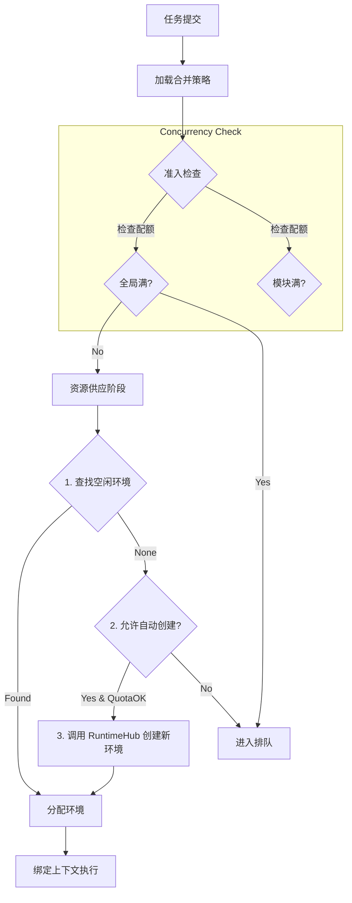

# 5.3 任务策略管理系统 (Task Strategy Management)

## 5.3.1 需求概述

任务策略管理 (TSM) 是 Crawler4j 的“大脑前额叶”，它不执行具体业务，而是通过定义一系列**规则 (Policy)** 即时决策“谁先跑”、“用什么资源跑”、“失败了怎么办”。

### 核心解惑
针对系统设计的四个关键问题：
1. **可编辑性**: 只有**策略 (Strategy/Policy)** 是可编辑的配置实体，而非硬编码逻辑。
2. **格式**: 采用 **YAML** 作为持久化与交互格式，支持热加载。
3. **解释逻辑**: Core 在任务提交 (`submit`) 和资源分配 (`allocate`) 两个切面解释策略。
4. **环境自动化**: 策略中的 **Provisioning Profile** 定义了“在何种条件下自动创建何种环境”。

---

## 5.3.2 策略模型设计 (The Strategy Model)

我们定义 `EvolutionaryStrategy` 为核心配置对象，它包含四个维度的控制规则。

### 1. 策略结构定义 (YAML Schema)

```yaml
# strategy_default.yaml (默认策略)
metadata:
  name: "default_conservative"
  version: "1.0"

# [A] 并发控制 (Concurrency & Quota)
concurrency:
  global_max: 10            # 全局最大并发 10
  group_buckets:            # 分组桶
    "module:ctrip": 2       # ctrip 模块最多 2 个
    "priority:high": 5      # 高优任务预留 5 个

# [B] 资源供应 (Resource Provisioning) -> 回答如何选择/创建环境
provisioning:
  mode: "hybrid"            # static(仅池化) | dynamic(仅新建) | hybrid(优先池化，不足新建)
  auto_create_limit: 5      # 允许动态创建的最大数量
  reuse_policy: "clean"     # dirty(直接复用) | clean(清理后复用) | ephemeral(用完销毁)
  environment_template:     # 新建环境时的模板参数
    browser_type: "chromium"
    headless: true

# [C] 调度优先级 (Scheduling)
scheduling:
  default_priority: 100
  timeout_seconds: 300      # 排队超时

# [D] 可靠性 (Reliability)
reliability:
  max_retries: 3
  backoff_strategy: "exponential" # fixed | exponential
  backoff_factor: 2.0
```

### 2. 策略生效范围 (Scope)
Core 支持三级策略覆盖，优先级由高到低：
1. **Task Level**: 提交任务时 `ctx.run(strategy_override=...)` 指定（最高优）。
2. **Module Level**: `module.yaml` 中定义的默认策略。
3. **Global Level**: 系统全局默认策略 (`config/strategies/*.yaml`)。

---

## 5.3.3 核心解释逻辑 (Core Interpretation Details)

Core 通过 `AdmissionController` (准入) 和 `ResourceMatcher` (撮合) 两个组件来解释上述策略。

### 流程图：从提交到执行



### 关键决策点说明

#### 1. 准入检查 (Interpretation of [A] Concurrency)
- Core 读取 `concurrency.group_buckets`。
- 如果 `current_running(ctrip) >= 2`，则直接将任务放入 `PENDING` 队列，状态设为 `QUEUED_BY_QUOTA`。
- **UI 表现**: 用户能看到任务在排队，提示“Waiting for quota: module:ctrip”。

#### 2. 资源供应 (Interpretation of [B] Provisioning) - 重点回答环境创建
当任务通过准入后，Core 需要给它一个 `Environment`。
- **场景一：利用存量 (pool)**
  - 根据任务 tags (如 `requires: "login_state"`) 在池中寻找匹配的 IDLE 环境。
- **场景二：自动创建 (auto-create)**
  - 条件：池中无匹配环境 AND `provisioning.mode` 为 `dynamic/hybrid` AND 未达到 `auto_create_limit`。
  - 动作：Core 调用 `RuntimeHub.create_environment(template)`。
  - **模板来源**: 策略中的 `environment_template` 字段决定了是创建 Headless Chrome 还是连接指纹浏览器。
- **场景三：资源不足**
  - 条件：池中无环境 且 无法创建（达上限）。
  - 动作：任务回退到队列，状态 `WAITING_FOR_RESOURCE`。

---

## 5.3.4 功能需求分解

### FR-TSM-001 策略编辑器 (Strategy Editor)
- **功能**: 提供 JSON/YAML 可视化编辑器。
- **验证**: 保存时校验 Schema 完整性（如 `backoff_factor` 必须大于 1）。
- **热更**: 修改 Global 策略后，无需重启 Core，新提交的任务立即生效。

### FR-TSM-002 环境自动化配置 (Environment Automator)
- **功能**: 将策略中的 `environment_template` 翻译为具体的 `BrowserContext` 创建参数。
- **参数映射**:
  - `browser_type: chromium` -> `playwright.chromium.launch()`
  - `proxy: auto` -> 自动向代理池申请 IP

### FR-TSM-003 动态配额桶 (Dynamic Buckets)
- **功能**: 支持基于表达式的配额。
- **示例**: "所有 `tag:vip` 的任务独占 5 个并发槽位"。

## 5.3.5 接口设计

### 策略对象 (Python Prototype)

```python
from pydantic import BaseModel

class ConcurrencyConfig(BaseModel):
    global_max: int
    group_buckets: dict[str, int]

class ProvisioningConfig(BaseModel):
    mode: str = "hybrid" # dynamic, static, hybrid
    auto_create_limit: int = 5
    environment_template: dict = {}

class StrategyProfile(BaseModel):
    name: str
    concurrency: ConcurrencyConfig
    provisioning: ProvisioningConfig
    # ...
```

## 5.3.6 交互设计 (Interaction Design)

为满足不同层次用户需求，策略编辑器采用 **双模式 (Dual Mode)** 设计。

### 1. 编辑模式
用户可在界面右上角切换视图：

- **可视化模式 (Visual Form)**: 
    - 适用场景: 修改常见参数 (并发数、超时时间)。
    - 交互: 表单、滑块、下拉框。
    - 实现: UI Host 解析策略 Schema，自动生成表单。

- **源码模式 (Source Code / YAML)**: 
    - 适用场景: 批量复制策略、使用高级表达式 (如 `module:ctrip: 2`)。
    - 交互: 嵌入式代码编辑器 (QScintilla)，支持 YAML 语法高亮与实时校验。
    - 联动: 编辑器内容变更时，失去焦点即尝试解析并更新 Visual Form；反之亦然。

### 2. 典型界面布局
```
+-------------------------------------------------------+
|  Strategy: Default Conservative             [Save]    |
+--------------------------+----------------------------+
|  [Form View] | [YAML View]|                           |
|                          |  concurrency:              |
|  Global Max: [ 10 ]      |    global_max: 10          |
|                          |    group_buckets:          |
|  Group Quotas:           |      priority:high: 5      |
|   + [High] : [ 5 ]       |                            |
|   + [Add..]              |  provisioning:             |
|                          |    mode: hybrid            |
+--------------------------+----------------------------+
```

### 3. 校验反馈
- **即时校验**: YAML 模式下，若格式错误，行号处显示红点。
- **逻辑校验**: 保存时，若 `min > max` 或引用了不存在的模板，弹出 Toast 警告。
