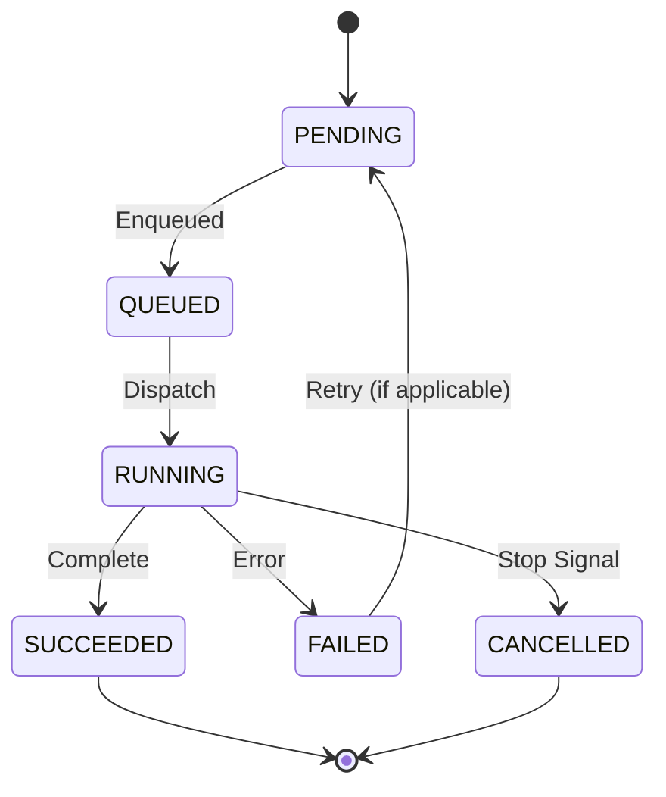

# 5.4 自动化任务管理 (Automation Task Management)

## 5.4.1 需求概述

自动化任务管理 (ATM) 子系统负责任务实例的生命周期管理，从任务创建、状态流转、执行驱动到最终的结果持久化与清理。

### 核心职责
- **任务实例化**: 将策略、环境与业务模块组合成可执行实例。
- **状态机管理**: 维护任务状态流转 (Pending -> Running -> Success/Fail)。
- **执行驱动**: 调用 SDK 接口执行 TaskScript。
- **容错处理**: 处理超时、取消信号及崩溃恢复。

## 5.4.2 系统设计

### 状态机设计 (Task State Machine)

### 核心类图

- `TaskInstance`: 任务实体，持有 `TaskContext` 和状态。
- `TaskRunner`: 执行器，负责线程/协程调度。
- `TaskRepository`: 持久化接口。

## 5.4.3 功能需求分解

### FR-ATM-001 任务实例化
- **功能说明**: 接收用户请求或调度指令，创建 `TaskInstance`。
- **输入**: `module_name`, `task_name`, `params`.
- **处理**:
    1. 生成唯一 `task_id` (UUID).
    2. 加载对应模块配置。
    3. 绑定初始状态 `PENDING`.

### FR-ATM-002 执行驱动 (Execution Driver)
- **功能说明**: 在指定驱动器 (Driver) 中运行任务逻辑。
- **流程**:
    1. 准备 `TaskContext` (注入 Logger, Browser 句柄).
    2. 调用 `TaskScript.on_init()`.
    3. 调用 `TaskScript.execute()`.
    4. 调用 `TaskScript.on_cleanup()`.
- **异常处理**: 捕获所有未处理异常，转换为 FAILED 状态。

### FR-ATM-003 停止与取消
- **功能说明**: 响应用户停止指令或系统关闭信号。
- **机制**:
    - **Graceful Stop**: 设置 `ctx.should_exit` 标志，等待任务主动退出。
    - **Force Stop**: 直接取消 asyncio Task，并强制回收环境资源。
- **超时**: 超过 `timeout` 配置强制触发 Force Stop。

### FR-ATM-004 持久化与恢复
- **功能说明**: 任务状态变更实时写入存储 (SQLite)。
- **恢复场景**: 系统重启时，检查处于 `RUNNING` 状态的任务，标记为 `INTERRUPTED` 或重新入队 (根据策略)。

## 5.4.4 数据设计 (Data Design)

### 任务表 (tasks)
| 字段 | 类型 | 说明 |
|------|------|------|
| id | TEXT (PK) | UUID |
| module | TEXT | 模块名 |
| name | TEXT | 任务名 |
| status | TEXT | 状态 |
| created_at | DATETIME | 创建时间 |
| started_at | DATETIME | 开始时间 |
| ended_at | DATETIME | 结束时间 |
| result | JSON | 执行结果 |
| error | TEXT | 错误信息 |
| env_id | TEXT | 关联环境ID |

## 5.4.5 接口设计

### ITaskService
- `submit_task(request: TaskRequest) -> task_id`
- `stop_task(task_id: str, force: bool = False)`
- `get_task(task_id: str) -> TaskDTO`
- `list_tasks(filter: TaskFilter) -> List[TaskDTO]`

## 5.4.6 交互设计

- **任务详情页**: 展示任务日志、当前截图、耗时统计。
- **控制栏**: 提供 "停止", "重试", "查看结果" 按钮。
